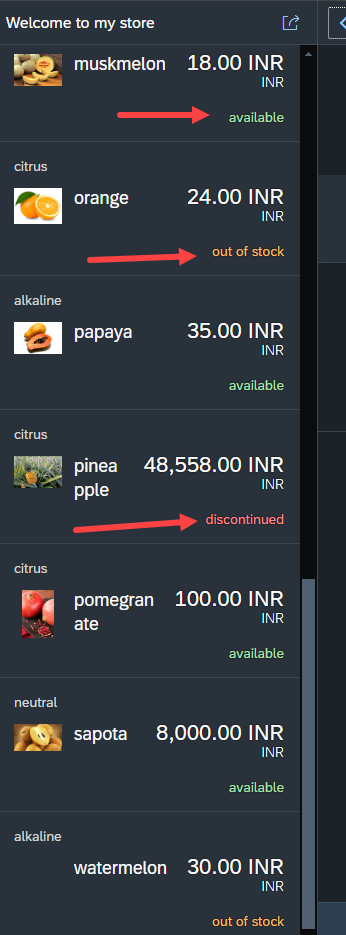
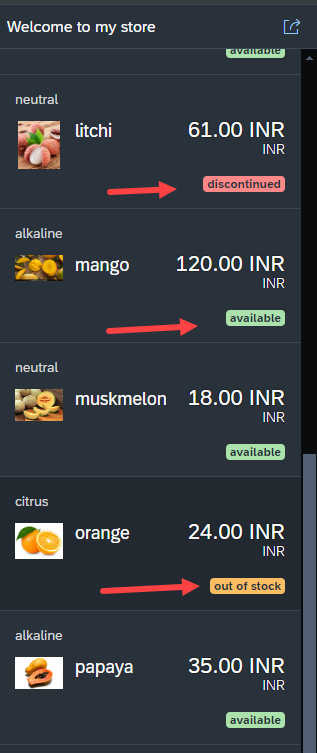

## Adding Custom formatter for product stock

</br></br>

- Made necessary changes to fruits.json model file 
- Added stock field with (available, out of stock, discontinued) values
- In formatter function replaced these values with ('Success', 'Warning', 'Error') 
- Needed colour formatting that happens in state section where formatter is used

</br>

*BaseController.js*

```js

sap.ui.define([
    'sap/ui/core/mvc/Controller',
    'ntt/hr/payroll/util/formatter',  // formatter.js included as dependency
///////////////////////////////////////////////////////////////////////    
    'ntt/hr/payroll/util/stockstat' // stock status dependency added 
], function(Controller, Formatter, Stockstat){  // formatter passed as argument ~~~~ addedd stockstat
///////////////////////////////////////////////////////////////////////    
    'use strict';
    return Controller.extend("ntt.hr.payroll.controller.BaseController", {
        formatter_curr : Formatter, // global variable declared for usage in every places
///////////////////////////////////////////////////////////////////////            
        stock_status : Stockstat,  //  added stock stat
///////////////////////////////////////////////////////////////////////            
        extractPath: function(oEvent){
            var fruitId = oEvent.getParameter("arguments").fruitId;
            return '/fruits/' + fruitId;            
        }
    });
});

```

</br>

*webapp/util/stockstat.js*

*stockstat.js*

```js

sap.ui.define([], () => {
    "use strict";
    return {
        statusText(sStatus) {
            switch (sStatus) {
                case "available":
                    return 'Success';
                case "out of stock":
                    return 'Warning';
                case "discontinued":
                    return 'Error';
                default:
                    return sStatus;
            }
        }
    };
});

```

</br>

*View1.view.xml*

```xml

    <ObjectListItem intro="{taste}" title="{name}"  
    number="{
            parts: [{path: 'price'},{path: 'curr'}],
            formatter: '.formatter_curr.formatCurrency'
            }" numberUnit="{curr}" 
    icon="{image}">
<!--///////////////////////////////////////////////////////////////////////////-->        
    <firstStatus>        
    <!-- Implemented Custom formatter for produst stock-->
            <ObjectStatus text="{stock}" 
            state="{ path: 'stock',
            formatter: '.stock_status.statusText'}" >
            </ObjectStatus>
    </firstStatus>
<!--///////////////////////////////////////////////////////////////////////////-->        
    </ObjectListItem>

```

</br>

**Testing**

</br>

</br></br>

</br>

**Text with highlighted color**

</br>

```xml

<firstStatus>        
<!-- Implemented Custom formatter for produst stock-->
    <ObjectStatus text="{stock}" 
    state="{ path: 'stock',
    formatter: '.stock_status.statusText'}" inverted="true"> <!-- Inverted attribute will highlight the text-->
    </ObjectStatus>
</firstStatus>

```

**Testing**

</br>

</br></br>

