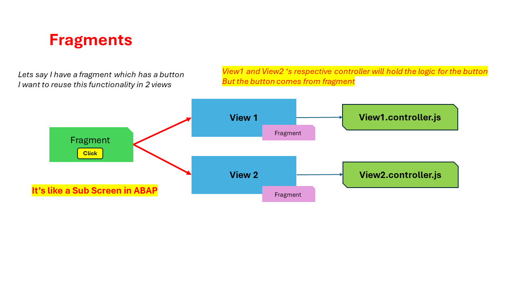
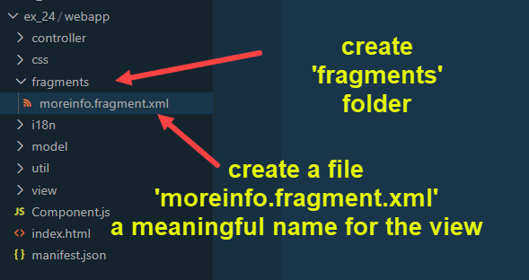

## Fragments - Introduction 


</br>

**What is fragment ? Why do we use it ?**

- Fragments are light weight UI parts, They are used to modularize our view content. 
- A fragment created once can be reused multiple times.
- A fragment unlike view does not have its own controller.

</br>

</br></br>


**Implementing fragments**

</br>

</br>

*moreinfo.fragment.xml* --- skeleton

```xml

<mvc:View xmlns:mvc="sap.ui.core.mvc" xmlns="sap.m">
<!--ntt.hr.payroll.fragments.moreinfo.fragment-->

</mvc:View>

```

<br>

*View2.view.xml* -- code removed from this view and will be added to *moreinfo.fragment.xml*

```xml

<IconTabFilter iconColor="Default" icon="sap-icon://sales-order-item" text="More info">
<!--/////////////////////////////////////////////////////////////////////////////////////////////////-->
    <f:SimpleForm >
        <Label text="Colour"/>
        <Text text="{color}" />
        <Label text="Taste" class="sapUiSmallMarginTop"/>
        <Text text="{taste}" class="sapUiSmallMarginTop"/>
        <Label text="price"/>
        <!-- Formatter for price with decimal unit-->                            
        <Text text="{
        parts: [{path: 'price'},{path: 'curr'}],
        formatter: '.formatter_curr.formatCurrency'
        }" />
        <!-- <Text text="{price} {curr}" /> -->
        <Label text="Season"/>
        <Text text="{season}" />                                                                                    
    </f:SimpleForm>
<!--/////////////////////////////////////////////////////////////////////////////////////////////////-->
</IconTabFilter>

```

<br>

*moreinfo.fragment.xml* --- fragment view definition with some screen elements

```xml

<mvc:View xmlns:mvc="sap.ui.core.mvc" xmlns="sap.m" xmlns:f="sap.ui.layout.form">
<!-- complete name space : ntt.hr.payroll.fragments.moreinfo-->
<!--/////////////////////////////////////////////////////////////////////////////////////////////////-->
    <f:SimpleForm >
        <Label text="Colour"/>
        <Text text="{color}" />
        <Label text="Taste" class="sapUiSmallMarginTop"/>
        <Text text="{taste}" class="sapUiSmallMarginTop"/>
        <Label text="price"/>
        <!-- Formatter for price with decimal unit-->                            
        <Text text="{
        parts: [{path: 'price'},{path: 'curr'}],
        formatter: '.formatter_curr.formatCurrency'
        }" />
        <!-- <Text text="{price} {curr}" /> -->
        <Label text="Season"/>
        <Text text="{season}" />                                                                                    
    </f:SimpleForm>
<!--/////////////////////////////////////////////////////////////////////////////////////////////////-->    
</mvc:View>

```
<br>

**Fragment screen integration with other view**

<br>

*View2.view.xml* 

```xml

<IconTabFilter iconColor="Default" icon="sap-icon://sales-order-item" text="More info">
<!--/////////////////////////////////////////////////////////////////////////////////////////////////-->
    <core:Fragment fragmentName="ntt.hr.payroll.fragments.moreinfo" type="XML"/>
<!--/////////////////////////////////////////////////////////////////////////////////////////////////-->
</IconTabFilter>

```

<br><br>