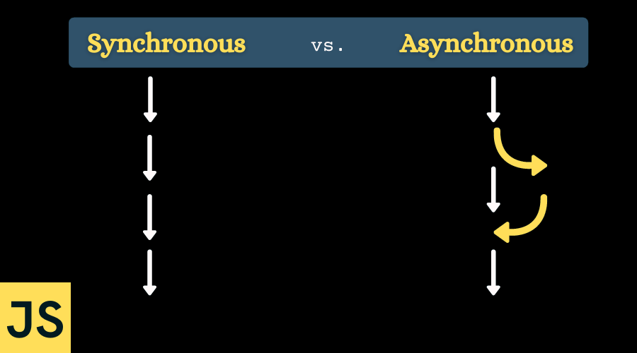
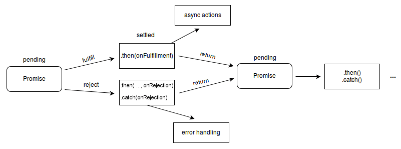
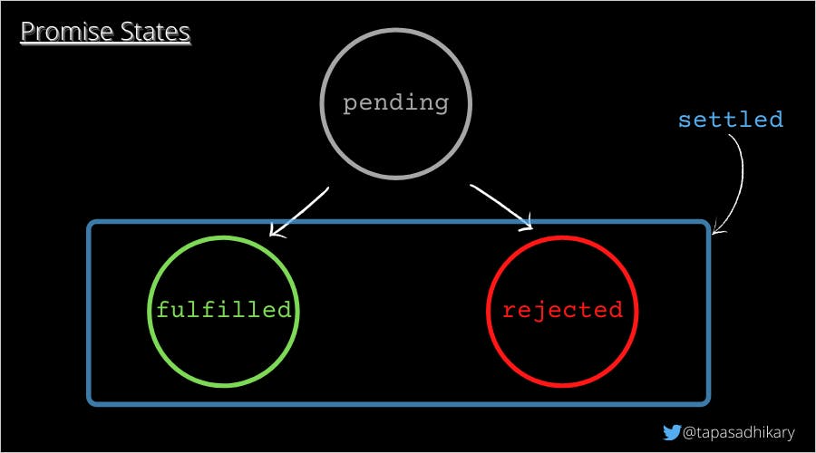

## Synchronours VS Asynchronours - Usage in Ui5 

</br>

**Asynchronous JavaScript** : *is the programming method where operations are run independently allowing the program to continue running while waiting for certain tasks to complete.* 

</br>

**Synchronous JavaScript** : *is the programming approach where tasks of a program are executed sequentially one at a time.*

</br>

</br></br>

</br>

**Promise in JavaScript**

*A promise is a JavaScript object that allows you to make asynchronous(aka async) calls. It produces a value when the async operation completes successfully or produces an error if it doesn't complete.*

You can create promise using the constructor method

</br>

```js

let promise = new Promise(function(resolve, reject) {    
    // Do something and either resolve or reject
});

```

</br>

</br>

</br></br>


**A promise object has the following internal properties**

</br>

**State:** *This property can have the following values.*

--- **Pending:** *When the execution function starts. In our story, when Jack and Jill start to fetch the water.*

--- **Fulfilled:** *When the promise resolves successfully. Like, Jack and Jill are back with the water.*

--- **Rejected:** *When the promise rejects. Example. Jack and Jill couldn't complete the mission.*


</br></br>


**Result:** *This property can have the following values,*

--- **Undefined:** *Initially, when the state value is pending.*

--- **Value:** *When the promise is resolved(value).*

--- **Error:** *When the promise is rejected.*

</br>

*A promise that is either resolved or rejected is called* **settled.**

</br>

</br></br>

**Example of Resolve**

</br>

```js

let promise = new Promise(function(resolve, reject) {
    // Got the water
    let value = 'water';
    resolve(value); // An assurance of getting the water successfully
});

```

</br></br>

**Example of Reject**

</br>

```js

let promise = new Promise(function(resolve, reject) {
    // OOPS, Jack fell down and broke his crown. 
    // And Jill came tumbling after.
    reject(new Error("Disaster")); // Throwing and error
});

```

</br></br>


</br></br></br></br>


## Sample code for understanding - all the concepts 

</br></br>

*index.html with JS script example*

```html

<html>

<head>
    <!-- <script src="https://sapui5.hana.ondemand.com/resources/sap-ui-core.js"></script> -->

    <script id="sap-ui-bootstrap" type="text/javascript" src="https://sapui5.hana.ondemand.com/resources/sap-ui-core.js"
        data-sap-ui-libs="sap.m" data-sap-ui-theme="sap_horizon" data-sap-ui-resourceroots='{
        "spiderman" : "./"
    }'></script>

    <script>

        //////////////////////////////////////////////////////////////////////////
        // Normal alert function instant display         
        var oBtn1 = new sap.m.Button("idBtn1", {
            text: "Instant Alert",
            icon: "sap-icon://add-employee",
            press: function () {
                alert("Ui5 instant alert test");
            }
        });

        // TYPE 1 - Synchronous execution based on timer wait 
        //////////////////////////////////////////////////////////////////////////        
        // Display alert based on timer wait
        var oBtn2 = new sap.m.Button("idBtn2", {
            text: "Wait 2 seconds alert -- using setTimeout()",
            icon: "sap-icon://pending",
            press: function () {

                let timeout;
                timeout = 0
                // Make a new timeout set to go off in 2000 milliseconds 
                timeout = setTimeout(function () {
                    message_disp();
                }, 2000); // timer in milliseconds 

                function message_disp() {
                    // Step 1. Put your logic here which gets executed  
                    // Step 2. Timer will wait and display the result of Step 1's execution 
                    alert("Ui5 2 seconds wait alert test");
                };
            }
        });

        // TYPE 2 - Synchronous flow based on another process completion
        //////////////////////////////////////////////////////////////////////////
        // Display alert based on Synchronous flow, 
        // Wait for a specific functionality to comeplete and display alert        
        var oBtn3 = new sap.m.Button("idBtn3", {
            text: "Wait for a sequence of process -- using setTimeout()",
            icon: "sap-icon://lateness",
            press: function () {

                let preview_timer = setTimeout(function () {
                    abc(); // sequence 1
                    xyz(); // sequence 2                     
                    last(); // sequence 3
                    alert('Ui5 alert test first message');
                }, 1000);

                // Process 1 
                function abc() {
                    setTimeout(function () {
                        alert("Ui5 alert test process 1");
                    }, 100)
                };

                // Process 2 
                function xyz() {
                    setTimeout(function () {
                        alert("Ui5 alert test process 2");
                    }, 100)
                };

                // Process 2 
                function last() {
                    setTimeout(function () {
                        alert("Ui5 alert test last message");
                    }, 100)
                };
            }
        });

        // TYPE 3 - Synchronous execution based on promise - 1 
        //////////////////////////////////////////////////////////////////////////
        var oBtn4 = new sap.m.Button("idBtn4", {
            text: "Wait for a process to comeplete -- Using Promise() & setTimeout()",
            icon: "sap-icon://process",
            press: function () {
                let preview_timer;

                // Function declaration 
                function msglist_get_preview() {
                    return new Promise(function (resolve, reject) {
                        setTimeout((function () {
                            alert('msglist_get_preview worked');
                            resolve("Stuff worked!");
                        }), 1000);
                    });
                }

                // Function call 
                preview_timer = setTimeout(function () {
                    msglist_get_preview().then(function () {
                        alert('done');
                    })
                });

            }
        });

        // TYPE 4 - Synchronous execution on promise - 2 
        //////////////////////////////////////////////////////////////////////////        
        var oBtn5 = new sap.m.Button("idBtn5", {
            text: "Process with 2 different outcome -- Using only Promise()",
            icon: "sap-icon://step",
            press: function () {

                let myPromise = new Promise(function (myResolve, myReject) {
                    let x;

                    x = sap.ui.getCore().byId("idInp").getValue();

                    // some code (try to change x to 5)
                    if (x) {
                        myResolve("OK");
                    } else {
                        myReject("Error");
                    }
                });

                myPromise.then(
                    function (value) { alert('success'); },
                    function (error) { alert('error'); }
                );
            }
        });

        // content 1 div 
        oBtn1.placeAt("content1");
        
        // content 2 div 
        oBtn2.placeAt("content2");
        
        // content 3 div 
        oBtn3.placeAt("content3");

        // content 4 div 
        oBtn4.placeAt("content4");

        // content 5 div input and button 
        oBtn5.placeAt("content5");
        new sap.m.Input("idInp").placeAt("content5");

    </script>
    <style></style>
</head>

<body class="sapUiBody">
    </br></br>
    Welcome! - Synchronous Java Script examples
    </br></br>
    <div id="content1"> </div>
    </br>
    --- Debug and understand ---
    </br></br>
    <div id="content2"> </div>
    </br>
    <div id="content3"> </div>
    </br>
    <div id="content4"> </div>
    </br>
    </br>

    <div id="content5">
        --Test-1--- Input some random value below / and click
        </br>
        --Test-2--- Dont Input anything below / and click
        </br>
        </br>
    </div>
</body>

</html>

```