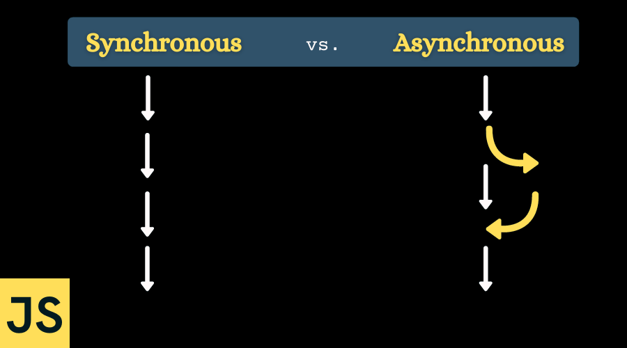

## Synchronours VS Asynchronours - Usage in Ui5 

 

**Asynchronous JavaScript** : *is the programming method where operations are run independently allowing the program to continue running while waiting for certain tasks to complete.* 

 

**Synchronous JavaScript** : *is the programming approach where tasks of a program are executed sequentially one at a time.*

 

  

**  **