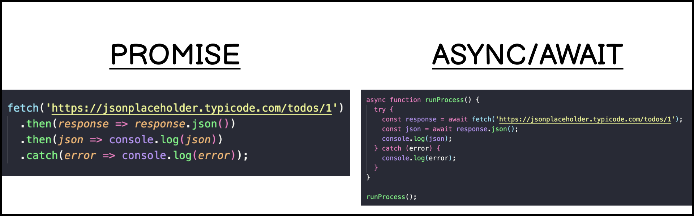

## Synchronours VS Asynchronours - Usage in Ui5 

</br>

**Asynchronous JavaScript** : *is the programming method where operations are run independently allowing the program to continue running while waiting for certain tasks to complete.* 

</br>

**Synchronous JavaScript** : *is the programming approach where tasks of a program are executed sequentially one at a time.*

</br>

</br></br>

</br>

## Promise in JavaScript

</br>

*A promise is a JavaScript object that allows you to make asynchronous(aka async) calls. It produces a value when the async operation completes successfully or produces an error if it doesn't complete.*

You can create promise using the constructor method

</br>

```js

let promise = new Promise(function(resolve, reject) {    
    // Do something and either resolve or reject
});

```

</br>

**Example of Resolve - Promise internal**

</br>

```js

let promise = new Promise(function(resolve, reject) {
    // Got the expected value
    let value = 'water';
    resolve(value); // An assurance of getting the value successfully
});

```

</br>

**Example of Reject - Promise internal**

</br>

```js

let promise = new Promise(function(resolve, reject) {
    // OOPS, resule is not as expected 
    reject(new Error("Disaster")); // Throwing an error
});

```

</br>

</br></br>


**A promise object has the following internal properties**

</br>

**State:** *This property can have the following values.*

--- **Pending:** *When the execution function starts. In our story, when Jack and Jill start to fetch the water.*

--- **Fulfilled:** *When the promise resolves successfully. Like, Jack and Jill are back with the water.*

--- **Rejected:** *When the promise rejects. Example. Jack and Jill couldn't complete the mission.*


</br></br>


**Result:** *This property can have the following values,*

--- **Undefined:** *Initially, when the state value is pending.*

--- **Value:** *When the promise is resolved(value).*

--- **Error:** *When the promise is rejected.*

</br>

*A promise that is either resolved or rejected is called* **settled.**

</br>

</br></br>


</br></br>

**Handling Promises by the Consumers**

</br>

*The promise object returned by the new Promise constructor is only internally accessible.* 
*A consumer can use it to know the state(pending, fulfilled, or rejected) and its possible outcomes(value or error).*

*They are inspectable. It means that we will be able to inspect the state and result property values using a debugger tool, but we will not be able to access them directly using the program.*

*So then? That's where we have three important handler methods, .then(), .catch(), and .finally(). These methods help us create a link between the executor and the consumer when a promise resolves or rejected.*

</br></br>

**The .then() Promise Handler - Promise external**

</br>

*We get a .then() method from every promise. The sole purpose of this method is to let the consumer know about the outcome of a promise. It accepts two functions as arguments, result and error.*

</br>

```js

promise.then(
  (result) => { 
     console.log(result);
  },
  (error) => { 
     console.log(error);
  }
);

```

</br>

*Resolve* - If you are just interested in the successful outcome, you can chose to pass only one argument,

```js

promise.then(
  (result) => { 
      console.log(result);
  }
);

```

</br>

*Reject* - Similarly, if you are interested in only the error, pass null as the value for the first argument.

```js

promise.then(
  null,
  (error) => { 
      console.log(error)
  }
);

```

</br></br>

test the following code in online compiler : - https://playcode.io/empty_javascript

```js

// 1. Create a Promise to carry out the process activity
let promise = new Promise(function(resolve, reject) {
 // Pretend a delay of 2 sec to process it 
  setTimeout(function() {
       
       let x;
       x = 0; // change this value and test 

       if (x) {       
         // Fetched the value - Let's resolve the promise
         resolve('Expected result - success');
       }
       else {       
         // Reject it as the disaster happend.
         reject(new Error('Not expected result - failure'));
       }

  }, 2000);
});

// 2. Function to Set up the handler to handle a promise result.
// It is to inform the proces flow function that a result is available positive or negative.
const processFlow = () => {
  // The handler function to handle the resolved promise
  promise.then(function(result) {
    // process conmpleted successfully
    console.log(`success ${result}`);
  });

  // process failred alternative flow or error message 
  promise.catch(function(error) {
    console.error(`error ${error.message}`);
    });
}

// 3. Calling the function to activate the set up.
processFlow();

```

</br></br>


## Async - Await function usage in JS

</br>

**A Few Rules about using async/await**

We need to understand a few simple rules to use the async and await keywords.

You can not use the await keyword in a regular, non-async function. JavaScript engine will throw a syntax error if you try doing so.

</br>

test the following code in online compiler : - https://playcode.io/empty_javascript

</br></br>

**Example - wrong way of using async-await**

```js

// WRONG usgae 

function getDetails(){
    console.log('test');
    alert("test1");
}

function caller() { // <<------------ Check here
    // Using await in a non-async function - wrong way
    const user = await getDetails();
    alert("test2");
}

// This will result in a syntax error
caller();

```

</br></br>


**Example - Right way of using async-await**

```js

// RIGHT usage 
function getDetails(){ // this function can be async or non-async doenst matter
    console.log('test');
    alert("test1");
}

async function caller() {  // <<------------ Check here
    // Using await in an async function - right way
    const user = await getDetails();
    alert("test2");
}

// This will result in displaying console message 'test'
caller();


```

</br></br></br>

**async(), await() + promise()**

</br>

```js

const validateUser = ({userId, password}) => {
    return new Promise((resolve, reject) => {

        if (sUser === "dante" && sPass === "dante") {
            resolve('login success!');
        } else {
            reject({ message: 'error login failed' });
        }

    });
}

const app = async () => {
    const data = {
        userId: '',
        password: ''
    };

    try {
        console.log('process started');
        const result = await validateUser(data);
        console.log(result);
        console.log('process ended');
    } catch (e) {
        console.error(e.message);
        console.log('process ended');
    }
}

// invoke the function app
app();


```
</br>
</br>



</br></br></br>

## Sample API call using Promise 

</br>

test the following code in online compiler : - https://playcode.io/empty_javascript

```js

fetch('https://jsonplaceholder.typicode.com/todos/1')
  .then(response => response.json())
  .then(json => console.log(json))
  .catch(error => console.log(error));

```

</br></br></br>

## Sample API call using Async , Await

</br>

test the following code in online compiler : - https://playcode.io/empty_javascript

```js

const runProcess = async () => {
  try {
    const response = await fetch('https://jsonplaceholder.typicode.com/todos/1');
    const json = await response.json();
    console.log(json);
  } catch (error) {
    console.log(error);
  }
};

runProcess();


// alternative way to call 
////////////////////////////////////////////////////////////////////

async function runProcess() {
  const response = await fetch('https://jsonplaceholder.typicode.com/todos/1');
  const json = await response.json();
  console.log(json)
}

runProcess();


```

</br></br></br>

## Sample all functions together - Async, Await + Promise + setTimeout

</br>

test the following code in online compiler : - https://playcode.io/empty_javascript

```js

var testAwait = function () {
    var promise = new Promise((resolve, reject) => {
        setTimeout(() => {
            resolve('Inside test await');
        }, 1000);
    });
    return promise;
}

var asyncFunction = async function() {
    await testAwait().then((data) => {
        console.log(data);
    })
    return 'hello asyncFunction';
}

asyncFunction().then((data) => {
    console.log(data);
});

```


</br></br></br>

## Sample functions together - Async, Await + Promise (Multiple call with changed timer parameter)

</br>

test the following code in online compiler : - https://playcode.io/empty_javascript

```js

const setAsyncTimeout = (cb, timeout = 0) => new Promise(resolve => {
    setTimeout(() => {
        cb();
        resolve();
    }, timeout);
});

const doStuffAsync = async () => {
    await setAsyncTimeout(() => {
        // Do stuff
        console.log('started');
    }, 500);

    await setAsyncTimeout(() => {
        // Do more stuff
        console.log('running');
    }, 1000);

    await setAsyncTimeout(() => {
        // Do even more stuff
        console.log('completed');
    }, 2000);
};

doStuffAsync();

```

</br></br></br>

## Sample - Async, Await multiple consolidation

</br>

test the following code in online compiler : - https://playcode.io/empty_javascript

```js

async function sayHello(name) {
  let greet = `Hey! ${name} very nice to meet you bud.`;
  setTimeout(() => {
    return {
      greet,
      createdAt: new Date(),
    };
  }, 1000);
}

const response1 = async () => await sayHello("sounish");
const response2 = async () => await sayHello("alex");
const response3 = async () => await sayHello("bill");

async function getData() {
  const data1 = await sayHello("sounish");
  const data2 = await sayHello("alex");
  const data3 = await sayHello("bill");
  return { data1, data2, data3 };
}

Promise.all([sayHello("sounish"), sayHello("alex"), sayHello("bill")]).then(
  (allResponses) => {
    console.log({ allResponses });
  }
);

getData().then((allData) => {
  console.log({ allData });
});

```


</br></br></br></br>


## Sample code for understanding - all the concepts 

</br></br>

*index.html with JS script example*

```html

<html>

<head>
    <!-- <script src="https://sapui5.hana.ondemand.com/resources/sap-ui-core.js"></script> -->

    <script id="sap-ui-bootstrap" type="text/javascript" src="https://sapui5.hana.ondemand.com/resources/sap-ui-core.js"
        data-sap-ui-libs="sap.m" data-sap-ui-theme="sap_horizon" data-sap-ui-resourceroots='{
        "spiderman" : "./"
    }'></script>

    <script>

        //////////////////////////////////////////////////////////////////////////
        // Normal alert function instant display         
        var oBtn1 = new sap.m.Button("idBtn1", {
            text: "Instant Alert",
            icon: "sap-icon://add-employee",
            press: function () {
                alert("Ui5 instant alert test");
            }
        });


        // TYPE 1 - Synchronous execution based on timer wait 
        //////////////////////////////////////////////////////////////////////////        
        // Display alert based on timer wait
        var oBtn2 = new sap.m.Button("idBtn2", {
            text: "Wait 2 seconds alert -- using setTimeout() - v1",
            icon: "sap-icon://pending",
            press: function () {

                let timeout;
                timeout = 0
                // Make a new timeout set to go off in 2000 milliseconds 
                timeout = setTimeout(function () {
                    message_disp();
                }, 2000); // timer in milliseconds 

                function message_disp() {
                    // Step 1. Put your logic here which gets executed  
                    // Step 2. Timer will wait and display the result of Step 1's execution 
                    alert("Ui5 2 seconds wait alert test");
                };
            }
        });


        // TYPE 2 - Synchronous flow based on another process completion
        //////////////////////////////////////////////////////////////////////////
        // Display alert based on Synchronous flow, 
        // Wait for a specific functionality to comeplete and display alert        
        var oBtn3 = new sap.m.Button("idBtn3", {
            text: "Wait for a sequence of process -- using setTimeout() - v2",
            icon: "sap-icon://lateness",
            press: function () {

                let preview_timer = setTimeout(function () {
                    abc(); // sequence 1
                    xyz(); // sequence 2                     
                    last(); // sequence 3
                    alert('Ui5 alert test first message');
                }, 1000);

                // Process 1 
                function abc() {
                    setTimeout(function () {
                        alert("Ui5 alert test process 1");
                    }, 100)
                };

                // Process 2 
                function xyz() {
                    setTimeout(function () {
                        alert("Ui5 alert test process 2");
                    }, 100)
                };

                // Process 2 
                function last() {
                    setTimeout(function () {
                        alert("Ui5 alert test last message");
                    }, 100)
                };
            }
        });


        // TYPE 3 - Synchronous execution based on promise - 1 
        //////////////////////////////////////////////////////////////////////////
        var oBtn4 = new sap.m.Button("idBtn4", {
            text: "Wait for a process to comeplete -- Using Promise() & setTimeout()",
            icon: "sap-icon://process",
            press: function () {
                let preview_timer;

                // Regular function declaration 
                function msglist_get_preview() {

                    // declared Promise as return parameter for regular function 
                    return new Promise(function (resolve, reject) {

                        // setTimeout Function inside - promise - Internal 
                        setTimeout((function () {
                            // Promise - Resolve state is inside setTimeout
                            alert('Promise function resolve worked');
                            resolve("Stuff worked!");
                        }), 1000); // set time out delay return

                        // set time out return will retrun to promise function retrun 
                    });

                    // promise function retrun is retruned to regular function return  
                }

                // Function call 
                // promise function only using resolve - external
                preview_timer = setTimeout(function () {
                    // Regualr function - promise - resolve state - external 
                    msglist_get_preview().then(function () {
                        alert('done');
                    })
                });

            }
        });


        // TYPE 4 - Synchronous execution on promise - 2 
        //////////////////////////////////////////////////////////////////////////        
        var oBtn5 = new sap.m.Button("idBtn5", {
            text: "Process with 2 different outcome -- Using only Promise()",
            icon: "sap-icon://step",
            press: function () {

                // Promise - Internal
                ///////////////////////////////////////////////////                
                let myPromise = new Promise(function (myResolve, myReject) {

                    let x;
                    x = sap.ui.getCore().byId("idInp").getValue();

                    // lets say you have sequence of process logic set a flag value after completion return that flag value as X 
                    // Based on X value will proceed further --- this also completely behaves like synchronous depending on the value condition 

                    // If X contains value
                    if (x) {
                        myResolve("OK");
                    }
                    // If X is empty
                    else {
                        myReject("Error");
                    }
                });

                // Promise - External 
                ///////////////////////////////////////////////////

                // Type 1 -- this style of coding also works 
                ///////////////////////////////////////////////////
                // myPromise.then(
                //     function (value) { alert('success'); },
                //     function (error) { alert('error'); }
                // );
                ///////////////////////////////////////////////////

                // Type 2 
                ///////////////////////////////////////////////////
                myPromise.then(function (result) {
                    // process conmpleted successfully
                    alert('Success');
                });

                // process failed alternative flow or error message 
                myPromise.catch(function (error) {
                    alert('Error');
                });
                ///////////////////////////////////////////////////
            }
        });


        // TYPE 5 - Synchronous execution using Async and Await 
        //////////////////////////////////////////////////////////////////////////       
        var oBtn6 = new sap.m.Button("idBtn6", {
            text: "Wait for a process to complete -- Using Async() & Await() - v1",
            icon: "sap-icon://begin",
            press: function () {

                // Process-1 function declaration
                function process_1() {
                    alert("Process 1 done");
                }

                // Process-2 function declaration
                async function Process_2() {
                    const someVariable = await process_1(); // Process-1 function call
                    alert("Process 2 done");
                }

                // Process-2 function call
                Process_2();
            }
        });


        // TYPE 6 - Synchronous execution using - async(), await() + promise() 
        //////////////////////////////////////////////////////////////////////////  
        var oBtn7 = new sap.m.Button("idBtn7", {
            text: "Login validate process -- Using Async(), Await() + Promise() - v2",
            icon: "sap-icon://open-command-field",
            press: function () {

                // declaration - implementation of function 2                                
                function login_validator ({sUser, sPass}) {

                    // const login_validator = ({ sUser, sPass }) => { 
                    // same opening statement in arrow function 

                    return new Promise((resolve, reject) => {
                        if (sUser === "dante" && sPass === "dante") {
                            resolve('login success!');
                        } else {
                            reject({ message: 'error login failed' });
                        }
                    });
                }

                // declaration - implementation of function 1                
                async function app(){ // regular function 
                
                // const app = async () => {  
                // same opening statement in arrow function 

                // const data = {
                    var data = {
                        sUser: document.getElementById("idUser").value,
                        sPass: document.getElementById("idPass").value
                    };

                    try {
                        console.log('process started');
                        
                        // call of function 2 
                        const result = await login_validator(data);
                        console.log(result);
                        console.log('process ended');
                        alert(result);

                    } catch (e) {
                        console.error(e.message);
                        console.log('process ended');
                        alert(e.message);                        
                    }                    
                }

                // call of function 1
                app();
            }
        });

        // content 1 div 
        oBtn1.placeAt("content1");

        // content 2 div 
        oBtn2.placeAt("content2");

        // content 3 div 
        oBtn3.placeAt("content3");

        // content 4 div 
        oBtn4.placeAt("content4");

        // content 5 div input and button 
        oBtn5.placeAt("content5");
        new sap.m.Input("idInp").placeAt("content5");

        // content 6 div 
        oBtn6.placeAt("content6");

        // content 7 div 
        oBtn7.placeAt("content7");

    </script>
    <style></style>
</head>

<body class="sapUiBody">
    </br></br>
    Welcome! - Synchronous Java Script examples
    </br></br>
    <div id="content1"> </div>
    </br>
    --- Debug and understand ---
    </br></br>
    <div id="content2"> </div>
    </br>
    <div id="content3"> </div>
    </br>
    <div id="content4"> </div>
    </br>
    </br>

    <div id="content5">
        --Test-1--- Input something / and click -- Promise Resolve
        </br>
        --Test-2--- Dont Input anything / and click -- Promise Reject
        </br>
        </br>
    </div>
    </br>
    <div id="content6"> </div>
    </br>

    <div id="box5">
        <!-- Validation for input fields-->
        <form>
            <div style="clear: left;">
                <div style="padding-top: 35px;">
                    <h3>Personal details</h3>
                    <h4>---Test-1----Enter username : dante, password : dante & click the button - validate</h4>
                    <h4>---Test-2----Let the field be blank, click the button - to show error</h4>
                    <!-- alignment of login details -->
                    <table id="login">
                        <tbod>
                            <tr>
                                <td><label>Username</label></td>
                                <td><input id="idUser" name="usr"></td>
                            </tr>
                            <tr>
                                <td><label>Password</label></td>
                                <td><input id="idPass" name="pass" type="password"></td>
                            </tr>
                            <tr>
                                <td><label></label></td>
                                <td>
                                    <div id="content7"> </div>
                                </td>
                            </tr>
                        </tbod>
                    </table>
                </div>
        </form>
</body>

</html>

```