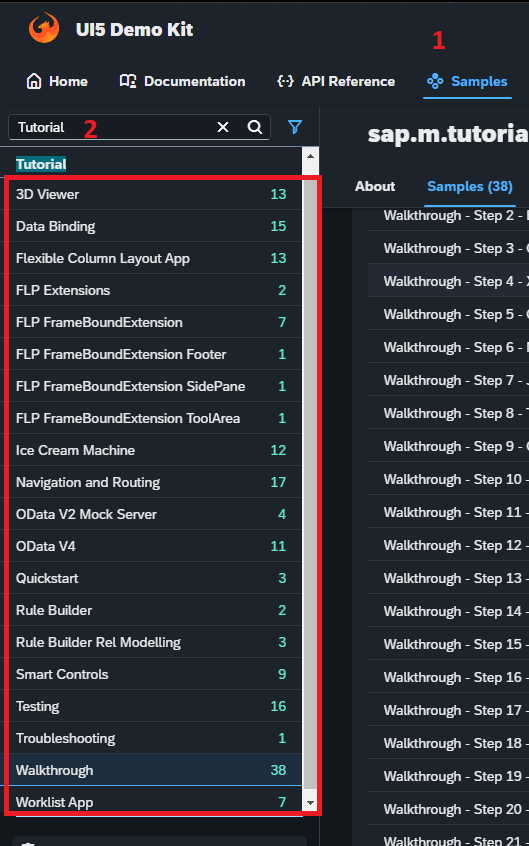

## SAP Ui / Ux : 

 

<a href="https://github.com/Octavius-Dante/Arthelais/tree/main/ALL_UI5_ODATA_TCODES"> **All Ui5 and Odata Tcodes** </a>

<a href="https://github.com/Octavius-Dante/Arthelais/tree/main/UI5_APP_EXTRACTOR_PROJECT"> **Ui5 Application extractor project (Work in Progress)** </a>

 

## SAP Mobile development KIT

 

- [# SAP MDK tutorials - developer.sap](https://developers.sap.com/tutorial-navigator.html?tag=software-product%3Atechnology-platform%2Fsap-business-technology-platform%2Fmobile-development-kit-client) - 32 tutorials | [Starter general not organised - developer.sap MDK Overview](https://developers.sap.com/topics/mobile-development-kit.html)
- [# SAP MDK community page - STARTER pages.community.sap.com](https://pages.community.sap.com/topics/mobile-technology/mobile-development-kit)
- [Github code samples](https://github.com/topics/mobile-development-kit) || [cloud-mdk-tutorial-samples](https://github.com/SAP-samples/cloud-mdk-tutorial-samples/tree/main)

 

## Learning Sequence (MDK)

 

- [0 - Set Up for the Mobile Development Kit (MDK)](https://developers.sap.com/group.mobile-dev-kit-setup.html)
- [1 - Create Your First MDK Application](https://developers.sap.com/mission.mobile-dev-kit-get-started.html)
- [Create a Customer List Page in an MDK App](https://developers.sap.com/tutorials/cp-mobile-dev-kit-list-page.html)
- [Create a Customer Detail Page in an MDK App](https://developers.sap.com/tutorials/cp-mobile-dev-kit-detail-page.html)
- [Create a Customer Record in an MDK App](https://developers.sap.com/tutorials/cp-mobile-dev-kit-create-customer.html)
- [Debug Your Mobile Development Kit Application](https://developers.sap.com/tutorials/cp-mobile-dev-kit-debugging.html)
- [Extend an MDK App with Customer Orders](https://developers.sap.com/tutorials/cp-mobile-dev-kit-customer-order.html)
- [Add Internationalization and Localization to an MDK App](https://developers.sap.com/tutorials/cp-mobile-dev-kit-i18n-localization.html)
- [sap blog page -editable table](https://community.sap.com/t5/technology-blog-posts-by-sap/what-s-new-in-mobile-development-kit-client-23-4/ba-p/13557735)

 

## 2025 SAP learning hub materials - Download *.zip files from Archive.org (WORK IN PROGRESS NOT COMPLETED)

 

- [FIORI-UI5-1-]()
- [FIORI-UI5-2-]()
- [FIORI-UI5-3-]()
- [FIORI-UI5-4-]()

 

**Ui5 development basic foundation**

 

Pre-requisite VSCode or BAS should be installed and active.

 

- [x] <a href="https://github.com/Octavius-Dante/Arthelais/tree/main/ex_1"> Exercise 1-Basic </a>
- [x] <a href="https://github.com/Octavius-Dante/Arthelais/tree/main/ex_2"> Exercise 2-HTML5</a>
- [x] <a href="https://github.com/Octavius-Dante/Arthelais/tree/main/ex_3"> Exercise 3-CSS </a>
- [x] <a href="https://github.com/Octavius-Dante/Arthelais/tree/main/ex_4"> Exercise 4-JS basic </a>
- [x] <a href="https://github.com/Octavius-Dante/Arthelais/tree/main/ex_5"> Exercise 5-JS deep dive </a>
- [x] <a href="https://github.com/Octavius-Dante/Arthelais/tree/main/ex_6"> Exercise 6-JQuery </a>
- [x] <a href="https://github.com/Octavius-Dante/Arthelais/tree/main/ex_7"> Exercise 7-SAP Ui5 Framework </a>
- [x] <a href="https://github.com/Octavius-Dante/Arthelais/tree/main/ex_8"> Exercise 8-Ui5 Control Hierarchy </a>
- [x] <a href="https://github.com/Octavius-Dante/Arthelais/tree/main/ex_9"> Exercise 9-Ui5 Control Hierarchy - 2</a>
- [x] <a href="https://github.com/Octavius-Dante/Arthelais/tree/main/ex_10"> Exercise 10-XML Views </a>
- [x] <a href="https://github.com/Octavius-Dante/Arthelais/tree/main/ex_11"> Exercise 11-Model Basics </a>
- [x] <a href="https://github.com/Octavius-Dante/Arthelais/tree/main/ex_12"> Exercise 12-Json Model Property Binding</a>
- [x] <a href="https://github.com/Octavius-Dante/Arthelais/tree/main/ex_13"> Exercise 13-Expression Binding XML Model</a>
- [x] <a href="https://github.com/Octavius-Dante/Arthelais/tree/main/ex_14"> Exercise 14-Table control</a>
- [x] <a href="https://github.com/Octavius-Dante/Arthelais/tree/main/ex_15"> Exercise 15-Element Binding</a>
- [x] <a href="https://github.com/Octavius-Dante/Arthelais/tree/main/ex_16"> Exercise 16-Formatters </a>
- [x] <a href="https://github.com/Octavius-Dante/Arthelais/tree/main/ex_17"> Exercise 17-Fiori Like app</a>
- [x] <a href="https://github.com/Octavius-Dante/Arthelais/tree/main/ex_18"> Exercise 18-List Control</a>
- [x] <a href="https://github.com/Octavius-Dante/Arthelais/tree/main/ex_19"> Exercise 19-Manifest JSON</a>
- [x] <a href="https://github.com/Octavius-Dante/Arthelais/tree/main/ex_20"> Exercise 20-Filters on List model</a>
- [x] <a href="https://github.com/Octavius-Dante/Arthelais/tree/main/ex_21"> Exercise 21-Router Basics</a>
- [x] <a href="https://github.com/Octavius-Dante/Arthelais/tree/main/ex_22"> Exercise 22-Route matched Handlers</a>
- [x] <a href="https://github.com/Octavius-Dante/Arthelais/tree/main/ex_23"> Exercise 23-Icon Tab bar</a>
- [x] <a href="https://github.com/Octavius-Dante/Arthelais/tree/main/ex_24"> Exercise 24-Fragments</a>
- [x] <a href="https://github.com/Octavius-Dante/Arthelais/tree/main/ex_25"> Exercise 25-Fragments Deep dive</a>
- [x] <a href="https://github.com/Octavius-Dante/Arthelais/tree/main/ex_26"> Exercise 26-Fiori Deployments</a>
- [x] <a href="https://github.com/Octavius-Dante/Arthelais/tree/main/ex_27"> Exercise 27-Odata GET</a>
- [x] <a href="https://github.com/Octavius-Dante/Arthelais/tree/main/ex_28"> Exercise 28-Create A Gateway Project</a>
- [x] <a href="https://github.com/Octavius-Dante/Arthelais/tree/main/ex_29"> Exercise 29-Implementing GET</a>
- [x] <a href="https://github.com/Octavius-Dante/Arthelais/tree/main/ex_30"> Exercise 30-implementing CRUD</a>
- [x] <a href="https://github.com/Octavius-Dante/Arthelais/tree/main/ex_31"> Exercise 31-Function Import and Images</a>
- [x] <a href="https://github.com/Octavius-Dante/Arthelais/tree/main/ex_32"> Exercise 32-Connectivity</a>
- [x] <a href="https://github.com/Octavius-Dante/Arthelais/tree/main/ex_33"> Exercise 33-Fiori Project Connect Odata</a>
- [x] <a href="https://github.com/Octavius-Dante/Arthelais/tree/main/ex_34"> Exercise 34-GET and Connect </a>
- [x] <a href="https://github.com/Octavius-Dante/Arthelais/tree/main/ex_35"> Exercise 35-POST, PATCH, GET and DELETE from Fiori</a>
- [x] <a href="https://github.com/Octavius-Dante/Arthelais/tree/main/ex_36"> Exercise 36-WebIde and Git integration</a>
- [x] <a href="https://github.com/Octavius-Dante/Arthelais/tree/main/ex_37"> Exercise 37-Deploy app to launchpad</a>
- [x] <a href="https://github.com/Octavius-Dante/Arthelais/tree/main/ex_38"> Exercise 38-Fiori Elements Basics ~~~~ (WORK IN PROGRESS)</a>

 

## Other Essential Topics

- [x] <a href="https://github.com/Octavius-Dante/Arthelais/tree/main/ex_39"> Exercise 39-Deep Entity handling OData service (You tube video links)</a>
- [x] <a href="https://github.com/Octavius-Dante/Arthelais/tree/main/ex_40"> Exercise 40-Using Flexible Column Layout (Complete Reference app!) </a>
- [x] ~ Order Browser (Planned)
- [x] ~ Smart Table (Planned)
- [x] ~ Analytical Chart (Planned)
- [x] ~ Data Card page (Planned)
- [x] ~ Gantt Chart (Planned)

  

## Important Topics

<a href="https://github.com/Octavius-Dante/Arthelais/tree/main/B-Important-Topics/Debug"> Debug</a>
 
<a href="https://github.com/Octavius-Dante/Arthelais/tree/main/B-Important-Topics/Show_Preview_Fix"> Show live preview --(or)-- Execution </a>
 
<a href="https://github.com/Octavius-Dante/Arthelais/tree/main/B-Important-Topics/Fiori_execution_2"> Execution using command - Quick and Easy and best </a>
 
<a href="https://github.com/Octavius-Dante/Arthelais/tree/main/B-Important-Topics/Bindings"> Bindings </a>
 
<a href="https://github.com/Octavius-Dante/Arthelais/tree/main/B-Important-Topics/Models"> Models </a>
 
<a href="https://github.com/Octavius-Dante/Arthelais/tree/main/B-Important-Topics/Fragments"> Fragments </a>
 
<a href="https://github.com/Octavius-Dante/Arthelais/tree/main/B-Important-Topics/Custom_formatter_stock_status"> Custom formatter ~ stock status </a>
 
<a href="https://github.com/Octavius-Dante/Arthelais/tree/main/B-Important-Topics/Epoch-time-to-utc"> Custom formatter ~ Epoch-date-to-UTC-date </a>
 
<a href="https://github.com/Octavius-Dante/Arthelais/tree/main/B-Important-Topics/Orders-Total-Title"> Orders Total in the Title </a>
 
<a href="https://github.com/Octavius-Dante/Arthelais/tree/main/B-Important-Topics/Synchronous-Wait-Ui5"> Synchronous Functions ~~ async, await, promise, setTimeout </a>
 

- [Ui5 fiori one page acceptance opa5 testing](https://www.youtube.com/watch?v=G7CpQ19TQ9k)
- [Ui5 fiori unit testing](https://www.youtube.com/watch?v=arNDYyFD788)

 
 

**VALIDATOR WEBPAGES**

  [CSS lint](http://csslint.net/) ----- [JS lint](https://www.jslint.com/) ---- [Json lint](https://jsonlint.com/) ---- [Yaml lint](https://www.yamllint.com/)

 

## 3rd party Json - Api links for testing 

  https://jsonplaceholder.typicode.com/albums
  https://jsonplaceholder.typicode.com/comments
  https://jsonplaceholder.typicode.com/posts
  https://jsonplaceholder.typicode.com/users
  https://jsonplaceholder.typicode.com/todos
  https://jsonplaceholder.typicode.com/photos

  

## SAP Fiori App library and SDK link 

[All SAP Fiori apps reference library provided by SAP](https://fioriappslibrary.hana.ondemand.com/sap/fix/externalViewer/#/home)

[SAP Sample Fiori SDK screen elements documentation](https://sapui5.hana.ondemand.com/)

  

## Other links for further learning

 
 
ORIGINAL BLOG : https://github.com/sonmezfurkan/UI5_from_scratch
  
FORKED FROM ORIGINAL : https://github.com/Octavius-Dante/UI5_from_scratch

  
YOUTUBE-1 : https://www.youtube.com/playlist?list=PLP_7HQeZf7LKjQU-aEvJLeg6xsWiiuX-j
  
YOUTUBE-2 : https://www.youtube.com/playlist?list=PLlZBMkVFeev52nPXdQYNDfUUw1RhGUGwu
  
YOUTUBE-3 : https://www.youtube.com/watch?v=mmSB85rWQ3w&ab_channel=CodeWithBrandon
  
YOUTUBE-4 : https://www.youtube.com/playlist?list=PL-LkmdOv4UPn5pvVyfS2TTJZ0VACl_jjD

  
NOCIN.EU -1 : https://nocin.eu/category/javascript/
  
NOCIN.EU -2 : https://nocin.eu/category/sap/fiori/

  
Brandon - repository for learning : https://github.com/brandoncaulfield
  
Brandon : https://www.youtube.com/watch?v=mmSB85rWQ3w&ab_channel=CodeWithBrandon
  
SAP - DEVELOPERS PAGE TUTORIAL-1 :  https://developers.sap.com/group.fiori-tools-odata-v4-incident.html
  
SAP - DEVELOPERS PAGE TUTORIAL-2 : https://developers.sap.com/group.fiori-tools-lrop.html
  
Tool Migration : https://help.sap.com/docs/SAP_FIORI_tools/17d50220bcd848aa854c9c182d65b699/70d41f3ee29d453a90efab3ce025d450.html?locale=en-US
  
SAP Fiori Tools User Guide : https://help.sap.com/docs/SAP_FIORI_tools/17d50220bcd848aa854c9c182d65b699/f09752ebcf63473e9194ea29ca232e56.html?locale=en-US

    

SAP UI5 SDK - PAGE LINKS : 
  
OPEN UI5 RESOURCES : https://sdk.openui5.org/resources
  
SAP UI5 RESOURCES : https://sapui5.hana.ondemand.com/sdk/#/resources
  
  
OPEN UI5 DEMOAPPS : https://sdk.openui5.org/demoapps
  
SAP UI5 DEMOAPPS : https://sapui5.hana.ondemand.com/sdk/#/demoapps 
  
  
OPEN UI5 SAMPLES : https://sdk.openui5.org/controls
  
SAP UI5 SAMPLES : https://sapui5.hana.ondemand.com/sdk/#/controls
  
  
OPEN UI5 API - REFERENCE : https://sdk.openui5.org/api
  
SAP UI5 API - REFERENCE : https://sapui5.hana.ondemand.com/sdk/#/api
  
  
OPEN UI5 DOCUMENTATION : https://sdk.openui5.org/topic
  
SAP UI5 DOCUMENTATION : https://sapui5.hana.ondemand.com/sdk/#/topic
  
  
OPEN UI5 HOME : https://sdk.openui5.org/
  
SAP UI5 HOME : https://sapui5.hana.ondemand.com/sdk/#/  
  
  
OPEN UI5 GIT REPOSITORY : https://github.com/SAP/openui5/
  
  

## Tutorials for Self Start from UI5 SDK Page 

  
OPEN UI5 SAMPLES : https://sdk.openui5.org/controls
  
SAP UI5 SAMPLES : https://sapui5.hana.ondemand.com/sdk/#/controls
  

  

## Data generation in SAP on-prem system 

*Use T-Code sepm_dg standard data generator program for EPM data model*

  

  
  
  

  
  
  

<!--

 <b> ALL CODE CHANGES - TODAY SESSION </b> 

 
 

 
 

 
 

-->

<!--

https://developers.sap.com/tutorials/appstudio-fioriapps-create.html

https://developers.sap.com/mission.sapui5-cf-launchpad.html

https://developers.sap.com/mission.sapui5-cf-first.html

https://developers.sap.com/tutorial-navigator.html?tag=programming-tool%3Asapui5

https://community.sap.com/t5/technology-blogs-by-members/deploy-the-ui5-fiori-app-on-sap-abap-repository-with-bas-webide-create/ba-p/13556327

https://developers.sap.com/tutorials/gateway-demo-signup.html  -->

<!--

abap : 

https://community.sap.com/t5/application-development-blog-posts/getting-started-with-the-abap-test-cockpit-for-developers/ba-p/13232141

https://community.sap.com/t5/application-development-blog-posts/atc-the-key-to-successful-abap-development/ba-p/13577493

https://www.guru99.com/system-monitoring-performance-checks.html

ai : 

PRE-REQ FOR SAP BUILD APPS 
NEED TO HAVE AUTHROIZATION TO -- CREATE INSTANCE SAP BUILD APPS - CONTINUE THIS EXERCISE TO COMPLETE THE TASK
https://learning.sap.com/learning-journeys/Setting-Up-SAP-Build-Work-Zone-standard-edition-and-SAP-Mobile-Start-with-SAP-S-4HANA/setting-up-identity-authentication-with-subaccount_d41164a3-d42b-4b20-85ee-e6f747927521

https://www.youtube.com/watch?v=EpuVqWDT2hw&ab_channel=SAPDevelopers

https://developers.sap.com/mission.sap-build-code-test-drive.html

RAP : 

https://developers.sap.com/mission.sap-fiori-abap-rap100.html

SAp Build APP 

search in developers blog section 
https://developers.sap.com/tutorial-navigator.html?search=SAP+build+app

1. https://developers.sap.com/mission.appgyver-low-code.html
2. https://developers.sap.com/tutorials/build-apps-workflow-check-status.html -(https://developers.sap.com/mission.build-workshop-sales-order.html)
3. https://developers.sap.com/mission.build-workshop-sales-order.html - (https://developers.sap.com/group.sap-build-apps-process-trigger.html)

-->

