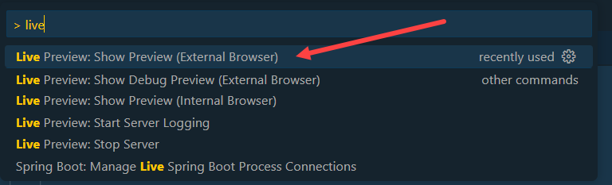
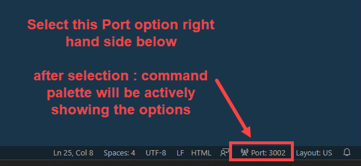

  

## How to see the Preview of the page properly in VSCode and BAS

 

Live preview and Show preview - will mostly fail due to lack of authorization to access bootstrap link, to access bootstrap a port setting is requested to the server since internal live preview and show preview is not started with port -- this page is tried to load and hangs and fails

the exact reason is browser should launch the link with a server port 
- internal live preview and show preview mostly don't launch with port setting so it fails to load things 
- earlier it worked now its not working
- so work around is 

in command palette Type '> **live**' 

and select the option shown below in the image > **live preview : Show Preview external browser**' 

 

  Above method is first time once the port is active next time onwards can select port option 
  in the window *(right side below)* then command palette will show the options (like first image) 
  

 

Always select *live preview : Show Preview external browser*

  

## End of the page
 

 <a href="https://github.com/Octavius-Dante/Arthelais/tree/main"> Main page </a> 

<!-- - [x] <a href="https://github.com/Octavius-Dante/Arthelais/tree/main/ex_38"> Exercise 38-Fiori Elements Basics</a> -->
  