## Exercise 1 - HTML basic

In this session we write a simple html page with basic html tag skeleton elements we commonly see in the pages 

</br></br>

Basic HTML page with some image - in BAS or VSCode install - live preview extension to see the page 

<details>
<summary> Live preview extension install </summary>
</br>
</br>

</br>
</br>
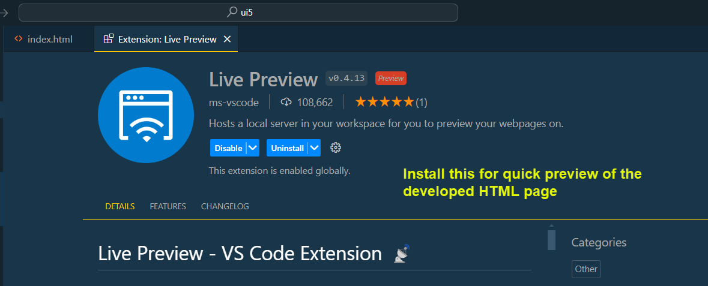

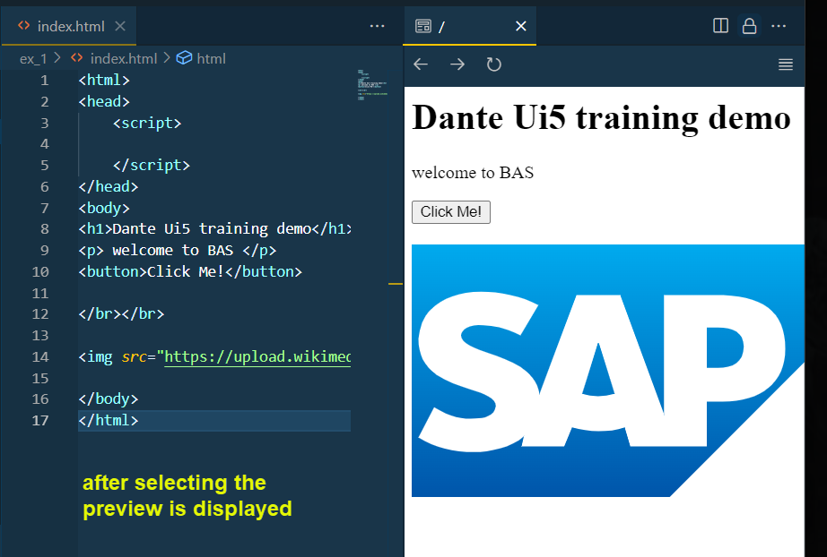
</br>
</br>
</details>
</br></br>

**index.html** sample # 1 - basic page
</br></br>

```html

<html>
<head>
    <script>

    </script>
</head>
<body>
<h1>Dante Ui5 training demo</h1>
<p> welcome to BAS </p>
<button>Click Me!</button>

</br></br>


</body>
</html>

```

</br></br>


**index.html** sample # 2 - heading tags test
</br></br>
<details>

<summary> headings test view </summary>
</br>
</br>

</br>
</br>
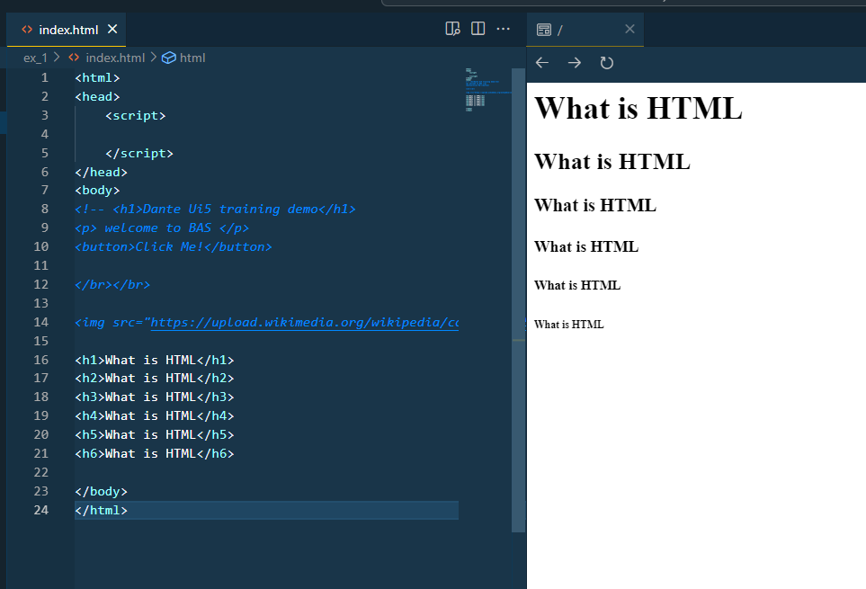
</br>
</br>
</details>
</br></br>

```html

<html>
<head>
    <script>

    </script>
</head>
<body>

<h1>What is HTML</h1>
<h2>What is HTML</h2>
<h3>What is HTML</h3>
<h4>What is HTML</h4>
<h5>What is HTML</h5>
<h6>What is HTML</h6>

</body>
</html>

```

</br></br>

**index.html** sample # 3 - emphasize and show tree structures DOM
</br></br>

```html

<html>

<head>
    <script>

    </script>
</head>

<body>

    <h2>What is HTML</h2>

    <p> HTML stands for
        <b><em>
                Hyper Text Markup Language
            </em>
        </b>, it is used for designing static web content

    </p>

</body>

</html>

```

</br></br>

<details>
<summary> DOM view in browsers </summary>
</br>

It is a tree data structure so all the elements can be insulated inside a tree as shown below 
</br></br>
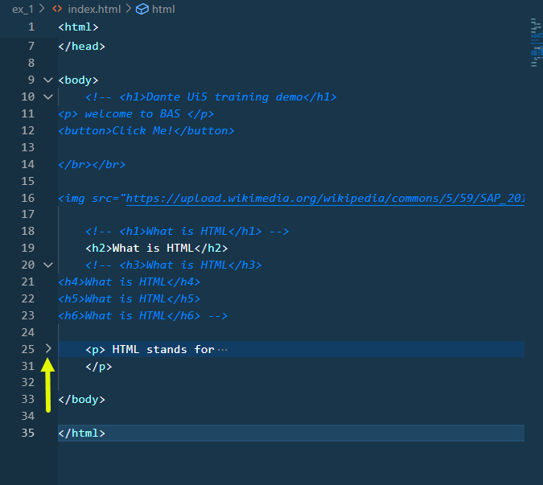

- This tree rendered can be viewed in browsers using  **(F12)** key to see developer tools 
- This tree data structure is called **DOM (Document object model)**

Developer tools in browser preview

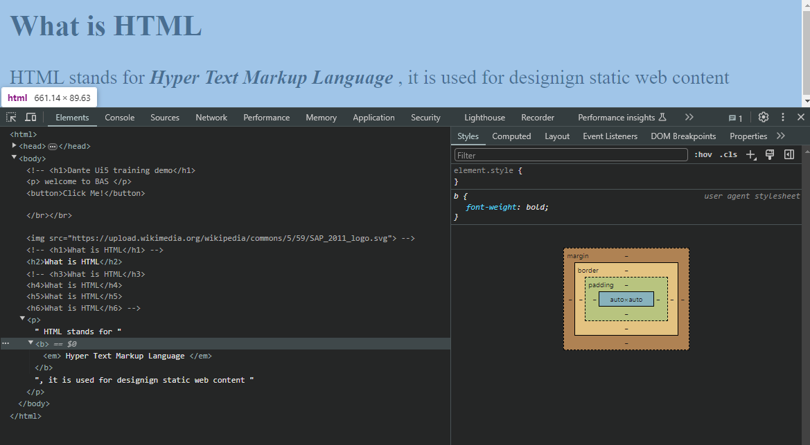

</details>
</br></br>


**index.html** sample # 4 - Multi paragraph sample
</br></br>

```html

<html>
<head>
    <script>

    </script>
</head>
<body>

<h2>What is HTML</h2>

<p> HTML stands for
    <b><em>
        Hyper Text Markup Language
    </em>
</b>, it is used for designing static web content

</p>


<h2>What is CSS</h2>
<p> 
CSS stands for Cascading Style Sheets, It is used to style / beautify our content
</p>

<h2>What is JS</h2>
<p> 
JS stands for Java Script, it is the browser's programming lanaguage
</p>

</body>
</html>

```
</br></br>

<details>
<summary> Test view of multi paragraphs </summary>
</br>
</br>
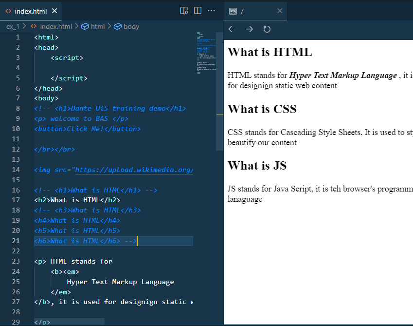
</br>
</details>

</br></br>

Organize things inside folder it's a good practice for view things in segregated manner 

- adding the image to local folder and forcing its appearance size inside the html page

</br></br>

<details>
<summary> Keep the image in local folder</summary>
</br>
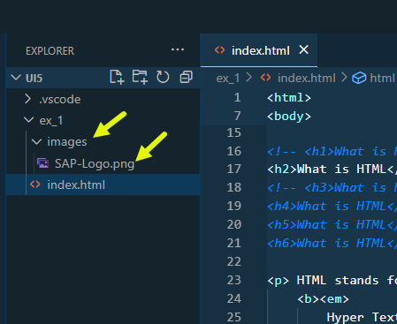
</br>
</details>

</br></br>

**index.html** sample # 5 - Image size edit and adding a webpage link 
</br></br>

```html

<html>
<head>
    <script>

    </script>
</head>
<body>

<h2>What is CSS</h2>
<p> 
CSS stands for Cascading Style Sheets, It is used to style / beautify our content
</p>

<h2>What is JS</h2>
<p> 
JS stands for Java Script, it is teh browser's programming lanaguage
</p>

<a href="https://sap.com"> Go to sap website </a>
</br> </br> 


</body>
</html>


```

</br></br>

<details>
<summary> page preview with reduced image size </summary>
</br>
</br>

original image link https://1000logos.net/wp-content/uploads/2023/07/SAP-Logo.png

</br>
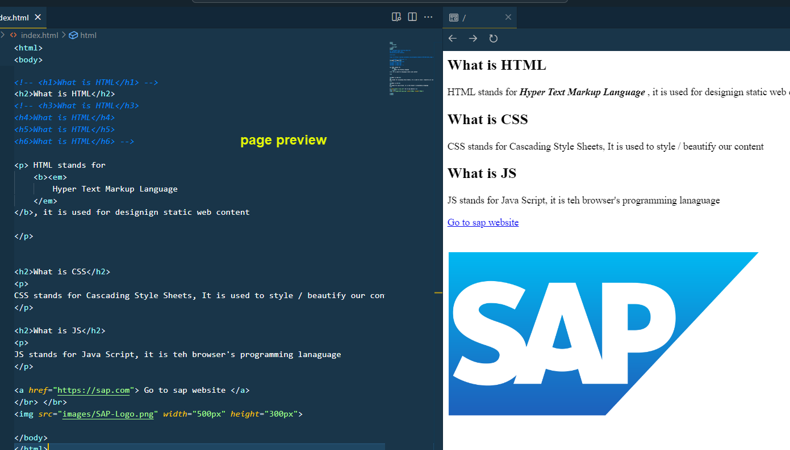
</br>
</details>
</br></br>


line break tag in html 

```html

</br> or <br>

```
</br></br>

**index.html** sample # 6 - adding webpage link to image 
</br></br>

```html

<html>
<head>
    <script>

    </script>
</head>
<body>

<a href="https://sap.com"> 

</a>

</body>
</html>

```

</br></br>

**index.html** sample # 7 - Ordered and Un-ordered List

```html

<html>
<head>
    <script>

    </script>
</head>
<body>

<!--ordered list -->

<ol>
  <li>Coffee</li>
  <li>Tea</li>
  <li>Milk</li>
</ol>

<!-- Un-ordered list -->

<ul>
  <li>Coffee</li>
  <li>Tea</li>
  <li>Milk</li>
</ul>

</body>

</html>

```

</br>

<details>
<summary> List preview </summary>
</br>
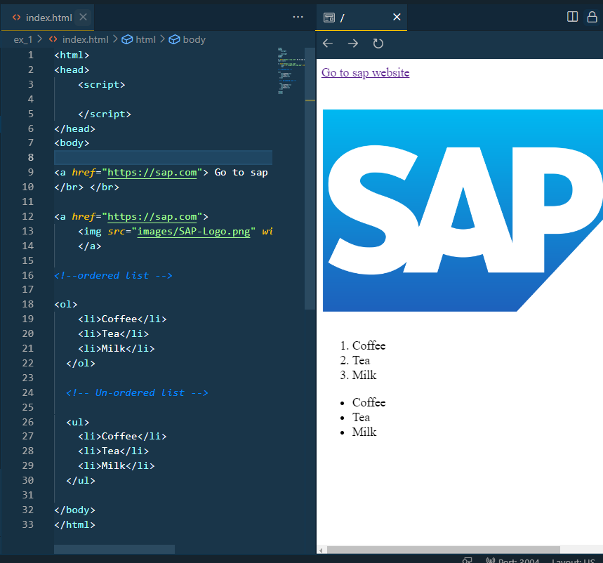
</br>
</details>

**index.html** sample # 8 - login page input fields sample.
</br></br>

```html

<html>
<head>
    <script>

    </script>
</head>
<body>

<br>
<label>User Name</label>
<input>
<br><br>
<label>Password</label>
<input type="password">
<br>

</body>

</html>

```

</br>
<details>
<summary> Login sample preview </summary>
</br>
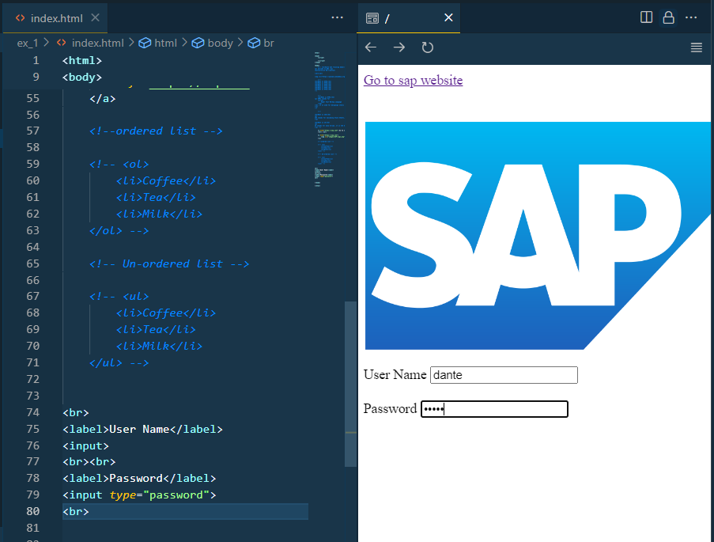
</br>
</details>

</br></br>

**index.html** sample # 9 - other types of input fields - setting limits and form submit 
</br></br>

```html

<html>
<head>
    <script>

    </script>
</head>
<body>

<br>
<label>User Name</label>
<input>
<br><br>
<label>Password</label>
<input type="password">
<br><br>

<br><br>
<input type="color"><br>
<input type="date"><br><br>

<label>Email</label>
<input type="email"><br><br>

<label>Numbers</label>
<input type="number"><br><br>

<label>Number with limit min 10 and max 100</label>
<input type="number" min="10" max="15"><br><br>

<input type="file"><br>


<!-- Form with action definition-->
<form method="GET" action="https://www.gmail.com">

    <label>User Name</label>
    <input id="idUser" name="usr">
    
    <br><br>
    
    <label>Password</label>
    <input id="idPass" name="pass" type="password">
    
    <br><br>
    <!-- this SUBMIT button will take the values mentioend with type name for input fields-->
    <input type="submit"><br>
    </form>

</body>

</html>

```

</br>
<details>
<summary> Login sample preview </summary>
</br>
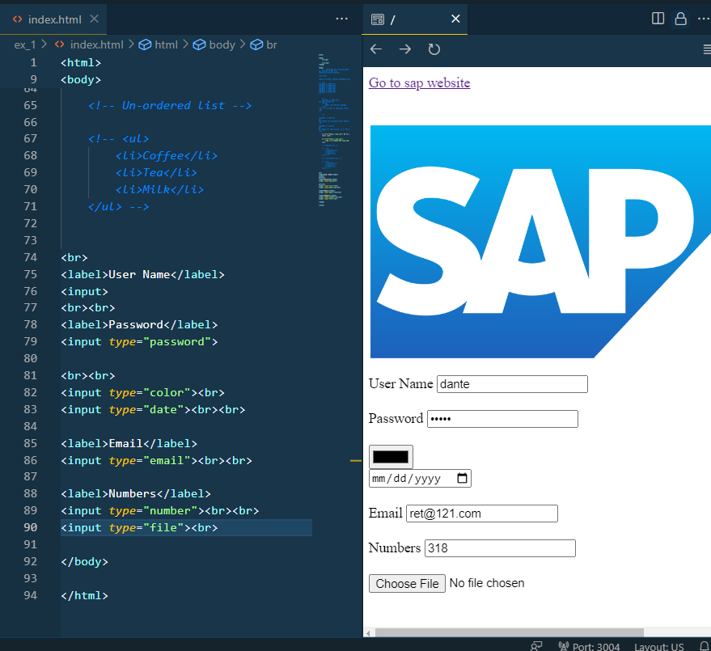
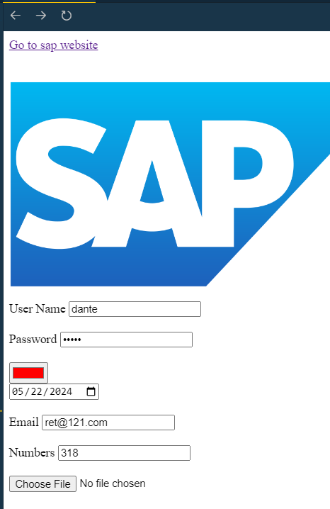
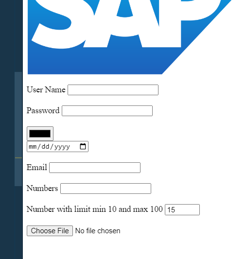
</br>
</details>


</br></br>
</br></br>
</br></br>

## End of Exercise 1 ---NEXT---> <a href="https://github.com/Octavius-Dante/Arthelais/tree/main/ex_2"> Exercise 2-HTML5 </a>


<!--

<details>
<summary> <b> ALL CODE CHANGES - TODAY SESSION </b> </summary>
</br>
</br>

</br>
</br>

</br>
</br>
</details>

-->
