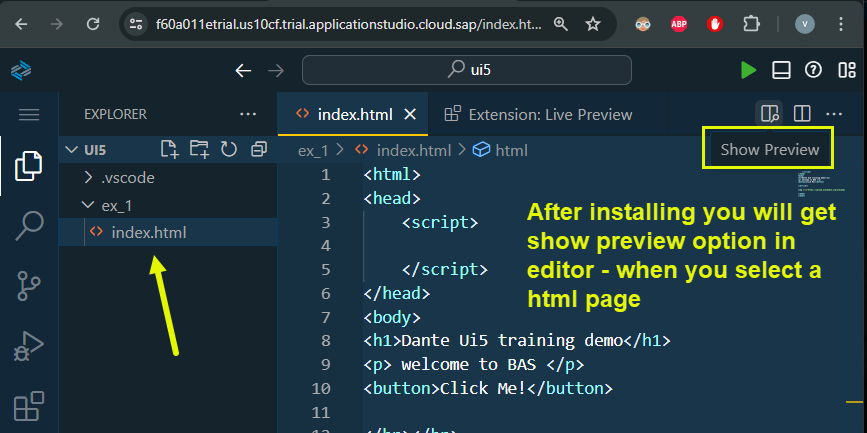

## Exercise 1 - HTML basic

In this session we write a simple html page with basic html tag skeleton elements we commonly see in the pages 

</br></br>

Basic HTML page with some image - in BAS or VSCode install - live preview extension to see the page 

<details>
<summary> Live preview extension install </summary>
</br>
</br>

</br>
</br>



</br>
</br>
</details>
</br></br>

**index.html** sample # 1 - basic page
</br></br>

```html

<html>
<head>
    <script>

    </script>
</head>
<body>
<h1>Dante Ui5 training demo</h1>
<p> welcome to BAS </p>
<button>Click Me!</button>

</br></br>


</body>
</html>

```

</br></br>


**index.html** sample # 2 - heading tags test
</br></br>
<details>

<summary> headings test view </summary>
</br>
</br>

</br>
</br>

</br>
</br>
</details>
</br></br>

```html

<html>
<head>
    <script>

    </script>
</head>
<body>
<!-- <h1>Dante Ui5 training demo</h1>
<p> welcome to BAS </p>
<button>Click Me!</button>

</br></br>

 -->

<h1>What is HTML</h1>
<h2>What is HTML</h2>
<h3>What is HTML</h3>
<h4>What is HTML</h4>
<h5>What is HTML</h5>
<h6>What is HTML</h6>

</body>
</html>

```

</br></br>

It is a tree data structure so all the elements can be insulated inside a tree as shown below 
</br></br>


- This tree rendered can be viewed in browsers using  **(F12)** key to see developer tools 
- This tree data structure is called **DOM (Document object model)**

Developer tools in browser preview


</br></br>

```html

<html>

<head>
    <script>

    </script>
</head>

<body>
    <!-- <h1>Dante Ui5 training demo</h1>
<p> welcome to BAS </p>
<button>Click Me!</button>

</br></br>

 -->

    <!-- <h1>What is HTML</h1> -->
    <h2>What is HTML</h2>
    <!-- <h3>What is HTML</h3>
<h4>What is HTML</h4>
<h5>What is HTML</h5>
<h6>What is HTML</h6> -->

    <p> HTML stands for
        <b><em>
                Hyper Text Markup Language
            </em>
        </b>, it is used for designing static web content

    </p>

</body>

</html>

```


</br></br>
</br></br>
</br></br>

## End of Exercise 1 ---NEXT---> <a href="https://github.com/Octavius-Dante/Arthelais/tree/main/ex_2"> Exercise 2-HTML5 </a>


<!--

<details>
<summary> <b> ALL CODE CHANGES - TODAY SESSION </b> </summary>
</br>
</br>

</br>
</br>

</br>
</br>
</details>

-->
