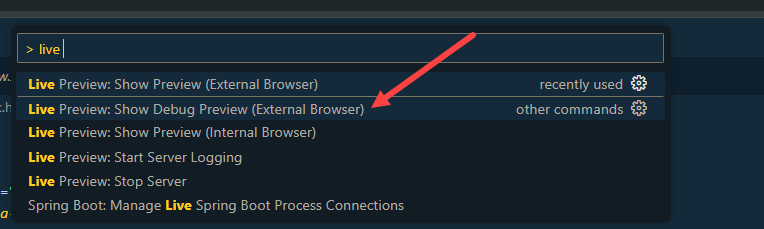

## Exercise 10 - XML Views

</br></br>

XML Stands for Extended Markup Language, it is a tree data structure to represent data, Unlike HTML, XML can have tag. The sole purpose of XM Lwas to exchange data between heterogeneous systems.

</br>

- Any Data object in programming language is converted to XML ---> **Rendering** 

- Also convert any XML to any data object ---> **Parsing**


</br></br>

**Why XML view over JS view :-**
</br>


1. Violation of MVC principles, XML is a data holding file and not a programming language there is no freedom to write processing or business logic. So no option to violate the MVC principle

2. XML is an industry standard to write views 

3. When the renderer convert JS view --> HTML+CSS, XML is faster to convert

4. All the code samples in SDK are built on XML views


</br></br>

> [!IMPORTANT]
> XML file is used to define view elements as a declarative object
> -- JS file we associate as controller we write logic for the declared object

</br></br>


**XML Skeleton structure in SAP Ui5**

</br>

```xml

<!-- xmlns:ns - ns-Name space -->

<mvc:View controllerName="full.Path.Of.Controller" xmlns:mvc="sap.ui.core.mvc" xmlns="sap.m" xmlns:ns="libname">

    <Input id="idInp" />
    <Button id="idBtn" />
    <Button id="idBtn" />

</mvc:View>

<!-- sap.m - default library -->

```

</br>

- When the renderer convert the XML view to HTML code, this time the control ID will be the **viewID--elementId**

- Now if we want to use **sap.ui.getCore().byId("viewId--ControlId");**

- So if we use the XML view, the best approach to get control instance is to use view object
**this.getView().byId("controlId")** -used most

</br></br>
</br>

## XML view sample (complete files)

</br>

**Sample JS script- Controller file - path + Filename(webapp\controller\MyXML.controller.js)**

```js

sap.ui.define([
    'sap/ui/core/mvc/Controller'
], function(Controller) {
    'use strict';
// workspacename.controller-folder.controller-name    
    return Controller.extend("chip.controller.MyXML",{
        onInit: function(){

        },
        //Ctrl+Slash / comment code in VSCode and BAS
        onBtnClick: function(){
                debugger; // break-point for testing 

// never use (sap.ui.getCore().byId) method for getting ID - it wont work in XML view only works in JSview 
//
// Reason why it wont work is : 
// XML view conversion to HTML - processed differently by renderer -- this generates a new id for element
// JS view conversion to HTML  - processed differently by renderer -- this doesnt generate new id for element
//
// both are different category of conversion process handled by renderer so it doesnt work
//
                //var oInp = sap.ui.getCore().byId("idText");  

// use this (this.getView().byId) method recommended way to get the ID in XMML views
                var oInp = this.getView().byId("idText");      

                alert(oInp.getValue());
            },
    });
});


```

</br></br>

**Sample XML view - Main view file - path + Filename(webapp\view\MyXML.view.xml)** 

```xml
<!-- ControllerName = workspacename.controller-folder.controller-name -->
<mvc:View controllerName="chip.controller.MyXML" xmlns:mvc="sap.ui.core.mvc" xmlns="sap.m">

    <Input id="idText"/>
    <Button id="idClick" press="onBtnClick" text="Click Me" icon="sap-icon://home"/>

</mvc:View>

```

</br></br>

**Sample index - Html file - path + Filename(webapp\index.html)** 

```html

<html>
    <head>
<!-- Bootstrap script link-->
        <script src="https://ui5.sap.com/resources/sap-ui-core.js"
                data-sap-ui-libs="sap.m"
                data-sap-ui-theme="sap_fiori_3_dark"
                data-sap-ui-resourceroots='{"chip" : "./"}'>                     
        </script>
<!-- data-sap-ui-resourceroots -- assigning a name to workspace-->

        <script>

// Object creation for XML view
            var oViewXML = new sap.ui.view({
                viewName: 'chip.view.MyXML',  // view name -- workspacename.view-folder.view-name
                type: 'XML',                  // view type
                id: "idXMLView"             
            });

// Object assignment of XML view to HTML div
            oViewXML.placeAt("canvas");

        </script>

    </head>
    <body class="sapUiBody">
        <div id="canvas"></div>
    </body> 

</html>

```


</br></br>


<details>
<summary> <b> MVC principle followed - JS view and XML view together  </b> </summary>
</br>
</br>

JS view + XML view appear together in **index.html** example of both 


**JS view controller file -JS - path + Filename(webapp\controller\Main.controller.js)**

```js

//AMD Like Syntax, Module Definition, Scaffolding template
sap.ui.define(
    ['sap/ui/core/mvc/Controller'], 
    function(Controller){
        return Controller.extend("chip.controller.Main",{
            //this.getView()
            //Hook methods
            // oSuperman : sap.ui.getCore(),
            onInit: function() {
               //If you give more what you get, soon you will get
               //more than you gave 
               console.log("Contructor was called ", sap.ui.getCore());
               console.log(this.getView());
            },
            onExit: function(){
                console.log("onExit was called", sap.ui.getCore());
            },
            onBeforeRendering: function(){
                console.log("Before rendering was called ", sap.ui.getCore());
            },
            onAfterRendering: function(){
                console.log("After Rendering was called ");
                $("#idInp").fadeOut(1000).fadeIn(5000);
            },
            spiderman: function(){
                    //Step 1: get the object of Button 1 
                    var oBtnNew = sap.ui.getCore().byId("idBtn");
                    //Step 2: Attach the event dynamically to function
                    oBtnNew.attachPress(function(){
                        //alert(document.getElementById("idInp").value);
                        //Step 1: get the application object(instance)
                        var oCore = sap.ui.getCore();
                        //Step 2: Obtain the UI5 control object - sap.ui.getCore().byId("idInp")
                        var oInp = oCore.byId("idInp");
                        //Step 3: We have a value, so we will have setter and getter for same
                        var sVal = oInp.getValue();
                        //Step 4: print on screen
                        alert(sVal);
                    });
                }
        });
});

```

</br></br>

**JS View file -JS - path + Filename(webapp\view\Main.view.js)**

```js

sap.ui.jsview("chip.view.Main", {

    getControllerName: function() {
        return "chip.controller.Main";
    },

    createContent: function(oController) {
            var oInp = new sap.m.Input("idInp");
            //oInp.placeAt("canvas");
            var oBtn = new sap.m.Button('idBtn',
                {
                text: 'Shoot!',
                icon: 'sap-icon://camera'
                }
            );
            
            //oBtn.placeAt("content");
            var oBtn2 = new sap.m.Button({
                text: "Attach",
                press: oController.spiderman
            });

            //oBtn2.placeAt("next");
            return [oInp, oBtn, oBtn2];
    }

});

```

</br></br>

**XML view file -XML - path + Filename(webapp\view\MyXML.view.xml)**

```xml

<mvc:View controllerName="chip.controller.MyXML" xmlns:mvc="sap.ui.core.mvc" xmlns="sap.m">

    <Input id="idText"/>
    <Button id="idClick" press="onBtnClick" text="Click Me" icon="sap-icon://home"/>

</mvc:View>

```

</br></br>

**XML view Controller file -JS - path + Filename(webapp\controller\MyXML.controller.js)**

```js

sap.ui.define([
    'sap/ui/core/mvc/Controller'
], function(Controller) {
    'use strict';
    return Controller.extend("chip.controller.MyXML",{
        onInit: function(){

        },
        //Ctrl+Slash /
        onBtnClick: function(){
                debugger;
                //var oInp = sap.ui.getCore().byId("idText");  //this.getView().byId("idText")
                var oInp = this.getView().byId("idText");
                alert(oInp.getValue());
            },
    });
});


```

</br></br>

**Index.html file - path + Filename(webapp\index.html)**

```html

<html>
    <head>

        <script src="https://sapui5.hana.ondemand.com/resources/sap-ui-core.js"
                data-sap-ui-libs="sap.m"
                data-sap-ui-theme="sap_fiori_3_dark"
                data-sap-ui-resourceroots='{
                    "chip" : "./"
                }'
        >     
        </script>

        <script>
            //var oControlName = new libraryName.ClassName(sId, sProperties);
            
            var oView = new sap.ui.view({
                viewName: 'chip.view.Main',
                type: 'JS'
            });
            
            oView.placeAt('content');

            var oViewXML = new sap.ui.view({
                viewName: 'chip.view.MyXML',
                type: 'XML',
                id: "idXMLView"
            });
            oViewXML.placeAt("canvas");


        </script>

    </head>
    <body class="sapUiBody">
        <div id="canvas"></div>
        <div id="content"></div>
        <div id="next"></div>
    </body> 

</html>

```
</br>
</br>
</details>

</br>

<details>
<summary> <b> MVC principle violated - JS view and XML view together  </b> </summary>
</br>
</br>


**JS view + XML view controller file -JS - path + Filename(webapp\controller\Main.controller.js)**

```js

//AMD Like Syntax, Module Definition, Scaffolding template
sap.ui.define(
    ['sap/ui/core/mvc/Controller'], 
    function(Controller){
        return Controller.extend("chip.controller.Main",{
            //this.getView()
            //Hook methods
            // oSuperman : sap.ui.getCore(),
            onInit: function() {
               //If you give more what you get, soon you will get
               //more than you gave 
               console.log("Contructor was called ", sap.ui.getCore());
               console.log(this.getView());
            },
            onExit: function(){
                console.log("onExit was called", sap.ui.getCore());
            },
            onBeforeRendering: function(){
                console.log("Before rendering was called ", sap.ui.getCore());
            },
            onAfterRendering: function(){
                console.log("After Rendering was called ");
                $("#idInp").fadeOut(1000).fadeIn(5000);
            },

            // XML view controlelr logic 
            onBtnClick: function(){
                debugger;
                //var oInp = sap.ui.getCore().byId("idText");  //this.getView().byId("idText")
                var oInp = this.getView().byId("idText");
                alert(oInp.getValue());
            },

            spiderman: function(){
                    //Step 1: get the object of Button 1 
                    var oBtnNew = sap.ui.getCore().byId("idBtn");
                    //Step 2: Attach the event dynamically to function
                    oBtnNew.attachPress(function(){
                        //alert(document.getElementById("idInp").value);
                        //Step 1: get the application object(instance)
                        var oCore = sap.ui.getCore();
                        //Step 2: Obtain the UI5 control object - sap.ui.getCore().byId("idInp")
                        var oInp = oCore.byId("idInp");
                        //Step 3: We have a value, so we will have setter and getter for same
                        var sVal = oInp.getValue();
                        //Step 4: print on screen
                        alert(sVal);
                    });
                }
        });
});

```

</br></br>

**XML view file -XML - path + Filename(webapp\view\MyXML.view.xml)**

```xml

<!--Check the controller name-->
<mvc:View controllerName="chip.controller.Main" xmlns:mvc="sap.ui.core.mvc" xmlns="sap.m">

    <Input id="idText"/>
    <Button id="idClick" press="onBtnClick" text="Click Me" icon="sap-icon://home"/>

</mvc:View>

```

</br></br>

**JS View file -JS - path + Filename(webapp\view\Main.view.js)**

```js

sap.ui.jsview("chip.view.Main", {

    getControllerName: function() {
        return "chip.controller.Main";
    },

    createContent: function(oController) {
            var oInp = new sap.m.Input("idInp");
            //oInp.placeAt("canvas");
            var oBtn = new sap.m.Button('idBtn',
                {
                text: 'Shoot!',
                icon: 'sap-icon://camera'
                }
            );
            
            //oBtn.placeAt("content");
            var oBtn2 = new sap.m.Button({
                text: "Attach",
                press: oController.spiderman
            });

            //oBtn2.placeAt("next");
            return [oInp, oBtn, oBtn2];
    }

});

```

</br></br>

**Index.html file - path + Filename(webapp\index.html)**

```html

<html>
    <head>

        <script src="https://sapui5.hana.ondemand.com/resources/sap-ui-core.js"
                data-sap-ui-libs="sap.m"
                data-sap-ui-theme="sap_fiori_3_dark"
                data-sap-ui-resourceroots='{
                    "chip" : "./"
                }'
        >     
        </script>

        <script>
            //var oControlName = new libraryName.ClassName(sId, sProperties);
            
            var oView = new sap.ui.view({
                viewName: 'chip.view.Main',
                type: 'JS'
            });
            
            oView.placeAt('content');

            var oViewXML = new sap.ui.view({
                viewName: 'chip.view.MyXML',
                type: 'XML',
                id: "idXMLView"
            });
            oViewXML.placeAt("canvas");


        </script>

    </head>
    <body class="sapUiBody">
        <div id="canvas"></div>
        <div id="content"></div>
        <div id="next"></div>
    </body> 

</html>

```

</br>
</br>
</details>

</br></br>

**Sample script for setting value in input field**

```js

this.getView().byId("idInp1").setValue("Some thing is Cooking!"); 

```


</br>
</br></br>

## End of Exercise 10 ---NEXT---> <a href="https://github.com/Octavius-Dante/Arthelais/tree/main/ex_11"> Exercise 11- Model Basics</a>
</br>
<p align="center"> <a href="https://github.com/Octavius-Dante/Arthelais/tree/main"> Main page </a> </p>


</br></br>

**All Previous sessions**
</br></br>

<!-- - [x] <a href="https://github.com/Octavius-Dante/Arthelais/tree/main/ex_37"> Exercise 37-Deploy app to launchpad</a>
- [x] <a href="https://github.com/Octavius-Dante/Arthelais/tree/main/ex_36"> Exercise 36-WebIde and Git integration</a>
- [x] <a href="https://github.com/Octavius-Dante/Arthelais/tree/main/ex_35"> Exercise 35-POST, GET and DELETE from Fiori</a>
- [x] <a href="https://github.com/Octavius-Dante/Arthelais/tree/main/ex_34"> Exercise 34-GET and Connect</a>
- [x] <a href="https://github.com/Octavius-Dante/Arthelais/tree/main/ex_33"> Exercise 33-Fiori Project Connect Odata</a>
- [x] <a href="https://github.com/Octavius-Dante/Arthelais/tree/main/ex_32"> Exercise 32-Connectivity</a>
- [x] <a href="https://github.com/Octavius-Dante/Arthelais/tree/main/ex_31"> Exercise 31-Function Import and Images</a>
- [x] <a href="https://github.com/Octavius-Dante/Arthelais/tree/main/ex_30"> Exercise 30-implementing CRUD</a>
- [x] <a href="https://github.com/Octavius-Dante/Arthelais/tree/main/ex_29"> Exercise 29-Implementing GET</a>
- [x] <a href="https://github.com/Octavius-Dante/Arthelais/tree/main/ex_28"> Exercise 28-Create A Gateway Project</a>
- [x] <a href="https://github.com/Octavius-Dante/Arthelais/tree/main/ex_27"> Exercise 27-Odata GET</a>
- [x] <a href="https://github.com/Octavius-Dante/Arthelais/tree/main/ex_26"> Exercise 26-Fiori Deployments</a>
- [x] <a href="https://github.com/Octavius-Dante/Arthelais/tree/main/ex_25"> Exercise 25-Fragments Deep dive</a>
- [x] <a href="https://github.com/Octavius-Dante/Arthelais/tree/main/ex_24"> Exercise 24-Fragments</a>
- [x] <a href="https://github.com/Octavius-Dante/Arthelais/tree/main/ex_23"> Exercise 23-Icon Tab bar</a>
- [x] <a href="https://github.com/Octavius-Dante/Arthelais/tree/main/ex_22"> Exercise 22-Route matched Handlers</a>
- [x] <a href="https://github.com/Octavius-Dante/Arthelais/tree/main/ex_21"> Exercise 21-Router Basics</a>
- [x] <a href="https://github.com/Octavius-Dante/Arthelais/tree/main/ex_20"> Exercise 20-Filters on List mode</a>
- [x] <a href="https://github.com/Octavius-Dante/Arthelais/tree/main/ex_19"> Exercise 19-Manifest JSON</a>
- [x] <a href="https://github.com/Octavius-Dante/Arthelais/tree/main/ex_18"> Exercise 18-List Control</a>
- [x] <a href="https://github.com/Octavius-Dante/Arthelais/tree/main/ex_17"> Exercise 17-Fiori Lite app</a>
- [x] <a href="https://github.com/Octavius-Dante/Arthelais/tree/main/ex_16"> Exercise 16-Formatters </a>
- [x] <a href="https://github.com/Octavius-Dante/Arthelais/tree/main/ex_15"> Exercise 15-Element Binding</a>
- [x] <a href="https://github.com/Octavius-Dante/Arthelais/tree/main/ex_14"> Exercise 14-Table control</a>
- [x] <a href="https://github.com/Octavius-Dante/Arthelais/tree/main/ex_13"> Exercise 13-Expression Binding XML Model</a>
- [x] <a href="https://github.com/Octavius-Dante/Arthelais/tree/main/ex_12"> Exercise 12-Json Model Property Binding</a>
- [x] <a href="https://github.com/Octavius-Dante/Arthelais/tree/main/ex_11"> Exercise 11-Model Basics </a>
- [x] <a href="https://github.com/Octavius-Dante/Arthelais/tree/main/ex_10"> Exercise 10-XML Views </a> -->
- [x] <a href="https://github.com/Octavius-Dante/Arthelais/tree/main/ex_9"> Exercise 9-Control Hierarchy 2</a>
- [x] <a href="https://github.com/Octavius-Dante/Arthelais/tree/main/ex_8"> Exercise 8-Ui5 Control Hierarchy </a>
- [x] <a href="https://github.com/Octavius-Dante/Arthelais/tree/main/ex_7"> Exercise 7-SAP Ui5 Framework </a>
- [x] <a href="https://github.com/Octavius-Dante/Arthelais/tree/main/ex_6"> Exercise 6-JQuery </a>
- [x] <a href="https://github.com/Octavius-Dante/Arthelais/tree/main/ex_5"> Exercise 5-JS deep dive </a>
- [x] <a href="https://github.com/Octavius-Dante/Arthelais/tree/main/ex_4"> Exercise 4-JS basic </a>
- [x] <a href="https://github.com/Octavius-Dante/Arthelais/tree/main/ex_3"> Exercise 3-CSS </a>
- [x] <a href="https://github.com/Octavius-Dante/Arthelais/tree/main/ex_2"> Exercise 2-HTML5</a>
- [x] <a href="https://github.com/Octavius-Dante/Arthelais/tree/main/ex_1"> Exercise 1 -Basic </a>


<!--

<details>
<summary> <b> ALL CODE CHANGES - TODAY SESSION </b> </summary>
</br>
</br>

</br>
</br>

</br>
</br>
</details>

-->