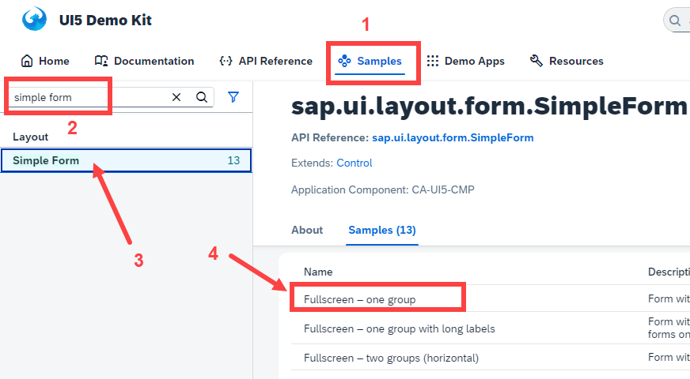
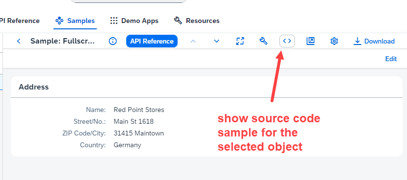
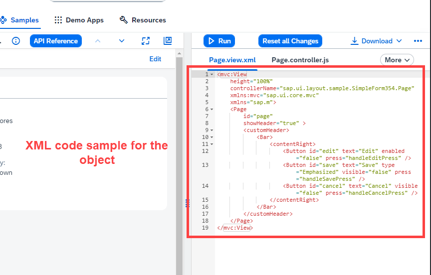
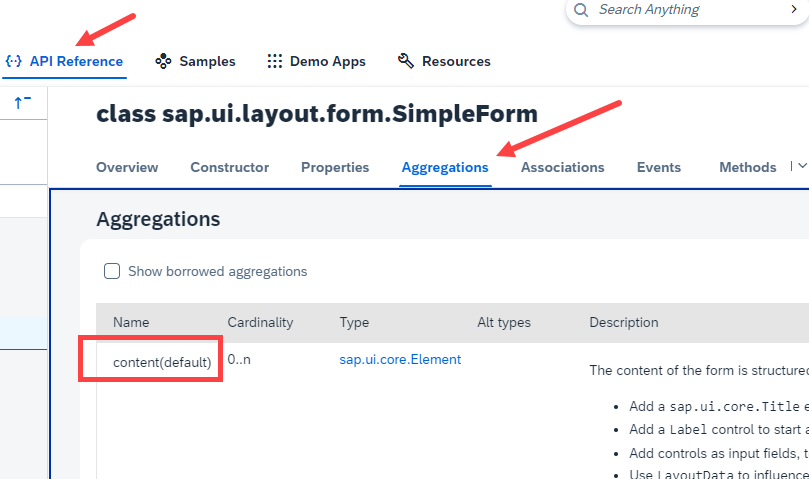

## Exercise 11 - Model basics

</br></br>


**Building a simple form layout in UI5**

</br>

<details>
<summary> Refer the SAP ui5 SDK in sample section for "Simple form" </summary>
</br>
</br>



</br>
</br>
</details>

<details>
<summary> Aggregation in Ui5 design </summary>
</br>
It can be represented as adding one object inside another object
</br></br>

- Usually the control class aggregates to the super classes of UI control so any 
</br> of the UI control can be passed as a object inside the aggregation 

- We can pass any child class object to simple form

- Parent class : sap.ui.core.Element - Child classes are button, input, message, title 

- Aggregation will follow same namespace as its control/class.

- Inside the aggregation we can add 0 or multiple objects of other classes depending on cardinality.

- If there is an aggregation which id default(one), then we can also skip writing it in our view.

</br></br>
</br>

</br></br>
</details>

</br>

xml view

```xml

<mvc:View xmlns:form="sap.ui.layout.form" controllerName="logger.controller.ex11" 
xmlns:mvc="sap.ui.core.mvc" xmlns="sap.m"
xmlns:f="sap.ui.layout.form"
xmlns:core="sap.ui.core">

<!-- Simple form definition Form is the ibrary namesapce -->
<!-- Aggregation of control follows the same name space as the parent Form name -->

<!-- No need to mention library for this form xmlns:f="sap.ui.layout.form" -->
    <form:SimpleForm editable="true"> <!-- editable property aligns the controls properly in screen -->
    <form:title>
        <core:Title icon="sap-icon://customer" text="Employee Details" />
    </form:title>
        <form:content>  <!-- Aggregation name starts with small letter-->
            <Label text="Emp Id"/> <!-- control name starts with capital letter -->
            <Input id="idEmpId" width="25%"/>
            <Label text="Emp Name"/>
            <Input id="idEmpName" width="30%"/>
            <Label text="Salary"/>
            <Input id="idSalary" width="20%"/>
            <Label text="Currency"/>
            <Input id="idCurrency" width="10%"/>
            <Label/> <!--empty label for spacing-->
            
                <!-- <HBox> -->
                    <Button text="Load data" press="onLoad" width=""/>
                    <Button text="Clear data" press="onClear" width=""/>
                <!-- </HBox> -->
                        
        </form:content>
    </form:SimpleForm>

    </mvc:View>

```

</br></br>

JS controller

```js

sap.ui.define(
    ['sap/ui/core/mvc/Controller'], 
    function(Controller){
        return Controller.extend("logger.controller.ex11",{

            onLoad: function(){
                this.getView().byId("idEmpId").setValue("609879");
                this.getView().byId("idEmpName").setValue("Argnan Carlyle");
                this.getView().byId("idSalary").setValue("400000"); 
                this.getView().byId("idCurrency").setValue("USD");
            },

            onClear: function(){
                this.getView().byId("idEmpId").setValue(" ");
                this.getView().byId("idEmpName").setValue(" ");
                this.getView().byId("idSalary").setValue(" "); 
                this.getView().byId("idCurrency").setValue(" ");                                
            }

        });
});

```

</br></br>

index.html 

``` html

<html>
    <head>
        <script src="https://sapui5.hana.ondemand.com/resources/sap-ui-core.js"
                data-sap-ui-libs="sap.m"
                data-sap-ui-theme="sap_fiori_3_dark"
                data-sap-ui-resourceroots='{"logger" : "./"}' >     
        </script>

        <script>
            var oViewXML = new sap.ui.view({
                viewName: 'logger.view.ex11',
                type: 'XML',
                id: "idXMLView"
            });
            oViewXML.placeAt("canvas");
        </script>
        
    </head>
    <body class="sapUiBody">
        <div id="canvas"></div>
    </body> 

</html>

```

</br></br>

## Model in SAP Ui5

</br>

Model is an object of data, The model is used to 

- Hold application data
- Manage data exchange between view and model through binding
- Provides manipulation capabilities
- Also, allows us to communicate to SAP server

</br>

**Types of models :**

- Client side
- Server side 

</br>

**Client side model :**

A Client side model, keeps all the data in the browser once loaded. Suitable for small size of data.
</br> These models are like internal tables in ABAP used fir Data manipulation.

</br>

**Client side model types**

- JSON model
- XML model 
- Resource model

</br>

**Server side model :**

A Server side model, keeps all the data in the server, It loads the data on demand when requested 
</br> using request response architecture, suitable for large size of data
</br> This model is a hook to communicate from Fiori App to SAP Server.
</br> SAP Fiori Apps can **only talk to OData services**.

</br>

**Server side model types**

- OData model

</br></br>

**Steps to create model**

1. create a brand new model object

```js

new sap.ui.model.json.JSONModel
new sap.ui.model.xml.XMLModel
new sap.ui.model.resource.ResourceModel
new sap.ui.model.odat.v2.ODataModel

```

2. Load or set the data to the model

```js    
    oModel.setData, oModel.loadData
```

3. Make the model aware to the application

```js

sap.ui.getCore().setModel(oModel) - set at App level //application level - RECOMMENDED
this.getView().setModel(oModel)  // only that view - view level
this.getView().byId("idControl").setModel(oModel) // Control level

```

4. Data Binding (using path) - 4 different syntax to do binding 
     - Need address of the data to build a path 


</br></br>

**Building a sample JSON model**

*empStr is the structure type holds only single row*
</br> *empTab is the table holds multiple records*

```json

{
    "empStr":{
            "empId": 634,
            "empName": "Carlisle",
            "salary": 450000,
            "currency": "USD"
    },

    "empTab": [
        {
            "empId": 101,
            "empName": "jane",
            "salary": 250000,
            "currency": "USD"
        },
        {
            "empId": 102,
            "empName": "jack",
            "salary": 125000,
            "currency": "USD"
        },
        {
            "empId": 101,
            "empName": "jerry",
            "salary": 300000,
            "currency": "DIN"
        },
    ]
}


```

</br></br>

**Rule for building address**

- For every Curly braces '{' , convert it to slash '/'
- Every array '[]' convert it to '/index'

<!-- </br> 

**How to build address of the data for data binding** -->


</br></br>
</br></br>
</br></br>


</br></br>
</br></br>
</br></br>

## End of Exercise 11 ---NEXT---> <a href="https://github.com/Octavius-Dante/Arthelais/tree/main/ex_12"> Exercise 12-Json Model Property Binding </a>
</br>
<p align="center"> <a href="https://github.com/Octavius-Dante/Arthelais/tree/main"> Main page </a> </p>


</br></br>

**All Previous sessions**
</br></br>

<!-- - [x] <a href="https://github.com/Octavius-Dante/Arthelais/tree/main/ex_37"> Exercise 37-Deploy app to launchpad</a>
- [x] <a href="https://github.com/Octavius-Dante/Arthelais/tree/main/ex_36"> Exercise 36-WebIde and Git integration</a>
- [x] <a href="https://github.com/Octavius-Dante/Arthelais/tree/main/ex_35"> Exercise 35-POST, GET and DELETE from Fiori</a>
- [x] <a href="https://github.com/Octavius-Dante/Arthelais/tree/main/ex_34"> Exercise 34-GET and Connect</a>
- [x] <a href="https://github.com/Octavius-Dante/Arthelais/tree/main/ex_33"> Exercise 33-Fiori Project Connect Odata</a>
- [x] <a href="https://github.com/Octavius-Dante/Arthelais/tree/main/ex_32"> Exercise 32-Connectivity</a>
- [x] <a href="https://github.com/Octavius-Dante/Arthelais/tree/main/ex_31"> Exercise 31-Function Import and Images</a>
- [x] <a href="https://github.com/Octavius-Dante/Arthelais/tree/main/ex_30"> Exercise 30-implementing CRUD</a>
- [x] <a href="https://github.com/Octavius-Dante/Arthelais/tree/main/ex_29"> Exercise 29-Implementing GET</a>
- [x] <a href="https://github.com/Octavius-Dante/Arthelais/tree/main/ex_28"> Exercise 28-Create A Gateway Project</a>
- [x] <a href="https://github.com/Octavius-Dante/Arthelais/tree/main/ex_27"> Exercise 27-Odata GET</a>
- [x] <a href="https://github.com/Octavius-Dante/Arthelais/tree/main/ex_26"> Exercise 26-Fiori Deployments</a>
- [x] <a href="https://github.com/Octavius-Dante/Arthelais/tree/main/ex_25"> Exercise 25-Fragments Deep dive</a>
- [x] <a href="https://github.com/Octavius-Dante/Arthelais/tree/main/ex_24"> Exercise 24-Fragments</a>
- [x] <a href="https://github.com/Octavius-Dante/Arthelais/tree/main/ex_23"> Exercise 23-Icon Tab bar</a>
- [x] <a href="https://github.com/Octavius-Dante/Arthelais/tree/main/ex_22"> Exercise 22-Route matched Handlers</a>
- [x] <a href="https://github.com/Octavius-Dante/Arthelais/tree/main/ex_21"> Exercise 21-Router Basics</a>
- [x] <a href="https://github.com/Octavius-Dante/Arthelais/tree/main/ex_20"> Exercise 20-Filters on List mode</a>
- [x] <a href="https://github.com/Octavius-Dante/Arthelais/tree/main/ex_19"> Exercise 19-Manifest JSON</a>
- [x] <a href="https://github.com/Octavius-Dante/Arthelais/tree/main/ex_18"> Exercise 18-List Control</a>
- [x] <a href="https://github.com/Octavius-Dante/Arthelais/tree/main/ex_17"> Exercise 17-Fiori Lite app</a>
- [x] <a href="https://github.com/Octavius-Dante/Arthelais/tree/main/ex_16"> Exercise 16-Formatters </a>
- [x] <a href="https://github.com/Octavius-Dante/Arthelais/tree/main/ex_15"> Exercise 15-Element Binding</a>
- [x] <a href="https://github.com/Octavius-Dante/Arthelais/tree/main/ex_14"> Exercise 14-Table control</a>
- [x] <a href="https://github.com/Octavius-Dante/Arthelais/tree/main/ex_13"> Exercise 13-Expression Binding XML Model</a>
- [x] <a href="https://github.com/Octavius-Dante/Arthelais/tree/main/ex_12"> Exercise 12-Json Model Property Binding</a>
- [x] <a href="https://github.com/Octavius-Dante/Arthelais/tree/main/ex_11"> Exercise 11-Model Basics </a> -->
- [x] <a href="https://github.com/Octavius-Dante/Arthelais/tree/main/ex_10"> Exercise 10-XML Views </a>
- [x] <a href="https://github.com/Octavius-Dante/Arthelais/tree/main/ex_9"> Exercise 9-Control Hierarchy 2</a>
- [x] <a href="https://github.com/Octavius-Dante/Arthelais/tree/main/ex_8"> Exercise 8-Ui5 Control Hierarchy </a>
- [x] <a href="https://github.com/Octavius-Dante/Arthelais/tree/main/ex_7"> Exercise 7-SAP Ui5 Framework </a>
- [x] <a href="https://github.com/Octavius-Dante/Arthelais/tree/main/ex_6"> Exercise 6-JQuery </a>
- [x] <a href="https://github.com/Octavius-Dante/Arthelais/tree/main/ex_5"> Exercise 5-JS deep dive </a>
- [x] <a href="https://github.com/Octavius-Dante/Arthelais/tree/main/ex_4"> Exercise 4-JS basic </a>
- [x] <a href="https://github.com/Octavius-Dante/Arthelais/tree/main/ex_3"> Exercise 3-CSS </a>
- [x] <a href="https://github.com/Octavius-Dante/Arthelais/tree/main/ex_2"> Exercise 2-HTML5</a>
- [x] <a href="https://github.com/Octavius-Dante/Arthelais/tree/main/ex_1"> Exercise 1 -Basic </a>


<!--

<details>
<summary> <b> ALL CODE CHANGES - TODAY SESSION </b> </summary>
</br>
</br>

</br>
</br>

</br>
</br>
</details>

-->