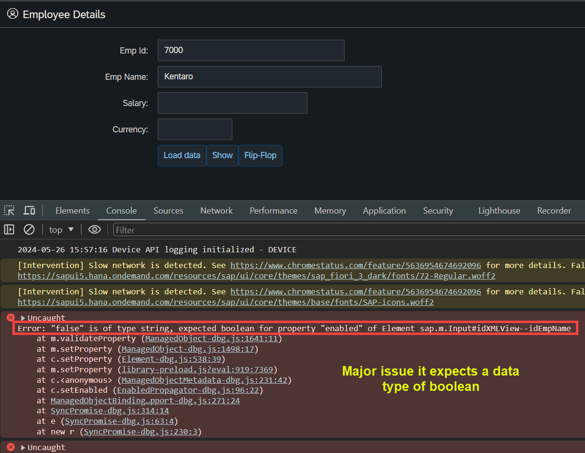

## Exercise 13 - Expression Binding XML Model

</br>

**Default binding mode for JSON model** 

- *Two way binding mode*

</br>

> [!IMPORTANT]
> One way or Two way model, the model data change happens in the view wont be reflected to the file without an exclusive logic only the memory buffer is manipulated

</br>

<!-- **Disable or enable screen elements with help of models - using a button** -->

<details>
<summary> Code samples for two way binding with models </summary>
</br>
</br>

1. View data is loaded from a model 
2. Changing a view data in the screen should affect the model (communicate the change to model and modify it)
3. Then the View is reloaded from the model this should (disable or enable screen elements)

</br></br>

*controller.js* # 1

```js

sap.ui.define(
    ['sap/ui/core/mvc/Controller',
        'logger/model/models'],
    function (Controller, Models) {
        return Controller.extend("logger.controller.ex13", {

            onInit: function () {
                // Calling our own reuse class to create model object
                var oModel = Models.createJSONModel();

                // - Model settiing at application level - available in all the views     
                sap.ui.getCore().setModel(oModel);

                // BINDING type 3
                var oSalary = this.getView().byId("idSalary");
                oSalary.bindValue('/empStr/Salary');

                // BINDING type 4
                var oCurr = this.getView().byId("idCurrency");
                oCurr.bindProperty("value", "/empStr/Currency");
            },

            onLoad: function () {

                /// Exercise 13 -  change is here
/////////////////////////////////////////////////////////////////////
                
                //Step 1 : Get the model object
                var oModel = sap.ui.getCore().getModel();

                //Step 2 : cahnge the data in the model 
                var objData = oModel.getProperty("/empStr"); // getting everything in the path of the structure 
                console.log(objData);
                oModel.setProperty("/empStr/empName", "Spiderman");

/////////////////////////////////////////////////////////////////////       

            },

            /// Exercise 13 -  change is here
/////////////////////////////////////////////////////////////////////
            onShow: function () {
                //Step 1 : Get the model object
                var oModel = sap.ui.getCore().getModel();

                //Step 2 : cahnge the data in the model 
                var objData = oModel.getProperty("/"); // get everything in the model
                console.log(objData);
                // oModel.setProperty("/empStr/empName", "Spiderman");
            }
//////////////////////////////////////////////////////////////////// 
        });
    });

```

</br></br>

*view.xml* # 1 

```js

<mvc:View xmlns:form="sap.ui.layout.form" controllerName="logger.controller.ex13" 
xmlns:mvc="sap.ui.core.mvc" xmlns="sap.m"
xmlns:f="sap.ui.layout.form"
xmlns:core="sap.ui.core">

<!-- Simple form definition Form is the ibrary namesapce -->
<!-- Aggregation of control follows the same name space as the parent Form name -->

<!-- No need to mention library for this form xmlns:f="sap.ui.layout.form" -->
    <form:SimpleForm editable="true"> <!-- editable property aligns the controls properly in screen -->
    <form:title>
        <core:Title icon="sap-icon://customer" text="Employee Details" />
    </form:title>
        <form:content>  <!-- Aggregation name starts with small letter-->
            <Label text="Emp Id"/> <!-- control name starts with capital letter -->            
            
            <!--BINDING type 1 { } address of the data operator for data binding -->
            <Input id="idEmpId" width="25%" value="{/empStr/empId}" enabled="{/empStr/pranks}"/> 
            <Label text="Emp Name"/>

            <!--BINDING type 2 have to instruct in Bootstrap for thsi type of binding-->
            <Input id="idEmpName" width="30%" value="{path: '/empStr/empName'}" enabled="{/empStr/pranks}" /> 
            <Label text="Salary"/>
            <Input id="idSalary" width="20%" value="{/empStr/Salary}" enabled="{/empStr/pranks}"/>
            <Label text="Currency"/>
            <Input id="idCurrency" width="10%" value="{/empStr/Currency}" enabled="{/empStr/pranks}"/>
            <Label/> <!--empty label for spacing-->            
                <HBox>
                    <Button text="Load data" press="onLoad" width=""/>
       <!-- /// Exercise 13 -  change is here
///////////////////////////////////////////////////////////////////// -->
                    <Button text="Show" press="onShow"/>
<!-- ///////////////////////////////////////////////////////////////  -->
                </HBox>
                     
        </form:content>
    </form:SimpleForm>

    </mvc:View>


```

</br></br>

**Testing of the View to model changes**

*check the developer tools console section when the page is loaded*


</br></br>

</br>
</br>
</details>

</br></br>

**Features :-**

1 . *Can we have multiple models in a UI5 app - Yes*

2 . *How will system differentiate between these models* 

    Using named model, we will have a default, we need to set the model to the app with a name, 
    which is the identifier for the model. And use *name>* in the binding

3 . *Which model is used the most in the real-time?* - *JSON + Resource + OData*

4 . *What is the right way if i want to initialize my model and share with all controllers/views*

    set it at application level, we can further modularize controller code.

</br></br>

**Defined multiple model and forcing the view to select the model by name - Single element**

<details>
<summary> Code sample </summary>
</br>
</br>

*controller.js*

```js

sap.ui.define(
    ['sap/ui/core/mvc/Controller',
        'logger/model/models'],
    function (Controller, Models) {
        return Controller.extend("logger.controller.ex13", {

            onInit: function () {
                // Calling our own reuse calss to create model object
                var oModel = Models.createJSONModel("model/mockdata/sample.json"); // model path passed 

                // - Model settiing at application level - available in all the views     
                sap.ui.getCore().setModel(oModel); // a - model with no name is the default model 

                /// Exercise 13 -  change is here 
///////////////////////////////////////////////////////////////////////////
                // Create JSON model 2 
                var oModel2 = Models.createJSONModel("model/mockdata/dataset.json"); // model path passed 

                // named model - we need to give a name
                sap.ui.getCore().setModel(oModel2, "got"); // a model with name
///////////////////////////////////////////////////////////////////////////

                // BINDING type 3
                var oSalary = this.getView().byId("idSalary");
                oSalary.bindValue('/empStr/Salary');

                // BINDING type 4
                var oCurr = this.getView().byId("idCurrency");
                oCurr.bindProperty("value", "/empStr/Currency");
            },

            onLoad: function () {
                //Step 1 : Get the model object
                var oModel = sap.ui.getCore().getModel();

                //Step 2 : cahnge the data in the model 
                var objData = oModel.getProperty("/empStr"); // getting everything in the path of the structure 
                console.log(objData);
                oModel.setProperty("/empStr/empName", "Spiderman");
            },

            onShow: function () {
                //Step 1 : Get the model object
                var oModel = sap.ui.getCore().getModel();

                //Step 2 : cahnge the data in the model 
                var objData = oModel.getProperty("/"); // get everything in the model
                console.log(objData);
                // oModel.setProperty("/empStr/empName", "Spiderman");
            },
        });
    });

```

</br></br>

*model.js*

```js

sap.ui.define(['sap/ui/model/json/JSONModel'], // Dependency asynchronous module definition (AMD)
    function (JSONModel) {
        'use strict';
        return {
///////////////////////////////////////////////////            
            createJSONModel: function (sFilepath) { // filepath variable is mentioned 
                var oModel = new JSONModel();
                oModel.loadData(sFilepath); // filepath variable is mentioned
///////////////////////////////////////////////////                  
                return oModel;
            },
            createXMLModel: function () {
            },
            createResourceModel: function () {
            }
        };
    });


```

</br></br>

*view.xml*

```xml

<mvc:View xmlns:form="sap.ui.layout.form" controllerName="logger.controller.ex13" 
xmlns:mvc="sap.ui.core.mvc" xmlns="sap.m"
xmlns:f="sap.ui.layout.form"
xmlns:core="sap.ui.core">

<!-- Simple form definition Form is the ibrary namesapce -->
<!-- Aggregation of control follows the same name space as the parent Form name -->

<!-- No need to mention library for this form xmlns:f="sap.ui.layout.form" -->
    <form:SimpleForm editable="true"> <!-- editable property aligns the controls properly in screen -->
    <form:title>
        <core:Title icon="sap-icon://customer" text="Employee Details" />
    </form:title>
        <form:content>  <!-- Aggregation name starts with small letter-->
            <Label text="Emp Id"/> <!-- control name starts with capital letter -->            
            
            <!--BINDING type 1 { } address of the data operator for data binding -->
            <Input id="idEmpId" width="25%" value="{/empStr/empId}" enabled="{/empStr/pranks}"/> 
            <Label text="Emp Name"/>

            <!--BINDING type 2 have to instruct in Bootstrap for thsi type of binding-->
       <!-- /// Exercise 13 -  Forced the screen field to pick the data from named model 'got'
//////////////////////////////////////////////////////////////////////// -->            
            <Input id="idEmpName" width="30%" value="{path: 'got>/empStr/empName'}" enabled="{/empStr/pranks}" /> 
<!-- //////////////////////////////////////////////////////////////////  --> 
                  
            <Label text="Salary"/>
            <Input id="idSalary" width="20%" value="{/empStr/Salary}" enabled="{/empStr/pranks}"/>
            <Label text="Currency"/>
            <Input id="idCurrency" width="10%" value="{/empStr/Currency}" enabled="{/empStr/pranks}"/>
            <Label/> <!--empty label for spacing-->            
                <HBox>
                    <Button text="Load data" press="onLoad" width=""/>
                    <Button text="Show" press="onShow"/>       
                </HBox>
                     
        </form:content>
    </form:SimpleForm>

    </mvc:View>


```

</br>
</details>

</br>

**Defined a button and forcing the view to switch between multiple models**


<details>
<summary> Code sample </summary>
</br>
</br>

*controller.js*

```js

sap.ui.define(
    ['sap/ui/core/mvc/Controller',
        'logger/model/models'],
    function (Controller, Models) {
        return Controller.extend("logger.controller.ex13", {

            onInit: function () {
                // Calling our own reuse calss to create model object
                var oModel = Models.createJSONModel("model/mockdata/sample.json"); // model path passed 

                // - Model settiing at application level - available in all the views     
                sap.ui.getCore().setModel(oModel); // a - model with no name is the default model 

                // Create JSON model 2 
                var oModel2 = Models.createJSONModel("model/mockdata/dataset.json"); // model path passed 

                // named model - we need to give a name
                sap.ui.getCore().setModel(oModel2, "got"); // a model with name

                // BINDING type 3
                var oSalary = this.getView().byId("idSalary");
                oSalary.bindValue('/empStr/Salary');

                // BINDING type 4
                var oCurr = this.getView().byId("idCurrency");
                oCurr.bindProperty("value", "/empStr/Currency");
            },

            onLoad: function () {
                //Step 1 : Get the model object
                var oModel = sap.ui.getCore().getModel();

                //Step 2 : cahnge the data in the model 
                var objData = oModel.getProperty("/empStr"); // getting everything in the path of the structure 
                console.log(objData);
                oModel.setProperty("/empStr/empName", "Spiderman");
            },

            onShow: function () {
                //Step 1 : Get the model object
                var oModel = sap.ui.getCore().getModel();

                //Step 2 : cahnge the data in the model 
                var objData = oModel.getProperty("/"); // get everything in the model
                console.log(objData);
                // oModel.setProperty("/empStr/empName", "Spiderman");
            },

            /// Exercise 13 -  change is here
//////////////////////////////////////////////////////////////////////////////////////////////////////////////////
            onFlip: function(){
                var oModel = sap.ui.getCore().getModel();
                var oGOTModel = sap.ui.getCore().getModel("got");
                sap.ui.getCore().setModel(oGOTModel);
                sap.ui.getCore().setModel(oModel, "got");
            }
//////////////////////////////////////////////////////////////////////////////////////////////////////////////////            

        });
    });

```

</br></br>

*view.xml*

```xml

<mvc:View xmlns:form="sap.ui.layout.form" controllerName="logger.controller.ex13" 
xmlns:mvc="sap.ui.core.mvc" xmlns="sap.m"
xmlns:f="sap.ui.layout.form"
xmlns:core="sap.ui.core">

<!-- Simple form definition Form is the ibrary namesapce -->
<!-- Aggregation of control follows the same name space as the parent Form name -->

<!-- No need to mention library for this form xmlns:f="sap.ui.layout.form" -->
    <form:SimpleForm editable="true"> <!-- editable property aligns the controls properly in screen -->
    <form:title>
        <core:Title icon="sap-icon://customer" text="Employee Details" />
    </form:title>
        <form:content>  <!-- Aggregation name starts with small letter-->
            <Label text="Emp Id"/> <!-- control name starts with capital letter -->            
            
            <!--BINDING type 1 { } address of the data operator for data binding -->
            <Input id="idEmpId" width="25%" value="{/empStr/empId}" enabled="{/empStr/pranks}"/> 
            <Label text="Emp Name"/>
            <!--BINDING type 2 have to instruct in Bootstrap for thsi type of binding-->
            <Input id="idEmpName" width="30%" value="{path: '/empStr/empName'}" enabled="{/empStr/pranks}" /> 
            <Label text="Salary"/>
            <Input id="idSalary" width="20%" value="{/empStr/Salary}" enabled="{/empStr/pranks}"/>
            <Label text="Currency"/>
            <Input id="idCurrency" width="10%" value="{/empStr/Currency}" enabled="{/empStr/pranks}"/>
            <Label/> <!--empty label for spacing-->            
                <HBox>
                    <Button text="Load data" press="onLoad" width=""/>
                    <Button text="Show" press="onShow"/> 
       <!-- /// Exercise 13 -  change is here
////////////////////////////////////////////////////////////////////////////////////////////////////////////////// -->                       
                    <Button text="Flip-Flop" press="onFlip"/>       
<!-- ////////////////////////////////////////////////////////////////////////////////////////////////////////////  -->                     
                </HBox>
                     
        </form:content>
    </form:SimpleForm>

    </mvc:View>


```

</br>
</br>
</details>

</br></br>

## Expression Binding 

</br>

*When we bind a expression a (logic) with the property of a model, is called expression binding.
format of expression is*

```xml

{= condition ? returnval-True : returnval-False}

```

*Sample code to disable the input field on view*

```xml

   <Input id="idSalary" width="20%" value="{/empStr/Salary}" enabled="false"/>

```

</br></br>

**Scenario : if an employee name is *Baratheon* disable the salary field** 

*sample expression in the view for salary field checking name value in condition and setting property*

```xml

<Input id="idSalary" width="20%" enabled="{= ${/empStr/empName} === 'Baratheon' ? false : true }"/>

```

- if the condition Baratheon is true (first value - False) will be used to set in enabled property
- if the condition Baratheon is false (second value - True) will be used to set in enabled property

</br></br>

## Building a XML Model 

</br>

<details>
<summary> code sample </summary>
</br>
</br>

*model.js*

```js

sap.ui.define([
    'sap/ui/model/json/JSONModel',
    'sap/ui/model/xml/XMLModel'   ], // Dependency asynchronous module definition (AMD)
    function (JSONModel, XMLModel) {
        'use strict';
        return {
            createJSONModel: function (sFilepath) {
                // Step 1. create a brand new model object
                var oModel = new JSONModel();
                // Step 2. Load or set the data to the model
                // oModel.setData();
                oModel.loadData(sFilepath);
                return oModel;
            },
//////////////////////////////////////////////////////////////////////////            
            createXMLModel: function (sFilepath) {
                // Step 1. create a brand new model object
                var oModel = new XMLModel();
                // Step 2. Load or set the data to the model
                // oModel.setData();
                oModel.loadData(sFilepath);
                return oModel;
            },
//////////////////////////////////////////////////////////////////////////            
            createResourceModel: function () {
            }
        };
    });

```

*controller.js*

```js

sap.ui.define(
    ['sap/ui/core/mvc/Controller',
        'logger/model/models'],
    function (Controller, Models) {
        return Controller.extend("logger.controller.ex13", {

            onInit: function () {
                // Calling our own reuse calss to create model object
                var oModel = Models.createJSONModel("model/mockdata/sample.json"); // model path passed 

                // - Model settiing at application level - available in all the views     
                sap.ui.getCore().setModel(oModel); // a - model with no name is the default model 

                // Create JSON model 2 
                var oModel2 = Models.createJSONModel("model/mockdata/dataset.json"); // model path passed 

                // named model - we need to give a name
                sap.ui.getCore().setModel(oModel2, "got"); // a model with name

//////////////////////////////////////////////////////////////////////////////////////////////////////////////////  
                // Create XMl model 
                var oXmlModel = Models.createXMLModel("model/mockdata/mydemo.xml")
                sap.ui.getCore().setModel(oModel); // overrride with existingjson model

//////////////////////////////////////////////////////////////////////////////////////////////////////////////////

                // BINDING type 3
                var oSalary = this.getView().byId("idSalary");
                oSalary.bindValue('/empStr/Salary');

                // BINDING type 4
                var oCurr = this.getView().byId("idCurrency");
                oCurr.bindProperty("value", "/empStr/Currency");
            },

            onLoad: function () {
                //Step 1 : Get the model object
                var oModel = sap.ui.getCore().getModel();

                //Step 2 : cahnge the data in the model 
                var objData = oModel.getProperty("/empStr"); // getting everything in the path of the structure 
                console.log(objData);
                oModel.setProperty("/empStr/empName", "Spiderman");
            },

            onShow: function () {
                //Step 1 : Get the model object
                var oModel = sap.ui.getCore().getModel();

                //Step 2 : cahnge the data in the model 
                var objData = oModel.getProperty("/"); // get everything in the model
                console.log(objData);
                // oModel.setProperty("/empStr/empName", "Spiderman");
            },

            onFlip: function(){
                var oModel = sap.ui.getCore().getModel();
                var oGOTModel = sap.ui.getCore().getModel("got");
                sap.ui.getCore().setModel(oGOTModel);
                sap.ui.getCore().setModel(oModel, "got");
            }        

        });
    });


```

</br></br>

*mydemo.xml - data file*

```xml

<?xml version="1.0"?>
<data>
    <empStr>
        <empId>7000</empId>
        <empName>Kentaro</empName>
        <Salary>7800</Salary>
        <Currency>USD</Currency>
    </empStr>

    <empTable>
        <row>
            <empNo>369424645</empNo>
            <empName>Arielle</empName>
            <Salary>238655</Salary>
            <Currency>IDR</Currency>
        </row>
        <row>
            <empNo>847223182</empNo>
            <empName>Sherline</empName>
            <Salary>226329</Salary>
            <Currency>SEK</Currency>
        </row>
        <row>
            <empNo>477404874</empNo>
            <empName>Roanne</empName>
            <Salary>293299</Salary>
            <Currency>IDR</Currency>
        </row>
        <row>
            <empNo>558185190</empNo>
            <empName>Helen</empName>
            <Salary>242973</Salary>
            <Currency>BRL</Currency>
        </row>
        <row>
            <empNo>522724081</empNo>
            <empName>Sorcha</empName>
            <Salary>311450</Salary>
            <Currency>IDR</Currency>
        </row>
        <row>
            <empNo>104583385</empNo>
            <empName>Ernesto</empName>
            <Salary>294720</Salary>
            <Currency>DKK</Currency>
        </row>
        <row>
            <empNo>200885311</empNo>
            <empName>Virgilio</empName>
            <Salary>241474</Salary>
            <Currency>XAF</Currency>
        </row>
        <row>
            <empNo>226451304</empNo>
            <empName>Milton</empName>
            <Salary>272522</Salary>
            <Currency>ETB</Currency>
        </row>
        <row>
            <empNo>860869464</empNo>
            <empName>Layla</empName>
            <Salary>266040</Salary>
            <Currency>JPY</Currency>
        </row>
        <row>
            <empNo>851401114</empNo>
            <empName>Ulberto</empName>
            <Salary>160639</Salary>
            <Currency>BOB</Currency>
        </row>

    </empTable>
</data>

```

</br>
</details>

</br></br>

**Major disadvantage of XML models**

It treats all the data in the field or row of its data file as string data type.

Example - we have used pranks field in the file and used it to pass true / false to the view for enable and disable 
          screen field that wont work 

*demonstration*

- made some changes to the xml model file added pranks field with false value 

```xml 

    <empStr>
        <empId>7000</empId>
        <empName>Kentaro</empName>
        <Salary>7800</Salary>
        <Currency>USD</Currency>
        <pranks>false</pranks>
    </empStr>

```

</br>

- Made the changes to xml view - added the pranks field to enabled property 

```xml

    <Input id="idEmpName" width="30%" value="{path: '/empStr/empName'}" enabled="{/empStr/pranks}"/> 

````




</br>
</br></br>

## End of Exercise 13 ---NEXT---> <a href="https://github.com/Octavius-Dante/Arthelais/tree/main/ex_14"> Exercise 14-Table control </a>
</br>
<p align="center"> <a href="https://github.com/Octavius-Dante/Arthelais/tree/main"> Main page </a> </p>


</br></br>

**All Previous sessions**
</br></br>
<!-- 
- [x] <a href="https://github.com/Octavius-Dante/Arthelais/tree/main/ex_37"> Exercise 37-Deploy app to launchpad</a>
- [x] <a href="https://github.com/Octavius-Dante/Arthelais/tree/main/ex_36"> Exercise 36-WebIde and Git integration</a>
- [x] <a href="https://github.com/Octavius-Dante/Arthelais/tree/main/ex_35"> Exercise 35-POST, GET and DELETE from Fiori</a>
- [x] <a href="https://github.com/Octavius-Dante/Arthelais/tree/main/ex_34"> Exercise 34-GET and Connect</a>
- [x] <a href="https://github.com/Octavius-Dante/Arthelais/tree/main/ex_33"> Exercise 33-Fiori Project Connect OData</a>
- [x] <a href="https://github.com/Octavius-Dante/Arthelais/tree/main/ex_32"> Exercise 32-Connectivity</a>
- [x] <a href="https://github.com/Octavius-Dante/Arthelais/tree/main/ex_31"> Exercise 31-Function Import and Images</a>
- [x] <a href="https://github.com/Octavius-Dante/Arthelais/tree/main/ex_30"> Exercise 30-implementing CRUD</a>
- [x] <a href="https://github.com/Octavius-Dante/Arthelais/tree/main/ex_29"> Exercise 29-Implementing GET</a>
- [x] <a href="https://github.com/Octavius-Dante/Arthelais/tree/main/ex_28"> Exercise 28-Create A Gateway Project</a>
- [x] <a href="https://github.com/Octavius-Dante/Arthelais/tree/main/ex_27"> Exercise 27-Odata GET</a>
- [x] <a href="https://github.com/Octavius-Dante/Arthelais/tree/main/ex_26"> Exercise 26-Fiori Deployments</a>
- [x] <a href="https://github.com/Octavius-Dante/Arthelais/tree/main/ex_25"> Exercise 25-Fragments Deep dive</a>
- [x] <a href="https://github.com/Octavius-Dante/Arthelais/tree/main/ex_24"> Exercise 24-Fragments</a>
- [x] <a href="https://github.com/Octavius-Dante/Arthelais/tree/main/ex_23"> Exercise 23-Icon Tab bar</a>
- [x] <a href="https://github.com/Octavius-Dante/Arthelais/tree/main/ex_22"> Exercise 22-Route matched Handlers</a>
- [x] <a href="https://github.com/Octavius-Dante/Arthelais/tree/main/ex_21"> Exercise 21-Router Basics</a>
- [x] <a href="https://github.com/Octavius-Dante/Arthelais/tree/main/ex_20"> Exercise 20-Filters on List mode</a>
- [x] <a href="https://github.com/Octavius-Dante/Arthelais/tree/main/ex_19"> Exercise 19-Manifest JSON</a>
- [x] <a href="https://github.com/Octavius-Dante/Arthelais/tree/main/ex_18"> Exercise 18-List Control</a>
- [x] <a href="https://github.com/Octavius-Dante/Arthelais/tree/main/ex_17"> Exercise 17-Fiori Lite app</a>
- [x] <a href="https://github.com/Octavius-Dante/Arthelais/tree/main/ex_16"> Exercise 16-Formatters </a>
- [x] <a href="https://github.com/Octavius-Dante/Arthelais/tree/main/ex_15"> Exercise 15-Element Binding</a>
- [x] <a href="https://github.com/Octavius-Dante/Arthelais/tree/main/ex_14"> Exercise 14-Table control</a>
- [x] <a href="https://github.com/Octavius-Dante/Arthelais/tree/main/ex_13"> Exercise 13-Expression Binding XML Model</a> -->
- [x] <a href="https://github.com/Octavius-Dante/Arthelais/tree/main/ex_12"> Exercise 12-Json Model Property Binding</a>
- [x] <a href="https://github.com/Octavius-Dante/Arthelais/tree/main/ex_11"> Exercise 11-Model Basics </a>
- [x] <a href="https://github.com/Octavius-Dante/Arthelais/tree/main/ex_10"> Exercise 10-XML Views </a>
- [x] <a href="https://github.com/Octavius-Dante/Arthelais/tree/main/ex_9"> Exercise 9-Control Hierarchy 2</a>
- [x] <a href="https://github.com/Octavius-Dante/Arthelais/tree/main/ex_8"> Exercise 8-Ui5 Control Hierarchy </a>
- [x] <a href="https://github.com/Octavius-Dante/Arthelais/tree/main/ex_7"> Exercise 7-SAP Ui5 Framework </a>
- [x] <a href="https://github.com/Octavius-Dante/Arthelais/tree/main/ex_6"> Exercise 6-JQuery </a>
- [x] <a href="https://github.com/Octavius-Dante/Arthelais/tree/main/ex_5"> Exercise 5-JS deep dive </a>
- [x] <a href="https://github.com/Octavius-Dante/Arthelais/tree/main/ex_4"> Exercise 4-JS basic </a>
- [x] <a href="https://github.com/Octavius-Dante/Arthelais/tree/main/ex_3"> Exercise 3-CSS </a>
- [x] <a href="https://github.com/Octavius-Dante/Arthelais/tree/main/ex_2"> Exercise 2-HTML5</a>
- [x] <a href="https://github.com/Octavius-Dante/Arthelais/tree/main/ex_1"> Exercise 1 -Basic </a>


<!--

<details>
<summary> <b> ALL CODE CHANGES - TODAY SESSION </b> </summary>
</br>
</br>

</br>
</br>

</br>
</br>
</details>

-->