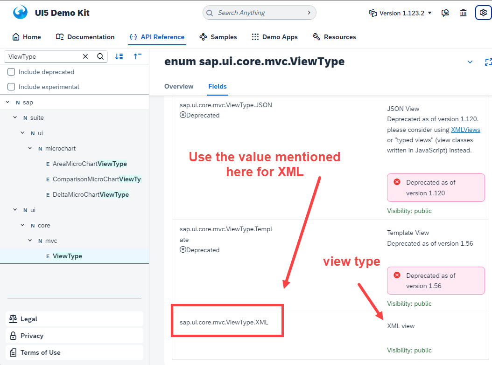

## Exercise 14 - Table Control

</br></br>

 E - Enumerators - constants with no changing fixed values
 </br> C - Classes 
 </br> N - NameSpaces - library


</br></br>

In HTML view definition part we have defined the *type: 'XML'* its not a best practice

```html
    <script>
        var oViewXML = new sap.ui.view({
            viewName: 'logger.view.ex13',
            type: 'XML',
            id: "idXMLView"
        });
        oViewXML.placeAt("canvas");
    </script>

```

</br>

*SAP best practice is define the constant name suggested in sap ui5 SDK* 




```html
    <script>
        var oViewXML = new sap.ui.view({
            viewName: 'logger.view.ex13',
            type: sap.ui.core.mvc.ViewType.XML,
            id: "idXMLView"
        });
        oViewXML.placeAt("canvas");
    </script>

```


</br></br>

## Defining table in Ui5

</br>

<details>
<summary> Things to check in SAP Ui5 SDK page for defining -- Table Control  </summary>
</br>
</br>

</br>


</br>

</br>
</details>

</br>

- In data model array structure is the right data type to be used for binding for table control

- Row property in table control need to bind with data model, Row property is an *aggregation* of table control

- *What is Absolute path > : - Absolute path is a address which we supply in Aggregation Binding*

- *What is Relative path > : - Relative path its a path which we bind with child control of the parent who is already bound to absolute path*
    *The path is always relative to its parent*

</br>

*Table data binding snippet*

```xml

<t:Table row="{/empTab}">

```

</br>

*Table data binding with Child mapping for columns*

```xml

<t:Table rows="{/empTab}">
    <t:columns>           
        <t:Column>
            <t:label>
                <Label text="EmpId" />
            </t:label>
            <t:template>
                <Text text="{empId}" />
            </t:template>
        </t:Column>

        <t:Column>
            <t:label>
                <Label text="EmpName" />
            </t:label>   
            <t:template>
                <Text text="{empName}" />
            </t:template>                         
        </t:Column>
</t:Table>            

```

</br></br>

<details>
<summary> Table control definition in view.xml and controller.js </summary>
</br>
</br>

*view.xml*

```xml

<mvc:View xmlns:form="sap.ui.layout.form" controllerName="logger.controller.ex13" 
xmlns:mvc="sap.ui.core.mvc" 
xmlns="sap.m"
xmlns:f="sap.ui.layout.form"
xmlns:t="sap.ui.table"
xmlns:core="sap.ui.core">

    <form:SimpleForm editable="true"> <!-- editable property aligns the controls properly in screen -->
    <form:title>
        <core:Title icon="sap-icon://customer" text="Employee Details" />
    </form:title>
        <form:content>  <!-- Aggregation name starts with small letter-->
            <Label text="Emp Id"/> <!-- control name starts with capital letter -->            
            <Input id="idEmpId" width="25%" value="{/empStr/empId}" /> 
            <Label text="Emp Name"/>
            <Input id="idEmpName" width="30%" value="{path: '/empStr/empName'}" enabled="{= ${/empStr/pranks} === 'true' ? true : false}"/> 
            <Label text="Salary"/>
            <Input id="idSalary" width="20%" enabled="{= ${/empStr/empName} === 'Baratheon' ? false : true }"/>
            <Label text="Currency"/>
            <Input id="idCurrency" width="10%" value="{/empStr/Currency}" />

            <Label/> <!--empty label for spacing-->            
                <HBox>
                    <Button text="Load data" press="onLoad" width=""/>
                    <Button text="Show" press="onShow"/>                     
                    <Button text="Flip-Flop" press="onFlip"/>       
                </HBox>
                     
        </form:content>
    </form:SimpleForm>
<!-- /////////////////////////////////////////////////////////////////////////////////////////// -->
    <t:Table rows="{/empTab}">
        <t:columns>           
            <t:Column>
                <t:label>
                    <Label text="EmpId" />
                </t:label>
                <t:template>
                    <Text text="{empId}" />
                </t:template>
            </t:Column>

            <t:Column>
                <t:label>
                    <Label text="EmpName" />
                </t:label>   
                <t:template>
                    <Text text="{empName}" />
                    <!-- <Input value="{empName}" /> -->
                </t:template>                         
            </t:Column>

            <t:Column>
                <t:label>
                    <Label text="Salary" />
                </t:label>   
                <t:template>
                    <Text text="{Salary}" />
                </t:template>                         
            </t:Column>

            <t:Column>
                <t:label>
                    <Label text="Currency" />
                </t:label>  
                <t:template>
                    <Text text="{Currency}" />
                </t:template>                          
            </t:Column>

            <t:Column>
                <t:label>
                    <Label text="Smoker" />
                </t:label>        
                <t:template>
                    <Text text="{}" />
                </t:template>                    
            </t:Column> 

            <t:Column>
                <t:label>
                    <Label text="Gender" />
                </t:label>      
                <t:template>
                    <Text text="{}" />
                </t:template>                      
            </t:Column>             

            <t:Column>
                <t:label>
                    <Label text="M-Status" />
                </t:label>    
                <t:template>
                    <Text text="{}" />
                </t:template>                        
            </t:Column> 

            <t:Column>
                <t:label>
                    <Label text="Rating" />
                </t:label>    
                <t:template>
                    <Text text="{}" />
                </t:template>                        
            </t:Column>                                     
        </t:columns>
        <t:rows>
            <t:Row>

            </t:Row>
        </t:rows>        
    </t:Table>

    </mvc:View>
<!-- /////////////////////////////////////////////////////////////////////////////////////////// -->
```

</br>

*controller.js* -- only the essential code snip is added for full code check the attachment *.zip file

```js

onInit function(){
    var oModel2 = Models.createJSONModel("model/mockdata/dataset.json"); // model path passed 
    // named model - we need to give a name
    sap.ui.getCore().setModel(oModel2, "got"); // a model with name
 
 // if XML model is used it should be commented -
 // - XML data mdoel is not SUPPORTED 

}

```

</br>
</br>
</details>


<details>
<summary> Table control testing and other column changes </summary>
</br>
</br>

*Changing Input field for employee name column - this brings input field instead of text*

*view.xml*

```xml

    <t:Column>
        <t:label>
            <Label text="EmpName" />
        </t:label>   
        <t:template>
            <!-- <Text text="{empName}" /> -->
            <Input value="{empName}" />
        </t:template>                         
    </t:Column>

```            

</br></br>

*Two way binding testing input value is reflected in the model*

</br>


</br></br>

*How to concatenate the Currency and the salary amount* -- make the following changes

*view.xml*

```xml

    <t:Column>
        <t:label>
            <Label text="Salary" />
        </t:label>   
        <t:template>
            <Text text="{Salary} {Currency}" />
        </t:template>                         
    </t:Column>

```

</br></br>

*Setting Drop down, Rating Indicator, Check box*

*view.xml*

```xml

    <t:Column>
        <t:label>
            <Label text="Smoker" />
        </t:label>        
        <t:template>
            <!-- Check Box-->
            <CheckBox selected="{smoker}"></CheckBox>
        </t:template>                    
    </t:Column> 

    <t:Column>
        <t:label>
            <Label text="Marital Status" />
        </t:label>    
        <t:template>
            <!-- Drop downn-->
            <Select selectedKey="{mStat}">
                <items>
                    <core:Item text="Married" key="M" />
                    <core:Item text="Single" key="S" />
                    <core:Item text="Divorcee" key="D" />
                </items>
                <items>
                </items>                        
            </Select>
        </t:template>                        
    </t:Column> 

    <t:Column>
        <t:label>
            <Label text="Rating" />
        </t:label>    
        <t:template>
        <!-- Rating Indicator -->
            <RatingIndicator value="{rating}"> </RatingIndicator>
        </t:template>                        
    </t:Column>                                     
    </t:columns>

```
</br>
</br>
</details>


<details>
<summary> Setting image link to a data model field and displaying it in table control column </summary>
</br>
</br>

*Instead of showing gender in text we are going to show the image*

- go to internet search for male icon and female icon in google
- copy the image address (right click) --> (image address)
- come to data model file (json) search male and replace it with male icon image address
- search female and replace it with female icon image address
- make the following changes in view xml file for accommodating the image

*view.xml*

```xml


```

</br>
</br>
</details>

</br></br>


</br>
</br></br>

## End of Exercise 14 ---NEXT---> <a href="https://github.com/Octavius-Dante/Arthelais/tree/main/ex_15"> Exercise 15-Element Binding </a>
</br>
<p align="center"> <a href="https://github.com/Octavius-Dante/Arthelais/tree/main"> Main page </a> </p>


</br></br>

**All Previous sessions**
</br></br>

<!-- - [x] <a href="https://github.com/Octavius-Dante/Arthelais/tree/main/ex_37"> Exercise 37-Deploy app to launchpad</a>
- [x] <a href="https://github.com/Octavius-Dante/Arthelais/tree/main/ex_36"> Exercise 36-WebIde and Git integration</a>
- [x] <a href="https://github.com/Octavius-Dante/Arthelais/tree/main/ex_35"> Exercise 35-POST, GET and DELETE from Fiori</a>
- [x] <a href="https://github.com/Octavius-Dante/Arthelais/tree/main/ex_34"> Exercise 34-GET and Connect</a>
- [x] <a href="https://github.com/Octavius-Dante/Arthelais/tree/main/ex_33"> Exercise 33-Fiori Project Connect OData</a>
- [x] <a href="https://github.com/Octavius-Dante/Arthelais/tree/main/ex_32"> Exercise 32-Connectivity</a>
- [x] <a href="https://github.com/Octavius-Dante/Arthelais/tree/main/ex_31"> Exercise 31-Function Import and Images</a>
- [x] <a href="https://github.com/Octavius-Dante/Arthelais/tree/main/ex_30"> Exercise 30-implementing CRUD</a>
- [x] <a href="https://github.com/Octavius-Dante/Arthelais/tree/main/ex_29"> Exercise 29-Implementing GET</a>
- [x] <a href="https://github.com/Octavius-Dante/Arthelais/tree/main/ex_28"> Exercise 28-Create A Gateway Project</a>
- [x] <a href="https://github.com/Octavius-Dante/Arthelais/tree/main/ex_27"> Exercise 27-Odata GET</a>
- [x] <a href="https://github.com/Octavius-Dante/Arthelais/tree/main/ex_26"> Exercise 26-Fiori Deployments</a>
- [x] <a href="https://github.com/Octavius-Dante/Arthelais/tree/main/ex_25"> Exercise 25-Fragments Deep dive</a>
- [x] <a href="https://github.com/Octavius-Dante/Arthelais/tree/main/ex_24"> Exercise 24-Fragments</a>
- [x] <a href="https://github.com/Octavius-Dante/Arthelais/tree/main/ex_23"> Exercise 23-Icon Tab bar</a>
- [x] <a href="https://github.com/Octavius-Dante/Arthelais/tree/main/ex_22"> Exercise 22-Route matched Handlers</a>
- [x] <a href="https://github.com/Octavius-Dante/Arthelais/tree/main/ex_21"> Exercise 21-Router Basics</a>
- [x] <a href="https://github.com/Octavius-Dante/Arthelais/tree/main/ex_20"> Exercise 20-Filters on List mode</a>
- [x] <a href="https://github.com/Octavius-Dante/Arthelais/tree/main/ex_19"> Exercise 19-Manifest JSON</a>
- [x] <a href="https://github.com/Octavius-Dante/Arthelais/tree/main/ex_18"> Exercise 18-List Control</a>
- [x] <a href="https://github.com/Octavius-Dante/Arthelais/tree/main/ex_17"> Exercise 17-Fiori Lite app</a>
- [x] <a href="https://github.com/Octavius-Dante/Arthelais/tree/main/ex_16"> Exercise 16-Formatters </a>
- [x] <a href="https://github.com/Octavius-Dante/Arthelais/tree/main/ex_15"> Exercise 15-Element Binding</a>
- [x] <a href="https://github.com/Octavius-Dante/Arthelais/tree/main/ex_14"> Exercise 14-Table control</a> -->
- [x] <a href="https://github.com/Octavius-Dante/Arthelais/tree/main/ex_13"> Exercise 13-Expression Binding XML Model</a>
- [x] <a href="https://github.com/Octavius-Dante/Arthelais/tree/main/ex_12"> Exercise 12-Json Model Property Binding</a>
- [x] <a href="https://github.com/Octavius-Dante/Arthelais/tree/main/ex_11"> Exercise 11-Model Basics </a>
- [x] <a href="https://github.com/Octavius-Dante/Arthelais/tree/main/ex_10"> Exercise 10-XML Views </a>
- [x] <a href="https://github.com/Octavius-Dante/Arthelais/tree/main/ex_9"> Exercise 9-Control Hierarchy 2</a>
- [x] <a href="https://github.com/Octavius-Dante/Arthelais/tree/main/ex_8"> Exercise 8-Ui5 Control Hierarchy </a>
- [x] <a href="https://github.com/Octavius-Dante/Arthelais/tree/main/ex_7"> Exercise 7-SAP Ui5 Framework </a>
- [x] <a href="https://github.com/Octavius-Dante/Arthelais/tree/main/ex_6"> Exercise 6-JQuery </a>
- [x] <a href="https://github.com/Octavius-Dante/Arthelais/tree/main/ex_5"> Exercise 5-JS deep dive </a>
- [x] <a href="https://github.com/Octavius-Dante/Arthelais/tree/main/ex_4"> Exercise 4-JS basic </a>
- [x] <a href="https://github.com/Octavius-Dante/Arthelais/tree/main/ex_3"> Exercise 3-CSS </a>
- [x] <a href="https://github.com/Octavius-Dante/Arthelais/tree/main/ex_2"> Exercise 2-HTML5</a>
- [x] <a href="https://github.com/Octavius-Dante/Arthelais/tree/main/ex_1"> Exercise 1 -Basic </a>


<!--

<details>
<summary> <b> ALL CODE CHANGES - TODAY SESSION </b> </summary>
</br>
</br>

</br>
</br>

</br>
</br>
</details>

-->