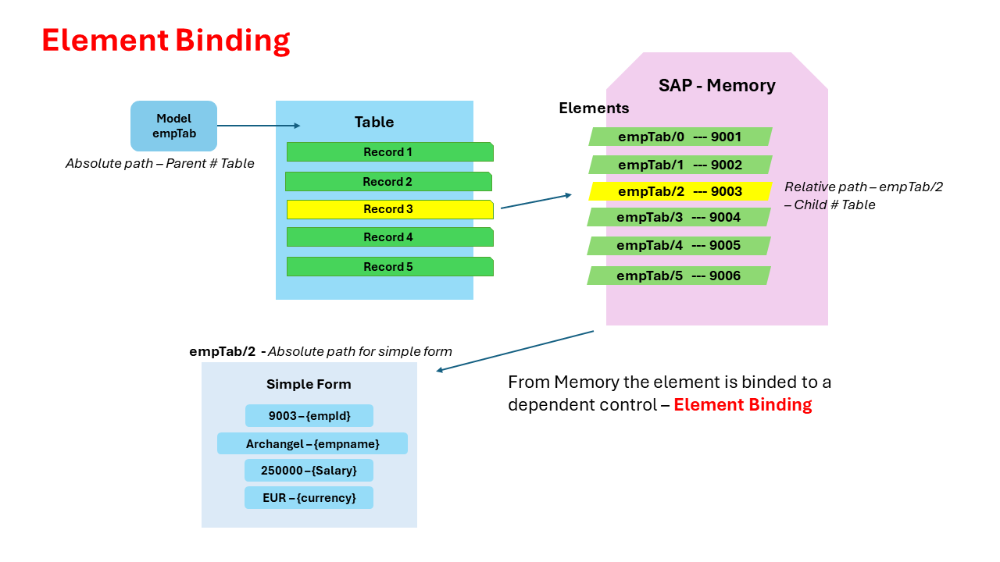
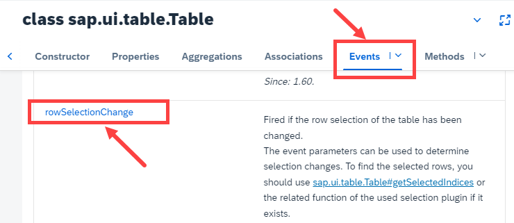
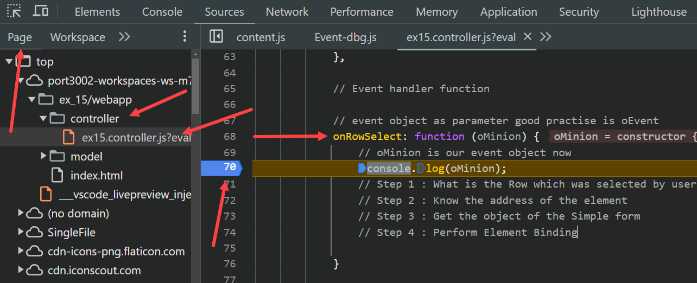
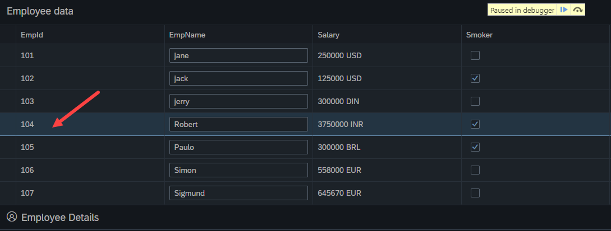
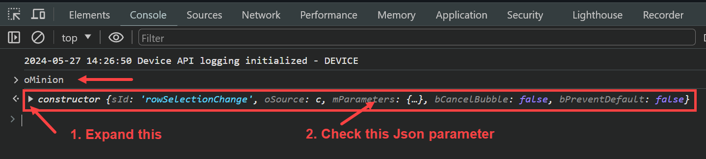
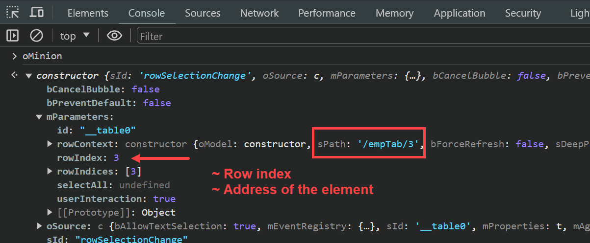
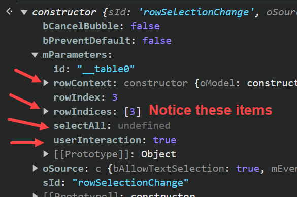
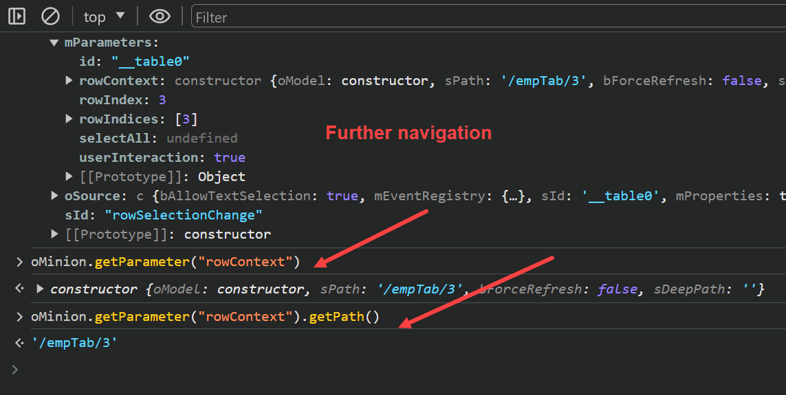
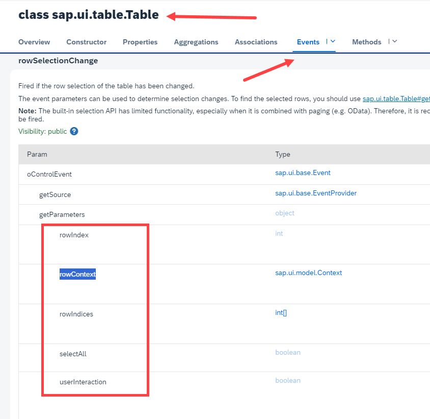

## Exercise 15 - Element Binding

</br>
</br>

## Event object in Ui5 

</br>

When ever a event is triggered for a control we attach event handler. In this event handler method, we will automatically get an event object which will carry lots of important information about that event.

This object is receivable as parameter to the event handler function, we can check the documentation for the same each event can have different parameters inside vent object.

</br></br>

**There are 3 default methods which we can use always :**

 1.. *getParameter* : - To get single event parameter details
 
 2.. *getParameters* : - To Show all the parameters for the event
 
 3.. *getSource* : - Provides us the object of source control from where event was fired


</br> </br>


## Element Binding

</br>

When we bind a single dataset (1 record) element with a dependent control is called element binding.

- The element address will be bound to the dependent control as absolute path

let say we have a table control with many records - user selects 1 record - that selected data set (is a data path relative data path)
-- Now use this path to display the record in another form control with input field
-- now binding this relative path to form control is element binding -- for form control this is an Absolute path

**Table control**

- For table control *Absolute path* (Parent) is data model file # in ABAP internal table name 
- For table control *Relative path* (Child)  is list of records in *Absolute path* # in ABAP internal table records
 
- *Relative path* selected dataset in table control is addressed as *Absolute path* for form control - this is *Element binding*.
- Form control is dependent control here

**Simple form control**

- For SF control *Absolute path* (Parent) is data structure from memory # in ABAP single line record structure
- For SF control *Relative path* (Child) is list of fields in *Absolute path* # in ABAP fields of line structure records

</br></br>



</br></br>

**view.xml**

*'rowSelectionChange'* event to table control defining an event name *'onRowSelect'*

```xml

    <t:Table rows="{/empTab}" title="Employee data" rowSelectionChange="onRowSelect" >

```

</br>

*Other Events for table control - Row Count*

```xml

    <t:Table rows="{/empTab}" visibleRowCount="7" title="Employee data">

```

</br>

*Other Events for table control- Row Selection mode*

```xml

<t:Table rows="{/empTab}" title="Employee data" selectionMode="Single">

```

</br>



</br>

*controller.js* 

```js
    // Event handler function

    // event object as parameter good practise is oEvent
    onRowSelect: function(oMinion) 
    {   
        // oMinion is our event object now 
        console.log(oMinion);
        // Step 1 : What is the Row which was selected by user
        // Step 2 : Know the address of the element
        // Step 3 : Get the object of the Simple form
        // Step 4 : Perform Element Binding

    }
 
```

</br></br>

<details>
<summary> debugging using developer tools for getting element path and deep understanding</summary>
</br>
</br>

*Make the following change to view.xml*

```xml

<t:Table rows="{/empTab}" title="Employee data" 

visibleRowCount="7"  
rowSelectionChange="onRowSelect" 
selectionMode="Single">  <!-- Visible row count - Row selection change - Slection mode -->  

```
</br></br>

1. Execute the index.html

</br>

2. In the page select developer tools and go to source section and set breakpoint for the code
</br></br>


</br></br>

3. Now select the item in the table control on the screen it stops at break point
</br></br>


</br></br>

4. In the console type the object name oMinion that we defined in the code
</br></br>


</br></br>

5. In the Expanded section we can see *Row Index* and the *Address path*
</br></br>


</br></br>

6. Notice the other items listed in the JSON parameters*
</br></br>



</br></br>

7. Those items can be found in SAP ui5 SDK Table events section's sub item section as shown below
</br></br>



</br></br>
</details>

</br>

**After understanding the events available methods we can define those in our code as shown below**

</br>

*controller.js*

```js
    // Event handler function

    // event object as parameter good practise is oEvent
    onRowSelect: function(oEvent) 
    {   
        // oMinion is our event object now 
        console.log(oEvent);
        // Step 1 : What is the Row which was selected by user
        var oRowContext = oEvent.getParameter.("rowContext");
        // Step 2 : Know the address of the element
        var sPath = oRowContext.getPath();
        // Step 3 : Get the object of the Simple form
        var oSimpleform = this.getView().byId("idSimple");
        // Step 4 : Perform Element Binding
        oSimpleform.bindElement(sPath);
    }

```

*Set proper id to 'Simple form' control*

```


```


</br></br>
</br></br>
</br></br>

## End of Exercise 15 ---NEXT---> <a href="https://github.com/Octavius-Dante/Arthelais/tree/main/ex_16"> Exercise 16-Formatters </a>
</br>
<p align="center"> <a href="https://github.com/Octavius-Dante/Arthelais/tree/main"> Main page </a> </p>


</br></br>

**All Previous sessions**
</br></br>

<!-- - [x] <a href="https://github.com/Octavius-Dante/Arthelais/tree/main/ex_37"> Exercise 37-Deploy app to launchpad</a>
- [x] <a href="https://github.com/Octavius-Dante/Arthelais/tree/main/ex_36"> Exercise 36-WebIde and Git integration</a>
- [x] <a href="https://github.com/Octavius-Dante/Arthelais/tree/main/ex_35"> Exercise 35-POST, GET and DELETE from Fiori</a>
- [x] <a href="https://github.com/Octavius-Dante/Arthelais/tree/main/ex_34"> Exercise 34-GET and Connect</a>
- [x] <a href="https://github.com/Octavius-Dante/Arthelais/tree/main/ex_33"> Exercise 33-Fiori Project Connect Odata</a>
- [x] <a href="https://github.com/Octavius-Dante/Arthelais/tree/main/ex_32"> Exercise 32-Connectivity</a>
- [x] <a href="https://github.com/Octavius-Dante/Arthelais/tree/main/ex_31"> Exercise 31-Function Import and Images</a>
- [x] <a href="https://github.com/Octavius-Dante/Arthelais/tree/main/ex_30"> Exercise 30-implementing CRUD</a>
- [x] <a href="https://github.com/Octavius-Dante/Arthelais/tree/main/ex_29"> Exercise 29-Implementing GET</a>
- [x] <a href="https://github.com/Octavius-Dante/Arthelais/tree/main/ex_28"> Exercise 28-Create A Gateway Project</a>
- [x] <a href="https://github.com/Octavius-Dante/Arthelais/tree/main/ex_27"> Exercise 27-Odata GET</a>
- [x] <a href="https://github.com/Octavius-Dante/Arthelais/tree/main/ex_26"> Exercise 26-Fiori Deployments</a>
- [x] <a href="https://github.com/Octavius-Dante/Arthelais/tree/main/ex_25"> Exercise 25-Fragments Deep dive</a>
- [x] <a href="https://github.com/Octavius-Dante/Arthelais/tree/main/ex_24"> Exercise 24-Fragments</a>
- [x] <a href="https://github.com/Octavius-Dante/Arthelais/tree/main/ex_23"> Exercise 23-Icon Tab bar</a>
- [x] <a href="https://github.com/Octavius-Dante/Arthelais/tree/main/ex_22"> Exercise 22-Route matched Handlers</a>
- [x] <a href="https://github.com/Octavius-Dante/Arthelais/tree/main/ex_21"> Exercise 21-Router Basics</a>
- [x] <a href="https://github.com/Octavius-Dante/Arthelais/tree/main/ex_20"> Exercise 20-Filters on List mode</a>
- [x] <a href="https://github.com/Octavius-Dante/Arthelais/tree/main/ex_19"> Exercise 19-Manifest JSON</a>
- [x] <a href="https://github.com/Octavius-Dante/Arthelais/tree/main/ex_18"> Exercise 18-List Control</a>
- [x] <a href="https://github.com/Octavius-Dante/Arthelais/tree/main/ex_17"> Exercise 17-Fiori Lite app</a>
- [x] <a href="https://github.com/Octavius-Dante/Arthelais/tree/main/ex_16"> Exercise 16-Formatters </a>
- [x] <a href="https://github.com/Octavius-Dante/Arthelais/tree/main/ex_15"> Exercise 15-Element Binding</a> -->
- [x] <a href="https://github.com/Octavius-Dante/Arthelais/tree/main/ex_14"> Exercise 14-Table control</a>
- [x] <a href="https://github.com/Octavius-Dante/Arthelais/tree/main/ex_13"> Exercise 13-Expression Binding XML Model</a>
- [x] <a href="https://github.com/Octavius-Dante/Arthelais/tree/main/ex_12"> Exercise 12-Json Model Property Binding</a>
- [x] <a href="https://github.com/Octavius-Dante/Arthelais/tree/main/ex_11"> Exercise 11-Model Basics </a>
- [x] <a href="https://github.com/Octavius-Dante/Arthelais/tree/main/ex_10"> Exercise 10-XML Views </a>
- [x] <a href="https://github.com/Octavius-Dante/Arthelais/tree/main/ex_9"> Exercise 9-Control Hierarchy 2</a>
- [x] <a href="https://github.com/Octavius-Dante/Arthelais/tree/main/ex_8"> Exercise 8-Ui5 Control Hierarchy </a>
- [x] <a href="https://github.com/Octavius-Dante/Arthelais/tree/main/ex_7"> Exercise 7-SAP Ui5 Framework </a>
- [x] <a href="https://github.com/Octavius-Dante/Arthelais/tree/main/ex_6"> Exercise 6-JQuery </a>
- [x] <a href="https://github.com/Octavius-Dante/Arthelais/tree/main/ex_5"> Exercise 5-JS deep dive </a>
- [x] <a href="https://github.com/Octavius-Dante/Arthelais/tree/main/ex_4"> Exercise 4-JS basic </a>
- [x] <a href="https://github.com/Octavius-Dante/Arthelais/tree/main/ex_3"> Exercise 3-CSS </a>
- [x] <a href="https://github.com/Octavius-Dante/Arthelais/tree/main/ex_2"> Exercise 2-HTML5</a>
- [x] <a href="https://github.com/Octavius-Dante/Arthelais/tree/main/ex_1"> Exercise 1 -Basic </a>


<!--

<details>
<summary> <b> ALL CODE CHANGES - TODAY SESSION </b> </summary>
</br>
</br>

</br>
</br>

</br>
</br>
</details>

-->