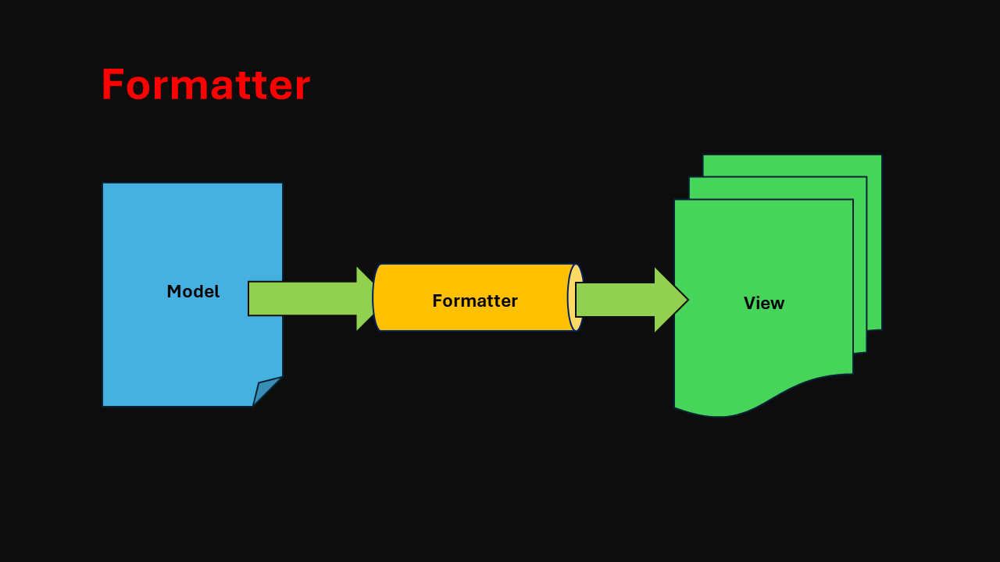

## Exercise 16 - Formatters


</br></br>

## Resource Model

</br>

When we have an app which is used internationally, we would like to translate the application labels in different language, so that we can allow internationalization/localization.

In short the internationalization is written as *i18n*

</br>

**There are 2 rules**

 1. Developer - Who enables the app to be internationalized 
 2. KM resource - Convert text to corresponding language (Knowledge management)

</br>


</br></br>

*Refer : following links for details screen element naming conventions* 

</br> [SAP Official GitHub repository for Ui5](https://github.com/SAP/openui5/blob/master/src/sap.m/test/sap/m/demokit/theming/webapp/i18n/i18n.properties)
</br> [SAP ui5 SDK page as on 2024-May-27](https://sapui5.hana.ondemand.com/sdk/#/topic/582ce93d326540f59d149031a44d5fb0)

</br>

*i18n.properties* file 

```i18n

## These belongs to XMl View

XLBL_EMPI=Employee ID
XLBL_EMPN=Employee Name
XLBL_SAL=Salary
XLBL_CURR=Currency
XLBL_SMK=Smoker
XLBL_M-STAT=Marital Status
XLBL_GEN=Gender
XLBL_RATE=Rating
XBUT_LOAD=Load data
XBUT_SHOW=Show
XBUT_FLIP=Flip-Flop

```

</br>

*model.js* - defining the resource model

```js

sap.ui.define([
    'sap/ui/model/json/JSONModel',
    'sap/ui/model/xml/XMLModel',   
    'sap/ui/model/resource/ResourceModel'], // Dependency asynchronous module definition (AMD)
    function (JSONModel, XMLModel, ResourceModel) {
        'use strict';
        // 'use strict' is declaration instruction to throw error 
        // if mentioned it will throw error when a value is assigned without declaration
        return {
            // createJSONModel: function (sFilepath) {
            //     // Step 1. create a brand new model object
            //     var oModel = new JSONModel();
            //     // Step 2. Load or set the data to the model
            //     // oModel.setData();
            //     oModel.loadData(sFilepath);
            //     return oModel;
            // },
       
            // createXMLModel: function (sFilepath) {
            //     // Step 1. create a brand new model object
            //     var oModel = new XMLModel();
            //     // Step 2. Load or set the data to the model
            //     // oModel.setData();
            //     oModel.loadData(sFilepath);
            //     return oModel;
            // },

            createResourceModel: function (){
                var oModel = new ResourceModel({
                    bundleUrl: "i18n/i18n.properties"
                });
                return oModel;
            }
        };
    });


```

</br>

*controller.js* - instantiating the model in controller.js 

</br>(only the essential snip is added here not the full file)

```js

onInit: function (){
    // Resource model 
    var oModelResource = Models.createResourceModel();
    // named model - we needd to give a name
    sap.ui.getCore().setModel(oModelResource, "i18n");
}

```

</br>

*view.xml* this is how it is addressed for texts in view file ( {i18n>XTIT_ED1} )

<details>
<summary> xml view file code sample </summary>
</br>
</br>

```xml

<mvc:View xmlns:form="sap.ui.layout.form" controllerName="logger.controller.ex16" 
xmlns:mvc="sap.ui.core.mvc" 
xmlns="sap.m"
xmlns:f="sap.ui.layout.form"
xmlns:t="sap.ui.table"
xmlns:core="sap.ui.core">

<!-- <t:Table rows="{/empTab}" visibleRowCount="5" selectionMode="Single"> -->
    <t:Table rows="{/empTab}" visibleRowCount="7" title="{i18n>XTIT_ED1}" rowSelectionChange="onRowSelect" selectionMode="Single">
        <t:columns>           
            <t:Column>
                <t:label>
                    <Label text="{i18n>XLBL_EMPI}" />
                </t:label>
                <t:template>
                    <Text text="{empId}" />
                </t:template>
            </t:Column>

            <t:Column>
                <t:label>
                    <Label text="{i18n>XLBL_EMPN}" />
                </t:label>   
                <t:template>
                    <!-- <Text text="{empName}" /> -->
                    <Input value="{empName}" />
                </t:template>                         
            </t:Column>

            <t:Column>
                <t:label>
                    <Label text="{i18n>XLBL_SAL}" />
                </t:label>   
                <t:template>
                    <Text text="{Salary} {Currency}" />
                </t:template>                         
            </t:Column>

            <t:Column>
                <t:label>
                    <Label text="{i18n>XLBL_SMK}" />
                </t:label>        
                <t:template>
                   <!-- Check Box-->
                    <CheckBox selected="{smoker}"></CheckBox>
                </t:template>                    
            </t:Column> 

            <t:Column>
                <t:label>
                    <Label text="{i18n>XLBL_GEN}" />
                </t:label>      
                <t:template>
                    <Image src="{gender}" width="40px" height="40px" />
                </t:template>                      
            </t:Column>             

            <t:Column>
                <t:label>
                    <Label text="{i18n>XLBL_M-STAT}" />
                </t:label>    
                <t:template>
                    <!-- Drop downn-->
                    <Select selectedKey="{mStat}">
                        <items>
                            <core:Item text="Married" key="M" />
                            <core:Item text="Single" key="S" />
                            <core:Item text="Divorcee" key="D" />
                        </items>
                        <items>
                        </items>                        
                    </Select>
                </t:template>                        
            </t:Column> 

            <t:Column>
                <t:label>
                    <Label text="{i18n>XLBL_RATE}" />
                </t:label>    
                <t:template>
                <!-- Rating Indicator -->
                 <RatingIndicator value="{rating}"> </RatingIndicator>
                </t:template>                        
            </t:Column>                                     
        </t:columns>
        <t:rows>
            <t:Row>

            </t:Row>
        </t:rows>        
    </t:Table>

    <form:SimpleForm editable="true" id="idSimple"> <!-- editable property aligns the controls properly in screen -->
    <form:title>
        <core:Title icon="sap-icon://customer" text="{i18n>XTIT_ED2}" />
    </form:title>
        <form:content>  <!-- Aggregation name starts with small letter-->
            <Label text="{i18n>XLBL_EMPI}"/> <!-- control name starts with capital letter -->            
            <Input id="idEmpId" width="25%" value="{empId}" /> 
            <Label text="{i18n>XLBL_EMPN}"/>
            <Input id="idEmpName" width="30%" value="{path: 'empName'}"/> 
            <!-- <Input id="idEmpName" width="30%" value="{path: 'empName'}" enabled="{= ${pranks} === 'true' ? true : false}"/>  -->
            <Label text="{i18n>XLBL_SAL}"/>
            <!-- <Input id="idSalary" width="20%" value="{Salary}" enabled="{= ${empName} === 'Baratheon' ? false : true }"/> -->
            <Input id="idSalary" width="20%" value="{Salary}"/>
            <Label text="{i18n>XLBL_CURR}"/>
            <Input id="idCurrency" width="10%" value="{Currency}" />

            <Label/> <!--empty label for spacing-->            
                <HBox>
                    <Button text="{i18n>XBUT_LOAD}" press="onLoad" width=""/>
                    <Button text="{i18n>XBUT_SHOW}" press="onShow"/>                     
                    <Button text="{i18n>XBUT_FLIP}" press="onFlip"/>       
                </HBox>
                     
        </form:content>
    </form:SimpleForm>

    </mvc:View>

```

</br>
</details>

</br>

Create another language file for i18n as shown below

</br>


</br></br>

Now go to google translate and do the translation for all the text maintained in i18n

</br>


</br></br>


*i18n_ta.properties*  Tamil தமிழ் language file 


```i18n

## These belongs to XMl View

XLBL_EMPI=பணியாளர் ஐடி
XLBL_EMPN=பணியாளர் பெயர்
XLBL_SAL=சம்பளம்
XLBL_CURR=நாணயம்
XLBL_SMK=புகைப்பிடிப்பவர்
XLBL_M-STAT=திருமண நிலை
XLBL_GEN=பாலினம்
XLBL_RATE=மதிப்பீடு
XBUT_LOAD=தரவை ஏற்றவும்
XBUT_SHOW=காட்டு
XBUT_FLIP=எழு-விழு
XTIT_ED1=பணியாளர் தரவு
XTIT_ED2=பணியாளர் விவரங்கள்

```

</br></br>

Now we have to test the added language text to our page (URL snip) ta - language code in my case

```url

?sap-ui-language=ta

```

</br>


</br></br>
</br>

## Formatters 

</br>

Formatter is a function which gets called before the binding takes place.

This function takes the data from the model and return the data to the U.I, so ultimately you will see the data on the screen which is transformed.

</br>

Some list of use case scenarios this formatter is used : 

- Scenario : Convert all the name to caps, 
- Scenario : Convert all the name to small
- Scenario : Currency formatting
- Scenario : Date formatting
- Scenario : Time formatting 
- Scenario : Changing values at runtime 
- Scenario : Performing some calculation like discount, premium, deductions, tax .. etc

</br>



</br>

*Formatter can only be used for Property binding syntax type 2*

</br>

*View.xml*  our formatter function should be created in controller.js *( . dot represents corresponding views controller file)*

```xml

<Input value="{path : 'empName', formatter : '.myFormatterFunction'}" />

```

</br>

*controller.js* 

```js

    myFormatterFunction: function (input){
        if(input){
            return input.toUpperCase();
        }
    }

```


</br></br>
</br></br>
</br></br>

## End of Exercise 16 ---NEXT---> <a href="https://github.com/Octavius-Dante/Arthelais/tree/main/ex_17"> Exercise 17-Fiori Like app </a>
</br>
<p align="center"> <a href="https://github.com/Octavius-Dante/Arthelais/tree/main"> Main page </a> </p>


</br></br>

**All Previous sessions**
</br></br>
<!-- 
- [x] <a href="https://github.com/Octavius-Dante/Arthelais/tree/main/ex_37"> Exercise 37-Deploy app to launchpad</a>
- [x] <a href="https://github.com/Octavius-Dante/Arthelais/tree/main/ex_36"> Exercise 36-WebIde and Git integration</a>
- [x] <a href="https://github.com/Octavius-Dante/Arthelais/tree/main/ex_35"> Exercise 35-POST, GET and DELETE from Fiori</a>
- [x] <a href="https://github.com/Octavius-Dante/Arthelais/tree/main/ex_34"> Exercise 34-GET and Connect</a>
- [x] <a href="https://github.com/Octavius-Dante/Arthelais/tree/main/ex_33"> Exercise 33-Fiori Project Connect Odata</a>
- [x] <a href="https://github.com/Octavius-Dante/Arthelais/tree/main/ex_32"> Exercise 32-Connectivity</a>
- [x] <a href="https://github.com/Octavius-Dante/Arthelais/tree/main/ex_31"> Exercise 31-Function Import and Images</a>
- [x] <a href="https://github.com/Octavius-Dante/Arthelais/tree/main/ex_30"> Exercise 30-implementing CRUD</a>
- [x] <a href="https://github.com/Octavius-Dante/Arthelais/tree/main/ex_29"> Exercise 29-Implementing GET</a>
- [x] <a href="https://github.com/Octavius-Dante/Arthelais/tree/main/ex_28"> Exercise 28-Create A Gateway Project</a>
- [x] <a href="https://github.com/Octavius-Dante/Arthelais/tree/main/ex_27"> Exercise 27-Odata GET</a>
- [x] <a href="https://github.com/Octavius-Dante/Arthelais/tree/main/ex_26"> Exercise 26-Fiori Deployments</a>
- [x] <a href="https://github.com/Octavius-Dante/Arthelais/tree/main/ex_25"> Exercise 25-Fragments Deep dive</a>
- [x] <a href="https://github.com/Octavius-Dante/Arthelais/tree/main/ex_24"> Exercise 24-Fragments</a>
- [x] <a href="https://github.com/Octavius-Dante/Arthelais/tree/main/ex_23"> Exercise 23-Icon Tab bar</a>
- [x] <a href="https://github.com/Octavius-Dante/Arthelais/tree/main/ex_22"> Exercise 22-Route matched Handlers</a>
- [x] <a href="https://github.com/Octavius-Dante/Arthelais/tree/main/ex_21"> Exercise 21-Router Basics</a>
- [x] <a href="https://github.com/Octavius-Dante/Arthelais/tree/main/ex_20"> Exercise 20-Filters on List mode</a>
- [x] <a href="https://github.com/Octavius-Dante/Arthelais/tree/main/ex_19"> Exercise 19-Manifest JSON</a>
- [x] <a href="https://github.com/Octavius-Dante/Arthelais/tree/main/ex_18"> Exercise 18-List Control</a>
- [x] <a href="https://github.com/Octavius-Dante/Arthelais/tree/main/ex_17"> Exercise 17-Fiori Lite app</a>
- [x] <a href="https://github.com/Octavius-Dante/Arthelais/tree/main/ex_16"> Exercise 16-Formatters </a> -->
- [x] <a href="https://github.com/Octavius-Dante/Arthelais/tree/main/ex_15"> Exercise 15-Element Binding</a>
- [x] <a href="https://github.com/Octavius-Dante/Arthelais/tree/main/ex_14"> Exercise 14-Table control</a>
- [x] <a href="https://github.com/Octavius-Dante/Arthelais/tree/main/ex_13"> Exercise 13-Expression Binding XML Model</a>
- [x] <a href="https://github.com/Octavius-Dante/Arthelais/tree/main/ex_12"> Exercise 12-Json Model Property Binding</a>
- [x] <a href="https://github.com/Octavius-Dante/Arthelais/tree/main/ex_11"> Exercise 11-Model Basics </a>
- [x] <a href="https://github.com/Octavius-Dante/Arthelais/tree/main/ex_10"> Exercise 10-XML Views </a>
- [x] <a href="https://github.com/Octavius-Dante/Arthelais/tree/main/ex_9"> Exercise 9-Control Hierarchy 2</a>
- [x] <a href="https://github.com/Octavius-Dante/Arthelais/tree/main/ex_8"> Exercise 8-Ui5 Control Hierarchy </a>
- [x] <a href="https://github.com/Octavius-Dante/Arthelais/tree/main/ex_7"> Exercise 7-SAP Ui5 Framework </a>
- [x] <a href="https://github.com/Octavius-Dante/Arthelais/tree/main/ex_6"> Exercise 6-JQuery </a>
- [x] <a href="https://github.com/Octavius-Dante/Arthelais/tree/main/ex_5"> Exercise 5-JS deep dive </a>
- [x] <a href="https://github.com/Octavius-Dante/Arthelais/tree/main/ex_4"> Exercise 4-JS basic </a>
- [x] <a href="https://github.com/Octavius-Dante/Arthelais/tree/main/ex_3"> Exercise 3-CSS </a>
- [x] <a href="https://github.com/Octavius-Dante/Arthelais/tree/main/ex_2"> Exercise 2-HTML5</a>
- [x] <a href="https://github.com/Octavius-Dante/Arthelais/tree/main/ex_1"> Exercise 1 -Basic </a>


<!--

<details>
<summary> <b> ALL CODE CHANGES - TODAY SESSION </b> </summary>
</br>
</br>

</br>
</br>

</br>
</br>
</details>

-->