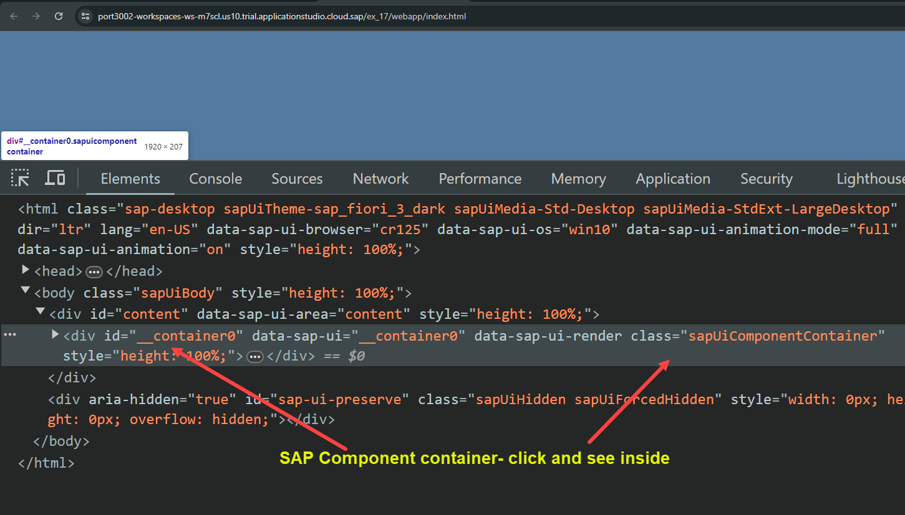
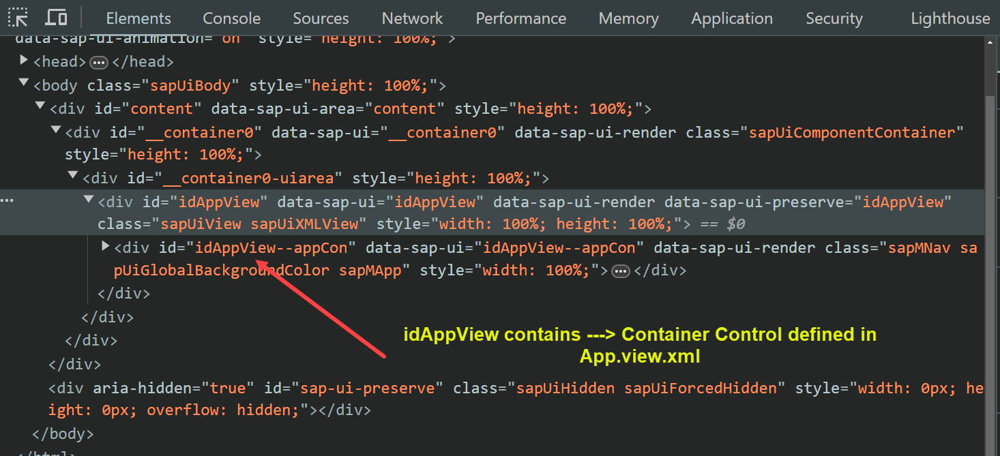

## Exercise 17 - Fiori Like app

</br></br>

*Why SAP Fiori was introduced ?  - it is a Ui5 guideline for designing web application in certain way.* 

Fiori Guidelines : https://experience.sap.com/fiori-design-web/ 

</br></br>


</br></br>


**New Flow details**


- *<b>Index Html</b> is just a trigger to start the web application it is not the main file.*

- *<b>Component.js</b> is the actual file responsible for code and view instantiation* - is the starting file and boot file for the application

- *<b>Manifest.json</b> is a companion file of Component.js, it is also called as application descriptor*

- *<b>App.view.xml</b> is the starting view of the app- the is the first view Component js calls central view*

- *<b>Container control</b> is part of App.view.xml (app container, split app container) it contains other views inside (view.xml)*
  *this container control is Responsible for navigation between the views*

- *<b>view.xml</b> regular views which contains screen elements*

- *<b>Controllers.js each view.xml contains a corresponding controller</b>*

- *<b>App controller</b>ss is a part of App view*

</br></br>

## Creating a Fiori app skeleton 

</br>

**Steps involved in creating a Fiori app skeleton :**

*Pre-requisite Webapp folder should be present and all the following activities takes place inside webapp*

1. Create an *Index.html* with sap ui5 bootstrap code 
2. Set a workspace directory *NameSpace unique name (org-Name.department-name.project-name) in Index.html*
3. Define *Component container* in index.html and place at a div.
4. Create *Component.js* with scaffolding template set UIComponent for NameSpace
5. Define a App view in *Component.js* 
6. Create a *view* folder 
7. Create *App.view.xml* 
8. Create a *controller* folder 
9. Create *App.controller.js*
10. Define a name for Component container *appCon* in *App.view.xml*
11. In *App.controller.js* put scaffolding template and set controller for NameSpace
12. Create *View1.view.xml* and *View2.view.xml* 
13. Create *View1.controller.js* and *View2.controller.js* 
14. In *Component.js* define *View1* and *View2* 
15. Define the *appCon* mentioned in *App.view.xml* in *Component.js* 
16. Use *addPage* property to *appCon* and embed the *View1* and *View2* objects
17. Return the component container object in *Component.js*

</br></br>

**Define Component container for Component.js**

</br>

*index.html* -- *Skeleton*

```html

<html>
    <head>
        <script src="https://sapui5.hana.ondemand.com/resources/sap-ui-core.js"
                data-sap-ui-libs="sap.m"
                data-sap-ui-theme="sap_fiori_3_dark"
                data-sap-ui-resourceroots='{"ntt.hr.payroll" : "./"}'
                data-sap-ui-bindingSyntax="Complex"
        >     
        </script>
<!-- Naming convention for workspace will be COMPANY-NAME.DEPARTMENT.PROJECT -->
        <script>
// 1. First define a component container for component.js  
            var oCompContainer = new sap.ui.core.ComponentContainer({
                name : "ntt.hr.payroll"
            });
            oCompContainer.placeAt("content");               
        </script>        

    </head>
    <body class="sapUiBody">
        <div id="content"></div>
    </body> 

</html>


```

</br>

**Component.jS**

- *It is the starting file for fiori apps*
- *It wraps the functionality of entire Fiori app*
- *It is companion with a file called application description (manifest.json)*
- *There is only one Component.js per app - file name should be ( Component.js )*
- *It inherits from SAP standard class sap/ui/core/UIComponent - base class*
- *This base class gets us free functionality and objects example (Router)*
- *The Component file instantiate app.view.xml*

</br>

[SDK link for sap/ui/core/UIComponent](https://sapui5.hana.ondemand.com/#/api/sap.ui.core.UIComponent%23methods/Summary)

</br>


</br>

*Create a file called Component.js inside webapp folder*


</br>

*Component.js* -- *Skeleton*

```js

sap.ui.define([
    'sap/ui/core/UIComponent'
], function(UIComponent){
    'use strict';
    return UIComponent.extend("ntt.hr.payroll.Component",{
        metadata: {},
        init: function(){
            // this line will call the base class constructor
            UIComponent.prototype.init.apply(this);
        },
        createContent: function(){
            var oView = sap.ui.view({
                viewName: "ntt.hr.payroll.view.App",
                id: "idAppView",
                type: "XML"
            });

            return oView;
        }
    });
});

```

</br>

*Create folders and files as shown below*

</br>


</br>

*App.view.xml* -- *Skeleton*

```xml
<mvc:View xmlns:mvc="sap.ui.core.mvc" xmlns="sap.m" 
controllerName="ntt.hr.payroll.controller.App">

<!-- Defining container control - it contains other views 

> This container control will be parent for other views 
> There are different types of container control

    ~ now we are using type : App container control

-->

<App id="appCon" />

</mvc:View>

```

</br>

*App.controller.js* -- *Skeleton*

```js

sap.ui.define([
    'sap/ui/core/mvc/Controller'
], function(Controller){
    'use strict';
    return Controller.extend("ntt.hr.payroll.controller.controlApp",{
        onInit: function(){

        }
    });
});

```
</br></br>

*Launch and test the app*

</br>

<details>
<summary> Test check files </summary>
</br>
</br>

</br>

</br>

</br>

</br>
</br>
</details>

<details>
<summary> Creating other views and controllers and do test run </summary>
</br>
</br>

</br>
</br>

*View1.view.xml* --- *Skeleton & a button*

```xml

<mvc:View xmlns:mvc="sap.ui.core.mvc" xmlns="sap.m" 
controllerName="ntt.hr.payroll.controller.View1">

<Button text="Go Next" icon="Sap-icon://arrow-right"
 press="onNExt" />

</mvc:View>

```

</br>

*View2.view.xml* --- *Skeleton & a button*

```xml

<mvc:View xmlns:mvc="sap.ui.core.mvc" xmlns="sap.m" 
controllerName="ntt.hr.payroll.controller.View2">

<Button text="Go Back" icon="Sap-icon://arrow-left"
 press="onBack" />

</mvc:View>

```

</br></br>

</br></br>

*View1.controller.js* --- *Skeleton*

```js

sap.ui.define([
    'sap/ui/core/mvc/Controller'
], function(Controller){
    'use strict';
    return Controller.extend("ntt.hr.payroll.controller.View1",{
        onInit: function(){

        },

        onNext: function(){
            
        }
        
    });
});

```

</br>

*View2.controller.js* --- *Skeleton*

```js

sap.ui.define([
    'sap/ui/core/mvc/Controller'
], function(Controller){
    'use strict';
    return Controller.extend("ntt.hr.payroll.controller.View2",{
        onInit: function(){

        },

        onBack: function(){

        }
    });
});

```

</br>

*Component.js* --- *Skeleton*

```js

sap.ui.define([
    'sap/ui/core/UIComponent'
], function(UIComponent){
    'use strict';
    return UIComponent.extend("ntt.hr.payroll.Component",{
        metadata: {},
        init: function(){
            // this line will call the base class constructor
            UIComponent.prototype.init.apply(this);
        },
        createContent: function(){
            var oView = sap.ui.view({
                viewName: "ntt.hr.payroll.view.App",
                id: "idAppView",
                type: "XML"
            });

            // Step 1 : Create View 1 object
            var oView1 = sap.ui.view({
                viewName: "ntt.hr.payroll.view.View1",
                id: "idView1",
                type: "XML"
            });

            // Step 2 : Create View 2 object
            var oView2 = sap.ui.view({
                viewName: "ntt.hr.payroll.view.View2",
                id: "idView2",
                type: "XML"
            });

            // Step 3 : Get the APP Container Control
            // this.getView().byId("idObject") -- We did this in previous session 
                                              // the same thing is referred differently 
            
            var oAppCon = oView.byId("appCon"); // appCon is from AppView - then we defined app container

            // Step 4 : Inject the View1 and View2 inside the container 
            oAppCon.addPage(oView1).addPage(oView2);
            return oView;
        }
    });
});

```

</br></br>

**Executed the app** ---- *See the hierarchy of the application in the DOM*

- *The reason for view 1 selection is by default first view takes the priority in display*

</br>

</br>

</br></br>
</details>


</br></br>
</br></br>
</br></br>

## End of Exercise 17 ---NEXT---> <a href="https://github.com/Octavius-Dante/Arthelais/tree/main/ex_18"> Exercise 18-List Control</a>
</br>
<p align="center"> <a href="https://github.com/Octavius-Dante/Arthelais/tree/main"> Main page </a> </p>


</br></br>

**All Previous sessions**
</br></br>

<!-- - [x] <a href="https://github.com/Octavius-Dante/Arthelais/tree/main/ex_37"> Exercise 37-Deploy app to launchpad</a>
- [x] <a href="https://github.com/Octavius-Dante/Arthelais/tree/main/ex_36"> Exercise 36-WebIde and Git integration</a>
- [x] <a href="https://github.com/Octavius-Dante/Arthelais/tree/main/ex_35"> Exercise 35-POST, GET and DELETE from Fiori</a>
- [x] <a href="https://github.com/Octavius-Dante/Arthelais/tree/main/ex_34"> Exercise 34-GET and Connect</a>
- [x] <a href="https://github.com/Octavius-Dante/Arthelais/tree/main/ex_33"> Exercise 33-Fiori Project Connect Odata</a>
- [x] <a href="https://github.com/Octavius-Dante/Arthelais/tree/main/ex_32"> Exercise 32-Connectivity</a>
- [x] <a href="https://github.com/Octavius-Dante/Arthelais/tree/main/ex_31"> Exercise 31-Function Import and Images</a>
- [x] <a href="https://github.com/Octavius-Dante/Arthelais/tree/main/ex_30"> Exercise 30-implementing CRUD</a>
- [x] <a href="https://github.com/Octavius-Dante/Arthelais/tree/main/ex_29"> Exercise 29-Implementing GET</a>
- [x] <a href="https://github.com/Octavius-Dante/Arthelais/tree/main/ex_28"> Exercise 28-Create A Gateway Project</a>
- [x] <a href="https://github.com/Octavius-Dante/Arthelais/tree/main/ex_27"> Exercise 27-Odata GET</a>
- [x] <a href="https://github.com/Octavius-Dante/Arthelais/tree/main/ex_26"> Exercise 26-Fiori Deployments</a>
- [x] <a href="https://github.com/Octavius-Dante/Arthelais/tree/main/ex_25"> Exercise 25-Fragments Deep dive</a>
- [x] <a href="https://github.com/Octavius-Dante/Arthelais/tree/main/ex_24"> Exercise 24-Fragments</a>
- [x] <a href="https://github.com/Octavius-Dante/Arthelais/tree/main/ex_23"> Exercise 23-Icon Tab bar</a>
- [x] <a href="https://github.com/Octavius-Dante/Arthelais/tree/main/ex_22"> Exercise 22-Route matched Handlers</a>
- [x] <a href="https://github.com/Octavius-Dante/Arthelais/tree/main/ex_21"> Exercise 21-Router Basics</a>
- [x] <a href="https://github.com/Octavius-Dante/Arthelais/tree/main/ex_20"> Exercise 20-Filters on List mode</a>
- [x] <a href="https://github.com/Octavius-Dante/Arthelais/tree/main/ex_19"> Exercise 19-Manifest JSON</a>
- [x] <a href="https://github.com/Octavius-Dante/Arthelais/tree/main/ex_18"> Exercise 18-List Control</a>
- [x] <a href="https://github.com/Octavius-Dante/Arthelais/tree/main/ex_17"> Exercise 17-Fiori Lite app</a> -->
- [x] <a href="https://github.com/Octavius-Dante/Arthelais/tree/main/ex_16"> Exercise 16-Formatters </a>
- [x] <a href="https://github.com/Octavius-Dante/Arthelais/tree/main/ex_15"> Exercise 15-Element Binding</a>
- [x] <a href="https://github.com/Octavius-Dante/Arthelais/tree/main/ex_14"> Exercise 14-Table control</a>
- [x] <a href="https://github.com/Octavius-Dante/Arthelais/tree/main/ex_13"> Exercise 13-Expression Binding XML Model</a>
- [x] <a href="https://github.com/Octavius-Dante/Arthelais/tree/main/ex_12"> Exercise 12-Json Model Property Binding</a>
- [x] <a href="https://github.com/Octavius-Dante/Arthelais/tree/main/ex_11"> Exercise 11-Model Basics </a>
- [x] <a href="https://github.com/Octavius-Dante/Arthelais/tree/main/ex_10"> Exercise 10-XML Views </a>
- [x] <a href="https://github.com/Octavius-Dante/Arthelais/tree/main/ex_9"> Exercise 9-Control Hierarchy 2</a>
- [x] <a href="https://github.com/Octavius-Dante/Arthelais/tree/main/ex_8"> Exercise 8-Ui5 Control Hierarchy </a>
- [x] <a href="https://github.com/Octavius-Dante/Arthelais/tree/main/ex_7"> Exercise 7-SAP Ui5 Framework </a>
- [x] <a href="https://github.com/Octavius-Dante/Arthelais/tree/main/ex_6"> Exercise 6-JQuery </a>
- [x] <a href="https://github.com/Octavius-Dante/Arthelais/tree/main/ex_5"> Exercise 5-JS deep dive </a>
- [x] <a href="https://github.com/Octavius-Dante/Arthelais/tree/main/ex_4"> Exercise 4-JS basic </a>
- [x] <a href="https://github.com/Octavius-Dante/Arthelais/tree/main/ex_3"> Exercise 3-CSS </a>
- [x] <a href="https://github.com/Octavius-Dante/Arthelais/tree/main/ex_2"> Exercise 2-HTML5</a>
- [x] <a href="https://github.com/Octavius-Dante/Arthelais/tree/main/ex_1"> Exercise 1 -Basic </a>


<!--

<details>
<summary> <b> ALL CODE CHANGES - TODAY SESSION </b> </summary>
</br>
</br>

</br>
</br>

</br>
</br>
</details>

-->