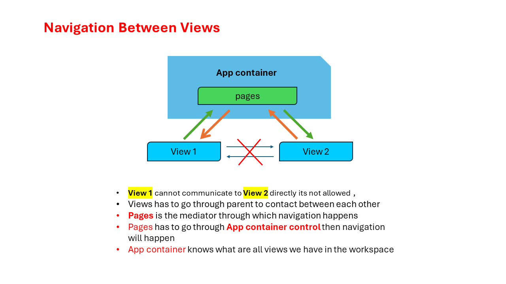
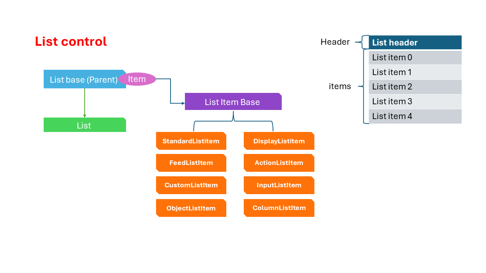

## Exercise 18 - List Control

</br> 

**We will Implement navigation between the 2 views**

</br>


</br>

*View1.controller.js*

```js
sap.ui.define([
    'sap/ui/core/mvc/Controller'
], function(Controller){
    'use strict';
    return Controller.extend("ntt.hr.payroll.controller.View1",{
        onInit: function(){

        },

        onNext: function(){
            // Step 1 : get the parent control object - Container for our view 
            var oAppCon = this.getView().getParent();
            // Step 2 : ask parent to nav to next view 
            oAppCon.to("idView2");
        }        
    });
});

```

</br>

*View2.controller.js*

```js

sap.ui.define([
    'sap/ui/core/mvc/Controller'
], function(Controller){
    'use strict';
    return Controller.extend("ntt.hr.payroll.controller.View2",{
        onInit: function(){

        },

        onBack: function(){
            this.getView().getParent().to("idView1");            
        }
    });
});

```
</br></br>

**Adding page title to both the view.xml**

</br>

*View1.view.xml*

```xml

<mvc:View xmlns:mvc="sap.ui.core.mvc" xmlns="sap.m" 
controllerName="ntt.hr.payroll.controller.View1">
    <Page title="View 1">
        <Button text="Go Next" icon="sap-icon://arrow-right" press="onNext" />
    </Page>
</mvc:View>

```

</br>

*View2.view.xml*

```xml

<mvc:View xmlns:mvc="sap.ui.core.mvc" xmlns="sap.m" 
controllerName="ntt.hr.payroll.controller.View2">
    <Page title="View 1">
        <Button text="Go Back" icon="sap-icon://arrow-left" press="onBack" />
    </Page>
</mvc:View>

```

</br></br>

*visit this link for reference how a Fiori blank page will look like just to get an idea*

https://sapui5.hana.ondemand.com/#/entity/sap.m.Page/sample/sap.m.sample.Page/code

Now we are going to make changes to our view page to make it look accordingly .

</br>

*View1.view.xml*

```xml

<mvc:View xmlns:mvc="sap.ui.core.mvc" xmlns="sap.m" 
controllerName="ntt.hr.payroll.controller.View1">
    <Page title="View 1">
        <headerContent>
            <Button  icon="sap-icon://action" press="onNext"></Button>
        </headerContent>
        <content> <!--this is a default property since headerContent is used this should be mandatorily used-->
            <SearchField id="idsf1"></SearchField>
            <List id="idList"></List>
        </content>
        <!-- <Button text="Go Next" icon="sap-icon://arrow-right" press="onNext" /> -->
    </Page>
</mvc:View>

```

</br>

*View2.view.xml*

```xml

<mvc:View xmlns:mvc="sap.ui.core.mvc" xmlns="sap.m" 
controllerName="ntt.hr.payroll.controller.View2">
    <Page title="View 2" showNavButton="true" navButtonPress="onBack">

        <!-- <Button text="Go Back" icon="sap-icon://arrow-left" press="onBack" /> -->
    </Page>
</mvc:View>

```

</br>


## List control

*It is a single column table which contains multiple items*

</br>

</br>

</br></br>

**We will add all types of list control items in our view for demonstration and understanding.**

*View1.view.xml*

```xml

<mvc:View xmlns:mvc="sap.ui.core.mvc" xmlns="sap.m" 
controllerName="ntt.hr.payroll.controller.View1">
    <Page title="View 1">
        <headerContent>
            <Button  icon="sap-icon://action" press="onNext"></Button>
        </headerContent>
        <content> <!--this is a default property since headerContent is used this should be mandatorily used-->
            <SearchField id="idsf1"></SearchField>
            <List id="idList">
            <items>
        <!--Displaying name/value pairs-->
                <DisplayListItem value="A natural antibiotic" label="Apple"></DisplayListItem>
        
        <!-- Standard list tiem for Displaying list content with a title description, icon and info-->        
                <StandardListItem title="Orange" description="The most rich source of vitamin C" 
                icon="https://images.vexels.com/media/users/3/143191/isolated/preview/925871db899c05172adae868b7ca93c0-orange-color-icon.png" ></StandardListItem>
                
        <!--input list item is used for creating input fields-->
                <InputListItem>
                    <HBox>
                        <Label text="what is teh best fruit for skin" />
                        <Input />
                    </HBox>
                </InputListItem>

        <!--if none of the list item can fulfill your need can switch to Custom list item-->
                <CustomListItem >
        <!--in Custom list item we can put any control int the way we like -->
                    <Label text="Do you want Cash on delivery of the fruits ?" />
                    <Switch />
                </CustomListItem>

            <!-- Object list itme can display business object data like 

            > Sales order 
            > Purchase order 
            > Invoices 
            > Accounting document
            > Service contract
            > Delivery note 
            > Billing document 

            Any business object in SAP can be displayed here all these data use measure 
            -->
                <ObjectListItem title="Banana" intro="A Great source of potassium" icon="https://cdn-icons-png.flaticon.com/512/6482/6482627.png" 
                number="150 CAD" numberUnit="Per Dozen" >
                    
             <!-- Extra attributes -->                   
                    <attributes>
                        <ObjectAttribute text="Yellow-Green" title="Color"></ObjectAttribute>
                        <ObjectAttribute text="Dozen" title="Unit"></ObjectAttribute>
                    </attributes>

                    <firstStatus>
                        <ObjectStatus text="Available" state="Success"></ObjectStatus>
                    </firstStatus>

                    <!-- <firstStatus>
                        <ObjectStatus text="Out of Stock" state="Warning"></ObjectStatus>
                    </firstStatus> -->

                    <!-- <firstStatus>
                        <ObjectStatus text="Discontinued" state="Error"></ObjectStatus>
                    </firstStatus>  -->

                </ObjectListItem>
            </items>

            <!-- Feed list item is to display internet info feeds like twitter & facebook -->
            <FeedListItem icon="https://assets.bwbx.io/images/users/iqjWHBFdfxIU/ipwI8jWqfiUQ/v1/-1x-1.jpg" 
            sender="Elon Tusk" 
            text="Whats Up lets have a casual meet up!" timestamp="Fri 7th june 2024" >  </FeedListItem>

            <!--its a clickable list item-->
            <ActionListItem press="onItemClick" text="Order Now!!">
            </ActionListItem>

            </List>
        </content>
        <!-- <Button text="Go Next" icon="sap-icon://arrow-right" press="onNext" /> -->
    </Page>
</mvc:View>


```

<br> <br>

*View2.view.xml*

```xml


<mvc:View xmlns:mvc="sap.ui.core.mvc" xmlns="sap.m" 
controllerName="ntt.hr.payroll.controller.View2">
    <Page title="View 2" showNavButton="true" navButtonPress="onBack">

        <!-- <Button text="Go Back" icon="sap-icon://arrow-left" press="onBack" /> -->

    <footer>
        <Toolbar>
<!-- This toolbar spacer responsible for moving the button on the right side -->        
        <ToolbarSpacer/> 
            <Button text="Order" type="Emphasized"></Button>
            <Button text="Remind later" type="Accept"></Button>
            <Button text="Cancel" type="Reject"></Button>
        </Toolbar>
    </footer>
    </Page>
</mvc:View>


```


</br></br>
</br></br>
</br></br>

## End of Exercise 18 ---NEXT---> <a href="https://github.com/Octavius-Dante/Arthelais/tree/main/ex_19"> Exercise 19-Manifest JSON </a>
</br>
<p align="center"> <a href="https://github.com/Octavius-Dante/Arthelais/tree/main"> Main page </a> </p>


</br></br>

**All Previous sessions**
</br></br>

<!-- - [x] <a href="https://github.com/Octavius-Dante/Arthelais/tree/main/ex_37"> Exercise 37-Deploy app to launchpad</a>
- [x] <a href="https://github.com/Octavius-Dante/Arthelais/tree/main/ex_36"> Exercise 36-WebIde and Git integration</a>
- [x] <a href="https://github.com/Octavius-Dante/Arthelais/tree/main/ex_35"> Exercise 35-POST, GET and DELETE from Fiori</a>
- [x] <a href="https://github.com/Octavius-Dante/Arthelais/tree/main/ex_34"> Exercise 34-GET and Connect</a>
- [x] <a href="https://github.com/Octavius-Dante/Arthelais/tree/main/ex_33"> Exercise 33-Fiori Project Connect Odata</a>
- [x] <a href="https://github.com/Octavius-Dante/Arthelais/tree/main/ex_32"> Exercise 32-Connectivity</a>
- [x] <a href="https://github.com/Octavius-Dante/Arthelais/tree/main/ex_31"> Exercise 31-Function Import and Images</a>
- [x] <a href="https://github.com/Octavius-Dante/Arthelais/tree/main/ex_30"> Exercise 30-implementing CRUD</a>
- [x] <a href="https://github.com/Octavius-Dante/Arthelais/tree/main/ex_29"> Exercise 29-Implementing GET</a>
- [x] <a href="https://github.com/Octavius-Dante/Arthelais/tree/main/ex_28"> Exercise 28-Create A Gateway Project</a>
- [x] <a href="https://github.com/Octavius-Dante/Arthelais/tree/main/ex_27"> Exercise 27-Odata GET</a>
- [x] <a href="https://github.com/Octavius-Dante/Arthelais/tree/main/ex_26"> Exercise 26-Fiori Deployments</a>
- [x] <a href="https://github.com/Octavius-Dante/Arthelais/tree/main/ex_25"> Exercise 25-Fragments Deep dive</a>
- [x] <a href="https://github.com/Octavius-Dante/Arthelais/tree/main/ex_24"> Exercise 24-Fragments</a>
- [x] <a href="https://github.com/Octavius-Dante/Arthelais/tree/main/ex_23"> Exercise 23-Icon Tab bar</a>
- [x] <a href="https://github.com/Octavius-Dante/Arthelais/tree/main/ex_22"> Exercise 22-Route matched Handlers</a>
- [x] <a href="https://github.com/Octavius-Dante/Arthelais/tree/main/ex_21"> Exercise 21-Router Basics</a>
- [x] <a href="https://github.com/Octavius-Dante/Arthelais/tree/main/ex_20"> Exercise 20-Filters on List mode</a>
- [x] <a href="https://github.com/Octavius-Dante/Arthelais/tree/main/ex_19"> Exercise 19-Manifest JSON</a>
- [x] <a href="https://github.com/Octavius-Dante/Arthelais/tree/main/ex_18"> Exercise 18-List Control</a> -->
- [x] <a href="https://github.com/Octavius-Dante/Arthelais/tree/main/ex_17"> Exercise 17-Fiori Lite app</a>
- [x] <a href="https://github.com/Octavius-Dante/Arthelais/tree/main/ex_16"> Exercise 16-Formatters </a>
- [x] <a href="https://github.com/Octavius-Dante/Arthelais/tree/main/ex_15"> Exercise 15-Element Binding</a>
- [x] <a href="https://github.com/Octavius-Dante/Arthelais/tree/main/ex_14"> Exercise 14-Table control</a>
- [x] <a href="https://github.com/Octavius-Dante/Arthelais/tree/main/ex_13"> Exercise 13-Expression Binding XML Model</a>
- [x] <a href="https://github.com/Octavius-Dante/Arthelais/tree/main/ex_12"> Exercise 12-Json Model Property Binding</a>
- [x] <a href="https://github.com/Octavius-Dante/Arthelais/tree/main/ex_11"> Exercise 11-Model Basics </a>
- [x] <a href="https://github.com/Octavius-Dante/Arthelais/tree/main/ex_10"> Exercise 10-XML Views </a>
- [x] <a href="https://github.com/Octavius-Dante/Arthelais/tree/main/ex_9"> Exercise 9-Control Hierarchy 2</a>
- [x] <a href="https://github.com/Octavius-Dante/Arthelais/tree/main/ex_8"> Exercise 8-Ui5 Control Hierarchy </a>
- [x] <a href="https://github.com/Octavius-Dante/Arthelais/tree/main/ex_7"> Exercise 7-SAP Ui5 Framework </a>
- [x] <a href="https://github.com/Octavius-Dante/Arthelais/tree/main/ex_6"> Exercise 6-JQuery </a>
- [x] <a href="https://github.com/Octavius-Dante/Arthelais/tree/main/ex_5"> Exercise 5-JS deep dive </a>
- [x] <a href="https://github.com/Octavius-Dante/Arthelais/tree/main/ex_4"> Exercise 4-JS basic </a>
- [x] <a href="https://github.com/Octavius-Dante/Arthelais/tree/main/ex_3"> Exercise 3-CSS </a>
- [x] <a href="https://github.com/Octavius-Dante/Arthelais/tree/main/ex_2"> Exercise 2-HTML5</a>
- [x] <a href="https://github.com/Octavius-Dante/Arthelais/tree/main/ex_1"> Exercise 1 -Basic </a>


<!--

<details>
<summary> <b> ALL CODE CHANGES - TODAY SESSION </b> </summary>
</br>
</br>

</br>
</br>

</br>
</br>
</details>

-->