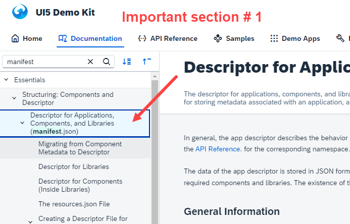
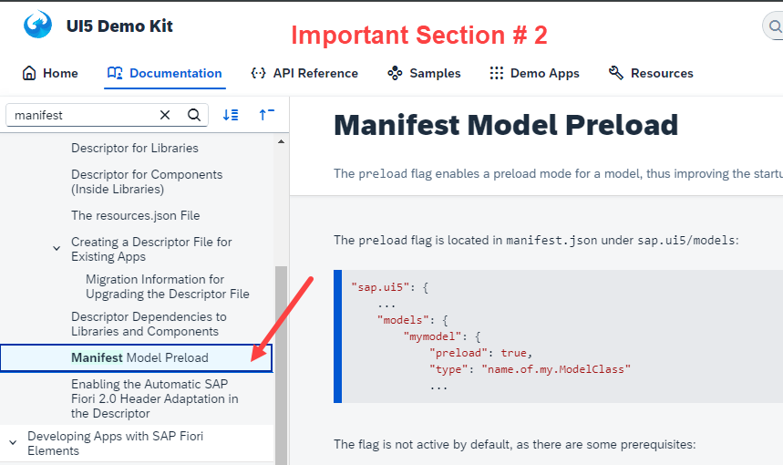
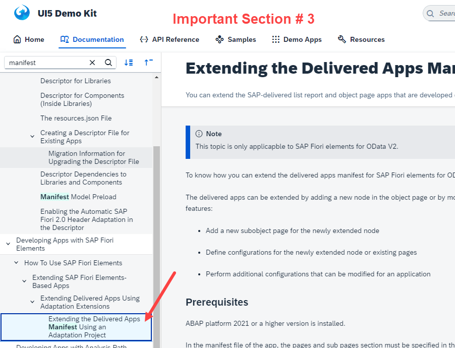
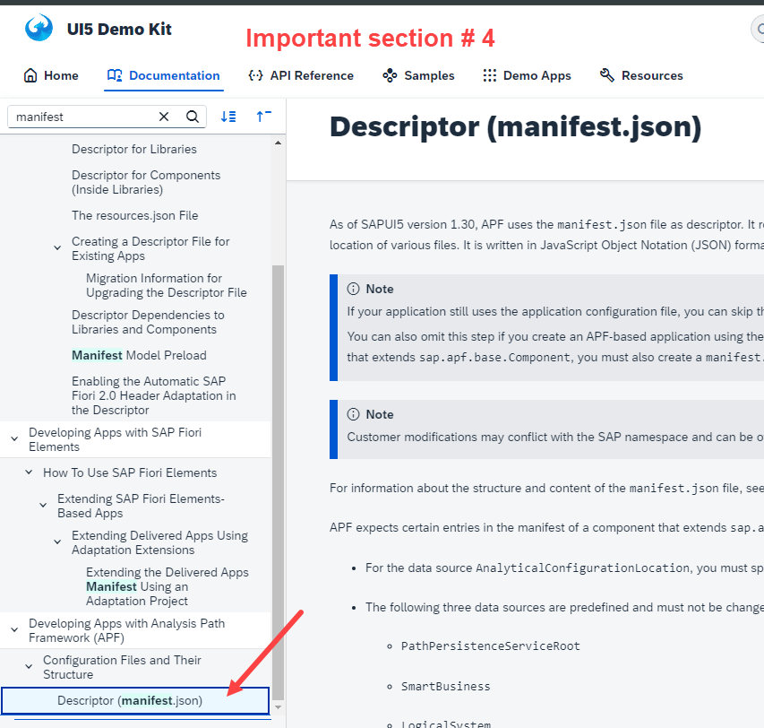
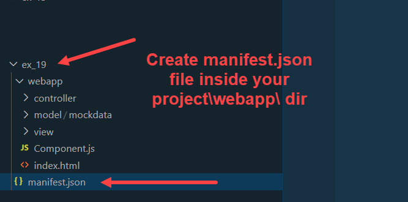
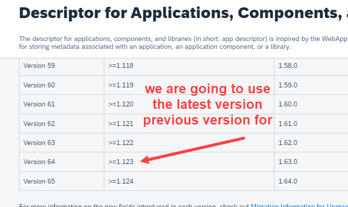
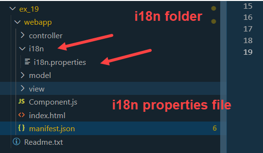
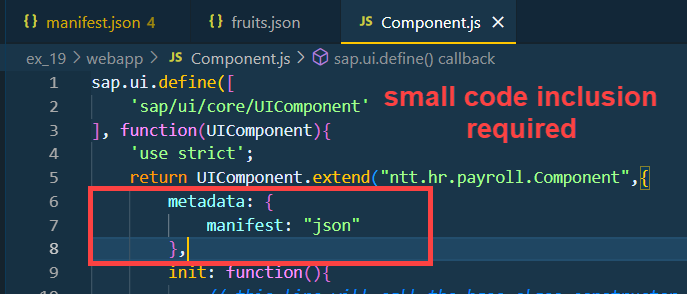
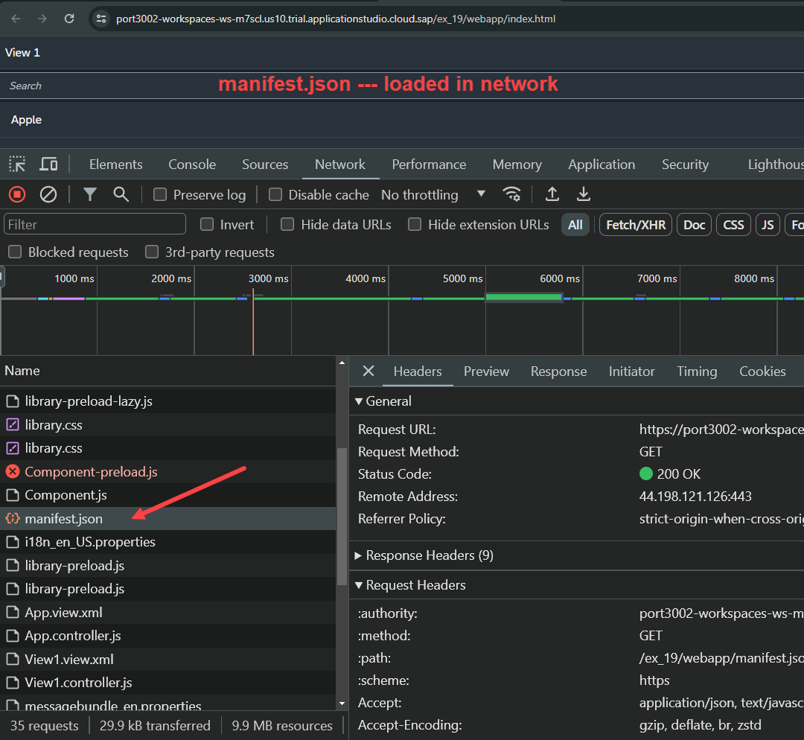
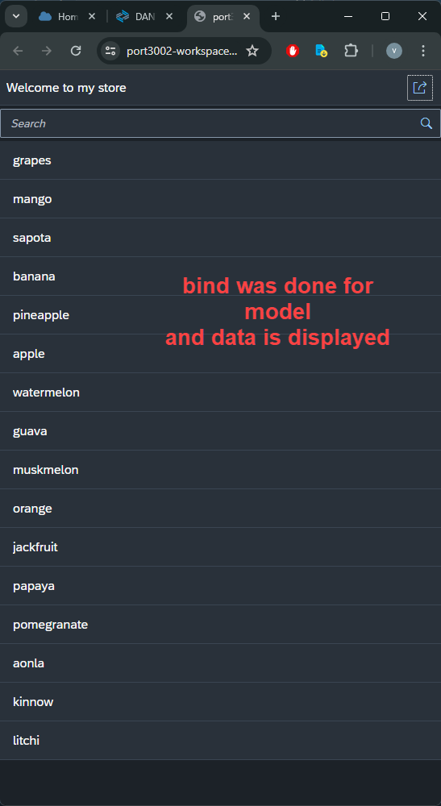

## Exercise 19 - Manifest JSON

</br></br>

Why manifest.Json. 

- Recently a colleague who was developing ui5 application left the organization 
   No one knows what was done by the colleague working on the project, 
   we as a developer need to take responsibility to maintain the same now.

- Each developer think with their own mindset and have different thought process of implementing apps.
   this will lead to inconsistent development spread across multiple files.

- Once upon a time I was sitting on a beach and enjoying my vacation suddenly my phone rings, Guess what...
   its your manager. The question comes "Before your vacation"  you did on development last week, 
   now I am sitting with one of the colleague and we have a customer issue, we need you to come and connect. 

- If we make best-practices, standard and follow all across, w/o exchange of a word, we all can still understand each others code.

- When SAP delivers their apps to us, do we get all cell no of developer from SAP to call then add ask to explain the code of the app.

*Manifest.json* or application descriptor file, always called by *Component.js* and is used for describing all the properties of our application.
it is the best-practice and declarative way of defining UI5 apps. The Ui5 framework read this file and auto generate/produce results.

</br></br>

**Capabilities**

- Creating the model

- Contains the information about our app like Id, name, version

- Inform the developer about the minimum Ui5 version required to run your app, what themes are supported 

- What different components are reusable 

- What are all the dependencies of this app on other apps

- *Contains complete end to end Navigation between different view at central place* - *Routing*

- *Contains code to instantiate all the views as and when they are required* - *Router*

- If we work with Fiori elements (ready to use templates provided by SAP) to auto generate app, t
   he most of code will be also generated inside the Manifest.json

-  For extending Fiori app, this file plays a critical role

- The file compose of 3 main sections
    1. sap.ui
    2. sap.ui5
    3. sap.app

*Skeleton of manifest you can learn about the structure from SAP Ui5 SDK*

</br>

<details>
<summary> Things to check in SAP Ui5 SDK </summary>
</br>
</br>

</br>

</br>

</br>

</br>
</br>
</details>

</br> </br>

<!-- *We Need to learn how to learn* 
*Focus on concepts not on examples*
*Focus on fundamentals*
*How framework works what are all designed, what are all best practices* -->

</br> 

**Create Manifest.json file** 



</br> 



</br> </br> 

*manifest.json* file

```json

{

    "_version": "1.123",
    "sap.app": {
        "id": "ntt.hr.payroll",
        "description": "{{APP_TITLE}}", 
        "applicationVersion": "1.0.0",
        "type":"application",
        "title": "{{APP_DESCRIPTION}}",
        "i18n": "i18n/i18n.properties"
    },

    "sap.ui": {
        "technology":"ui5",
        "icons": {
            "icon": "sap-icon://home"
        },
        "deviceTypes": {
                    "desktop": true,
                    "tablet": true,
                    "phone": true
        }
    },
    "sap.ui5": {
        "dependencies": {
            "minUI5Version": "1.123",
            "libs": {
                "sap.m": {},
                "sap.ui.table": {}
            }
        },
        "library": {
            "i18n":true,
            "css":"css/mystyle.css"
        }
    }
}

```

</br> </br> 



</br> </br> 

**Create i18n folder and create i18n.properties file and add the details**

```i18n

APP_TITLE="My First Fiori App"
APP_DESCRIPTION="Developed by Vivian Octavius for learning"

```

</br>  



</br> 

*Component.js*

```js

// above init function
        metadata: {
            manifest: "json"
        },

```

</br> 

**Testing by running the application**

</br> 



</br> 

```json

{
    "_version": "1.123",
    "sap.app": {
        "id": "ntt.hr.payroll",
        "description": "{{APP_TITLE}}",
        "applicationVersion": "1.0.0",
        "type": "application",
        "title": "{{APP_DESCRIPTION}}",
        "i18n": "i18n/i18n.properties"
    },
    "sap.ui": {
        "technology": "UI5",
        "icons": {
            "icon": "sap-icon://home"
        },
        "deviceTypes": {
            "desktop": true,
            "tablet": true,
            "phone": true
        }
    },
    "sap.ui5": {
        "dependencies": {
            "minUI5Version": "1.123",
            "libs": {
                "sap.m": {},
                "sap.ui.table": {}
            }
        },
        "contentDensities": {
            "compact": true,
            "cozy": true
        },
        "library": {
            "css": "css/mystyle.css"
        },
        "models": {
            "i18n": {
                "type": "sap.ui.model.resource.ResourceModel",
                "uri": "i18n/i18n.properties"
            },
            "": {   // model with no name is the default model
                "type": "sap.ui.model.json.JSONModel",
                "uri": "model/mockdata/fruits.json"
            }
        }
    }
}


```
</br></br>

changes in *View1.view.xml* -- *commented codes are removed here can find it in zip file code backups*

```xml

<mvc:View xmlns:mvc="sap.ui.core.mvc" xmlns="sap.m" 
controllerName="ntt.hr.payroll.controller.View1">
    <Page title="{i18n>XTIT_VIEW1}">
        <headerContent>
            <Button  icon="sap-icon://action" press="onNext"></Button>
        </headerContent>
        <content> <!--this is a default property since headerContent is used this should be mandatorily used-->
            <SearchField id="idsf1"></SearchField>
            <List id="idList" items="{/fruits}">
             <items>
                <DisplayListItem label="{name}"></DisplayListItem>       
            </items>
            </List>
        </content>
    </Page>
</mvc:View>

```

</br>

**Testing**

</br>



</br>


</br>
</br></br>

## End of Exercise 19 ---NEXT---> <a href="https://github.com/Octavius-Dante/Arthelais/tree/main/ex_20"> Exercise 20-Filters on List model </a>
</br>
<p align="center"> <a href="https://github.com/Octavius-Dante/Arthelais/tree/main"> Main page </a> </p>


</br></br>

**All Previous sessions**
</br></br>
<!-- 
- [x] <a href="https://github.com/Octavius-Dante/Arthelais/tree/main/ex_37"> Exercise 37-Deploy app to launchpad</a>
- [x] <a href="https://github.com/Octavius-Dante/Arthelais/tree/main/ex_36"> Exercise 36-WebIde and Git integration</a>
- [x] <a href="https://github.com/Octavius-Dante/Arthelais/tree/main/ex_35"> Exercise 35-POST, GET and DELETE from Fiori</a>
- [x] <a href="https://github.com/Octavius-Dante/Arthelais/tree/main/ex_34"> Exercise 34-GET and Connect</a>
- [x] <a href="https://github.com/Octavius-Dante/Arthelais/tree/main/ex_33"> Exercise 33-Fiori Project Connect OData</a>
- [x] <a href="https://github.com/Octavius-Dante/Arthelais/tree/main/ex_32"> Exercise 32-Connectivity</a>
- [x] <a href="https://github.com/Octavius-Dante/Arthelais/tree/main/ex_31"> Exercise 31-Function Import and Images</a>
- [x] <a href="https://github.com/Octavius-Dante/Arthelais/tree/main/ex_30"> Exercise 30-implementing CRUD</a>
- [x] <a href="https://github.com/Octavius-Dante/Arthelais/tree/main/ex_29"> Exercise 29-Implementing GET</a>
- [x] <a href="https://github.com/Octavius-Dante/Arthelais/tree/main/ex_28"> Exercise 28-Create A Gateway Project</a>
- [x] <a href="https://github.com/Octavius-Dante/Arthelais/tree/main/ex_27"> Exercise 27-Odata GET</a>
- [x] <a href="https://github.com/Octavius-Dante/Arthelais/tree/main/ex_26"> Exercise 26-Fiori Deployments</a>
- [x] <a href="https://github.com/Octavius-Dante/Arthelais/tree/main/ex_25"> Exercise 25-Fragments Deep dive</a>
- [x] <a href="https://github.com/Octavius-Dante/Arthelais/tree/main/ex_24"> Exercise 24-Fragments</a>
- [x] <a href="https://github.com/Octavius-Dante/Arthelais/tree/main/ex_23"> Exercise 23-Icon Tab bar</a>
- [x] <a href="https://github.com/Octavius-Dante/Arthelais/tree/main/ex_22"> Exercise 22-Route matched Handlers</a>
- [x] <a href="https://github.com/Octavius-Dante/Arthelais/tree/main/ex_21"> Exercise 21-Router Basics</a>
- [x] <a href="https://github.com/Octavius-Dante/Arthelais/tree/main/ex_20"> Exercise 20-Filters on List mode</a>
- [x] <a href="https://github.com/Octavius-Dante/Arthelais/tree/main/ex_19"> Exercise 19-Manifest JSON</a> -->
- [x] <a href="https://github.com/Octavius-Dante/Arthelais/tree/main/ex_18"> Exercise 18-List Control</a>
- [x] <a href="https://github.com/Octavius-Dante/Arthelais/tree/main/ex_17"> Exercise 17-Fiori Lite app</a>
- [x] <a href="https://github.com/Octavius-Dante/Arthelais/tree/main/ex_16"> Exercise 16-Formatters </a>
- [x] <a href="https://github.com/Octavius-Dante/Arthelais/tree/main/ex_15"> Exercise 15-Element Binding</a>
- [x] <a href="https://github.com/Octavius-Dante/Arthelais/tree/main/ex_14"> Exercise 14-Table control</a>
- [x] <a href="https://github.com/Octavius-Dante/Arthelais/tree/main/ex_13"> Exercise 13-Expression Binding XML Model</a>
- [x] <a href="https://github.com/Octavius-Dante/Arthelais/tree/main/ex_12"> Exercise 12-Json Model Property Binding</a>
- [x] <a href="https://github.com/Octavius-Dante/Arthelais/tree/main/ex_11"> Exercise 11-Model Basics </a>
- [x] <a href="https://github.com/Octavius-Dante/Arthelais/tree/main/ex_10"> Exercise 10-XML Views </a>
- [x] <a href="https://github.com/Octavius-Dante/Arthelais/tree/main/ex_9"> Exercise 9-Control Hierarchy 2</a>
- [x] <a href="https://github.com/Octavius-Dante/Arthelais/tree/main/ex_8"> Exercise 8-Ui5 Control Hierarchy </a>
- [x] <a href="https://github.com/Octavius-Dante/Arthelais/tree/main/ex_7"> Exercise 7-SAP Ui5 Framework </a>
- [x] <a href="https://github.com/Octavius-Dante/Arthelais/tree/main/ex_6"> Exercise 6-JQuery </a>
- [x] <a href="https://github.com/Octavius-Dante/Arthelais/tree/main/ex_5"> Exercise 5-JS deep dive </a>
- [x] <a href="https://github.com/Octavius-Dante/Arthelais/tree/main/ex_4"> Exercise 4-JS basic </a>
- [x] <a href="https://github.com/Octavius-Dante/Arthelais/tree/main/ex_3"> Exercise 3-CSS </a>
- [x] <a href="https://github.com/Octavius-Dante/Arthelais/tree/main/ex_2"> Exercise 2-HTML5</a>
- [x] <a href="https://github.com/Octavius-Dante/Arthelais/tree/main/ex_1"> Exercise 1 -Basic </a>


<!--

<details>
<summary> <b> ALL CODE CHANGES - TODAY SESSION </b> </summary>
</br>
</br>

</br>
</br>

</br>
</br>
</details>

-->