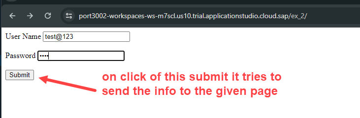
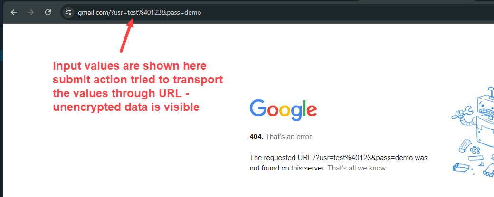
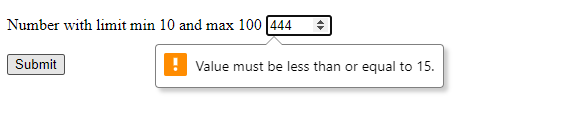
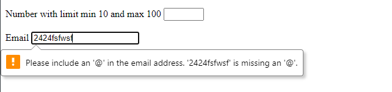
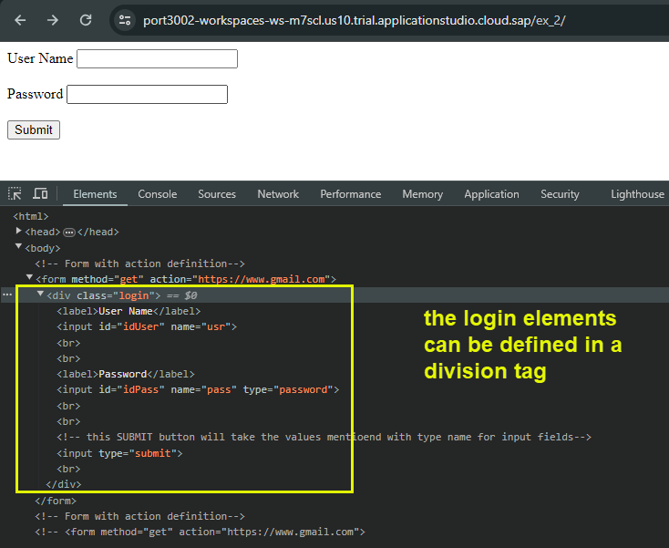
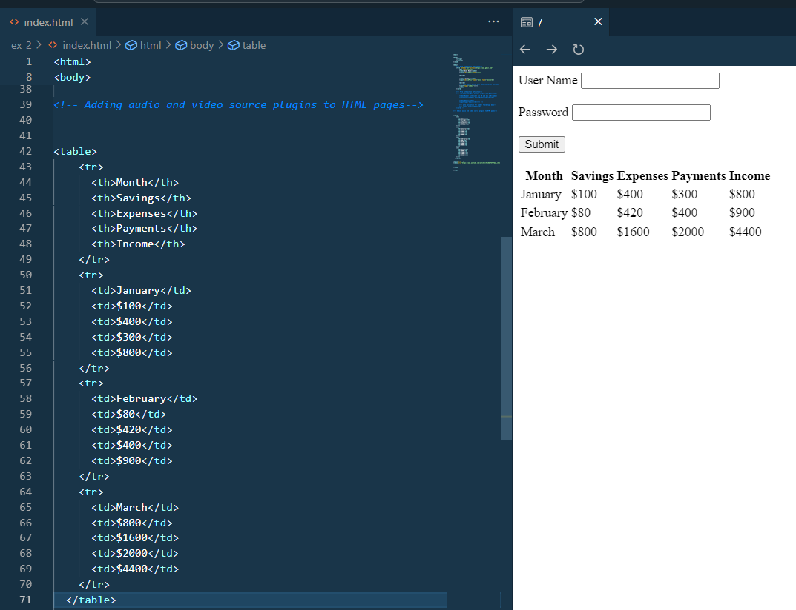

## Exercise 2 - HTML5 basic 2

In this session we discuss about request and responses from web pages to server and server to webpages

</br></br>

Requests which can be sent to server to perform an action or retrieve data **Request has header and body**
</br></br>

Response is a reply from server for a request from client it has header and body and it could be of any data type 
</br> **(html, xml, json, excel, pdf, word..etc)**

</br>

**Request types :**

1. GET - read data
2. POST - Create new data
3. PUT - Update
4. DELETE - Remove data

</br>

**What are the Ways to talk to server from client ?**

1. Form Submit **(simplest and easiest one)**
2. Using HTTPRequest object
3. Using AJAX Call
4. Some framework

</br>

<details>
<summary> Defining form with Submit action login </summary>
</br>
</br>

```html

<html>
<head>
    <script>
    </script>
</head>
<body>
    <!-- Form with action definition-->
    <form method="get" action="https://www.gmail.com">

        <label>User Name</label>
        <input id="idUser" name="usr">

        <br><br>

        <label>Password</label>
        <input id="idPass" name="pass" type="password">

        <br><br>
        <!-- this SUBMIT button will take the values mentioend with type name for input fields-->
        <input type="submit"><br>
    </form>
</body>
</html>

```

</br></br>

testing it 



</br>
</br>
</details>

<details>
<summary> Submit button auto validation for a field type </summary>
</br>
</br>

```html

<html>
<head>
    <script>
    </script>
</head>
<body>

    <!-- Form with action definition-->
    <form method="get" action="https://www.gmail.com">
      <div class="login">

        <label>Number with limit min 10 and max 100</label>
        <input type="number" min="10" max="15"><br><br>

        <label>Email</label>
        <input type="email"><br><br>

        <!-- auto validation for number field type demo-->
        <input type="submit"><br>
      </div>    
    </form>

</body>
</html>

```



</br>
</br>
</details>


<details>
<summary> Block level elements Div and Span </summary>
</br>
</br>

**Div** :
</br>
The div is division tag used as a container for HTML elements used for grouping </br>
which is then styled with CSS or manipulated with JavaScript. </br>
it is a good practice to provide **class** (classification) property for every div element for grouping purpose

```html
<div>
```

</br> 

**Span** :
</br>
The span is a inline element tag , it never starts from a new line, always keeps it in same line

```html
<span>
```
</br></br>


```html

<html>
<head>
    <script>
    </script>
</head>
<body>

    <!-- Form with action definition-->
    <form method="get" action="https://www.gmail.com">
      <div class="login">

        <label>User Name</label>
        <input id="idUser" name="usr">

        <br><br>

        <label>Password</label>
        <input id="idPass" name="pass" type="password">

        <!-- auto validation for number field type demo-->
        <input type="submit"><br>
      </div>    
    </form>

</body>
</html>

```



</br>
</br>
</details>

<details>
<summary> Table, Rows and columns </summary>
</br>
</br>

```html

<html>

<head>
    <script>
    </script>
</head>

<body>

<table>
    <tr>
      <th>Month</th>
      <th>Savings</th>
      <th>Expenses</th>
      <th>Payments</th>
      <th>Income</th>
    </tr>
    <tr>
      <td>January</td>
      <td>$100</td>
      <td>$400</td>
      <td>$300</td>
      <td>$800</td>
    </tr>
    <tr>
      <td>February</td>
      <td>$80</td>
      <td>$420</td>
      <td>$400</td>
      <td>$900</td>    
    </tr>
    <tr>
      <td>March</td>
      <td>$800</td>
      <td>$1600</td>
      <td>$2000</td>
      <td>$4400</td>    
    </tr>  
  </table>


</body>

</html>

```

</br>
</br>

</br>
</br>
</details>


<details>
<summary> Defining iframe tag with layout parameters</summary>
</br>
</br>

```html

<html>
<head>
    <script>
    </script>
</head>
<body>

<iframe src ="https://www.youtube.com/" width="1350" height="900"></iframe>

<iframe width="1280" height="720" src="https://www.youtube.com/embed/aniRVWQ0WgM" title="Making of - A Plague Tale: Innocence [Behind the Scenes]" frameborder="0" allow="accelerometer; autoplay; clipboard-write; encrypted-media; gyroscope; picture-in-picture; web-share" referrerpolicy="strict-origin-when-cross-origin" allowfullscreen></iframe>


</body>

</html>

```

</br>
</br>
</details>


</br></br>
</br></br>
</br></br>

## End of Exercise 2 ---NEXT---> <a href="https://github.com/Octavius-Dante/Arthelais/tree/main/ex_3"> Exercise 3-CSS </a>
</br>
<p align="center"> <a href="https://github.com/Octavius-Dante/Arthelais/tree/main"> Main page </a> </p>


<!--

<details>
<summary> <b> ALL CODE CHANGES - TODAY SESSION </b> </summary>
</br>
</br>

</br>
</br>

</br>
</br>
</details>

-->