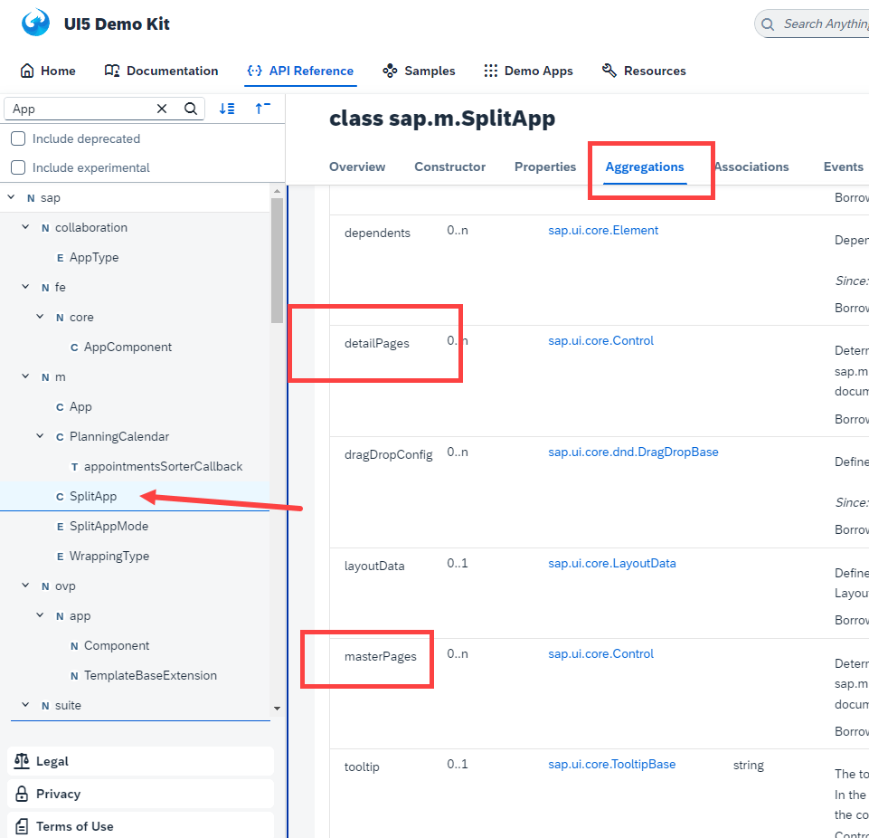

## Exercise 20 - Filters on List model

</br></br>

**Implementing object list item and item search**

SAP provides *Filter on list model for implementing search*

</br>


</br>

- A Filtering items based on condition 

- condition contains (operand 1, operator and operand 2)

- operadn-1 operator operand-2 ( fruits = apple) 

- Operators - [ = , >=, <=, <>, contains]


</br>


**Go to sap ui5 SDK** 

</br>


</br>


</br>


*View1.view.xml*

```xml

<mvc:View xmlns:mvc="sap.ui.core.mvc" xmlns="sap.m" 
controllerName="ntt.hr.payroll.controller.View1">
    <Page title="{i18n>XTIT_VIEW1}">
        <headerContent>
            <Button  icon="sap-icon://action" press="onNext"></Button>
        </headerContent>
        <content> 
            <SearchField id="idsf1" search="onSearch"></SearchField> <!-- On search function -->
            <List id="idList" items="{/fruits}">
             <items>
                <ObjectListItem intro="{taste}" title="{name}"  
                number="{price}" numberUnit="{curr}" 
                icon="{image}">
                </ObjectListItem>
                    <firstStatus>
                        <ObjectStatus text="Available" state="Success"></ObjectStatus>
                    </firstStatus>
              </items>
            </List>
        </content>
    </Page>
</mvc:View>

```

</br>


<details>
<summary> Search implementation understanding through SDK DOCS </summary>
</br>
</br>

</br>

</br>
</br>
</details>

</br>

*View1.controller.js*

```js

sap.ui.define([
    'sap/ui/core/mvc/Controller',
    'sap/ui/model/Filter',
    'sap/ui/model/FilterOperator'
], function(Controller, Filter, FilterOperator){
    'use strict';
    return Controller.extend("ntt.hr.payroll.controller.View1",{
        onInit: function(){
        },

        onNext: function(){
            // Step 1 : get the parent control object - Container for our view 
            var oAppCon = this.getView().getParent();
            // Step 2 : ask parent to nav to next view 
            oAppCon.to("idView2");
        },
        
        onItemClick: function(){
            // this - is my current class object - which is our controller
            this.onNext();
        },

        onSearch: function(oEvent){
            // Step 1 : What is teh user type in search field
            var sSearch = oEvent.getParameter("query");            
            
            // Step 2 : Construct a Filter object with operand and operator
            var oFilter = new Filter("name", FilterOperator.contains, sSearch);
            var aFilter = [oFilter];
            
            // Step 3 : get the list object 
            var oList = this.getVIew().byId("idList");
            
            // Step 4 : inject the filter to the list 
            oList.getBinding("item").filter(aFilter);            
        }
    });
});

```

</br>

**Testing**

</br>


</br></br>

*Multiple search condition implemented in search filter*
<br> *earlier we used only name now we included taste also in the search*

```js

sap.ui.define([
    'sap/ui/core/mvc/Controller',
    'sap/ui/model/Filter',
    'sap/ui/model/FilterOperator'
], function(Controller, Filter, FilterOperator){
    'use strict';
    return Controller.extend("ntt.hr.payroll.controller.View1",{
        onInit: function(){
        },

        onNext: function(){
            // Step 1 : get the parent control object - Container for our view 
            var oAppCon = this.getView().getParent();
            // Step 2 : ask parent to nav to next view 
            oAppCon.to("idView2");
        },
        
        onItemClick: function(){
            // this - is my current class object - which is our controller
            this.onNext();
        },

        onSearch: function(oEvent){
            // Step 1 : What is teh user type in search field
            var sSearch = oEvent.getParameter("query");            
            
            // Step 2 : Construct a Filter object with operand and operator
            var oFilter = new Filter("name", FilterOperator.Contains, sSearch);
            var oFilter2 = new Filter("taste", FilterOperator.Contains, sSearch); // implementing search parameter 2 
            var aFilter = [oFilter, oFilter2];
            var oMaster = new Filter({
                filters: aFilter,
                and: false // when AND = FALSE that means -search filter is defiend with- OR = TRUE
            })
            
            // Step 3 : get the list object 
            var oList = this.getView().byId("idList");
            
            // Step 4 : inject the filter to the list 
            oList.getBinding("items").filter(oMaster); // New multi condition search paramter 
            
        }
    });
});

```

</br>

**Testing**

</br>


</br></br>

**Sorting of list items**

*will implement sort for the displayed list items in the page refer SDK for details as shown below*


</br>

```xml


<mvc:View xmlns:mvc="sap.ui.core.mvc" xmlns="sap.m" 
controllerName="ntt.hr.payroll.controller.View1">
    <Page title="{i18n>XTIT_VIEW1}">
        <headerContent>
            <Button  icon="sap-icon://action" press="onNext"></Button>
        </headerContent>
        <content> 
            <SearchField id="idsf1" search="onSearch"></SearchField> <!-- On search function -->
            <List id="idList" items="{
                path: '/fruits',
                sorter: {
                    path : 'name'
                  }
                }">
             <items>
                <ObjectListItem intro="{taste}" title="{name}"  
                number="{price}" numberUnit="{curr}" 
                icon="{image}">
                </ObjectListItem>
                    <firstStatus>
                        <ObjectStatus text="Available" state="Success"></ObjectStatus>
                    </firstStatus>
              </items>
            </List>
        </content>
    </Page>
</mvc:View>


```
</br>

**Now We add Navigation to the list items**

</br>

```xml

    <ObjectListItem type='Navigation' intro="{taste}" title="{name}"  
    number="{price}" numberUnit="{curr}" 
    icon="{image}">
    </ObjectListItem>

```

**Testing**

</br>


</br></br>


**Implementing Navigation**

```xml

    <List id="idList" itemPress="onNavNext" items="{
        path: '/fruits',
        sorter: {
            path : 'name'
        }
    }">

```

</br>

```js

    onNavNext: function(oEvent){
        this.onNext();
    }

```

</br>

**Now we try different list modes**

*Single Select Mode*

</br>

```xml

    <List id="idList" mode="SingleSelect" itemPress="onNavNext" items="{
        path: '/fruits',
        sorter: {
            path : 'name'
        }
    }">

```

</br>

**Testing**

</br>


</br>

*Single Select Left side - Mode*

```xml

    <List id="idList" mode="SingleSelectLeft" itemPress="onNavNext" items="{
        path: '/fruits',
        sorter: {
            path : 'name'
        }
    }">

```

</br>

**Testing**

</br>


</br>

*Multi Select Mode*

```xml

    <List id="idList" mode="MultiSelect" itemPress="onNavNext" items="{
        path: '/fruits',
        sorter: {
            path : 'name'
        }
    }">

```

</br>

**Testing**

</br>


</br>

*Delete Mode*

```xml

    <List id="idList" mode="Delete" delete="onDelete" itemPress="onNavNext" items="{
        path: '/fruits',
        sorter: {
            path : 'name'
        }
    }">

```

</br>

**Testing**

</br>


</br>

*Implementing delete*

</br>


</br>

```js

    onDelete: function(oEvent){
        // Step 1 : Find out which item was selected for deletion
        var oSelected = oEvent.getParameter("listItem");
        // Step 2 : Get the model object
        var oList = oEvent.getSource();
        // Step 3 : Remove the item from the list 
        oList.removeItem(oSelected);
    }


```

The page we are using is called object work list page 
<br> this has another important design principle.


</br></br>


## Fiori design 

</br>

**SAP Fiori Worklist**

*Where the first screen is added as a List control with search and when we navigate to the screen, we see the details.* 
</br> *This is called Worklist Fiori App.*

</br>

**Master-Detail Fiori App**

</br>

</br>

*When we want to use screen width optimally, we can use master-details Fiori app.*
</br> *in this case the screen will be split into 2 parts*

- So far we used *App container control* now we are going to use *Split app container control*


*SAP Ui5 SDK page*

</br>

</br>


*App.view.xml*

```xml

<mvc:View xmlns:mvc="sap.ui.core.mvc" xmlns="sap.m" 
controllerName="ntt.hr.payroll.controller.App">

<!-- Defining Split app container control - it contains other views 

> This container control will be parent for other views 
> There are different types of container control

    ~ now we are using type : Split App container control
-->

<SplitApp id="appCon" />

<!-- <App id="appCon" /> -->

</mvc:View>


```


</br></br>
</br></br>

## End of Exercise 20 ---NEXT---> <a href="https://github.com/Octavius-Dante/Arthelais/tree/main/ex_21"> Exercise 21-Router Basics </a>
</br>
<p align="center"> <a href="https://github.com/Octavius-Dante/Arthelais/tree/main"> Main page </a> </p>


</br></br>

**All Previous sessions**
</br></br>

<!-- - [x] <a href="https://github.com/Octavius-Dante/Arthelais/tree/main/ex_37"> Exercise 37-Deploy app to launchpad</a>
- [x] <a href="https://github.com/Octavius-Dante/Arthelais/tree/main/ex_36"> Exercise 36-WebIde and Git integration</a>
- [x] <a href="https://github.com/Octavius-Dante/Arthelais/tree/main/ex_35"> Exercise 35-POST, GET and DELETE from Fiori</a>
- [x] <a href="https://github.com/Octavius-Dante/Arthelais/tree/main/ex_34"> Exercise 34-GET and Connect</a>
- [x] <a href="https://github.com/Octavius-Dante/Arthelais/tree/main/ex_33"> Exercise 33-Fiori Project Connect Odata</a>
- [x] <a href="https://github.com/Octavius-Dante/Arthelais/tree/main/ex_32"> Exercise 32-Connectivity</a>
- [x] <a href="https://github.com/Octavius-Dante/Arthelais/tree/main/ex_31"> Exercise 31-Function Import and Images</a>
- [x] <a href="https://github.com/Octavius-Dante/Arthelais/tree/main/ex_30"> Exercise 30-implementing CRUD</a>
- [x] <a href="https://github.com/Octavius-Dante/Arthelais/tree/main/ex_29"> Exercise 29-Implementing GET</a>
- [x] <a href="https://github.com/Octavius-Dante/Arthelais/tree/main/ex_28"> Exercise 28-Create A Gateway Project</a>
- [x] <a href="https://github.com/Octavius-Dante/Arthelais/tree/main/ex_27"> Exercise 27-Odata GET</a>
- [x] <a href="https://github.com/Octavius-Dante/Arthelais/tree/main/ex_26"> Exercise 26-Fiori Deployments</a>
- [x] <a href="https://github.com/Octavius-Dante/Arthelais/tree/main/ex_25"> Exercise 25-Fragments Deep dive</a>
- [x] <a href="https://github.com/Octavius-Dante/Arthelais/tree/main/ex_24"> Exercise 24-Fragments</a>
- [x] <a href="https://github.com/Octavius-Dante/Arthelais/tree/main/ex_23"> Exercise 23-Icon Tab bar</a>
- [x] <a href="https://github.com/Octavius-Dante/Arthelais/tree/main/ex_22"> Exercise 22-Route matched Handlers</a>
- [x] <a href="https://github.com/Octavius-Dante/Arthelais/tree/main/ex_21"> Exercise 21-Router Basics</a>
- [x] <a href="https://github.com/Octavius-Dante/Arthelais/tree/main/ex_20"> Exercise 20-Filters on List mode</a> -->
- [x] <a href="https://github.com/Octavius-Dante/Arthelais/tree/main/ex_19"> Exercise 19-Manifest JSON</a>
- [x] <a href="https://github.com/Octavius-Dante/Arthelais/tree/main/ex_18"> Exercise 18-List Control</a>
- [x] <a href="https://github.com/Octavius-Dante/Arthelais/tree/main/ex_17"> Exercise 17-Fiori Lite app</a>
- [x] <a href="https://github.com/Octavius-Dante/Arthelais/tree/main/ex_16"> Exercise 16-Formatters </a>
- [x] <a href="https://github.com/Octavius-Dante/Arthelais/tree/main/ex_15"> Exercise 15-Element Binding</a>
- [x] <a href="https://github.com/Octavius-Dante/Arthelais/tree/main/ex_14"> Exercise 14-Table control</a>
- [x] <a href="https://github.com/Octavius-Dante/Arthelais/tree/main/ex_13"> Exercise 13-Expression Binding XML Model</a>
- [x] <a href="https://github.com/Octavius-Dante/Arthelais/tree/main/ex_12"> Exercise 12-Json Model Property Binding</a>
- [x] <a href="https://github.com/Octavius-Dante/Arthelais/tree/main/ex_11"> Exercise 11-Model Basics </a>
- [x] <a href="https://github.com/Octavius-Dante/Arthelais/tree/main/ex_10"> Exercise 10-XML Views </a>
- [x] <a href="https://github.com/Octavius-Dante/Arthelais/tree/main/ex_9"> Exercise 9-Control Hierarchy 2</a>
- [x] <a href="https://github.com/Octavius-Dante/Arthelais/tree/main/ex_8"> Exercise 8-Ui5 Control Hierarchy </a>
- [x] <a href="https://github.com/Octavius-Dante/Arthelais/tree/main/ex_7"> Exercise 7-SAP Ui5 Framework </a>
- [x] <a href="https://github.com/Octavius-Dante/Arthelais/tree/main/ex_6"> Exercise 6-JQuery </a>
- [x] <a href="https://github.com/Octavius-Dante/Arthelais/tree/main/ex_5"> Exercise 5-JS deep dive </a>
- [x] <a href="https://github.com/Octavius-Dante/Arthelais/tree/main/ex_4"> Exercise 4-JS basic </a>
- [x] <a href="https://github.com/Octavius-Dante/Arthelais/tree/main/ex_3"> Exercise 3-CSS </a>
- [x] <a href="https://github.com/Octavius-Dante/Arthelais/tree/main/ex_2"> Exercise 2-HTML5</a>
- [x] <a href="https://github.com/Octavius-Dante/Arthelais/tree/main/ex_1"> Exercise 1 -Basic </a>


<!--

<details>
<summary> <b> ALL CODE CHANGES - TODAY SESSION </b> </summary>
</br>
</br>

</br>
</br>

</br>
</br>
</details>

-->
