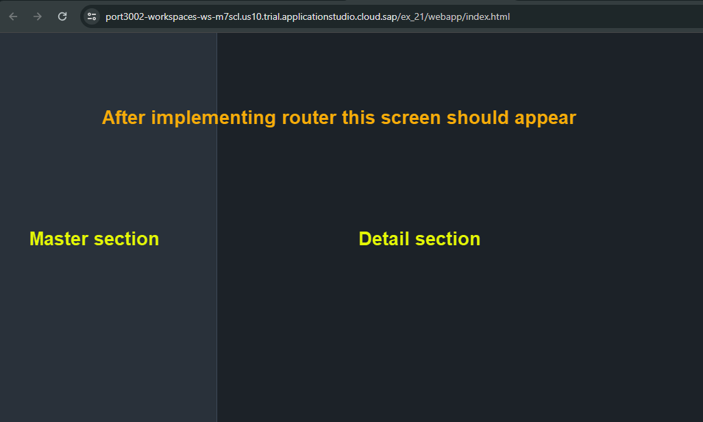
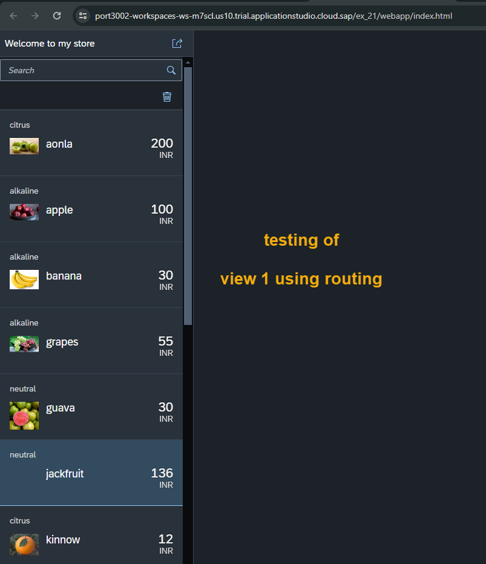

## Exercise 21 - Router Basics

</br>

1. We have used sap.ui.view to create view object but in SDK page it is shown that it is deprecated, why we use it?

2. What is the best practice and place where we put our view instantiation code?

3. We are creating all our view object when app starts, what if user wont even go to that view in the navigation, 
   this way still we created view object and wasted memory. How can we optimize that ?

4. We have implemented navigation using parent container control but it sometimes very tricky to parent control object.

5. How as a developer i can check my colleagues code and understand overall application structure and navigation 
   without talking to another developers.

</br>

**Router is the solution to all the above problems**    

</br></br>

**More Question**

1 . The Browser navigation buttons are not working as expected.

2. If refresh happens, we should be able to restore the last stable of the application for the user so user don't 
    need to spend time and effort of navigation between screens again.

3. The user take the URL and share the same with colleagues/Friends/family, It should load the same state what we see on the page.
    This is only possible in real world when every page is marked as unique end point.

</br></br>

## Steps to Implement router

1. We need to provide router configuration in our *manifest.json* file 

2. We need the object of the router *UIComponent class has router method - gerRouter*

3. Initialize router using initialize method - it will check *manifest.json* and scan the routing config, by reading it, 
   it will do the creation of view objects as well as navigation will be also taken care.

4.    


</br></br>


*manifest.json* --- *only the router code snip*

**Explanation :**

- *rootView* contains the details of the AppView the first view of the app, the app container
- *routing* contains the path of other views 

</br>

*This piece of code definition should come under (SAP ui5 section)*

```json

        "rootView":{
            "id": "idAppView",
            "type": "XML",
            "viewName": "ntt.hr.payroll.view.App"
        },
        "routing": {
            "config":{
                "viewPath": "ntt.hr.payroll.view",
                "viewType": "XML",
                "controlId": "appCon"
            },
            "routes":[],
            "targets": {}
        },


```

</br>

*manifest.json* --- *Full code* -- *Routing*

```json

{
    "_version": "1.123",
    "sap.app": {
        "id": "ntt.hr.payroll",
        "description": "{{APP_TITLE}}",
        "applicationVersion": "1.0.0",
        "type": "application",
        "title": "{{APP_DESCRIPTION}}",
        "i18n": "i18n/i18n.properties"
    },
    "sap.ui": {
        "technology": "UI5",
        "icons": {
            "icon": "sap-icon://home"
        },
        "deviceTypes": {
            "desktop": true,
            "tablet": true,
            "phone": true
        }
    },
    "sap.ui5": {
        "dependencies": {
            "minUI5Version": "1.123",
            "libs": {
                "sap.m": {},
                "sap.ui.table": {}
            }
        },
        "rootView":{
            "id": "idAppView",
            "type": "XML",
            "viewName": "ntt.hr.payroll.view.App"
        },
        "routing": {
            "config":{
                "viewPath": "ntt.hr.payroll.view",
                "viewType": "XML",
                "controlId": "appCon"
            },
            "routes":[],
            "targets": {}
        },

        "contentDensities": {
            "compact": true,
            "cozy": true
        },
        "library": {
            "css": "css/mystyle.css"
        },
        "models": {
            "i18n": {
                "type": "sap.ui.model.resource.ResourceModel",
                "uri": "i18n/i18n.properties"
            },
            "": {
                "type": "sap.ui.model.json.JSONModel",
                "uri": "model/mockdata/fruits.json"
            }
        }
    }
}


```

</br>

**Major alterations to component.js**

- commented the old view code - because we configured router in *manifest.json*

- then initialized router object in *component.js*

</br>

*Component.js*

```js

sap.ui.define([
    'sap/ui/core/UIComponent'
], function (UIComponent) {
    'use strict';
    return UIComponent.extend("ntt.hr.payroll.Component", {
        metadata: {
            manifest: "json"
        },
        init: function () {
            // this line will call the base class constructor
            UIComponent.prototype.init.apply(this);

            // implement router 
            //////////////////////////////////////////
            // Step 1: Inside the manifest.json file add - rootView, routing sections- DONE 
            // Step 2: Get the router object 
            var oRouter = this.getRouter();
            // Step 3: Initialize the router 
            oRouter.initialize();

            //////////////////////////////////////////
        },
        // Routing - implementation in manifest.json following code is not needed
        /////////////////////////////////////////////////////////////////////////////////        
        // createContent: function(){
        //     var oView = sap.ui.view({
        //         viewName: "ntt.hr.payroll.view.App",
        //         id: "idAppView",
        //         type: "XML"
        //     });

        //     // Step 1 : Create View 1 object
        //     var oView1 = sap.ui.view({
        //         viewName: "ntt.hr.payroll.view.View1",
        //         id: "idView1",
        //         type: "XML"
        //     });

        //     // Step 2 : Create View 2 object
        //     var oView2 = sap.ui.view({
        //         viewName: "ntt.hr.payroll.view.View2",
        //         id: "idView2",
        //         type: "XML"
        //     });

        //     // Step 3 : Get the APP Container Control
        //     // this.getView().byId("idObject") -- We did this in previous session 
        //                                       // the same thing is referred differently 

        //     var oAppCon = oView.byId("appCon"); // appCon is from AppView - then we defined app container

        //     // Step 4 : Inject the View1 and View2 inside the container 
        //     // oAppCon.addPage(oView1).addPage(oView2);

        //     // Definign Split app pages -Ex-20
        //     oAppCon.addMasterPage(oView1).addDetailPage(oView2);
        //     return oView;
        // }
        /////////////////////////////////////////////////////////////////////////////////

    });
});

```

</br>

**Testing**



</br></br>

**Adding view1 and view 2 - adding the views**

*manifest.json* -- *View1 added*

```json

    "routing": {
        "config":{
            "viewPath": "ntt.hr.payroll.view",
            "viewType": "XML",
            "controlId": "appCon"
        },
        "routes":[{
            "name": "first",
            "target": "Facepage",
            "pattern": ""
        }],
        "targets": {
            "Facepage":{
                "viewName": "View1",
                "controlAggregation": "masterPages"
            }
        }
    },

```

</br>

**Testing**




</br></br>
</br></br>
</br></br>

## End of Exercise 21 ---NEXT---> <a href="https://github.com/Octavius-Dante/Arthelais/tree/main/ex_22"> Exercise 22-Route matched Handlers </a>
</br>
<p align="center"> <a href="https://github.com/Octavius-Dante/Arthelais/tree/main"> Main page </a> </p>


</br></br>

**All Previous sessions**
</br></br>

<!-- - [x] <a href="https://github.com/Octavius-Dante/Arthelais/tree/main/ex_37"> Exercise 37-Deploy app to launchpad</a>
- [x] <a href="https://github.com/Octavius-Dante/Arthelais/tree/main/ex_36"> Exercise 36-WebIde and Git integration</a>
- [x] <a href="https://github.com/Octavius-Dante/Arthelais/tree/main/ex_35"> Exercise 35-POST, GET and DELETE from Fiori</a>
- [x] <a href="https://github.com/Octavius-Dante/Arthelais/tree/main/ex_34"> Exercise 34-GET and Connect</a>
- [x] <a href="https://github.com/Octavius-Dante/Arthelais/tree/main/ex_33"> Exercise 33-Fiori Project Connect OData</a>
- [x] <a href="https://github.com/Octavius-Dante/Arthelais/tree/main/ex_32"> Exercise 32-Connectivity</a>
- [x] <a href="https://github.com/Octavius-Dante/Arthelais/tree/main/ex_31"> Exercise 31-Function Import and Images</a>
- [x] <a href="https://github.com/Octavius-Dante/Arthelais/tree/main/ex_30"> Exercise 30-implementing CRUD</a>
- [x] <a href="https://github.com/Octavius-Dante/Arthelais/tree/main/ex_29"> Exercise 29-Implementing GET</a>
- [x] <a href="https://github.com/Octavius-Dante/Arthelais/tree/main/ex_28"> Exercise 28-Create A Gateway Project</a>
- [x] <a href="https://github.com/Octavius-Dante/Arthelais/tree/main/ex_27"> Exercise 27-Odata GET</a>
- [x] <a href="https://github.com/Octavius-Dante/Arthelais/tree/main/ex_26"> Exercise 26-Fiori Deployments</a>
- [x] <a href="https://github.com/Octavius-Dante/Arthelais/tree/main/ex_25"> Exercise 25-Fragments Deep dive</a>
- [x] <a href="https://github.com/Octavius-Dante/Arthelais/tree/main/ex_24"> Exercise 24-Fragments</a>
- [x] <a href="https://github.com/Octavius-Dante/Arthelais/tree/main/ex_23"> Exercise 23-Icon Tab bar</a>
- [x] <a href="https://github.com/Octavius-Dante/Arthelais/tree/main/ex_22"> Exercise 22-Route matched Handlers</a>
- [x] <a href="https://github.com/Octavius-Dante/Arthelais/tree/main/ex_21"> Exercise 21-Router Basics</a> -->
- [x] <a href="https://github.com/Octavius-Dante/Arthelais/tree/main/ex_20"> Exercise 20-Filters on List mode</a>
- [x] <a href="https://github.com/Octavius-Dante/Arthelais/tree/main/ex_19"> Exercise 19-Manifest JSON</a>
- [x] <a href="https://github.com/Octavius-Dante/Arthelais/tree/main/ex_18"> Exercise 18-List Control</a>
- [x] <a href="https://github.com/Octavius-Dante/Arthelais/tree/main/ex_17"> Exercise 17-Fiori Lite app</a>
- [x] <a href="https://github.com/Octavius-Dante/Arthelais/tree/main/ex_16"> Exercise 16-Formatters </a>
- [x] <a href="https://github.com/Octavius-Dante/Arthelais/tree/main/ex_15"> Exercise 15-Element Binding</a>
- [x] <a href="https://github.com/Octavius-Dante/Arthelais/tree/main/ex_14"> Exercise 14-Table control</a>
- [x] <a href="https://github.com/Octavius-Dante/Arthelais/tree/main/ex_13"> Exercise 13-Expression Binding XML Model</a>
- [x] <a href="https://github.com/Octavius-Dante/Arthelais/tree/main/ex_12"> Exercise 12-Json Model Property Binding</a>
- [x] <a href="https://github.com/Octavius-Dante/Arthelais/tree/main/ex_11"> Exercise 11-Model Basics </a>
- [x] <a href="https://github.com/Octavius-Dante/Arthelais/tree/main/ex_10"> Exercise 10-XML Views </a>
- [x] <a href="https://github.com/Octavius-Dante/Arthelais/tree/main/ex_9"> Exercise 9-Control Hierarchy 2</a>
- [x] <a href="https://github.com/Octavius-Dante/Arthelais/tree/main/ex_8"> Exercise 8-Ui5 Control Hierarchy </a>
- [x] <a href="https://github.com/Octavius-Dante/Arthelais/tree/main/ex_7"> Exercise 7-SAP Ui5 Framework </a>
- [x] <a href="https://github.com/Octavius-Dante/Arthelais/tree/main/ex_6"> Exercise 6-JQuery </a>
- [x] <a href="https://github.com/Octavius-Dante/Arthelais/tree/main/ex_5"> Exercise 5-JS deep dive </a>
- [x] <a href="https://github.com/Octavius-Dante/Arthelais/tree/main/ex_4"> Exercise 4-JS basic </a>
- [x] <a href="https://github.com/Octavius-Dante/Arthelais/tree/main/ex_3"> Exercise 3-CSS </a>
- [x] <a href="https://github.com/Octavius-Dante/Arthelais/tree/main/ex_2"> Exercise 2-HTML5</a>
- [x] <a href="https://github.com/Octavius-Dante/Arthelais/tree/main/ex_1"> Exercise 1 -Basic </a>


<!--

<details>
<summary> <b> ALL CODE CHANGES - TODAY SESSION </b> </summary>
</br>
</br>

</br>
</br>

</br>
</br>
</details>

-->