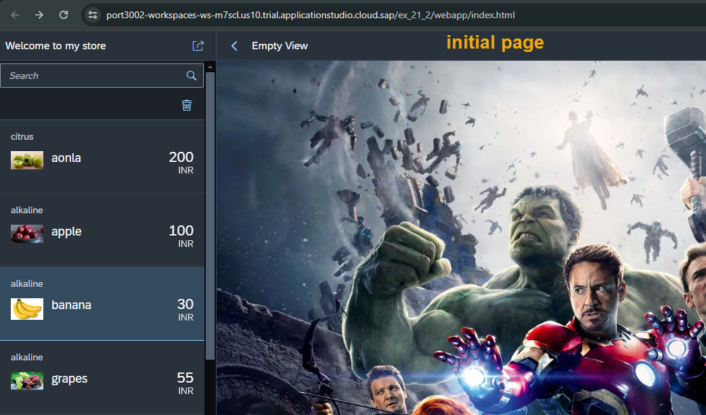
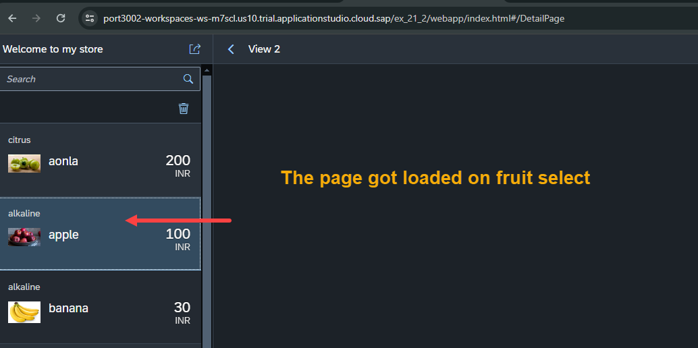
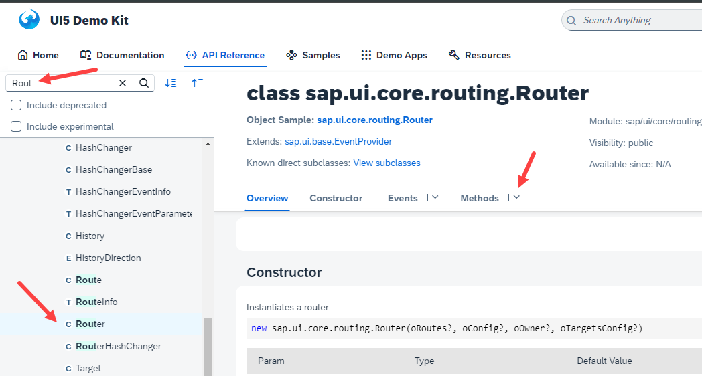
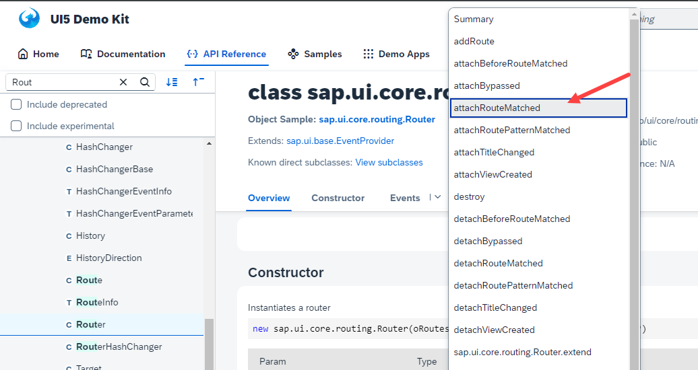

## Exercise 22 - Route matched Handlers

</br></br>

**Implementing multiple page and navigating using routers**

- In previous session initial load of the page view showed a master page 

Define a new empty view to display during load of the page (detail section) and on click of the master item a new page load should happen

*manifest.json* -- changes for defining -- only the code - snip 

```json

    "routes":[{
        "name": "first",
        "pattern": "",
        "target": ["Facepage","Secondpage"]
    },{
        "name": "second",
        "pattern": "DetailPage",
        "target": ["Datapage"]
    }],
    "targets": {
        "Facepage":{
            "viewName": "View1",
            "controlAggregation": "masterPages"
        },
        "Secondpage":{
            "viewName": "Empty",
            "controlAggregation": "detailPages"
        },
        "Datapage":{
            "viewName": "View2",
            "controlAggregation": "detailPages"
        }
            }

```

<br>

<details>
<summary> manifest json full code </summary>
</br>

```json

{
    "_version": "1.123",
    "sap.app": {
        "id": "ntt.hr.payroll",
        "description": "{{APP_TITLE}}",
        "applicationVersion": "1.0.0",
        "type": "application",
        "title": "{{APP_DESCRIPTION}}",
        "i18n": "i18n/i18n.properties"
    },
    "sap.ui": {
        "technology": "UI5",
        "icons": {
            "icon": "sap-icon://home"
        },
        "deviceTypes": {
            "desktop": true,
            "tablet": true,
            "phone": true
        }
    },
    "sap.ui5": {
        "dependencies": {
            "minUI5Version": "1.123",
            "libs": {
                "sap.m": {},
                "sap.ui.table": {}
            }
        },
        "rootView":{
            "id": "idAppView",
            "type": "XML",
            "viewName": "ntt.hr.payroll.view.App"
        },
        "routing": {
            "config":{
                "viewPath": "ntt.hr.payroll.view",
                "viewType": "XML",
                "controlId": "appCon"
            },
            "routes":[{
                "name": "first",
                "pattern": "",
                "target": ["Facepage","Secondpage"]
           },{
                "name": "second",
                "pattern": "DetailPage",
                "target": ["Datapage"]
           }],
            "targets": {
                "Facepage":{
                    "viewName": "View1",
                    "controlAggregation": "masterPages"
                },
                "Secondpage":{
                    "viewName": "Empty",
                    "controlAggregation": "detailPages"
                },
                "Datapage":{
                    "viewName": "View2",
                    "controlAggregation": "detailPages"
                }
            }
        },

        "contentDensities": {
            "compact": true,
            "cozy": true
        },
        "library": {
            "css": "css/mystyle.css"
        },
        "models": {
            "i18n": {
                "type": "sap.ui.model.resource.ResourceModel",
                "uri": "i18n/i18n.properties"
            },
            "": {
                "type": "sap.ui.model.json.JSONModel",
                "uri": "model/mockdata/fruits.json"
            }
        }
    }
}


```

</br>
</details>


<br>

*empty.controller.js*

```js

sap.ui.define([
    "sap/ui/core/mvc/Controller"
], function(Controller){
    'use strict';
    return Controller.extend("ntt.hr.payroll.controller.Empty",{
        
    });
});

```

<br>

*empty.view.xml*

```xml

<mvc:View xmlns:mvc="sap.ui.core.mvc" xmlns="sap.m" 
controllerName="ntt.hr.payroll.controller.Empty">
    <Page title="Empty View" showNavButton="true" navButtonPress="onBack">
        <Image src="https://cdn.britannica.com/60/182360-050-CD8878D6/Avengers-Age-of-Ultron-Joss-Whedon.jpg" width="75%" height="100%"></Image>       
    </Page>
</mvc:View>


```

<br>

*View1.view.xml*

```xml

    <List id="idList" mode="SingleSelectMaster" delete="onDelete" 
    itemPress="onNavNext" selectionChange="onFruitSelect"  items="{
        path: '/fruits',
        sorter: {
            path : 'name'
        }
    }">

```

<br>

*View1.controller.js*

```js

sap.ui.define([
    'sap/ui/core/mvc/Controller',
    'sap/ui/model/Filter',
    'sap/ui/model/FilterOperator'
], function(Controller, Filter, FilterOperator){
    'use strict';
    return Controller.extend("ntt.hr.payroll.controller.View1",{
        onInit: function(){

///////////////////////////////////////////////////////////////////////////////            
            // To get he router object from component.js we are calling this method
            // So we are getting the same 
            this.Router = this.getOwnerComponent().getRouter();
///////////////////////////////////////////////////////////////////////////////            
        },
///////////////////////////////////////////////////////////////////////////////
        onFruitSelect: function(oEvent){
// Router will take care of all the navigation !             
            // Step 1 : Get the router 
            // this.Router
            
            // Step 2 : Trigger the Route
            this.Router.navTo("second") ;
        }
///////////////////////////////////////////////////////////////////////////////

    });
});


```

<br>

<details>
<summary> view 1 controller JS -- Full code </summary>
</br>
</br>

```js

sap.ui.define([
    'sap/ui/core/mvc/Controller',
    'sap/ui/model/Filter',
    'sap/ui/model/FilterOperator'
], function(Controller, Filter, FilterOperator){
    'use strict';
    return Controller.extend("ntt.hr.payroll.controller.View1",{
        onInit: function(){
///////////////////////////////////////////////////////////////////////////////            
            // To get he router object from component.js we are calling this method
            // So we are getting the same 
            this.Router = this.getOwnerComponent().getRouter();
///////////////////////////////////////////////////////////////////////////////            
        },

        onNext: function(){
            // Step 1 : get the parent control object - Container for our view 
            var oAppCon = this.getView().getParent();
            // Step 2 : ask parent to nav to next view 
            oAppCon.to("idView2");
        },
        
        onItemClick: function(){
            // this - is my current class object - which is our controller
            this.onNext();
        },

        onSearch: function(oEvent){
            // Step 1 : What is teh user type in search field
            var sSearch = oEvent.getParameter("query");            
            
            // Live Change 
            if (sSearch === "" || sSearch === undefined){
                sSearch = oEvent.getParameter("newValue");
            }

            // Step 2 : Construct a Filter object with operand and operator
            var oFilter = new Filter("name", FilterOperator.Contains, sSearch);
            var oFilter2 = new Filter("taste", FilterOperator.Contains, sSearch); // implementing search parameter 2 
            var aFilter = [oFilter, oFilter2];
            var oMaster = new Filter({
                filters: aFilter,
                and: false // when AND = FALSE that means -search filter is defiend with- OR = TRUE
            })
            
            // Step 3 : get the list object 
            var oList = this.getView().byId("idList");
            
            // Step 4 : inject the filter to the list 
            oList.getBinding("items").filter(oMaster); // New multi condition search paramter 
            
        },

        onNavNext: function(oEvent){
            this.onNext();
        },

        onDelete: function(oEvent){
            // Step 1 : Find out which item was selected for deletion
            var oSelected = oEvent.getParameter("listItem");
            // Step 2 : Get the model object
            var oList = oEvent.getSource();
            // Step 3 : Remove the item from the list 
            oList.removeItem(oSelected);
        },

        onDeleteItems: function(oEvent){
            var oList = this.getView().byId("idList");
            var aSelectedItems = oList.getSelectedItems();
            aSelectedItems.forEach(item => {
                oList.removeItem(item);
            });
        },
///////////////////////////////////////////////////////////////////////////////
        onFruitSelect: function(oEvent){
// Router will take care of all the navigation !             
            // Step 1 : Get the router 
            // this.Router
            
            // Step 2 : Trigger the Route
            this.Router.navTo("second") ;
        }
///////////////////////////////////////////////////////////////////////////////

    });
});

```

</br>
</details>

<br>


**One Final important Change is needed to Manifest.json for app container section**

- The above changes will display the master page and empty page - initially

- on click of the item in master page the detail page will be loaded but it gets loaded behind empty page 

- By design the priority goes to the default detail page(empty page) 

- In order to make the view change in detail view section on click of items - following change need to be defined

</br>

*manifest.json*

```json

        "routing": {
            "config":{
                "viewPath": "ntt.hr.payroll.view",
                "viewType": "XML",
                "controlId": "appCon",
                "clearControlAggregation": true
            },
        }

```
</br></br>

**Testing**

<details>
<summary> Testing images </summary>
</br>

</br>

</br>
</details>


</br></br>

> [!NOTE]
> Item press  functionality in list control work when - object list item has (type = navigation).

</br></br>

So far we did the master detail page with some view changes - the exact naming convention and pattern used will be as follows 

*manifest.json*

```json

    "routes":[{
        "name": "Master",
        "pattern": "",
        "target": ["Facepage","Secondpage"]
    },{
        "name": "Detail",
        "pattern": "DetailPage",
        "target": ["Facepage","Datapage"]
    }],

```
</br>

**CODE snip only**

*View1.controller.js*

```js

    onInit: function(){
        this.Router = this.getOwnerComponent().getRouter();     
    },

    onFruitSelect: function(oEvent){
        this.Router.navTo("Detail") ;
    }

```

*View2.controller.js*

```js

    onInit: function(){
        this.Router = this.getOwnerComponent().getRouter();     
    },

    onFruitSelect: function(oEvent){
        this.Router.navTo("Master") ;
    }

```
</br></br>

**Earlier in our session we did element binding - selection of 1 item in table control is displayed in simple form now the same concept will implement here on select of a fruit item in master page the fruit detail should be displayed in detail page**


*View2.controller.js*

```js

    onInit: function(){
        this.Router = this.getOwnerComponent().getRouter();     
        this.Router.getRoute("Detail").attachRouteMatched();
    },

    onFruitSelect: function(oEvent){
        this.Router.navTo("Master") ;
    }

```

**SAP ui5 SDK page**

<details>
<summary> <b> ALL CODE CHANGES - TODAY SESSION </b> </summary>
</br>
</br>

</br>

</br>
</br>
</details>


</br></br>
</br></br>
</br></br>

## End of Exercise 22 ---NEXT---> <a href="https://github.com/Octavius-Dante/Arthelais/tree/main/ex_23"> Exercise 23-Icon Tab bar </a>
</br>
<p align="center"> <a href="https://github.com/Octavius-Dante/Arthelais/tree/main"> Main page </a> </p>


</br></br>

**All Previous sessions**
</br></br>

<!-- - [x] <a href="https://github.com/Octavius-Dante/Arthelais/tree/main/ex_37"> Exercise 37-Deploy app to launchpad</a>
- [x] <a href="https://github.com/Octavius-Dante/Arthelais/tree/main/ex_36"> Exercise 36-WebIde and Git integration</a>
- [x] <a href="https://github.com/Octavius-Dante/Arthelais/tree/main/ex_35"> Exercise 35-POST, GET and DELETE from Fiori</a>
- [x] <a href="https://github.com/Octavius-Dante/Arthelais/tree/main/ex_34"> Exercise 34-GET and Connect</a>
- [x] <a href="https://github.com/Octavius-Dante/Arthelais/tree/main/ex_33"> Exercise 33-Fiori Project Connect Odata</a>
- [x] <a href="https://github.com/Octavius-Dante/Arthelais/tree/main/ex_32"> Exercise 32-Connectivity</a>
- [x] <a href="https://github.com/Octavius-Dante/Arthelais/tree/main/ex_31"> Exercise 31-Function Import and Images</a>
- [x] <a href="https://github.com/Octavius-Dante/Arthelais/tree/main/ex_30"> Exercise 30-implementing CRUD</a>
- [x] <a href="https://github.com/Octavius-Dante/Arthelais/tree/main/ex_29"> Exercise 29-Implementing GET</a>
- [x] <a href="https://github.com/Octavius-Dante/Arthelais/tree/main/ex_28"> Exercise 28-Create A Gateway Project</a>
- [x] <a href="https://github.com/Octavius-Dante/Arthelais/tree/main/ex_27"> Exercise 27-Odata GET</a>
- [x] <a href="https://github.com/Octavius-Dante/Arthelais/tree/main/ex_26"> Exercise 26-Fiori Deployments</a>
- [x] <a href="https://github.com/Octavius-Dante/Arthelais/tree/main/ex_25"> Exercise 25-Fragments Deep dive</a>
- [x] <a href="https://github.com/Octavius-Dante/Arthelais/tree/main/ex_24"> Exercise 24-Fragments</a>
- [x] <a href="https://github.com/Octavius-Dante/Arthelais/tree/main/ex_23"> Exercise 23-Icon Tab bar</a>
- [x] <a href="https://github.com/Octavius-Dante/Arthelais/tree/main/ex_22"> Exercise 22-Route matched Handlers</a> -->
- [x] <a href="https://github.com/Octavius-Dante/Arthelais/tree/main/ex_21"> Exercise 21-Router Basics</a>
- [x] <a href="https://github.com/Octavius-Dante/Arthelais/tree/main/ex_20"> Exercise 20-Filters on List mode</a>
- [x] <a href="https://github.com/Octavius-Dante/Arthelais/tree/main/ex_19"> Exercise 19-Manifest JSON</a>
- [x] <a href="https://github.com/Octavius-Dante/Arthelais/tree/main/ex_18"> Exercise 18-List Control</a>
- [x] <a href="https://github.com/Octavius-Dante/Arthelais/tree/main/ex_17"> Exercise 17-Fiori Lite app</a>
- [x] <a href="https://github.com/Octavius-Dante/Arthelais/tree/main/ex_16"> Exercise 16-Formatters </a>
- [x] <a href="https://github.com/Octavius-Dante/Arthelais/tree/main/ex_15"> Exercise 15-Element Binding</a>
- [x] <a href="https://github.com/Octavius-Dante/Arthelais/tree/main/ex_14"> Exercise 14-Table control</a>
- [x] <a href="https://github.com/Octavius-Dante/Arthelais/tree/main/ex_13"> Exercise 13-Expression Binding XML Model</a>
- [x] <a href="https://github.com/Octavius-Dante/Arthelais/tree/main/ex_12"> Exercise 12-Json Model Property Binding</a>
- [x] <a href="https://github.com/Octavius-Dante/Arthelais/tree/main/ex_11"> Exercise 11-Model Basics </a>
- [x] <a href="https://github.com/Octavius-Dante/Arthelais/tree/main/ex_10"> Exercise 10-XML Views </a>
- [x] <a href="https://github.com/Octavius-Dante/Arthelais/tree/main/ex_9"> Exercise 9-Control Hierarchy 2</a>
- [x] <a href="https://github.com/Octavius-Dante/Arthelais/tree/main/ex_8"> Exercise 8-Ui5 Control Hierarchy </a>
- [x] <a href="https://github.com/Octavius-Dante/Arthelais/tree/main/ex_7"> Exercise 7-SAP Ui5 Framework </a>
- [x] <a href="https://github.com/Octavius-Dante/Arthelais/tree/main/ex_6"> Exercise 6-JQuery </a>
- [x] <a href="https://github.com/Octavius-Dante/Arthelais/tree/main/ex_5"> Exercise 5-JS deep dive </a>
- [x] <a href="https://github.com/Octavius-Dante/Arthelais/tree/main/ex_4"> Exercise 4-JS basic </a>
- [x] <a href="https://github.com/Octavius-Dante/Arthelais/tree/main/ex_3"> Exercise 3-CSS </a>
- [x] <a href="https://github.com/Octavius-Dante/Arthelais/tree/main/ex_2"> Exercise 2-HTML5</a>
- [x] <a href="https://github.com/Octavius-Dante/Arthelais/tree/main/ex_1"> Exercise 1 -Basic </a>


<!--

<details>
<summary> <b> ALL CODE CHANGES - TODAY SESSION </b> </summary>
</br>
</br>

</br>
</br>

</br>
</br>
</details>

-->