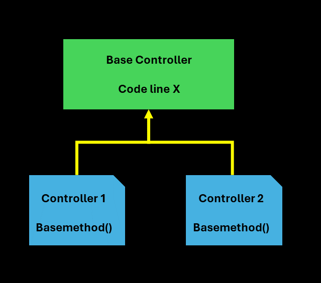
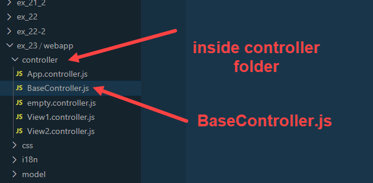
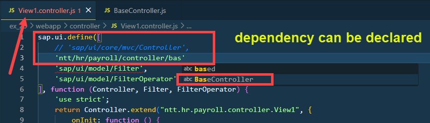
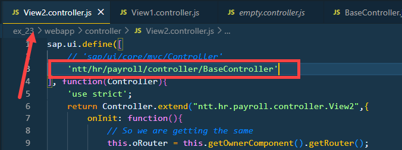
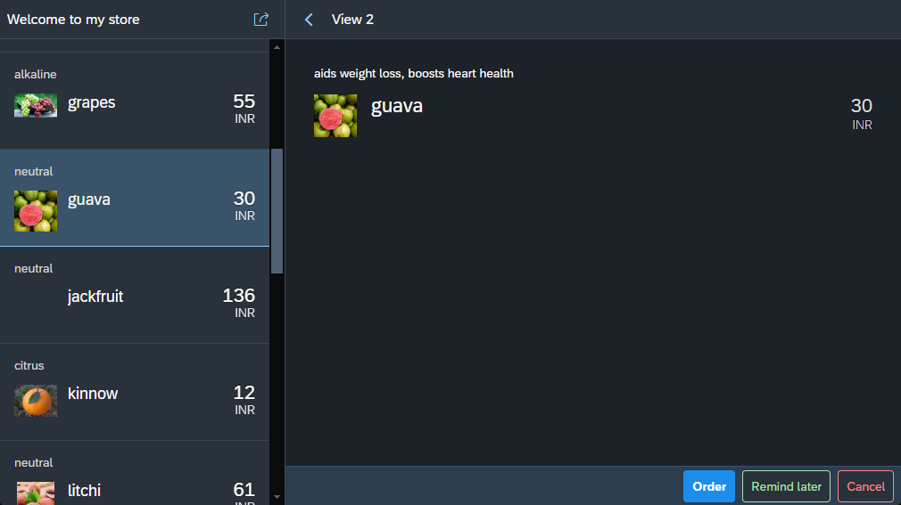
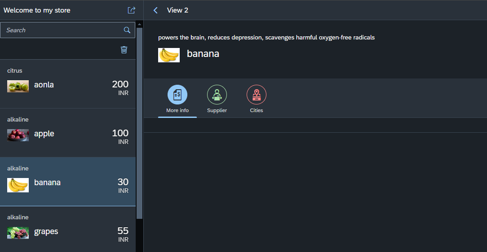

## Exercise 23 - Icon Tab bar

</br>

As per previous session we have some duplication in our code so we are going to modularize it and reuse it by using oops concept 

**Introducing Base Controller**

</br>

</br>

- Base controller is an abstract class (object cannot be directly instantiated) that's the reason (base.controller name was not used)
- Base controller doesn't belong to any view 

Create base controller in *Controller folder*

</br>

</br>

*Regular scaffolding code template is followed here*

</br> 

Code block from *View1.controller.js* we are going to replace

```js

    hercules: function (oEvent) {
///////////////////////////////////////////////////////         
        var fruitId = oEvent.getParameter("arguments").fruitId;
        var sPath = '/fruits/' + fruitId;
///////////////////////////////////////////////////////         
        var oList = this.getView().byId("idList");
        var element = {}; // variabel place holder for holdign the value -- WORKAREA
        if (oList.getItems().length > 0){  // Internal table is not initial check 
            
            // loop all the items in the model and look for the selected path 
            // - get the path and set it and break the loop 
            for (let i = 0; i < oList.getItems().length; i++) {  // looping the internal table record for locating the values 
                element = oList.getItems()[i];                   // assignment of table record to WORKAREA (based on loop index)
                if (element.getBindingContextPath() === sPath) { // searching for the path in WORKAREA
                    oList.setSelectedItem(element); // setting the value to screen object from WORKAREA 
                    break; // once the item is identified and screen element is set close the search or break the loop 
                }
            }
        }
    },


```

</br>

Code block from *View2.controller.js* we are going to replace

```js

    hercules: function(oEvent){
        // debugger;
///////////////////////////////////////////////////////         
        var fruitId =  oEvent.getParameter("arguments").fruitId;
        var sPath = '/fruits/' + fruitId;
///////////////////////////////////////////////////////         
        this.getView().bindElement(sPath); // Binding with /fruits/<fruitID> - absolute path
    }

```

</br></br> 

**Duplication code in both the controller**

```js

    var fruitId =  oEvent.getParameter("arguments").fruitId;
    var sPath = '/fruits/' + fruitId;

```

</br></br> 

*BaseController.js*

```js

sap.ui.define([
    'sap/ui/core/mvc/Controller'
], function(Controller){
    'use strict';
    return Controller.extend("ntt.hr.payroll.controller.BaseController", {
        extractPath: function(oEvent){
            var fruitId = oEvent.getParameter("arguments").fruitId;
            return '/fruits/' + fruitId;            
        }
    });
});

```

</br> 


</br>

</br>

</br>

*Code changes in -- View1.controller.js*

```js

hercules: function (oEvent) {
    // var fruitId = oEvent.getParameter("arguments").fruitId;
    // var sPath = '/fruits/' + fruitId;
///////////////////////////////////////////////////////            
    var sPath = this.extractPath(oEvent);
///////////////////////////////////////////////////////            
    var oList = this.getView().byId("idList");
    var element = {}; // variabel place holder for holdign the value -- WORKAREA
    if (oList.getItems().length > 0){  // Internal table is not initial check 
        
        // loop all the items in the model and look for the selected path 
        // - get the path and set it and break the loop 
        for (let i = 0; i < oList.getItems().length; i++) {  // looping the internal table record for locating the values 
            element = oList.getItems()[i];                   // assignment of table record to WORKAREA (based on loop index)
            if (element.getBindingContextPath() === sPath) { // searching for the path in WORKAREA
                oList.setSelectedItem(element); // setting the value to screen object from WORKAREA 
                break; // once the item is identified and screen element is set close the search or break the loop 
            }
        }
    }

},

```

</br>

*Code changes in -- View2.controller.js*

```js

hercules: function(oEvent){
    // debugger;
    // var fruitId =  oEvent.getParameter("arguments").fruitId;
    // var sPath = '/fruits/' + fruitId;
///////////////////////////////////////////////////////         
    var sPath = this.extractPath(oEvent);
///////////////////////////////////////////////////////         
    this.getView().bindElement(sPath); // Binding with /fruits/<fruitID> - absolute path
}

```

</br></br> 


<details>
<summary> <b> Full code -- View1 & View2 - controller </b> </summary>
</br></br>

*View1.controller.js*

```js

sap.ui.define([
    // 'sap/ui/core/mvc/Controller',
    'ntt/hr/payroll/controller/BaseController',
    'sap/ui/model/Filter',
    'sap/ui/model/FilterOperator'
], function (Controller, Filter, FilterOperator) {
    'use strict';
    return Controller.extend("ntt.hr.payroll.controller.View1", {
        onInit: function () {
            this.Router = this.getOwnerComponent().getRouter();
            this.Router.getRoute("Detail").attachPatternMatched(this.hercules, this);
        },

// TYPE 1  :        
        hercules: function (oEvent) {
            // var fruitId = oEvent.getParameter("arguments").fruitId;
            // var sPath = '/fruits/' + fruitId;
///////////////////////////////////////////////////////             
            var sPath = this.extractPath(oEvent);
///////////////////////////////////////////////////////             
            var oList = this.getView().byId("idList");
            var element = {}; // variabel place holder for holdign the value -- WORKAREA
            if (oList.getItems().length > 0){  // Internal table is not initial check 
                
                // loop all the items in the model and look for the selected path 
                // - get the path and set it and break the loop 
                for (let i = 0; i < oList.getItems().length; i++) {  // looping the internal table record for locating the values 
                    element = oList.getItems()[i];                   // assignment of table record to WORKAREA (based on loop index)
                    if (element.getBindingContextPath() === sPath) { // searching for the path in WORKAREA
                        oList.setSelectedItem(element); // setting the value to screen object from WORKAREA 
                        break; // once the item is identified and screen element is set close the search or break the loop 
                    }
                }
                // // then set the retrieved path
                // if (element) {
                //     oList.SetSelectedItem(element);
                // }
            }

        },

// // // TYPE 2  : directly set the path value to screen element 
//         hercules: function (oEvent) {
//             var fruitId = oEvent.getParameter("arguments").fruitId;
//             var sPath = '/fruits/' + fruitId;
//             var oList = this.getView().byId("idList");
//             oList.setSelectedItem(sPath);
//         }

        onNext: function () {
            // Step 1 : get the parent control object - Container for our view 
            var oAppCon = this.getView().getParent();
            // Step 2 : ask parent to nav to next view 
            oAppCon.to("idView2");
        },

        onItemClick: function () {
            // this - is my current class object - which is our controller
            this.onNext();
        },

        onSearch: function (oEvent) {
            // Step 1 : What is teh user type in search field
            var sSearch = oEvent.getParameter("query");

            // Live Change 
            if (sSearch === "" || sSearch === undefined) {
                sSearch = oEvent.getParameter("newValue");
            }

            // Step 2 : Construct a Filter object with operand and operator
            var oFilter = new Filter("name", FilterOperator.Contains, sSearch);
            var oFilter2 = new Filter("taste", FilterOperator.Contains, sSearch); // implementing search parameter 2 
            var aFilter = [oFilter, oFilter2];
            var oMaster = new Filter({
                filters: aFilter,
                and: false // when AND = FALSE that means -search filter is defiend with- OR = TRUE
            })

            // Step 3 : get the list object 
            var oList = this.getView().byId("idList");

            // Step 4 : inject the filter to the list 
            oList.getBinding("items").filter(oMaster); // New multi condition search paramter 

        },

        onNavNext: function (oEvent) {
            this.onNext();
        },

        onDelete: function (oEvent) {
            // Step 1 : Find out which item was selected for deletion
            var oSelected = oEvent.getParameter("listItem");
            // Step 2 : Get the model object
            var oList = oEvent.getSource();
            // Step 3 : Remove the item from the list 
            oList.removeItem(oSelected);
        },

        onDeleteItems: function (oEvent) {
            var oList = this.getView().byId("idList");
            var aSelectedItems = oList.getSelectedItems();
            aSelectedItems.forEach(item => {
                oList.removeItem(item);
            });
        },
        onFruitSelect: function (oEvent) {
            var oSelectedItem = oEvent.getParameter("listItem");
            // debugger;
            this.Router.navTo("Detail", {
                fruitId: oSelectedItem.getBindingContextPath().split("/")[2]
            });
        }

    });
});

```

</br></br>

*View2.controller.js*

```js

sap.ui.define([
    // 'sap/ui/core/mvc/Controller'
    'ntt/hr/payroll/controller/BaseController'
], function(Controller){
    'use strict';
    return Controller.extend("ntt.hr.payroll.controller.View2",{
        onInit: function(){
            // So we are getting the same 
            this.oRouter = this.getOwnerComponent().getRouter();
            // this.Router.getRoute("Detail").attachPatternMatched(this.hercules);
            this.oRouter.getRoute("Detail").attachPatternMatched(this.hercules, this);
        },

        onBack: function(oEvent){
            // this.getView().getParent().to("idView1");  
            this.oRouter.navTo("Master") ;          
        },

        hercules: function(oEvent){
            // debugger;
            // var fruitId =  oEvent.getParameter("arguments").fruitId;
            // var sPath = '/fruits/' + fruitId;
///////////////////////////////////////////////////////             
            var sPath = this.extractPath(oEvent);
///////////////////////////////////////////////////////             
            this.getView().bindElement(sPath); // Binding with /fruits/<fruitID> - absolute path
        }
    });
});

```

</br></br>
</details>


</br></br>


**App performs in the same way after making all the changes but why we implemented it ? --- REUSABILITY - Proper SAP standard way**


</br></br>


## Adding business object on the right side detail page 

</br>


*View2.view.xml*

```xml

<mvc:View xmlns:mvc="sap.ui.core.mvc" xmlns="sap.m" 
controllerName="ntt.hr.payroll.controller.View2">
    <Page title="View 2" showNavButton="true" navButtonPress="onBack">
          <!-- <Button text="Go Back" icon="sap-icon://arrow-left" press="onBack" /> -->
        <content>
            <!-- <Text text="{name}" />     -->
<!--/////////////////////////////////////////////////////////////////////////-->            
            <ObjectHeader intro="{healthBenefit}" title="{name}" icon="{image}" 
            number="{price}" numberUnit="{curr}" ></ObjectHeader>
<!--/////////////////////////////////////////////////////////////////////////-->                        
        </content>
    <footer>
        <Toolbar>
<!-- This toolbar spacer responsible for moving the button on the right side -->        
        <ToolbarSpacer/> 
            <Button text="Order" type="Emphasized"></Button>
            <Button text="Remind later" type="Accept"></Button>
            <Button text="Cancel" type="Reject"></Button>
        </Toolbar>
    </footer>
    </Page>
</mvc:View>

```

</br>

**Testing**

</br>

</br>

</br></br>

## Tab strip in UI5 is called - Icon Tab Bar


*Icon tab bar contains - items aggregation and each item points to a icon tab filter*

</br>

*View2.view.xml*

```xml

<mvc:View xmlns:mvc="sap.ui.core.mvc" xmlns="sap.m" 
controllerName="ntt.hr.payroll.controller.View2">
    <Page title="View 2" showNavButton="true" navButtonPress="onBack">
          <!-- <Button text="Go Back" icon="sap-icon://arrow-left" press="onBack" /> -->
        <content>
            <!-- <Text text="{name}" />     -->

            <ObjectHeader intro="{healthBenefit}" title="{name}" icon="{image}" 
            number="{price}" numberUnit="{curr}" ></ObjectHeader>

<!--/////////////////////////////////////////////////////////////////////////-->
            <IconTabBar >
                <items>
                    <IconTabFilter iconColor="Default" icon="sap-icon://sales-order-item" text="More info"></IconTabFilter>
                    <IconTabFilter iconColor="Positive" icon="sap-icon://supplier" text="Supplier"></IconTabFilter>
                    <IconTabFilter iconColor="Negative" icon="sap-icon://functional-location" text="Cities"></IconTabFilter>
                </items>
            </IconTabBar>
<!--/////////////////////////////////////////////////////////////////////////-->

        </content>
    <footer>
        <Toolbar>
<!-- This toolbar spacer responsible for moving the button on the right side -->        
        <ToolbarSpacer/> 
            <Button text="Order" type="Emphasized"></Button>
            <Button text="Remind later" type="Accept"></Button>
            <Button text="Cancel" type="Reject"></Button>
        </Toolbar>
    </footer>
    </Page>
</mvc:View>


```

</br>

**Testing**

</br>

</br></br>


**Adding details to all the tabs**

</br>

*View2.view.xml*

```xml


```


</br></br>
</br></br>
</br></br>

## End of Exercise 23 ---NEXT---> <a href="https://github.com/Octavius-Dante/Arthelais/tree/main/ex_24"> Exercise 24-Fragments </a>
</br>
<p align="center"> <a href="https://github.com/Octavius-Dante/Arthelais/tree/main"> Main page </a> </p>


</br></br>

**All Previous sessions**
</br></br>

<!-- - [x] <a href="https://github.com/Octavius-Dante/Arthelais/tree/main/ex_37"> Exercise 37-Deploy app to launchpad</a>
- [x] <a href="https://github.com/Octavius-Dante/Arthelais/tree/main/ex_36"> Exercise 36-WebIde and Git integration</a>
- [x] <a href="https://github.com/Octavius-Dante/Arthelais/tree/main/ex_35"> Exercise 35-POST, GET and DELETE from Fiori</a>
- [x] <a href="https://github.com/Octavius-Dante/Arthelais/tree/main/ex_34"> Exercise 34-GET and Connect</a>
- [x] <a href="https://github.com/Octavius-Dante/Arthelais/tree/main/ex_33"> Exercise 33-Fiori Project Connect Odata</a>
- [x] <a href="https://github.com/Octavius-Dante/Arthelais/tree/main/ex_32"> Exercise 32-Connectivity</a>
- [x] <a href="https://github.com/Octavius-Dante/Arthelais/tree/main/ex_31"> Exercise 31-Function Import and Images</a>
- [x] <a href="https://github.com/Octavius-Dante/Arthelais/tree/main/ex_30"> Exercise 30-implementing CRUD</a>
- [x] <a href="https://github.com/Octavius-Dante/Arthelais/tree/main/ex_29"> Exercise 29-Implementing GET</a>
- [x] <a href="https://github.com/Octavius-Dante/Arthelais/tree/main/ex_28"> Exercise 28-Create A Gateway Project</a>
- [x] <a href="https://github.com/Octavius-Dante/Arthelais/tree/main/ex_27"> Exercise 27-Odata GET</a>
- [x] <a href="https://github.com/Octavius-Dante/Arthelais/tree/main/ex_26"> Exercise 26-Fiori Deployments</a>
- [x] <a href="https://github.com/Octavius-Dante/Arthelais/tree/main/ex_25"> Exercise 25-Fragments Deep dive</a>
- [x] <a href="https://github.com/Octavius-Dante/Arthelais/tree/main/ex_24"> Exercise 24-Fragments</a>
- [x] <a href="https://github.com/Octavius-Dante/Arthelais/tree/main/ex_23"> Exercise 23-Icon Tab bar</a> -->
- [x] <a href="https://github.com/Octavius-Dante/Arthelais/tree/main/ex_22"> Exercise 22-Route matched Handlers</a>
- [x] <a href="https://github.com/Octavius-Dante/Arthelais/tree/main/ex_21"> Exercise 21-Router Basics</a>
- [x] <a href="https://github.com/Octavius-Dante/Arthelais/tree/main/ex_20"> Exercise 20-Filters on List mode</a>
- [x] <a href="https://github.com/Octavius-Dante/Arthelais/tree/main/ex_19"> Exercise 19-Manifest JSON</a>
- [x] <a href="https://github.com/Octavius-Dante/Arthelais/tree/main/ex_18"> Exercise 18-List Control</a>
- [x] <a href="https://github.com/Octavius-Dante/Arthelais/tree/main/ex_17"> Exercise 17-Fiori Lite app</a>
- [x] <a href="https://github.com/Octavius-Dante/Arthelais/tree/main/ex_16"> Exercise 16-Formatters </a>
- [x] <a href="https://github.com/Octavius-Dante/Arthelais/tree/main/ex_15"> Exercise 15-Element Binding</a>
- [x] <a href="https://github.com/Octavius-Dante/Arthelais/tree/main/ex_14"> Exercise 14-Table control</a>
- [x] <a href="https://github.com/Octavius-Dante/Arthelais/tree/main/ex_13"> Exercise 13-Expression Binding XML Model</a>
- [x] <a href="https://github.com/Octavius-Dante/Arthelais/tree/main/ex_12"> Exercise 12-Json Model Property Binding</a>
- [x] <a href="https://github.com/Octavius-Dante/Arthelais/tree/main/ex_11"> Exercise 11-Model Basics </a>
- [x] <a href="https://github.com/Octavius-Dante/Arthelais/tree/main/ex_10"> Exercise 10-XML Views </a>
- [x] <a href="https://github.com/Octavius-Dante/Arthelais/tree/main/ex_9"> Exercise 9-Control Hierarchy 2</a>
- [x] <a href="https://github.com/Octavius-Dante/Arthelais/tree/main/ex_8"> Exercise 8-Ui5 Control Hierarchy </a>
- [x] <a href="https://github.com/Octavius-Dante/Arthelais/tree/main/ex_7"> Exercise 7-SAP Ui5 Framework </a>
- [x] <a href="https://github.com/Octavius-Dante/Arthelais/tree/main/ex_6"> Exercise 6-JQuery </a>
- [x] <a href="https://github.com/Octavius-Dante/Arthelais/tree/main/ex_5"> Exercise 5-JS deep dive </a>
- [x] <a href="https://github.com/Octavius-Dante/Arthelais/tree/main/ex_4"> Exercise 4-JS basic </a>
- [x] <a href="https://github.com/Octavius-Dante/Arthelais/tree/main/ex_3"> Exercise 3-CSS </a>
- [x] <a href="https://github.com/Octavius-Dante/Arthelais/tree/main/ex_2"> Exercise 2-HTML5</a>
- [x] <a href="https://github.com/Octavius-Dante/Arthelais/tree/main/ex_1"> Exercise 1 -Basic </a>


<!--

<details>
<summary> <b> ALL CODE CHANGES - TODAY SESSION </b> </summary>
</br>
</br>

</br>
</br>

</br>
</br>
</details>

-->