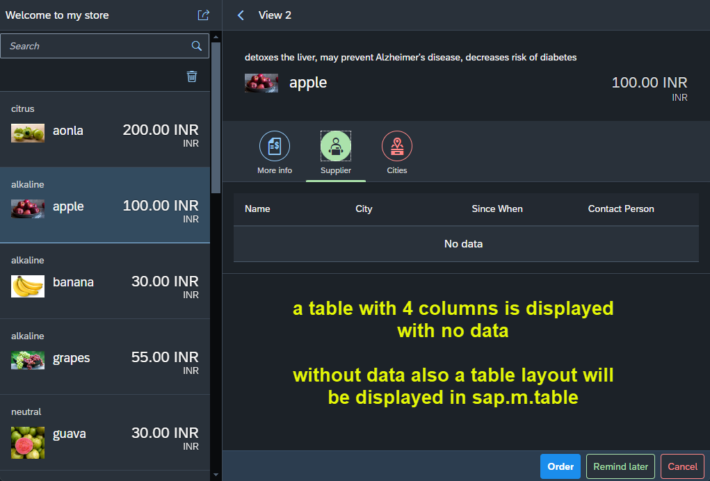
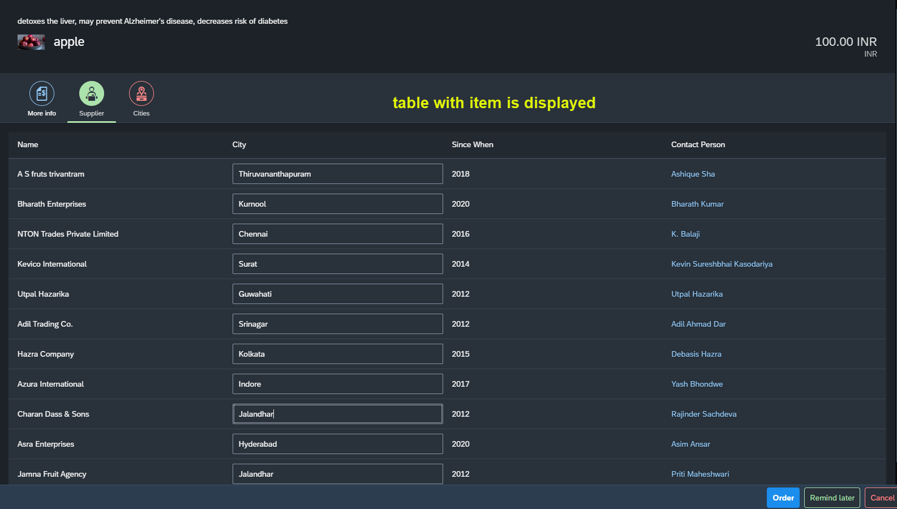
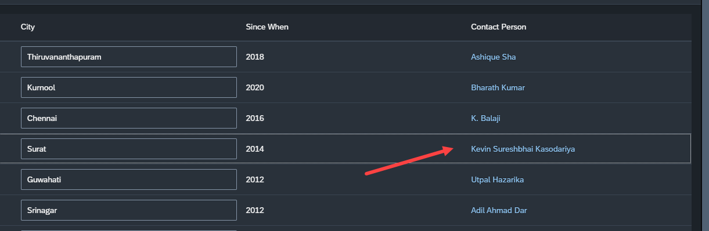
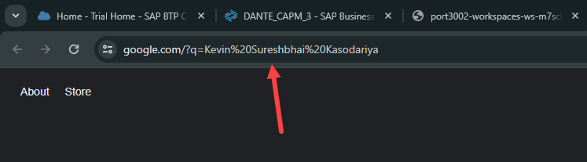
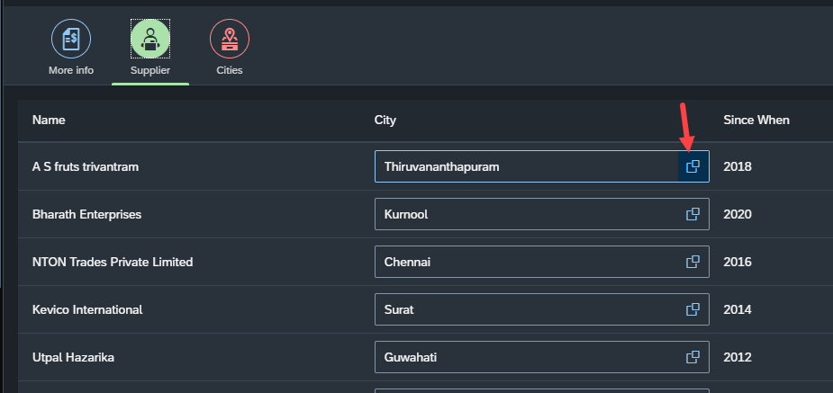
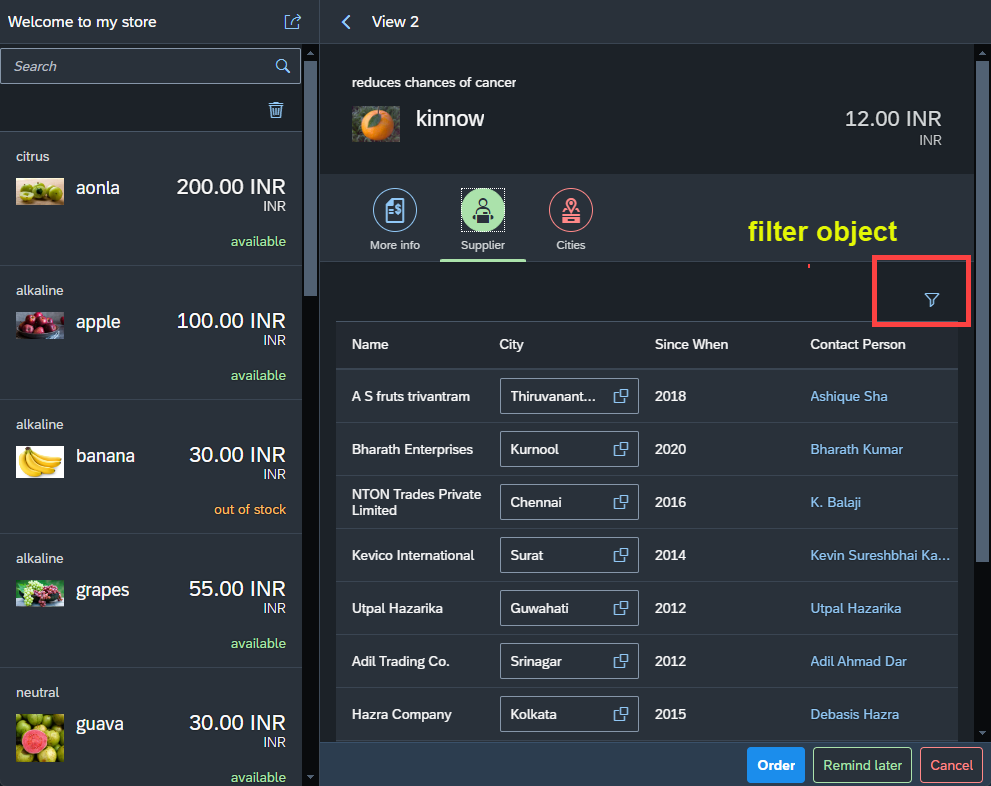
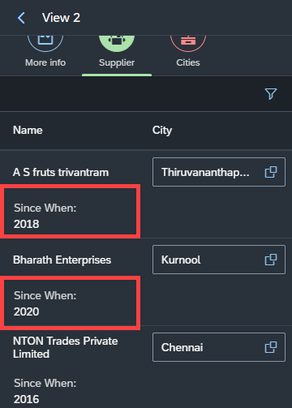
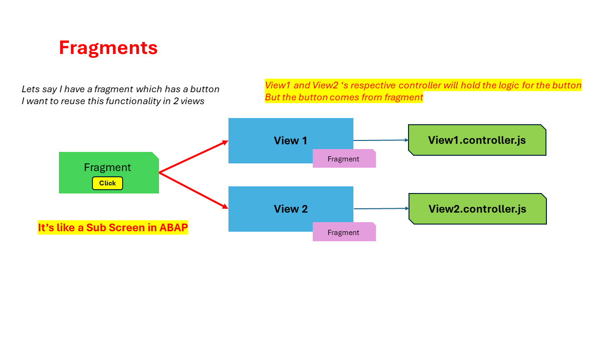
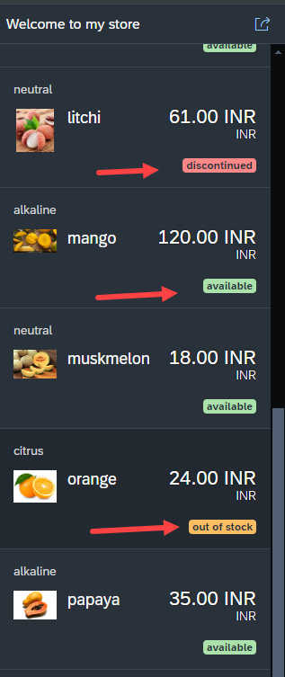

## Exercise 24 - Fragments

</br></br>

**Exercise 1 : from previous session**

*Requirement :* 

- Create a sap.m.Table in the second tab (Supplier) for supplier data.
- The Columns are (name, since when, city & person name)
- The City columns must be editable. And when we clikc F4 help of city field, all the cities should come as in a pop-up

</br>

*View2.view.xml*

```xml

    <IconTabFilter iconColor="Positive" icon="sap-icon://supplier" text="Supplier">
        <Table >
    <!--/////////////////////////////////////////////////////////////////////////////////////////////-->
            <columns> 
                <Column >
                    <header>
                        <Text text="Name"/>
                    </header>
                </Column>
                <Column >
                    <header>
                        <Text text="City"/>
                    </header>
                </Column>
                <Column >
                    <header>
                        <Text text="Since When"/>
                    </header>
                </Column>
                <Column >
                    <header>
                        <Text text="Contact Person"/>
                    </header>
                </Column>                                                                                                
            </columns>
    <!--/////////////////////////////////////////////////////////////////////////////////////////////-->
        </Table>
    </IconTabFilter>


```

</br>

**Testing**

</br>

</br></br>


**Difference between sap.m.table and sap.ui.table**

- *The ui.table will not display columns if we do not do binding with rows but the sap.m.table will display the columns always.*

- *The sap.m.table is a list eventually and all the properties we worked with list control works out of the box* 
*control extends from parent base class (sap.m.ListBase) - list modes -single select left, master select, multi select, delete, navigation everything works*


</br></br> 

*View2.view.xml* --- *adding items*

```xml

    <IconTabFilter iconColor="Positive" icon="sap-icon://supplier" text="Supplier">
        <Table items="{/supplier}">
            <columns> 
                <Column >
                    <header>
                        <Text text="Name"/>
                    </header>
                </Column>
                <Column >
                    <header>
                        <Text text="City"/>
                    </header>
                </Column>
                <Column >
                    <header>
                        <Text text="Since When"/>
                    </header>
                </Column>
                <Column >
                    <header>
                        <Text text="Contact Person"/>
                    </header>
                </Column>                                                                                                
            </columns>
<!--/////////////////////////////////////////////////////////////////////////////////////////////-->
            <items>
                <ColumnListItem >
                    <Text text="{name}"/>
                    <Input value="{city}"/>
                    <Text text="{sinceWhen}"/>
                    <Link text="{person}"></Link>
                </ColumnListItem>
            </items>
<!--/////////////////////////////////////////////////////////////////////////////////////////////-->
        </Table>
    </IconTabFilter>


```

</br>

**Testing**

</br>

</br></br>


**Add link press event**

</br>

*View2.view.xml*

```xml

<Link text="{person}" press="onLinkPress"></Link>

```

</br>

*View2.controller.js*

```js

    onLinkPress: function(oEvent){
        var sText = oEvent.getSource().getText(); // getting the text from the source using event object
        sText = 'https://google.com?q=' + sText; // google search query with link text
        window.open(sText); // open another window
    }

```

**Testing**

</br>

</br>

</br></br>


**Add value help property to Input field**

```xml

<Input value="{city}" showValueHelp="true"/>

```
</br>

**Testing**

</br>

</br></br>


**Adding function for F4 help - cosmetic - controller not implemented**

*View2.view.xml*

```xml

<Input value="{city}" showValueHelp="true" valueHelpRequest="onF4help"/>

```

</br>


**Adding filter - cosmetic - controller not implemented**

*View2.view.xml*

```xml

    <IconTabFilter iconColor="Positive" icon="sap-icon://supplier" text="Supplier">
        <Table items="{/supplier}">
<!--/////////////////////////////////////////////////////////////////////////////////////////////-->                        
            <headerToolbar>
                <Toolbar >
                    <ToolbarSpacer ></ToolbarSpacer>
                        <Button icon='sap-icon://filter' press="onFilter" />
                </Toolbar>
            </headerToolbar>
<!--/////////////////////////////////////////////////////////////////////////////////////////////-->                            
            <columns> 
                <Column >
                    <header>
                        <Text text="Name"/>
                    </header>
                </Column>
                <Column >
                    <header>
                        <Text text="City"/>
                    </header>
                </Column>
                <Column >
                    <header>
                        <Text text="Since When"/>
                    </header>
                </Column>
                <Column >
                    <header>
                        <Text text="Contact Person"/>
                    </header>
                </Column>                                                                                                
            </columns>
            <items>
                <ColumnListItem >
                    <Text text="{name}"/>
                    <Input value="{city}" showValueHelp="true" valueHelpRequest="onF4help"/>
                    <Text text="{sinceWhen}"/>
                    <Link text="{person}" press="onLinkPress"></Link>
                </ColumnListItem>
            </items>
        </Table>
    </IconTabFilter>

```

</br>

*View2.controller.js*

```js

    onF4help: function(){
        alert('This functionality under construction');
    },

    onFilter: function(){
        alert('This functionality under construction');
    }

```

</br>


**Testing**

</br>

</br></br>


**I don't want to display a field in mobile device but in tablet and desktop**

*View2.view.xml*

```xml

    <columns> 
        <Column >
            <header>
                <Text text="Name"/>
            </header>
        </Column>
        <Column >
            <header>
                <Text text="City"/>
            </header>
        </Column>
        <Column >
            <header>
                <Text text="Since When"/>
            </header>
        </Column>
        <!-- screend width proerty for column-->        
<!--////////////////////////////////////////////////////////-->        
        <Column minScreenWidth="Tablet">
<!--////////////////////////////////////////////////////////-->                
            <header>
                <Text text="Contact Person"/>
            </header>
        </Column>                                                                                                
    </columns>

```

</br>

**I want to display a field in next line in mobile device**

*View2.view.xml*

```xml

    <columns> 
        <Column >
            <header>
                <Text text="Name"/>
            </header>
        </Column>
        <Column >
            <header>
                <Text text="City"/>
            </header>
        </Column>
<!--////////////////////////////////////////////////////////-->          
        <Column minScreenWidth="Tablet" demandPopin="true">
<!--////////////////////////////////////////////////////////-->          
            <header>
                <Text text="Since When"/>
            </header>
        </Column>
        <Column minScreenWidth="Tablet">
            <header>
                <Text text="Contact Person"/>
            </header>
        </Column>                                                                                                
    </columns>

```
</br>

**Testing**

</br>

</br>

*Demond-Popin property is only available in sap.m.table*

</br></br>

</br>


**Exercise 2 : from previous session**

*Requirement :* 

- Find out in Ui5 SDK, how can we modularize SAP views ?

</br>

**Answer is - FRAGMENTS**


</br></br>


## Fragments - Introduction 


</br>

**What is fragment ? Why do we use it ?**

- Fragments are light weight UI parts, They are used to modularize our view content. 
- A fragment created once can be reused multiple times.
- A fragment unlike view does not have its own controller.

</br>

</br></br>


**Implementing fragments**

</br>

</br>

*moreinfo.fragment.xml* --- skeleton

```xml

<mvc:View xmlns:mvc="sap.ui.core.mvc" xmlns="sap.m">
<!--ntt.hr.payroll.fragments.moreinfo-->

</mvc:View>

```

<br>

*View2.view.xml* -- code removed from this view and will be added to *moreinfo.fragment.xml*

```xml

<IconTabFilter iconColor="Default" icon="sap-icon://sales-order-item" text="More info">
<!--/////////////////////////////////////////////////////////////////////////////////////////////////-->
    <f:SimpleForm >
        <Label text="Colour"/>
        <Text text="{color}" />
        <Label text="Taste" class="sapUiSmallMarginTop"/>
        <Text text="{taste}" class="sapUiSmallMarginTop"/>
        <Label text="price"/>
        <!-- Formatter for price with decimal unit-->                            
        <Text text="{
        parts: [{path: 'price'},{path: 'curr'}],
        formatter: '.formatter_curr.formatCurrency'
        }" />
        <!-- <Text text="{price} {curr}" /> -->
        <Label text="Season"/>
        <Text text="{season}" />                                                                                    
    </f:SimpleForm>
<!--/////////////////////////////////////////////////////////////////////////////////////////////////-->
</IconTabFilter>

```

<br>

*moreinfo.fragment.xml* --- fragment view definition with some screen elements

```xml

<mvc:View xmlns:mvc="sap.ui.core.mvc" xmlns="sap.m" xmlns:f="sap.ui.layout.form">
<!-- complete name space : ntt.hr.payroll.fragments.moreinfo-->
<!--/////////////////////////////////////////////////////////////////////////////////////////////////-->
    <f:SimpleForm >
        <Label text="Colour"/>
        <Text text="{color}" />
        <Label text="Taste" class="sapUiSmallMarginTop"/>
        <Text text="{taste}" class="sapUiSmallMarginTop"/>
        <Label text="price"/>
        <!-- Formatter for price with decimal unit-->                            
        <Text text="{
        parts: [{path: 'price'},{path: 'curr'}],
        formatter: '.formatter_curr.formatCurrency'
        }" />
        <!-- <Text text="{price} {curr}" /> -->
        <Label text="Season"/>
        <Text text="{season}" />                                                                                    
    </f:SimpleForm>
<!--/////////////////////////////////////////////////////////////////////////////////////////////////-->    
</mvc:View>

```
<br>

**Fragment screen integration with other view**

<br>

*View2.view.xml* 

```xml

<IconTabFilter iconColor="Default" icon="sap-icon://sales-order-item" text="More info">
<!--/////////////////////////////////////////////////////////////////////////////////////////////////-->
    <core:Fragment fragmentName="ntt.hr.payroll.fragments.moreinfo" type="XML"/>
<!--/////////////////////////////////////////////////////////////////////////////////////////////////-->
</IconTabFilter>

```

<br><br>

**Now we will create 2 more Fragments and make our view 2 screen broken into multiple fragments**

*View2.view.xml* -- (after fragment implemented and integrated)

```xml

    <IconTabBar >
        <items>
            <IconTabFilter iconColor="Default" icon="sap-icon://sales-order-item" text="More info">
                <!--Fragment more info ////////////////////////////-->                    
                <core:Fragment fragmentName="ntt.hr.payroll.fragments.moreinfo" type="XML"/>
                <!--////////////////////////////////////////////////--> 
            </IconTabFilter>

            <IconTabFilter iconColor="Positive" icon="sap-icon://supplier" text="Supplier">
                <!--Fragment supplier ////////////////////////////-->                    
                <core:Fragment fragmentName="ntt.hr.payroll.fragments.supplier" type="XML"/>
                <!--//////////////////////////////////////////////-->                        
            </IconTabFilter>
            
            <IconTabFilter iconColor="Negative" icon="sap-icon://functional-location" text="Cities">
                <!--Fragment cities ////////////////////////////-->
                <!-- USED FORM FOR ALIGNMENT FO TEXT -->
                <core:Fragment fragmentName="ntt.hr.payroll.fragments.cities" type="XML"/>
                <!--//////////////////////////////////////////////-->  
            </IconTabFilter>
        </items>
    </IconTabBar>

```

<br>

*supplier.fragment.xml*

```xml

<mvc:View xmlns:mvc="sap.ui.core.mvc" xmlns="sap.m">
<!--ntt.hr.payroll.fragments.supplier-->
    <Table items="{/supplier}">                      
        <headerToolbar>
            <Toolbar >
                <ToolbarSpacer ></ToolbarSpacer>
                    <Button icon='sap-icon://filter' press="onFilter" />
            </Toolbar>
        </headerToolbar>
        <columns> 
            <Column >
                <header>
                    <Text text="Name"/>
                </header>
            </Column>
            <Column >
                <header>
                    <Text text="City"/>
                </header>
            </Column>
            <Column minScreenWidth="Tablet" demandPopin="true">
                <header>
                    <Text text="Since When"/>
                </header>
            </Column>
            <Column minScreenWidth="Tablet">
                <header>
                    <Text text="Contact Person"/>
                </header>
            </Column>                                                                                                
        </columns>
        <items>
            <ColumnListItem >
                <Text text="{name}"/>
                <Input value="{city}" showValueHelp="true" valueHelpRequest="onF4help"/>
                <Text text="{sinceWhen}"/>
                <Link text="{person}" press="onLinkPress"></Link>
            </ColumnListItem>
        </items>
    </Table>
</mvc:View>

```

<br>

*cities.fragment.xml*

```xml

<mvc:View xmlns:mvc="sap.ui.core.mvc" xmlns="sap.m" xmlns:f="sap.ui.layout.form" 
xmlns:core="sap.ui.core" xmlns:sap.ui.layout="sap.ui.layout">
<!--ntt.hr.payroll.fragments.cities-->
<f:SimpleForm editable="true">

    <Label text="Dropdown"/>
    <!-- Dropdown declaration - all cities will be listed in drop down as item -->
    <Select items="{/cities}" maxWidth="20%">
    <!-- items belongs to core namespace so include it in top -->      
        <core:Item text="{cityName}" key="{cityName}" />                      
    </Select>

    <Label text="Dropdown + Input field ~~ Combo box"/>
    <!-- Combo box allows input to search and add input to existing items and also select the exisitng items -->
    <ComboBox items="{/cities}" maxWidth="20%">
    <!-- items belongs to core namespace so include it in top -->      
        <core:Item text="{cityName}" key="{cityName}" />                      
    </ComboBox>

    <Label text="Multi Combo box"/>
    <!-- Multi Combo box -->
    <MultiComboBox items="{/cities}" maxWidth="20%">
    <!-- items belongs to core namespace so include it in top -->      
        <core:Item text="{cityName}" key="{cityName}" />                      
    </MultiComboBox>                            

</f:SimpleForm>

<sap.ui.layout:Grid id="grid0">
    <sap.ui.layout:content>
        <Label text="Order">
            <layoutData>
                <sap.ui.layout:GridData span="XL1 L1 M6 S6"/>
            </layoutData>
        </Label>
        <Input>
            <layoutData>
                <sap.ui.layout:GridData span="XL3 L3 M6 S6"/>
            </layoutData>
        </Input>
        <Label text="Customer">
            <layoutData>
                <sap.ui.layout:GridData span="XL1 L1 M6 S6"/>
            </layoutData>
        </Label>
        <Input>
            <layoutData>
                <sap.ui.layout:GridData span="XL3 L3 M6 S6"/>
            </layoutData>
        </Input>
        <Label text="Approval Status">
            <layoutData>
                <sap.ui.layout:GridData span="XL1 L1 M6 S6"/>
            </layoutData>
        </Label>
        <Input>
            <layoutData>
                <sap.ui.layout:GridData span="XL3 L3 M6 S6"/>
            </layoutData>
        </Input>
        <HBox>
            <layoutData>
                <sap.ui.layout:GridData span="XL4 L4 M12 S12"/>
            </layoutData>
        </HBox>


        <Label text="Contact Person">
            <layoutData>
                <sap.ui.layout:GridData span="XL1 L1 M6 S6"/>
            </layoutData>
        </Label>
        <Input>
            <layoutData>
                <sap.ui.layout:GridData span="XL3 L3 M6 S6"/>
            </layoutData>
        </Input>
        <Label text="Orde Dater">
            <layoutData>
                <sap.ui.layout:GridData span="XL1 L1 M6 S6"/>
            </layoutData>
        </Label>
        <Input>
            <layoutData>
                <sap.ui.layout:GridData span="XL3 L3 M6 S6"/>
            </layoutData>
        </Input>
    </sap.ui.layout:content>
</sap.ui.layout:Grid>

</mvc:View>

```

<br><br>


</br></br></br></br>


**Adding Custom formatter for product stock**

<details>
<summary> <b> custom formatter code + tested image </b> </summary>
</br>
</br>

- Made necessary changes to fruits.json model file 
- Added stock field with (available, out of stock, discontinued) values
- In formatter function replaced these values with ('Success', 'Warning', 'Error') 
- Needed colour formatting happens in state section where formatter is used

</br></br>

*BaseController.js*

```js

sap.ui.define([
    'sap/ui/core/mvc/Controller',
    'ntt/hr/payroll/util/formatter',  // formatter.js included as dependency
///////////////////////////////////////////////////////////////////////    
    'ntt/hr/payroll/util/stockstat' // stock status dependency added 
], function(Controller, Formatter, Stockstat){  // formatter passed as argument ~~~~ addedd stockstat
///////////////////////////////////////////////////////////////////////    
    'use strict';
    return Controller.extend("ntt.hr.payroll.controller.BaseController", {
        formatter_curr : Formatter, // global variable declared for usage in every places
///////////////////////////////////////////////////////////////////////            
        stock_status : Stockstat,  //  added stock stat
///////////////////////////////////////////////////////////////////////            
        extractPath: function(oEvent){
            var fruitId = oEvent.getParameter("arguments").fruitId;
            return '/fruits/' + fruitId;            
        }
    });
});

```

</br>

*webapp/util/stockstat.js*

*stockstat.js*

```js

sap.ui.define([], () => {
    "use strict";
    return {
        statusText(sStatus) {
            switch (sStatus) {
                case "available":
                    return 'Success';
                case "out of stock":
                    return 'Warning';
                case "discontinued":
                    return 'Error';
                default:
                    return sStatus;
            }
        }
    };
});

```

</br>

*View1.view.xml*

```xml

    <ObjectListItem intro="{taste}" title="{name}"  
    number="{
            parts: [{path: 'price'},{path: 'curr'}],
            formatter: '.formatter_curr.formatCurrency'
            }" numberUnit="{curr}" 
    icon="{image}">
<!--///////////////////////////////////////////////////////////////////////////-->        
    <firstStatus>        
    <!-- Implemented Custom formatter for produst stock-->
            <ObjectStatus text="{stock}" 
            state="{ path: 'stock',
            formatter: '.stock_status.statusText'}" >
            </ObjectStatus>
    </firstStatus>
<!--///////////////////////////////////////////////////////////////////////////-->        
    </ObjectListItem>

```

</br>

**Testing**

</br>

</br></br>

</br>

**Text with highlighted color**

</br>

```xml

<firstStatus>        
<!-- Implemented Custom formatter for produst stock-->
    <ObjectStatus text="{stock}" 
    state="{ path: 'stock',
    formatter: '.stock_status.statusText'}" inverted="true"> <!-- Inverted attribute will highlight the text-->
    </ObjectStatus>
</firstStatus>

```

**Testing**

</br>

</br></br>

</br>
</br>
</details>


</br></br>
</br></br>
</br></br>

## End of Exercise 24 ---NEXT---> <a href="https://github.com/Octavius-Dante/Arthelais/tree/main/ex_25"> Exercise 25-Fragments Deep dive </a>
</br>
<p align="center"> <a href="https://github.com/Octavius-Dante/Arthelais/tree/main"> Main page </a> </p>


</br></br>

**All Previous sessions**
</br></br>

<!-- - [x] <a href="https://github.com/Octavius-Dante/Arthelais/tree/main/ex_37"> Exercise 37-Deploy app to launchpad</a>
- [x] <a href="https://github.com/Octavius-Dante/Arthelais/tree/main/ex_36"> Exercise 36-WebIde and Git integration</a>
- [x] <a href="https://github.com/Octavius-Dante/Arthelais/tree/main/ex_35"> Exercise 35-POST, GET and DELETE from Fiori</a>
- [x] <a href="https://github.com/Octavius-Dante/Arthelais/tree/main/ex_34"> Exercise 34-GET and Connect</a>
- [x] <a href="https://github.com/Octavius-Dante/Arthelais/tree/main/ex_33"> Exercise 33-Fiori Project Connect Odata</a>
- [x] <a href="https://github.com/Octavius-Dante/Arthelais/tree/main/ex_32"> Exercise 32-Connectivity</a>
- [x] <a href="https://github.com/Octavius-Dante/Arthelais/tree/main/ex_31"> Exercise 31-Function Import and Images</a>
- [x] <a href="https://github.com/Octavius-Dante/Arthelais/tree/main/ex_30"> Exercise 30-implementing CRUD</a>
- [x] <a href="https://github.com/Octavius-Dante/Arthelais/tree/main/ex_29"> Exercise 29-Implementing GET</a>
- [x] <a href="https://github.com/Octavius-Dante/Arthelais/tree/main/ex_28"> Exercise 28-Create A Gateway Project</a>
- [x] <a href="https://github.com/Octavius-Dante/Arthelais/tree/main/ex_27"> Exercise 27-Odata GET</a>
- [x] <a href="https://github.com/Octavius-Dante/Arthelais/tree/main/ex_26"> Exercise 26-Fiori Deployments</a>
- [x] <a href="https://github.com/Octavius-Dante/Arthelais/tree/main/ex_25"> Exercise 25-Fragments Deep dive</a>
- [x] <a href="https://github.com/Octavius-Dante/Arthelais/tree/main/ex_24"> Exercise 24-Fragments</a> -->
- [x] <a href="https://github.com/Octavius-Dante/Arthelais/tree/main/ex_23"> Exercise 23-Icon Tab bar</a>
- [x] <a href="https://github.com/Octavius-Dante/Arthelais/tree/main/ex_22"> Exercise 22-Route matched Handlers</a>
- [x] <a href="https://github.com/Octavius-Dante/Arthelais/tree/main/ex_21"> Exercise 21-Router Basics</a>
- [x] <a href="https://github.com/Octavius-Dante/Arthelais/tree/main/ex_20"> Exercise 20-Filters on List mode</a>
- [x] <a href="https://github.com/Octavius-Dante/Arthelais/tree/main/ex_19"> Exercise 19-Manifest JSON</a>
- [x] <a href="https://github.com/Octavius-Dante/Arthelais/tree/main/ex_18"> Exercise 18-List Control</a>
- [x] <a href="https://github.com/Octavius-Dante/Arthelais/tree/main/ex_17"> Exercise 17-Fiori Lite app</a>
- [x] <a href="https://github.com/Octavius-Dante/Arthelais/tree/main/ex_16"> Exercise 16-Formatters </a>
- [x] <a href="https://github.com/Octavius-Dante/Arthelais/tree/main/ex_15"> Exercise 15-Element Binding</a>
- [x] <a href="https://github.com/Octavius-Dante/Arthelais/tree/main/ex_14"> Exercise 14-Table control</a>
- [x] <a href="https://github.com/Octavius-Dante/Arthelais/tree/main/ex_13"> Exercise 13-Expression Binding XML Model</a>
- [x] <a href="https://github.com/Octavius-Dante/Arthelais/tree/main/ex_12"> Exercise 12-Json Model Property Binding</a>
- [x] <a href="https://github.com/Octavius-Dante/Arthelais/tree/main/ex_11"> Exercise 11-Model Basics </a>
- [x] <a href="https://github.com/Octavius-Dante/Arthelais/tree/main/ex_10"> Exercise 10-XML Views </a>
- [x] <a href="https://github.com/Octavius-Dante/Arthelais/tree/main/ex_9"> Exercise 9-Control Hierarchy 2</a>
- [x] <a href="https://github.com/Octavius-Dante/Arthelais/tree/main/ex_8"> Exercise 8-Ui5 Control Hierarchy </a>
- [x] <a href="https://github.com/Octavius-Dante/Arthelais/tree/main/ex_7"> Exercise 7-SAP Ui5 Framework </a>
- [x] <a href="https://github.com/Octavius-Dante/Arthelais/tree/main/ex_6"> Exercise 6-JQuery </a>
- [x] <a href="https://github.com/Octavius-Dante/Arthelais/tree/main/ex_5"> Exercise 5-JS deep dive </a>
- [x] <a href="https://github.com/Octavius-Dante/Arthelais/tree/main/ex_4"> Exercise 4-JS basic </a>
- [x] <a href="https://github.com/Octavius-Dante/Arthelais/tree/main/ex_3"> Exercise 3-CSS </a>
- [x] <a href="https://github.com/Octavius-Dante/Arthelais/tree/main/ex_2"> Exercise 2-HTML5</a>
- [x] <a href="https://github.com/Octavius-Dante/Arthelais/tree/main/ex_1"> Exercise 1 -Basic </a>


<!--

<details>
<summary> <b> ALL CODE CHANGES - TODAY SESSION </b> </summary>
</br>
</br>

</br>
</br>

</br>
</br>
</details>

-->