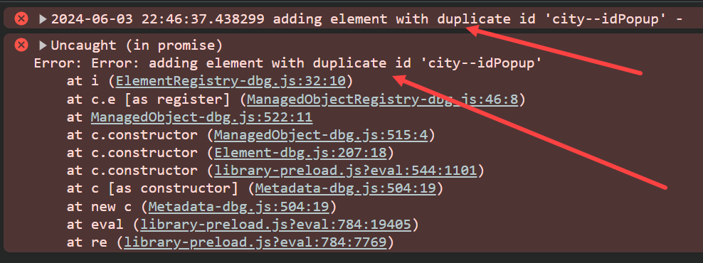

## Exercise 25 - Fragments Deep dive


</br>

**In our previous session we created a blank pop up window for F4 help and filter button that can be accessed only once**

- The reason for the issue is POPUP object gets created once (example : triggering F4 help first time it works second time it wont work)

- When we trigger the same popup window again object creation happens with same name and ended up in error - because object with same name already exist

</br>

</br>


- *When we work with asynchronous functions and promises, the UI5 will not pass their pointer object to the Call back function. So we will not be able to use this pointer which is our controller object inside the callbacks. TO be able to use <b>this</b> pointer inside the call back, we create an extra variable of type local to which we assign this pointer.*

</br>

e.g.

```js

var that = this;

```

</br>

*<b>that</b> variable is a local variable which will behold the controller object for us. And the caller method will actually allow its callback to access its local variable.*

</br>

**Solution**

*View2.controller.js* --- this is a sample code for F4 help same treatment should be given for filter function also 

```js

    oCityPopup: null, // geclare a global variable for holding object 
    onF4help: function () {
        // if the object is not filled 
        //IF NOT oCityPopup IS INITIAL.
        if (!this.oCityPopup) {
            var that = this; // assigned local variable that with this objects
            Fragment.load({
                name: "ntt.hr.payroll.fragments.popup",
                type: "XML",
                id: 'city',
                controller: this // Controller access is provided to the popup 
            })
            // Asynchronous call back - promise 
                .then(function (oPopup) { 
                    // - inside callback function this. controller object wont be accessible 
                    // - so we create a local variable and assign this controller object
                    // - this local varaibel will bve in scope of this whole function and its call back function

                    // assign the object created by system to our global variable
                    that.oCityPopup = oPopup;
                    // change the title
                    that.oCityPopup.setTitle("Select City");
                    that.oCityPopup.open();
                });
        } else {
            // this section is outside call back function so here this. controller works! 
            this.oCityPopup.open();
        }
    },

```
</br></br>

**Populating data value in F4 help**

*So far we just created only a blank pop up with title and no values are populated yet, no we are going to populate the values*


**By Default the fragment wont have access to the model, But if someone who already have access to the model, like view can permit the access of model resources to the fragment, then we can show the data to the user**


</br></br>

*View2.controller.js*

```js

    onF4help: function () {
        // alert('This functionality under construction');
        if (!this.oCityPopup) {
            var that = this;
            Fragment.load({
                name: "ntt.hr.payroll.fragments.popup",
                type: "XML",
                id: 'city',
                controller: this // Controller access is provided to the popup
            })
                // Asynchronous - 1.Call back and 2.Promise
                .then(function (oPopup) { // this oPopup object is an object of Select dialog control of fragments view
                    // assign the object created by system to our global variable
                    that.oCityPopup = oPopup;
                    that.oCityPopup.setTitle("Select City");
//////////////////////////////////////////////////////////////////////////// 
                    // provided access for fragment from the view to get to the model data                           
                    that.getView().addDependent(that.oCityPopup);
                    that.oCityPopup.bindAggregation("items",{
                        path: '/cities',
                        template: new sap.m.DisplayListItem({
                            label: '{cityName}',
                            value: '{famousFor}'
                        })
                    });
////////////////////////////////////////////////////////////////////////////                         
                    that.oCityPopup.open();
                });
        } else {
            this.oCityPopup.open();
        }
    }

```
<br><br>

**Adding multi select to Popup - Filter object used multi select**

*This functionality can be easily achieved by adding a parameter in fragments.xml*

*set multiSelect="true" in SelectDialog control*

<br>

*popup.fragment.xml*

```xml

<core:FragmentDefinition xmlns:core="sap.ui.core" xmlns="sap.m">
<!--ntt.hr.payroll.fragments.popup-->
    <SelectDialog id="idPopup" multiSelect="true" />
</core:FragmentDefinition>


```


</br>


</br></br>
</br></br>
</br></br>

## End of Exercise 25 ---NEXT---> <a href="https://github.com/Octavius-Dante/Arthelais/tree/main/ex_26"> Exercise 26-Fiori Deployments </a>
</br>
<p align="center"> <a href="https://github.com/Octavius-Dante/Arthelais/tree/main"> Main page </a> </p>


</br></br>

**All Previous sessions**
</br></br>
<!-- 
- [x] <a href="https://github.com/Octavius-Dante/Arthelais/tree/main/ex_37"> Exercise 37-Deploy app to launchpad</a>
- [x] <a href="https://github.com/Octavius-Dante/Arthelais/tree/main/ex_36"> Exercise 36-WebIde and Git integration</a>
- [x] <a href="https://github.com/Octavius-Dante/Arthelais/tree/main/ex_35"> Exercise 35-POST, GET and DELETE from Fiori</a>
- [x] <a href="https://github.com/Octavius-Dante/Arthelais/tree/main/ex_34"> Exercise 34-GET and Connect</a>
- [x] <a href="https://github.com/Octavius-Dante/Arthelais/tree/main/ex_33"> Exercise 33-Fiori Project Connect Odata</a>
- [x] <a href="https://github.com/Octavius-Dante/Arthelais/tree/main/ex_32"> Exercise 32-Connectivity</a>
- [x] <a href="https://github.com/Octavius-Dante/Arthelais/tree/main/ex_31"> Exercise 31-Function Import and Images</a>
- [x] <a href="https://github.com/Octavius-Dante/Arthelais/tree/main/ex_30"> Exercise 30-implementing CRUD</a>
- [x] <a href="https://github.com/Octavius-Dante/Arthelais/tree/main/ex_29"> Exercise 29-Implementing GET</a>
- [x] <a href="https://github.com/Octavius-Dante/Arthelais/tree/main/ex_28"> Exercise 28-Create A Gateway Project</a>
- [x] <a href="https://github.com/Octavius-Dante/Arthelais/tree/main/ex_27"> Exercise 27-Odata GET</a>
- [x] <a href="https://github.com/Octavius-Dante/Arthelais/tree/main/ex_26"> Exercise 26-Fiori Deployments</a>
- [x] <a href="https://github.com/Octavius-Dante/Arthelais/tree/main/ex_25"> Exercise 25-Fragments Deep dive</a> -->
- [x] <a href="https://github.com/Octavius-Dante/Arthelais/tree/main/ex_24"> Exercise 24-Fragments</a>
- [x] <a href="https://github.com/Octavius-Dante/Arthelais/tree/main/ex_23"> Exercise 23-Icon Tab bar</a>
- [x] <a href="https://github.com/Octavius-Dante/Arthelais/tree/main/ex_22"> Exercise 22-Route matched Handlers</a>
- [x] <a href="https://github.com/Octavius-Dante/Arthelais/tree/main/ex_21"> Exercise 21-Router Basics</a>
- [x] <a href="https://github.com/Octavius-Dante/Arthelais/tree/main/ex_20"> Exercise 20-Filters on List mode</a>
- [x] <a href="https://github.com/Octavius-Dante/Arthelais/tree/main/ex_19"> Exercise 19-Manifest JSON</a>
- [x] <a href="https://github.com/Octavius-Dante/Arthelais/tree/main/ex_18"> Exercise 18-List Control</a>
- [x] <a href="https://github.com/Octavius-Dante/Arthelais/tree/main/ex_17"> Exercise 17-Fiori Lite app</a>
- [x] <a href="https://github.com/Octavius-Dante/Arthelais/tree/main/ex_16"> Exercise 16-Formatters </a>
- [x] <a href="https://github.com/Octavius-Dante/Arthelais/tree/main/ex_15"> Exercise 15-Element Binding</a>
- [x] <a href="https://github.com/Octavius-Dante/Arthelais/tree/main/ex_14"> Exercise 14-Table control</a>
- [x] <a href="https://github.com/Octavius-Dante/Arthelais/tree/main/ex_13"> Exercise 13-Expression Binding XML Model</a>
- [x] <a href="https://github.com/Octavius-Dante/Arthelais/tree/main/ex_12"> Exercise 12-Json Model Property Binding</a>
- [x] <a href="https://github.com/Octavius-Dante/Arthelais/tree/main/ex_11"> Exercise 11-Model Basics </a>
- [x] <a href="https://github.com/Octavius-Dante/Arthelais/tree/main/ex_10"> Exercise 10-XML Views </a>
- [x] <a href="https://github.com/Octavius-Dante/Arthelais/tree/main/ex_9"> Exercise 9-Control Hierarchy 2</a>
- [x] <a href="https://github.com/Octavius-Dante/Arthelais/tree/main/ex_8"> Exercise 8-Ui5 Control Hierarchy </a>
- [x] <a href="https://github.com/Octavius-Dante/Arthelais/tree/main/ex_7"> Exercise 7-SAP Ui5 Framework </a>
- [x] <a href="https://github.com/Octavius-Dante/Arthelais/tree/main/ex_6"> Exercise 6-JQuery </a>
- [x] <a href="https://github.com/Octavius-Dante/Arthelais/tree/main/ex_5"> Exercise 5-JS deep dive </a>
- [x] <a href="https://github.com/Octavius-Dante/Arthelais/tree/main/ex_4"> Exercise 4-JS basic </a>
- [x] <a href="https://github.com/Octavius-Dante/Arthelais/tree/main/ex_3"> Exercise 3-CSS </a>
- [x] <a href="https://github.com/Octavius-Dante/Arthelais/tree/main/ex_2"> Exercise 2-HTML5</a>
- [x] <a href="https://github.com/Octavius-Dante/Arthelais/tree/main/ex_1"> Exercise 1 -Basic </a>


<!--

<details>
<summary> <b> ALL CODE CHANGES - TODAY SESSION </b> </summary>
</br>
</br>

</br>
</br>

</br>
</br>
</details>

-->