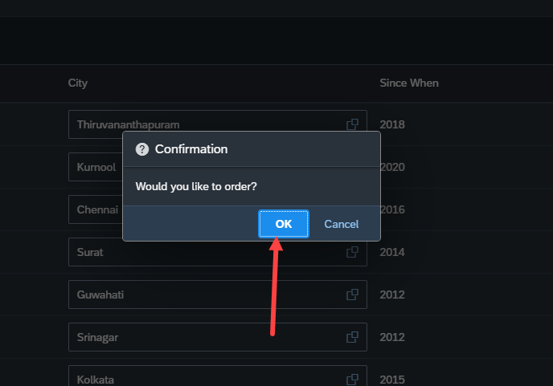
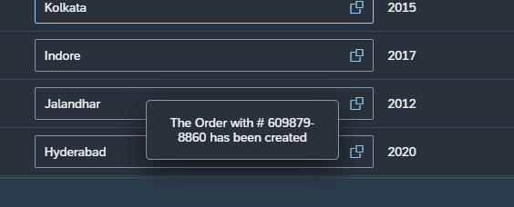

## Exercise 26 - Fiori Deployments

</br>

**SAP Ui5 Message classes**

So far we used alert message in the ui5 web application its a violation of messaging standard in UI5 it is recommended to use Ui5 message classes

- sap.m.MessageBox
- sap.m.MessageTost
- sap.m.MessageView
- sap.m.MessageStrip (consolidate multiple message and display)

</br></br>


**Simple Message box implementation for Order button**

*View2.view.xml*

```xml

    <footer>
        <Toolbar>
<!-- This toolbar spacer responsible for moving the button on the right side -->        
        <ToolbarSpacer/> 
            <Button text="Order" press="onOrder" type="Emphasized"></Button>
            <Button text="Remind later" type="Accept"></Button>
            <Button text="Cancel" press="onCancel" type="Reject"></Button>
        </Toolbar>
    </footer>

```

</br>


*Need to add dependencies for message object usage in controller - top section*

```js

sap.ui.define([
    // 'sap/ui/core/mvc/Controller'
    'ntt/hr/payroll/controller/BaseController',
    "sap/ui/core/Fragment",
    "sap/ui/model/Filter",
    "sap/ui/model/FilterOperator",
////////////////////////////////////////////////////////////////////////////////////////////////////    
    "sap/m/MessageBox",  
    "sap/m/MessageToast",
    "sap/m/MessageStrip" 
], function (Controller, Fragment, Filter, FilterOperator, MessageBox, MessageToast, MessageStrip) {
////////////////////////////////////////////////////////////////////////////////////////////////////
    'use strict';

```


*View2.controller.js*

```js

    handleConfirm: function(status){
        if(status === "OK"){
            // alert("This functionality is under construction");            
        }else{

        }
    },

    onOrder: function(params){
        MessageBox.confirm("Confirmation", {
            title : 'Confirmation',
            onClose: this.handleConfirm
        })
    }

```

</br></br>

**Simple Message Toast implementation - static text**

*View2.controller.js*

```js

    handleConfirm: function(status){
        if(status === "OK"){
            // alert("This functionality is under construction");
            MessageToast.show("The Order with # XXXXX-XX has been created");
        }else{

        }
    }

```

</br></br>

**Implementing i18n text for Messages and passing a value to message with place holder - Dynamic text**

</br>

*Maintain i18n text as shown below*

</br>

</br></br>

*i18n text*

```bat

APP_TITLE="My First Fiori App"
APP_DESCRIPTION="Developed by Vivian Ocatvius for learning"
XTIT_VIEW1=Welcome to my store
XMSG_CONFIRM=Would you like to order?
XMSG_ORDER=The Order with # {0} has been created

```

</br>

*We need to implement a message read function in base controller to pass dynamic value text to message with place holders*

*BaseController.js*

```js

sap.ui.define([
    'sap/ui/core/mvc/Controller',
    'ntt/hr/payroll/util/formatter',  // formatter.js included as dependency
    'ntt/hr/payroll/util/stockstat'   // stock status
], function(Controller, Formatter, Stockstat){  // formatter passed as argument
    'use strict';
    return Controller.extend("ntt.hr.payroll.controller.BaseController", {
        formatter_curr : Formatter, // global variable declared for usage in every places
        stock_status : Stockstat,
        extractPath: function(oEvent){
            var fruitId = oEvent.getParameter("arguments").fruitId;
            return '/fruits/' + fruitId;            
        },
/////////////////////////////////////////////////////////////////////////////////////
        readMessage: function(key, param1){
            var oResourceModel = this.getOwnerComponent().getrModel("i18n");
            var oResourceBundle = oResourceModel.getResourceBundle();
            return oResourceBundle.getText(key, param1);
        }
/////////////////////////////////////////////////////////////////////////////////////
    });
});

```

</br>

*View2.controller.js*

```js

    handleConfirm: function(status){
        if(status === "OK"){
            // alert("This functionality is under construction");
            MessageToast.show(this.readMessage("XMSG_ORDERL","609879-8860"));
        }else{

        }
    },

    onOrder: function(params){
        var that = this;
        MessageBox.confirm(this.readMessage("XMSG_CONFIRM"), {
            title : 'Confirmation',
            // now (this.) pointer will be pased as controlelr object to call back function handleConfirm
            onClose: this.handleConfirm.bind(this) 
        })
    }

```

</br>

**Testing**

</br>

</br></br>

</br></br>

</br></br>


</br></br>
</br></br>
</br></br>

## End of Exercise 26 ---NEXT---> <a href="https://github.com/Octavius-Dante/Arthelais/tree/main/ex_27"> Exercise 27-OData GET </a>
</br>
<p align="center"> <a href="https://github.com/Octavius-Dante/Arthelais/tree/main"> Main page </a> </p>


</br></br>

**All Previous sessions**
</br></br>

<!-- - [x] <a href="https://github.com/Octavius-Dante/Arthelais/tree/main/ex_37"> Exercise 37-Deploy app to launchpad</a>
- [x] <a href="https://github.com/Octavius-Dante/Arthelais/tree/main/ex_36"> Exercise 36-WebIde and Git integration</a>
- [x] <a href="https://github.com/Octavius-Dante/Arthelais/tree/main/ex_35"> Exercise 35-POST, GET and DELETE from Fiori</a>
- [x] <a href="https://github.com/Octavius-Dante/Arthelais/tree/main/ex_34"> Exercise 34-GET and Connect</a>
- [x] <a href="https://github.com/Octavius-Dante/Arthelais/tree/main/ex_33"> Exercise 33-Fiori Project Connect Odata</a>
- [x] <a href="https://github.com/Octavius-Dante/Arthelais/tree/main/ex_32"> Exercise 32-Connectivity</a>
- [x] <a href="https://github.com/Octavius-Dante/Arthelais/tree/main/ex_31"> Exercise 31-Function Import and Images</a>
- [x] <a href="https://github.com/Octavius-Dante/Arthelais/tree/main/ex_30"> Exercise 30-implementing CRUD</a>
- [x] <a href="https://github.com/Octavius-Dante/Arthelais/tree/main/ex_29"> Exercise 29-Implementing GET</a>
- [x] <a href="https://github.com/Octavius-Dante/Arthelais/tree/main/ex_28"> Exercise 28-Create A Gateway Project</a>
- [x] <a href="https://github.com/Octavius-Dante/Arthelais/tree/main/ex_27"> Exercise 27-Odata GET</a>
- [x] <a href="https://github.com/Octavius-Dante/Arthelais/tree/main/ex_26"> Exercise 26-Fiori Deployments</a> -->
- [x] <a href="https://github.com/Octavius-Dante/Arthelais/tree/main/ex_25"> Exercise 25-Fragments Deep dive</a>
- [x] <a href="https://github.com/Octavius-Dante/Arthelais/tree/main/ex_24"> Exercise 24-Fragments</a>
- [x] <a href="https://github.com/Octavius-Dante/Arthelais/tree/main/ex_23"> Exercise 23-Icon Tab bar</a>
- [x] <a href="https://github.com/Octavius-Dante/Arthelais/tree/main/ex_22"> Exercise 22-Route matched Handlers</a>
- [x] <a href="https://github.com/Octavius-Dante/Arthelais/tree/main/ex_21"> Exercise 21-Router Basics</a>
- [x] <a href="https://github.com/Octavius-Dante/Arthelais/tree/main/ex_20"> Exercise 20-Filters on List mode</a>
- [x] <a href="https://github.com/Octavius-Dante/Arthelais/tree/main/ex_19"> Exercise 19-Manifest JSON</a>
- [x] <a href="https://github.com/Octavius-Dante/Arthelais/tree/main/ex_18"> Exercise 18-List Control</a>
- [x] <a href="https://github.com/Octavius-Dante/Arthelais/tree/main/ex_17"> Exercise 17-Fiori Lite app</a>
- [x] <a href="https://github.com/Octavius-Dante/Arthelais/tree/main/ex_16"> Exercise 16-Formatters </a>
- [x] <a href="https://github.com/Octavius-Dante/Arthelais/tree/main/ex_15"> Exercise 15-Element Binding</a>
- [x] <a href="https://github.com/Octavius-Dante/Arthelais/tree/main/ex_14"> Exercise 14-Table control</a>
- [x] <a href="https://github.com/Octavius-Dante/Arthelais/tree/main/ex_13"> Exercise 13-Expression Binding XML Model</a>
- [x] <a href="https://github.com/Octavius-Dante/Arthelais/tree/main/ex_12"> Exercise 12-Json Model Property Binding</a>
- [x] <a href="https://github.com/Octavius-Dante/Arthelais/tree/main/ex_11"> Exercise 11-Model Basics </a>
- [x] <a href="https://github.com/Octavius-Dante/Arthelais/tree/main/ex_10"> Exercise 10-XML Views </a>
- [x] <a href="https://github.com/Octavius-Dante/Arthelais/tree/main/ex_9"> Exercise 9-Control Hierarchy 2</a>
- [x] <a href="https://github.com/Octavius-Dante/Arthelais/tree/main/ex_8"> Exercise 8-Ui5 Control Hierarchy </a>
- [x] <a href="https://github.com/Octavius-Dante/Arthelais/tree/main/ex_7"> Exercise 7-SAP Ui5 Framework </a>
- [x] <a href="https://github.com/Octavius-Dante/Arthelais/tree/main/ex_6"> Exercise 6-JQuery </a>
- [x] <a href="https://github.com/Octavius-Dante/Arthelais/tree/main/ex_5"> Exercise 5-JS deep dive </a>
- [x] <a href="https://github.com/Octavius-Dante/Arthelais/tree/main/ex_4"> Exercise 4-JS basic </a>
- [x] <a href="https://github.com/Octavius-Dante/Arthelais/tree/main/ex_3"> Exercise 3-CSS </a>
- [x] <a href="https://github.com/Octavius-Dante/Arthelais/tree/main/ex_2"> Exercise 2-HTML5</a>
- [x] <a href="https://github.com/Octavius-Dante/Arthelais/tree/main/ex_1"> Exercise 1 -Basic </a>


<!--

<details>
<summary> <b> ALL CODE CHANGES - TODAY SESSION </b> </summary>
</br>
</br>

</br>
</br>

</br>
</br>
</details>

-->