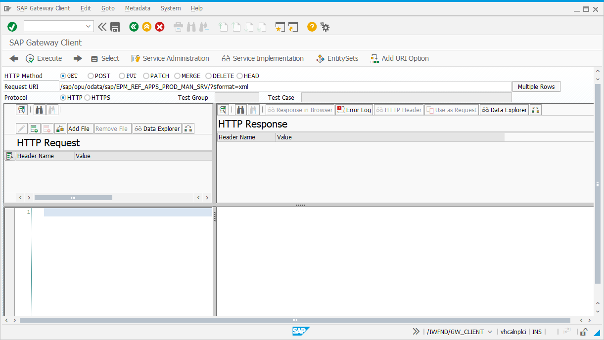

## Exercise 27 - OData GET

</br>

**Identify Gateway services Version**

*In Order to Work with Gateway services in SAP ERP (ECC | S/4 HANA) systems, Need to identify the version in the system,* 
<br> *SAP Gateway services version should be greater than 7.40*

*SAP_BASIS - 740 or above*
<br> and 
<br> *SAP_GWFND - 740 or above*


</br>

</br></br>

**Configuration settings for Gateway services**

*In SPRO T-code in the following tree path the settings should be active as shown below*

</br>

</br></br>


## OData Service Origin and Functionality

</br>

OData Service stands for **Open Data Protocol**, it is used to expose data over network **(http/https) protocol**.
</br> It was initially developed by an organization called *OASIS* nad later acquired by *Microsoft* and became an Open source.
</br> OData is a **REST (Representational State transfer)** also known as **Stateless communication.**

<br>

**OData Service is an open source** in the generation of technology and in the world of web applications billions of organizations are using it in day today life
this OData can be built using JAVA, .Net, Java Script also in cloud based applications.

<br>

**Stateful Communication** : contains session example SAP logon pad if there is inactivity the session times out.

<br>

**Stateless Communication** : doesn't operate based on session from back end it operates based on request and response if there is a request received it process it and sends response.

</br></br>

> [!IMPORTANT]
> Fiori only communicates to OData service it cannot communicate to CDS or ABAP directly it needs to be converted into OData service.

</br></br>

## Demo OData service in any ECC or S/4 HANA On-Premise systems

</br>


SAP Provides a sample OData service in every SAP system for demo and training purpose. Which contains different entity sets for training like Sales order, Product, supplier, customer, ..... GW_SAMPLEBASIC

By Default in your system it wont be active, we need to activate it. 

</br></br>

**Important T-codes for OData service**

*1. Maintain and register services :* **/n/IWFND/MAINT_SERVICE** 

*2. Test a service in SAP System :* **/n/IWFND/GW_CLIENT** 

*3. To detect runtime errors for service :* **/n/IWFND/ERROR_LOG** 

</br></br>


**/n/IWFND/MAINT_SERVICE** 

</br>

</br></br>

**/n/IWFND/GW_CLIENT**

</br>

</br></br>

**/n/IWFND/ERROR_LOG** 

</br>

</br></br>


**Sample basic OData service in T-code : /n/IWFND/MAINT_SERVICE**

</br></br>

</br></br>

</br></br>

</br></br>

</br></br>

The following links are used in my demo server the path starting from '/sap/opu/odata/IWBEP/------------' this remains the same only domain and port differs according to company's OData service path

</br></br>

## Service calls

</br>

1. *Service document - When we hit an OData service it loads the service document which shows collection of all the entity sets.* 
<br> *Entity Set - End point on which we apply all the CURDQ Operation.*

```http
http://vhcalnplci.dummy.nodomain:8000/sap/opu/odata/IWBEP/GWSAMPLE_BASIC/?$format=xml
```

</br>

</br></br>

> [!IMPORTANT]
> Entity type is a structure of entity set (aka) structure of business data

</br></br>

2. *Service metadata Document - Which holds the information of the data about the data. It contains all the list of service entity types composed of property and keys*

```http
http://vhcalnplci.dummy.nodomain:8000/sap/opu/odata/IWBEP/GWSAMPLE_BASIC/$metadata
```

You can notice entity set structures field details and its length in this metadata

</br>

</br></br>

[Metadata XML sample here download it and open it in browser](https://github.com/Octavius-Dante/Arthelais/blob/main/ex_27/GWSAMPLE_BASIC-metadata.xml)

</br></br>

## OData service - GET Calls (aka) Read operations 

</br>

> [!IMPORTANT]
> First parameter in OData HTTP call starts with '?' question mark operations starts with '$' and all consecutive operations are added with '&' 

</br></br>

```http
Sample 1 : (ProductSet?$format=json)

Sample 2 : https://odata-api.blah.com/accounts?$expand=company&$filter=company/name eq 'Nebcorp'&$expand=company/company_plan

Sample with spaces for understanding : https://odata-api.blah.com/accounts ? $expand=company & $filter=company/name eq 'Nebcorp' & $expand=company/company_plan

```

</br></br>

1. *Read all the records of the EntitySet this is an equivalent to (SELECT * FROM DB.Table)* 

```http
http://vhcalnplci.dummy.nodomain:8000/sap/opu/odata/IWBEP/GWSAMPLE_BASIC/ProductSet?$format=json
```

</br>

</br></br>

> [!IMPORTANT]
> Use JSON viewer or JSON formatter plugin in chrome browser for better readability of JSON data

</br></br>

> [!IMPORTANT]
> Pagination : business data will be huge cant load all billions of records in single go so small chunk of data is loaded and on demand it will load further data example  youtube video buffering 

</br></br>

2. *Read only top 2 records basic pagination sample 1*

```http
http://vhcalnplci.dummy.nodomain:8000/sap/opu/odata/IWBEP/GWSAMPLE_BASIC/ProductSet?$format=json&$top=2
```

</br>

</br></br>

3. *Read only 2 records after skipping first 2 records basic pagination sample 2*

```http
http://vhcalnplci.dummy.nodomain:8000/sap/opu/odata/IWBEP/GWSAMPLE_BASIC/ProductSet?$format=json&$top=2&$skip=2
```

</br>

</br></br>


</br></br>
</br></br>
</br></br>

## End of Exercise 27 ---NEXT---> <a href="https://github.com/Octavius-Dante/Arthelais/tree/main/ex_28"> Exercise 28-Create A Gateway Project</a>
</br>
<p align="center"> <a href="https://github.com/Octavius-Dante/Arthelais/tree/main"> Main page </a> </p>


</br></br>

**All Previous sessions**
</br></br>

<!-- - [x] <a href="https://github.com/Octavius-Dante/Arthelais/tree/main/ex_37"> Exercise 37-Deploy app to launchpad</a>
- [x] <a href="https://github.com/Octavius-Dante/Arthelais/tree/main/ex_36"> Exercise 36-WebIde and Git integration</a>
- [x] <a href="https://github.com/Octavius-Dante/Arthelais/tree/main/ex_35"> Exercise 35-POST, GET and DELETE from Fiori</a>
- [x] <a href="https://github.com/Octavius-Dante/Arthelais/tree/main/ex_34"> Exercise 34-GET and Connect</a>
- [x] <a href="https://github.com/Octavius-Dante/Arthelais/tree/main/ex_33"> Exercise 33-Fiori Project Connect Odata</a>
- [x] <a href="https://github.com/Octavius-Dante/Arthelais/tree/main/ex_32"> Exercise 32-Connectivity</a>
- [x] <a href="https://github.com/Octavius-Dante/Arthelais/tree/main/ex_31"> Exercise 31-Function Import and Images</a>
- [x] <a href="https://github.com/Octavius-Dante/Arthelais/tree/main/ex_30"> Exercise 30-implementing CRUD</a>
- [x] <a href="https://github.com/Octavius-Dante/Arthelais/tree/main/ex_29"> Exercise 29-Implementing GET</a>
- [x] <a href="https://github.com/Octavius-Dante/Arthelais/tree/main/ex_28"> Exercise 28-Create A Gateway Project</a>
- [x] <a href="https://github.com/Octavius-Dante/Arthelais/tree/main/ex_27"> Exercise 27-Odata GET</a> -->
- [x] <a href="https://github.com/Octavius-Dante/Arthelais/tree/main/ex_26"> Exercise 26-Fiori Deployments</a>
- [x] <a href="https://github.com/Octavius-Dante/Arthelais/tree/main/ex_25"> Exercise 25-Fragments Deep dive</a>
- [x] <a href="https://github.com/Octavius-Dante/Arthelais/tree/main/ex_24"> Exercise 24-Fragments</a>
- [x] <a href="https://github.com/Octavius-Dante/Arthelais/tree/main/ex_23"> Exercise 23-Icon Tab bar</a>
- [x] <a href="https://github.com/Octavius-Dante/Arthelais/tree/main/ex_22"> Exercise 22-Route matched Handlers</a>
- [x] <a href="https://github.com/Octavius-Dante/Arthelais/tree/main/ex_21"> Exercise 21-Router Basics</a>
- [x] <a href="https://github.com/Octavius-Dante/Arthelais/tree/main/ex_20"> Exercise 20-Filters on List mode</a>
- [x] <a href="https://github.com/Octavius-Dante/Arthelais/tree/main/ex_19"> Exercise 19-Manifest JSON</a>
- [x] <a href="https://github.com/Octavius-Dante/Arthelais/tree/main/ex_18"> Exercise 18-List Control</a>
- [x] <a href="https://github.com/Octavius-Dante/Arthelais/tree/main/ex_17"> Exercise 17-Fiori Lite app</a>
- [x] <a href="https://github.com/Octavius-Dante/Arthelais/tree/main/ex_16"> Exercise 16-Formatters </a>
- [x] <a href="https://github.com/Octavius-Dante/Arthelais/tree/main/ex_15"> Exercise 15-Element Binding</a>
- [x] <a href="https://github.com/Octavius-Dante/Arthelais/tree/main/ex_14"> Exercise 14-Table control</a>
- [x] <a href="https://github.com/Octavius-Dante/Arthelais/tree/main/ex_13"> Exercise 13-Expression Binding XML Model</a>
- [x] <a href="https://github.com/Octavius-Dante/Arthelais/tree/main/ex_12"> Exercise 12-Json Model Property Binding</a>
- [x] <a href="https://github.com/Octavius-Dante/Arthelais/tree/main/ex_11"> Exercise 11-Model Basics </a>
- [x] <a href="https://github.com/Octavius-Dante/Arthelais/tree/main/ex_10"> Exercise 10-XML Views </a>
- [x] <a href="https://github.com/Octavius-Dante/Arthelais/tree/main/ex_9"> Exercise 9-Control Hierarchy 2</a>
- [x] <a href="https://github.com/Octavius-Dante/Arthelais/tree/main/ex_8"> Exercise 8-Ui5 Control Hierarchy </a>
- [x] <a href="https://github.com/Octavius-Dante/Arthelais/tree/main/ex_7"> Exercise 7-SAP Ui5 Framework </a>
- [x] <a href="https://github.com/Octavius-Dante/Arthelais/tree/main/ex_6"> Exercise 6-JQuery </a>
- [x] <a href="https://github.com/Octavius-Dante/Arthelais/tree/main/ex_5"> Exercise 5-JS deep dive </a>
- [x] <a href="https://github.com/Octavius-Dante/Arthelais/tree/main/ex_4"> Exercise 4-JS basic </a>
- [x] <a href="https://github.com/Octavius-Dante/Arthelais/tree/main/ex_3"> Exercise 3-CSS </a>
- [x] <a href="https://github.com/Octavius-Dante/Arthelais/tree/main/ex_2"> Exercise 2-HTML5</a>
- [x] <a href="https://github.com/Octavius-Dante/Arthelais/tree/main/ex_1"> Exercise 1 -Basic </a>


<!--

<details>
<summary> <b> ALL CODE CHANGES - TODAY SESSION </b> </summary>
</br>
</br>

</br>
</br>

</br>
</br>
</details>

-->