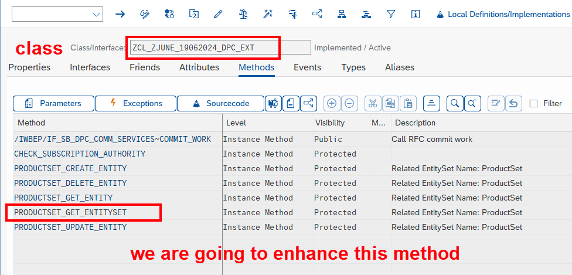
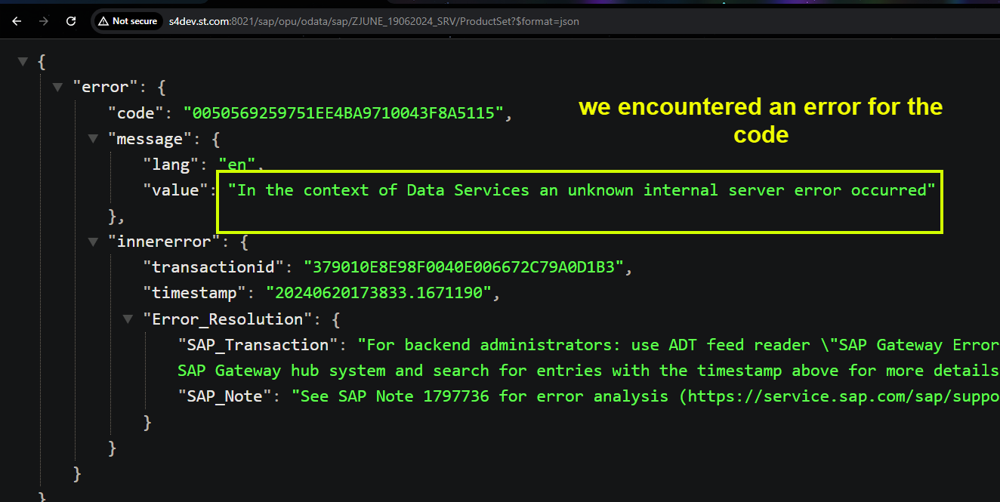
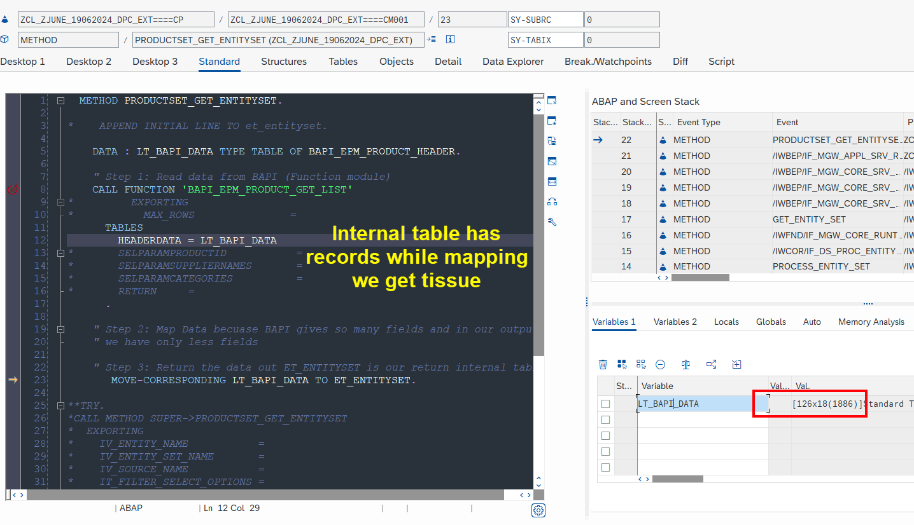
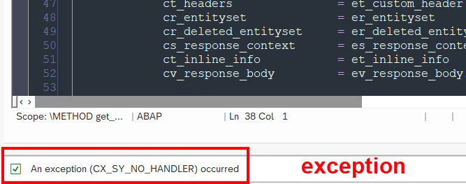
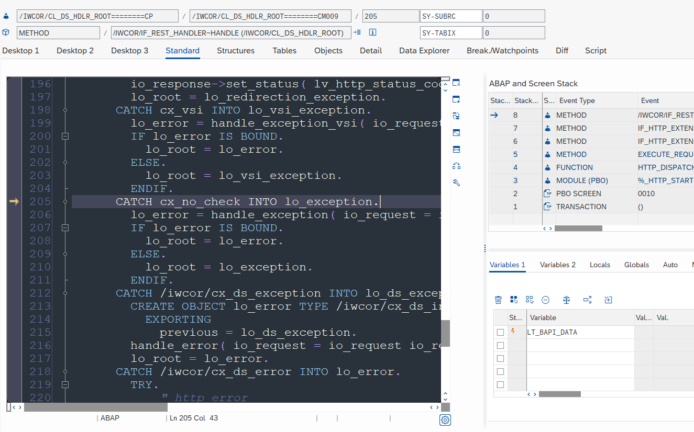
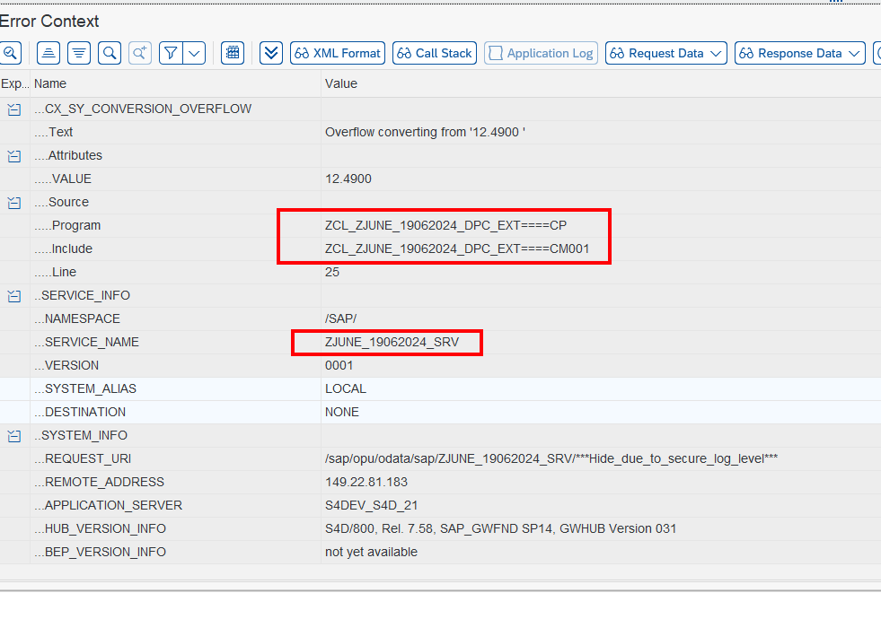
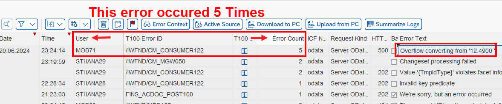
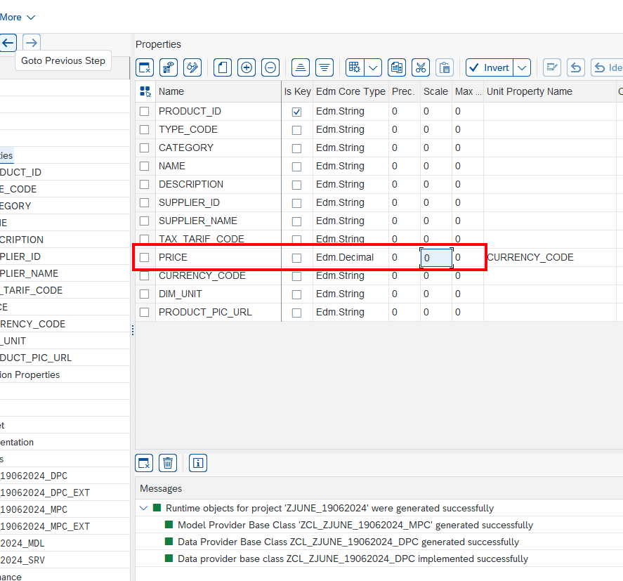

## Exercise 29 - Implementing GET

</br>


> [!NOTE]
>  In this section we discuss about ABAP coding so user should know how to program in ABAP to understand things</br>


</br></br>

**We will improve our 'GET_ENTITY_SET' Method in our OData service we created yesterday**

</br>

</br></br>

*Process that we are going to do in ABAP is listed below*

```abap


     " Step 1: Read data from BAPI (Function module)
        
     " Step 2: Map Data because BAPI gives so many fields and in our output
        " we have only less fields 
        
     " Step 3: Return the data out ET_ENTITYSET is our return internal table    


```

</br></br>


**ABAP code block used inside this method # 1**

</br>

```abap

  METHOD PRODUCTSET_GET_ENTITYSET.

*    APPEND INITIAL LINE TO et_entityset.

    DATA : LT_BAPI_DATA TYPE TABLE OF BAPI_EPM_PRODUCT_HEADER.

    " Step 1: Read data from BAPI (Function module)
    CALL FUNCTION 'BAPI_EPM_PRODUCT_GET_LIST'
*         EXPORTING
*           MAX_ROWS               =
      TABLES
        HEADERDATA = LT_BAPI_DATA
*       SELPARAMPRODUCTID           =
*       SELPARAMSUPPLIERNAMES       =
*       SELPARAMCATEGORIES          =
*       RETURN     =
      .

    " Step 2: Map Data becuase BAPI gives so many fields and in our output
    " we have only less fields

    " Step 3: Return the data out ET_ENTITYSET is our return internal table
       MOVE-CORRESPONDING LT_BAPI_DATA TO ET_ENTITYSET.

  ENDMETHOD.

```

</br></br>

**Testing**

</br>

</br></br>

**Debugging and identifying the problem**

<details>
<summary> <b> Expand this to see the details </b> </summary>
</br>
</br>

</br></br>

</br>

</br>

</br></br>
</details>

</br></br>

*Assumption : BAPI structure has more fields and ET_ENTITY_SET has less fields so we encountered error during assignment of values to the structure*

</br></br>

**To identify the exact issue go to transaction : /N/IWFND/ERROR_LOG**

<details>
<summary> <b> Expand this to see the details </b> </summary>
</br>
</br>
</br>

</br></br>

*Confirming that this is from our Class*

</br>

</br>
</br>

</br></br>
</details>

</br></br>

**Make necessary corrections to OData service as shown below # 2**

</br>

</br></br>


</br></br>

**Make necessary corrections to the code as shown below # 2**

</br>

```abap

  METHOD PRODUCTSET_GET_ENTITYSET.

*    APPEND INITIAL LINE TO et_entityset.

    DATA : LT_BAPI_DATA TYPE TABLE OF BAPI_EPM_PRODUCT_HEADER.

    " Step 1: Read data from BAPI (Function module)
    CALL FUNCTION 'BAPI_EPM_PRODUCT_GET_LIST'
*         EXPORTING
*           MAX_ROWS               =
      TABLES
        HEADERDATA = LT_BAPI_DATA
*       SELPARAMPRODUCTID           =
*       SELPARAMSUPPLIERNAMES       =
*       SELPARAMCATEGORIES          =
*       RETURN     =
      .

    " Step 2: Map Data becuase BAPI gives so many fields and in our output
    " we have only less fields

    " Step 3: Return the data out ET_ENTITYSET is our return internal table
*       MOVE-CORRESPONDING LT_BAPI_DATA TO ET_ENTITYSET.

      ET_ENTITYSET = CORRESPONDING #( LT_BAPI_DATA ).  " New ABAP syntax for move corresponding

  ENDMETHOD.

```

</br>


</br></br>
</br></br>
</br></br>

## End of Exercise 29 ---NEXT---> <a href="https://github.com/Octavius-Dante/Arthelais/tree/main/ex_30"> Exercise 30-Implementing CRUD </a>
</br>
<p align="center"> <a href="https://github.com/Octavius-Dante/Arthelais/tree/main"> Main page </a> </p>


</br></br>

**All Previous sessions**
</br></br>

<!-- - [x] <a href="https://github.com/Octavius-Dante/Arthelais/tree/main/ex_37"> Exercise 37-Deploy app to launchpad</a>
- [x] <a href="https://github.com/Octavius-Dante/Arthelais/tree/main/ex_36"> Exercise 36-WebIde and Git integration</a>
- [x] <a href="https://github.com/Octavius-Dante/Arthelais/tree/main/ex_35"> Exercise 35-POST, GET and DELETE from Fiori</a>
- [x] <a href="https://github.com/Octavius-Dante/Arthelais/tree/main/ex_34"> Exercise 34-GET and Connect</a>
- [x] <a href="https://github.com/Octavius-Dante/Arthelais/tree/main/ex_33"> Exercise 33-Fiori Project Connect Odata</a>
- [x] <a href="https://github.com/Octavius-Dante/Arthelais/tree/main/ex_32"> Exercise 32-Connectivity</a>
- [x] <a href="https://github.com/Octavius-Dante/Arthelais/tree/main/ex_31"> Exercise 31-Function Import and Images</a>
- [x] <a href="https://github.com/Octavius-Dante/Arthelais/tree/main/ex_30"> Exercise 30-implementing CRUD</a>
- [x] <a href="https://github.com/Octavius-Dante/Arthelais/tree/main/ex_29"> Exercise 29-Implementing GET</a> -->
- [x] <a href="https://github.com/Octavius-Dante/Arthelais/tree/main/ex_28"> Exercise 28-Create A Gateway Project</a>
- [x] <a href="https://github.com/Octavius-Dante/Arthelais/tree/main/ex_27"> Exercise 27-Odata GET</a>
- [x] <a href="https://github.com/Octavius-Dante/Arthelais/tree/main/ex_26"> Exercise 26-Fiori Deployments</a>
- [x] <a href="https://github.com/Octavius-Dante/Arthelais/tree/main/ex_25"> Exercise 25-Fragments Deep dive</a>
- [x] <a href="https://github.com/Octavius-Dante/Arthelais/tree/main/ex_24"> Exercise 24-Fragments</a>
- [x] <a href="https://github.com/Octavius-Dante/Arthelais/tree/main/ex_23"> Exercise 23-Icon Tab bar</a>
- [x] <a href="https://github.com/Octavius-Dante/Arthelais/tree/main/ex_22"> Exercise 22-Route matched Handlers</a>
- [x] <a href="https://github.com/Octavius-Dante/Arthelais/tree/main/ex_21"> Exercise 21-Router Basics</a>
- [x] <a href="https://github.com/Octavius-Dante/Arthelais/tree/main/ex_20"> Exercise 20-Filters on List mode</a>
- [x] <a href="https://github.com/Octavius-Dante/Arthelais/tree/main/ex_19"> Exercise 19-Manifest JSON</a>
- [x] <a href="https://github.com/Octavius-Dante/Arthelais/tree/main/ex_18"> Exercise 18-List Control</a>
- [x] <a href="https://github.com/Octavius-Dante/Arthelais/tree/main/ex_17"> Exercise 17-Fiori Lite app</a>
- [x] <a href="https://github.com/Octavius-Dante/Arthelais/tree/main/ex_16"> Exercise 16-Formatters </a>
- [x] <a href="https://github.com/Octavius-Dante/Arthelais/tree/main/ex_15"> Exercise 15-Element Binding</a>
- [x] <a href="https://github.com/Octavius-Dante/Arthelais/tree/main/ex_14"> Exercise 14-Table control</a>
- [x] <a href="https://github.com/Octavius-Dante/Arthelais/tree/main/ex_13"> Exercise 13-Expression Binding XML Model</a>
- [x] <a href="https://github.com/Octavius-Dante/Arthelais/tree/main/ex_12"> Exercise 12-Json Model Property Binding</a>
- [x] <a href="https://github.com/Octavius-Dante/Arthelais/tree/main/ex_11"> Exercise 11-Model Basics </a>
- [x] <a href="https://github.com/Octavius-Dante/Arthelais/tree/main/ex_10"> Exercise 10-XML Views </a>
- [x] <a href="https://github.com/Octavius-Dante/Arthelais/tree/main/ex_9"> Exercise 9-Control Hierarchy 2</a>
- [x] <a href="https://github.com/Octavius-Dante/Arthelais/tree/main/ex_8"> Exercise 8-Ui5 Control Hierarchy </a>
- [x] <a href="https://github.com/Octavius-Dante/Arthelais/tree/main/ex_7"> Exercise 7-SAP Ui5 Framework </a>
- [x] <a href="https://github.com/Octavius-Dante/Arthelais/tree/main/ex_6"> Exercise 6-JQuery </a>
- [x] <a href="https://github.com/Octavius-Dante/Arthelais/tree/main/ex_5"> Exercise 5-JS deep dive </a>
- [x] <a href="https://github.com/Octavius-Dante/Arthelais/tree/main/ex_4"> Exercise 4-JS basic </a>
- [x] <a href="https://github.com/Octavius-Dante/Arthelais/tree/main/ex_3"> Exercise 3-CSS </a>
- [x] <a href="https://github.com/Octavius-Dante/Arthelais/tree/main/ex_2"> Exercise 2-HTML5</a>
- [x] <a href="https://github.com/Octavius-Dante/Arthelais/tree/main/ex_1"> Exercise 1 -Basic </a>


<!--

<details>
<summary> <b> ALL CODE CHANGES - TODAY SESSION </b> </summary>
</br>
</br>

</br>
</br>

</br>
</br>
</details>

-->