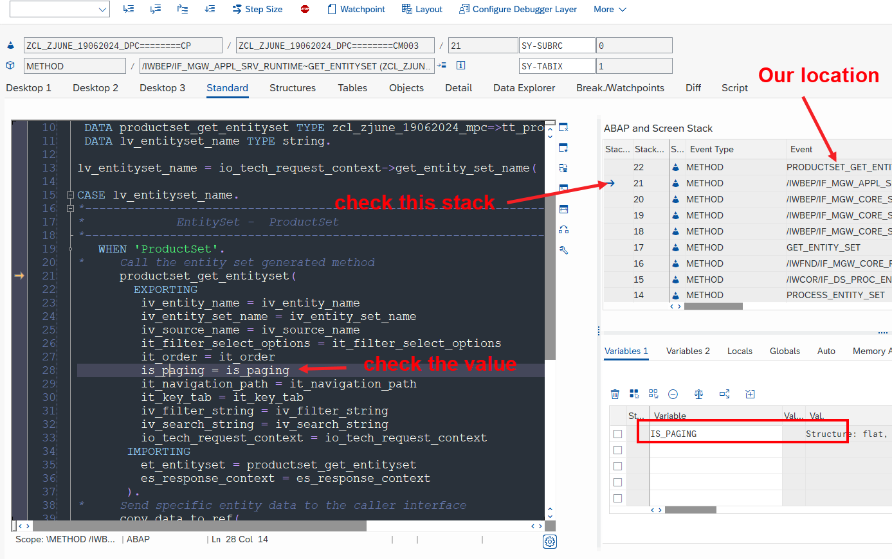

## Exercise 29 - Implementing GET

</br>


> [!NOTE]
>  In this section we discuss about ABAP coding so user should know how to program in ABAP to understand things</br>


</br></br>

**We will improve our 'GET_ENTITY_SET' Method in our OData service we created yesterday**

</br>

</br></br>

*Process that we are going to do in ABAP is listed below*

```ABAP


     " Step 1: Read data from BAPI (Function module)
        
     " Step 2: Map Data because BAPI gives so many fields and in our output
        " we have only less fields 
        
     " Step 3: Return the data out ET_ENTITYSET is our return internal table    


```

</br></br>


**ABAP code used inside this method # 1**

</br>

```ABAP

  METHOD PRODUCTSET_GET_ENTITYSET.

*    APPEND INITIAL LINE TO et_entityset.

    DATA : LT_BAPI_DATA TYPE TABLE OF BAPI_EPM_PRODUCT_HEADER.

    " Step 1: Read data from BAPI (Function module)
    CALL FUNCTION 'BAPI_EPM_PRODUCT_GET_LIST'
*         EXPORTING
*           MAX_ROWS               =
      TABLES
        HEADERDATA = LT_BAPI_DATA
*       SELPARAMPRODUCTID           =
*       SELPARAMSUPPLIERNAMES       =
*       SELPARAMCATEGORIES          =
*       RETURN     =
      .

    " Step 2: Map Data becuase BAPI gives so many fields and in our output
    " we have only less fields

    " Step 3: Return the data out ET_ENTITYSET is our return internal table
       MOVE-CORRESPONDING LT_BAPI_DATA TO ET_ENTITYSET.

  ENDMETHOD.

```

</br></br>

<details>
<summary> <b> Testing </b> </summary>
</br>

</br>

</br></br>

</details>
</br>

**Debugging and identifying the problem**

<details>
<summary> <b> Expand this to see the details </b> </summary>
</br>
</br>

</br></br>

</br>

</br>

</br></br>
</details>

</br></br>

*Assumption 1 : BAPI structure has more fields and ET_ENTITY_SET has less fields so we encountered error during assignment of values to the structure*


*Assumption 2 : Data tytpe mismatch during assignment of values*


</br></br>

**To identify the exact issue go to transaction : /N/IWFND/ERROR_LOG**

<details>
<summary> <b> Expand this to see the details </b> </summary>
</br>
</br>
</br>

</br></br>

*Confirming that this is from our Class*

</br>

</br>
</br>

</br></br>
</details>

</br></br>

<details>
<summary> <b> Make necessary corrections to OData service as shown below </b> </summary>
</br>
</br>

</br>

</br></br>

</details>
</br></br>

**ABAP code used inside this method # 2**

</br>

```ABAP

  METHOD PRODUCTSET_GET_ENTITYSET.

*    APPEND INITIAL LINE TO et_entityset.

    DATA : LT_BAPI_DATA TYPE TABLE OF BAPI_EPM_PRODUCT_HEADER.

    " Step 1: Read data from BAPI (Function module)
    CALL FUNCTION 'BAPI_EPM_PRODUCT_GET_LIST'
*         EXPORTING
*           MAX_ROWS               =
      TABLES
        HEADERDATA = LT_BAPI_DATA
*       SELPARAMPRODUCTID           =
*       SELPARAMSUPPLIERNAMES       =
*       SELPARAMCATEGORIES          =
*       RETURN     =
      .

    " Step 2: Map Data becuase BAPI gives so many fields and in our output
    " we have only less fields

    " Step 3: Return the data out ET_ENTITYSET is our return internal table
*       MOVE-CORRESPONDING LT_BAPI_DATA TO ET_ENTITYSET. " This code also works

      ET_ENTITYSET = CORRESPONDING #( LT_BAPI_DATA ).  " New ABAP syntax for move corresponding

  ENDMETHOD.

```

</br>

<details>
<summary> <b> Testing after corrections </b> </summary>
</br>
</br>

</br>

</br></br>

</br></br>

</br></br>
</details>

</br></br>

```http

// $FORMAT
http://s4dev.st.com:8021/sap/opu/odata/sap/ZJUNE_19062024_SRV/ProductSet?$format=json

// $COUNT
http://s4dev.st.com:8021/sap/opu/odata/sap/ZJUNE_19062024_SRV/ProductSet/$count

// $SELECT = PRODUCT_ID , CATEGORY , NAME
http://s4dev.st.com:8021/sap/opu/odata/sap/ZJUNE_19062024_SRV/ProductSet?$format=json&$select=PRODUCT_ID,CATEGORY,NAME

```

</br></br></br>

## Implementing Pagination for 'GET' operations

</br>

**Put break point and trigger the following request from browser**

</br>

```http

// $TOP = 25
http://s4dev.st.com:8021/sap/opu/odata/sap/ZJUNE_19062024_SRV/ProductSet?$format=json&$select=PRODUCT_ID,CATEGORY,NAME&$top=25

```

**Set a break-point and in debugger identify the list of structures and see what is the value passed in it during $top and $skip operation triggered from browser**

</br>


<details>
<summary> <b> Identifying Pagination value in debugger </b> </summary>
</br>
</br>

</br>

</br></br>

</br></br>

</br></br>
</details>


</br></br>

**ABAP code used inside this method # 3**

</br>

```ABAP

  METHOD PRODUCTSET_GET_ENTITYSET.

*    APPEND INITIAL LINE TO et_entityset.

    DATA : LT_BAPI_DATA TYPE TABLE OF BAPI_EPM_PRODUCT_HEADER,
           LS_MAX_ROWS  TYPE BAPI_EPM_MAX_ROWS,
           LV_TOP       TYPE I,
           LV_SKIP      TYPE I,
           LV_TOTAL     TYPE I.

    " Read the values which was passed by browser for top and skip
    LV_TOP = IS_PAGING-TOP.
    LV_SKIP = IS_PAGING-SKIP. 
    LV_TOTAL = LV_TOP + LV_SKIP.
    LS_MAX_ROWS-BAPIMAXROW = LV_TOTAL.

    " Step 1: Read data from BAPI (Function module)
    CALL FUNCTION 'BAPI_EPM_PRODUCT_GET_LIST'
      EXPORTING
        MAX_ROWS   = LS_MAX_ROWS
      TABLES
        HEADERDATA = LT_BAPI_DATA
*       SELPARAMPRODUCTID           =
*       SELPARAMSUPPLIERNAMES       =
*       SELPARAMCATEGORIES          =
*       RETURN     =
      .

    " Step 2: Map Data becuase BAPI gives so many fields and in our output
    " we have only less fields

    " Step 3: Return the data out ET_ENTITYSET is our return internal table
    MOVE-CORRESPONDING LT_BAPI_DATA TO ET_ENTITYSET.

*      ET_ENTITYSET = CORRESPONDING #( LT_BAPI_DATA ).

  ENDMETHOD.

```

</br>

<details>
<summary> <b> Testing after implementing $top logic </b> </summary>
</br></br>

</br></br>
</details>

</br></br>

**Now will implement logic for skip**

</br>

**ABAP code used inside this method # 4**

</br>

```ABAP

  METHOD PRODUCTSET_GET_ENTITYSET.

*    APPEND INITIAL LINE TO et_entityset.

    DATA : LT_BAPI_DATA TYPE TABLE OF BAPI_EPM_PRODUCT_HEADER,
           LS_MAX_ROWS  TYPE BAPI_EPM_MAX_ROWS,
           LV_TOP       TYPE I,
           LV_SKIP      TYPE I,
           LV_TOTAL     TYPE I,
           LS_ENTITY    TYPE ZCL_ZJUNE_19062024_MPC=>TS_PRODUCT.

    " Read the values which was passed by browser for top and skip
    LV_TOP = IS_PAGING-TOP.
    LV_SKIP = IS_PAGING-SKIP.
    LV_TOTAL = LV_TOP + LV_SKIP.
    LS_MAX_ROWS-BAPIMAXROW = LV_TOTAL.

    " Step 1: Read data from BAPI (Function module)
    CALL FUNCTION 'BAPI_EPM_PRODUCT_GET_LIST'
      EXPORTING
        MAX_ROWS   = LS_MAX_ROWS
      TABLES
        HEADERDATA = LT_BAPI_DATA
*       SELPARAMPRODUCTID           =
*       SELPARAMSUPPLIERNAMES       =
*       SELPARAMCATEGORIES          =
*       RETURN     =
      .

    " Step 2: Map Data becuase BAPI gives so many fields and in our output
    " we have only less fields

    " Step 3: Return the data out ET_ENTITYSET is our return internal table
*    MOVE-CORRESPONDING LT_BAPI_DATA TO ET_ENTITYSET.
*    ET_ENTITYSET = CORRESPONDING #( LT_BAPI_DATA ).

* Start the looping of records from the skip variable value till total
    IF LV_TOTAL IS NOT INITIAL.
      LOOP AT LT_BAPI_DATA INTO DATA(LS_BAPI_DATA) FROM LV_SKIP + 1 TO LV_TOTAL.

        MOVE-CORRESPONDING LS_BAPI_DATA TO LS_ENTITY.
        APPEND LS_ENTITY TO ET_ENTITYSET.

        CLEAR : LS_BAPI_DATA, LS_ENTITY.
      ENDLOOP.
    ELSE.
      ET_ENTITYSET = CORRESPONDING #( LT_BAPI_DATA ).
    ENDIF.

  ENDMETHOD.

```

</br>

```http

// $TOP and $SKIP
http://s4dev.st.com:8021/sap/opu/odata/sap/ZJUNE_19062024_SRV/ProductSet?$format=json&$select=PRODUCT_ID,CATEGORY,NAME&$top=5&$skip=3

```

</br>

<details>
<summary> <b> Testing after implementing $top & $skip logic </b> </summary>
</br></br>

</br></br>

</br></br>
</details>


</br></br></br>


## Implementing Filter options 

</br>

```http

// $Filter 
http://s4dev.st.com:8021/sap/opu/odata/sap/ZJUNE_19062024_SRV/ProductSet?$format=json&$filter=CATEGORY eq 'Mice'

```

</br>

```ABAP

  METHOD PRODUCTSET_GET_ENTITYSET.

*    APPEND INITIAL LINE TO et_entityset.

    DATA : LT_BAPI_DATA TYPE TABLE OF BAPI_EPM_PRODUCT_HEADER,
           LS_MAX_ROWS  TYPE BAPI_EPM_MAX_ROWS,
           LV_TOP       TYPE I,
           LV_SKIP      TYPE I,
           LV_TOTAL     TYPE I,
           LS_ENTITY    TYPE ZCL_ZJUNE_19062024_MPC=>TS_PRODUCT,
           LT_BAPI_CAT  TYPE TABLE OF BAPI_EPM_PRODUCT_CATEG_RANGE,
           LS_BAPI_CAT  LIKE LINE OF LT_BAPI_CAT.

    " Read the values which was passed by browser for top and skip
    LV_TOP = IS_PAGING-TOP.
    LV_SKIP = IS_PAGING-SKIP.
    LV_TOTAL = LV_TOP + LV_SKIP.
    LS_MAX_ROWS-BAPIMAXROW = LV_TOTAL.

* in Metadata we have marked filtering option only for category
    LOOP AT IT_FILTER_SELECT_OPTIONS INTO DATA(LS_FILTER_OPTION) WHERE PROPERTY = 'CATEGORY'.

      MOVE-CORRESPONDING LS_FILTER_OPTION-SELECT_OPTIONS TO LT_BAPI_CAT.

    ENDLOOP.

    " Step 1: Read data from BAPI (Function module)
    CALL FUNCTION 'BAPI_EPM_PRODUCT_GET_LIST'
      EXPORTING
        MAX_ROWS           = LS_MAX_ROWS
      TABLES
        HEADERDATA         = LT_BAPI_DATA
*       SELPARAMPRODUCTID  =
*       SELPARAMSUPPLIERNAMES       =
        SELPARAMCATEGORIES = LT_BAPI_CAT
*       RETURN             =
      .

    " Step 2: Map Data becuase BAPI gives so many fields and in our output
    " we have only less fields

    " Step 3: Return the data out ET_ENTITYSET is our return internal table
*    MOVE-CORRESPONDING LT_BAPI_DATA TO ET_ENTITYSET.
*    ET_ENTITYSET = CORRESPONDING #( LT_BAPI_DATA ).

* Start the looping of records from the skip variable value till total
    IF LV_TOTAL IS NOT INITIAL.
      LOOP AT LT_BAPI_DATA INTO DATA(LS_BAPI_DATA) FROM LV_SKIP + 1 TO LV_TOTAL.

        MOVE-CORRESPONDING LS_BAPI_DATA TO LS_ENTITY.
        APPEND LS_ENTITY TO ET_ENTITYSET.

        CLEAR : LS_BAPI_DATA, LS_ENTITY.
      ENDLOOP.
    ELSE.
      ET_ENTITYSET = CORRESPONDING #( LT_BAPI_DATA ).
    ENDIF.

  ENDMETHOD.

```

</br>

<details>
<summary> <b> Testing after implementing $filter logic </b> </summary>
</br></br>

</br></br>

</br></br>
</details>


</br></br></br>


## Implementing Single select by Key (GET_ENTITY) method

</br>

</br>

</br></br>

</br>

```ABAP

  METHOD PRODUCTSET_GET_ENTITY.

    DATA : LV_PROD_ID TYPE BAPI_EPM_PRODUCT_ID,
           LS_HEADER  TYPE BAPI_EPM_PRODUCT_header.

    " Step 1 : read the key value passed by user from screen
    READ TABLE IT_KEY_TAB INTO DATA(LS_KEY_TAB) WITH KEY NAME = 'PRODUCT_ID'.
    LV_PROD_ID = LS_KEY_TAB-VALUE.

    " Step 2 : call BAPAI to laod that product data by KEY
    CALL FUNCTION 'BAPI_EPM_PRODUCT_GET_DETAIL'
      EXPORTING
        PRODUCT_ID = LV_PROD_ID
      IMPORTING
        HEADERDATA = LS_HEADER
*     TABLES
*       CONVERSION_FACTORS       =
*       RETURN     =
      .

    " Step3 : Map data to output
    ER_ENTITY = CORRESPONDING #( LS_HEADER ).

  ENDMETHOD.

```

</br>

<details>
<summary> <b> Testing after implementing GET_ENTITY method </b> </summary>
</br></br>

</br></br>
</details>


</br></br></br>

## Implementing Exceptions

</br>

```ABAP

  METHOD PRODUCTSET_GET_ENTITY.

    DATA : LV_PROD_ID TYPE BAPI_EPM_PRODUCT_ID,
           LS_HEADER  TYPE BAPI_EPM_PRODUCT_header,
           LT_RETURN  TYPE TABLE OF BAPIRET2. " for handling exceptions

    " Step 1 : read the key value passed by user from screen
    READ TABLE IT_KEY_TAB INTO DATA(LS_KEY_TAB) WITH KEY NAME = 'PRODUCT_ID'.
    LV_PROD_ID = LS_KEY_TAB-VALUE.

    " Step 2 : call BAPAI to laod that product data by KEY
    CALL FUNCTION 'BAPI_EPM_PRODUCT_GET_DETAIL'
      EXPORTING
        PRODUCT_ID = LV_PROD_ID
      IMPORTING
        HEADERDATA = LS_HEADER
*     TABLES
*       CONVERSION_FACTORS       =
        RETURN     = LT_RETURN.

    IF LT_RETURN IS NOT INITIAL.

      ME->MO_CONTEXT->GET_MESSAGE_CONTAINER( )->ADD_MESSAGES_FROM_BAPI(
         IT_BAPI_MESSAGES          =  LT_RETURN       " Return parameter table
*        IV_ERROR_CATEGORY         =                  " Error Category
*        IV_DETERMINE_LEADING_MSG  =                  " Use "no", "first", or "last" as leading message
*        IV_ENTITY_TYPE            =                  " Entity type/name
*        IT_KEY_TAB                =                  " Entity key as name-value pair
*        IV_ADD_TO_RESPONSE_HEADER = ABAP_FALSE       " Flag for adding or not the message to the response header
      ).

      RAISE EXCEPTION TYPE /IWBEP/CX_MGW_BUSI_EXCEPTION
        EXPORTING
*         TEXTID            =
*         PREVIOUS          =
          MESSAGE_CONTAINER = ME->MO_CONTEXT->GET_MESSAGE_CONTAINER( )
*         HTTP_STATUS_CODE  =
*         HTTP_HEADER_PARAMETERS =
*         SAP_NOTE_ID       =
*         MSG_CODE          =
*         EXCEPTION_CATEGORY     =
*         ENTITY_TYPE       =
*         MESSAGE           =
*         MESSAGE_UNLIMITED =
*         FILTER_PARAM      =
*         OPERATION_NO      =
        .

    ELSE.

      " Step3 : Map data to output
      ER_ENTITY = CORRESPONDING #( LS_HEADER ).

    ENDIF.

  ENDMETHOD.

```

</br></br>


</br></br>
</br></br>
</br></br>

## End of Exercise 29 ---NEXT---> <a href="https://github.com/Octavius-Dante/Arthelais/tree/main/ex_30"> Exercise 30-Implementing CRUD </a>
</br>
<p align="center"> <a href="https://github.com/Octavius-Dante/Arthelais/tree/main"> Main page </a> </p>


</br></br>

**All Previous sessions**
</br></br>

<!-- - [x] <a href="https://github.com/Octavius-Dante/Arthelais/tree/main/ex_37"> Exercise 37-Deploy app to launchpad</a>
- [x] <a href="https://github.com/Octavius-Dante/Arthelais/tree/main/ex_36"> Exercise 36-WebIde and Git integration</a>
- [x] <a href="https://github.com/Octavius-Dante/Arthelais/tree/main/ex_35"> Exercise 35-POST, GET and DELETE from Fiori</a>
- [x] <a href="https://github.com/Octavius-Dante/Arthelais/tree/main/ex_34"> Exercise 34-GET and Connect</a>
- [x] <a href="https://github.com/Octavius-Dante/Arthelais/tree/main/ex_33"> Exercise 33-Fiori Project Connect Odata</a>
- [x] <a href="https://github.com/Octavius-Dante/Arthelais/tree/main/ex_32"> Exercise 32-Connectivity</a>
- [x] <a href="https://github.com/Octavius-Dante/Arthelais/tree/main/ex_31"> Exercise 31-Function Import and Images</a>
- [x] <a href="https://github.com/Octavius-Dante/Arthelais/tree/main/ex_30"> Exercise 30-implementing CRUD</a>
- [x] <a href="https://github.com/Octavius-Dante/Arthelais/tree/main/ex_29"> Exercise 29-Implementing GET</a> -->
- [x] <a href="https://github.com/Octavius-Dante/Arthelais/tree/main/ex_28"> Exercise 28-Create A Gateway Project</a>
- [x] <a href="https://github.com/Octavius-Dante/Arthelais/tree/main/ex_27"> Exercise 27-Odata GET</a>
- [x] <a href="https://github.com/Octavius-Dante/Arthelais/tree/main/ex_26"> Exercise 26-Fiori Deployments</a>
- [x] <a href="https://github.com/Octavius-Dante/Arthelais/tree/main/ex_25"> Exercise 25-Fragments Deep dive</a>
- [x] <a href="https://github.com/Octavius-Dante/Arthelais/tree/main/ex_24"> Exercise 24-Fragments</a>
- [x] <a href="https://github.com/Octavius-Dante/Arthelais/tree/main/ex_23"> Exercise 23-Icon Tab bar</a>
- [x] <a href="https://github.com/Octavius-Dante/Arthelais/tree/main/ex_22"> Exercise 22-Route matched Handlers</a>
- [x] <a href="https://github.com/Octavius-Dante/Arthelais/tree/main/ex_21"> Exercise 21-Router Basics</a>
- [x] <a href="https://github.com/Octavius-Dante/Arthelais/tree/main/ex_20"> Exercise 20-Filters on List mode</a>
- [x] <a href="https://github.com/Octavius-Dante/Arthelais/tree/main/ex_19"> Exercise 19-Manifest JSON</a>
- [x] <a href="https://github.com/Octavius-Dante/Arthelais/tree/main/ex_18"> Exercise 18-List Control</a>
- [x] <a href="https://github.com/Octavius-Dante/Arthelais/tree/main/ex_17"> Exercise 17-Fiori Lite app</a>
- [x] <a href="https://github.com/Octavius-Dante/Arthelais/tree/main/ex_16"> Exercise 16-Formatters </a>
- [x] <a href="https://github.com/Octavius-Dante/Arthelais/tree/main/ex_15"> Exercise 15-Element Binding</a>
- [x] <a href="https://github.com/Octavius-Dante/Arthelais/tree/main/ex_14"> Exercise 14-Table control</a>
- [x] <a href="https://github.com/Octavius-Dante/Arthelais/tree/main/ex_13"> Exercise 13-Expression Binding XML Model</a>
- [x] <a href="https://github.com/Octavius-Dante/Arthelais/tree/main/ex_12"> Exercise 12-Json Model Property Binding</a>
- [x] <a href="https://github.com/Octavius-Dante/Arthelais/tree/main/ex_11"> Exercise 11-Model Basics </a>
- [x] <a href="https://github.com/Octavius-Dante/Arthelais/tree/main/ex_10"> Exercise 10-XML Views </a>
- [x] <a href="https://github.com/Octavius-Dante/Arthelais/tree/main/ex_9"> Exercise 9-Control Hierarchy 2</a>
- [x] <a href="https://github.com/Octavius-Dante/Arthelais/tree/main/ex_8"> Exercise 8-Ui5 Control Hierarchy </a>
- [x] <a href="https://github.com/Octavius-Dante/Arthelais/tree/main/ex_7"> Exercise 7-SAP Ui5 Framework </a>
- [x] <a href="https://github.com/Octavius-Dante/Arthelais/tree/main/ex_6"> Exercise 6-JQuery </a>
- [x] <a href="https://github.com/Octavius-Dante/Arthelais/tree/main/ex_5"> Exercise 5-JS deep dive </a>
- [x] <a href="https://github.com/Octavius-Dante/Arthelais/tree/main/ex_4"> Exercise 4-JS basic </a>
- [x] <a href="https://github.com/Octavius-Dante/Arthelais/tree/main/ex_3"> Exercise 3-CSS </a>
- [x] <a href="https://github.com/Octavius-Dante/Arthelais/tree/main/ex_2"> Exercise 2-HTML5</a>
- [x] <a href="https://github.com/Octavius-Dante/Arthelais/tree/main/ex_1"> Exercise 1 -Basic </a>


<!--

<details>
<summary> <b> ALL CODE CHANGES - TODAY SESSION </b> </summary>
</br>
</br>

</br>
</br>

</br>
</br>
</details>

-->