## Exercise 30 - Implementing CURD Operations 

</br>

**CREATE - POST**
</br>

**UPDATE - PUT / PATCH**
</br>

**RETRIEVE - GET**
</br>

**DELETE - DELETE**

</br>

**Implement CREATE_ENTITY Method for Create operation**

</br>
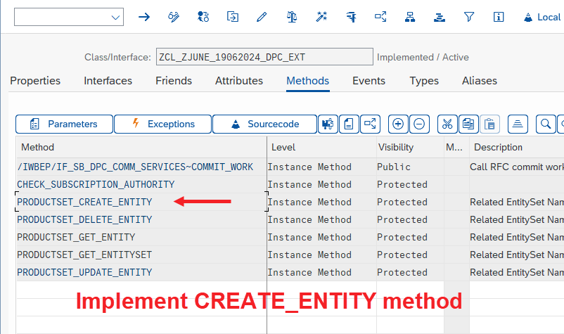
</br></br>

```ABAP

  METHOD PRODUCTSET_CREATE_ENTITY.

    DATA : LS_ENTITY TYPE ZCL_ZJUNE_19062024_MPC=>TS_PRODUCT,
           LS_HEADER TYPE BAPI_EPM_PRODUCT_HEADER,
           LT_RETURN TYPE TABLE OF BAPIRET2.

    " Received the data coming from client side
    IO_DATA_PROVIDER->READ_ENTRY_DATA(
      IMPORTING
        ES_DATA = LS_ENTITY
    ).

    " Map the data to the BAPI input, TODO : Enhance the implementation by extra validation and pre-checks
    LS_HEADER = CORRESPONDING #( LS_ENTITY ).

    " Call the BAPI to create data
    CALL FUNCTION 'BAPI_EPM_PRODUCT_CREATE'
      EXPORTING
        HEADERDATA = LS_HEADER
*       PERSIST_TO_DB            = ABAP_TRUE
      TABLES
*       CONVERSION_FACTORS       =
        RETURN     = LT_RETURN.

    " Exception handling from BAPI
    IF LT_RETURN IS NOT INITIAL.

      ME->MO_CONTEXT->GET_MESSAGE_CONTAINER( )->ADD_MESSAGES_FROM_BAPI(
        IT_BAPI_MESSAGES          =  LT_RETURN " Return parameter table
      ).

      RAISE EXCEPTION TYPE /IWBEP/CX_MGW_BUSI_EXCEPTION
        EXPORTING
          MESSAGE_CONTAINER = ME->MO_CONTEXT->GET_MESSAGE_CONTAINER( ).
    ENDIF.

    " Return data out
    ER_ENTITY = LS_ENTITY.

  ENDMETHOD.

```

</br></br>

**Tools available for doing POST operation :**

1. *Postman*
2. *Gateway Client*

</br></br>

<details>
<summary> <b> Gateway Client for POST operations - T-Code /n/IWFND/GW_CLIENT</b> </summary>
</br>
</br>

```http

// single record call GET
http://s4dev.st.com:8021/sap/opu/odata/sap/ZJUNE_19062024_SRV/ProductSet?$format=json&$top=1

```

</br>
</br>
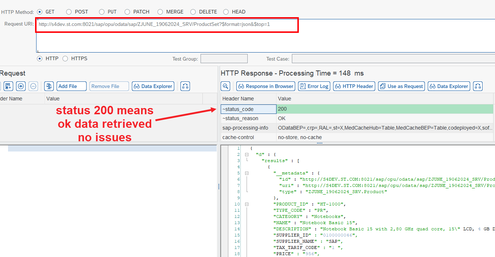
</br></br>

*We are going to manipulate the get request values and use it for POST call*

</br></br>
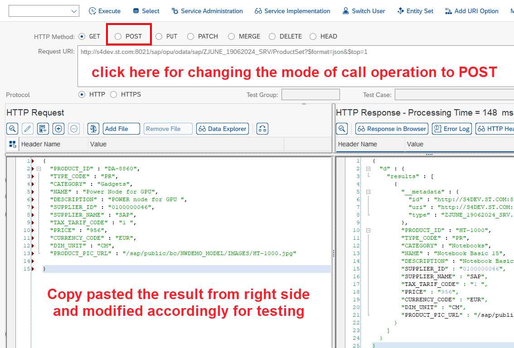
</br></br>
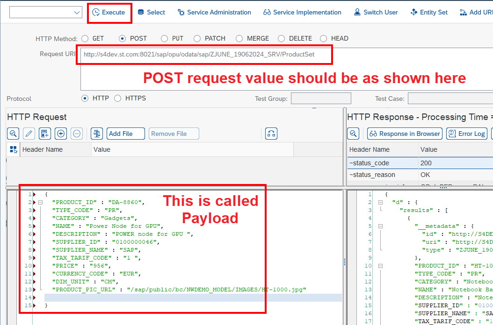
</br></br>
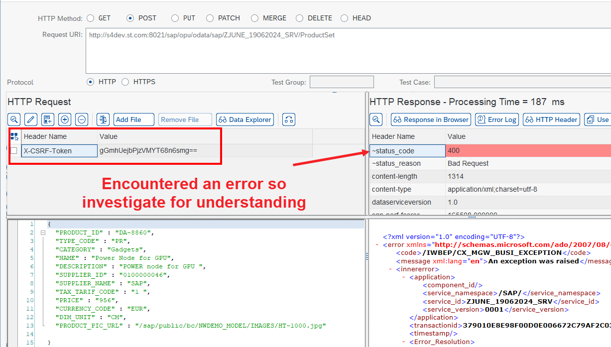
</br></br>

*Goto /N/IWFND/ERROR_LOG T-code for understanding the errors* 
</br></br>
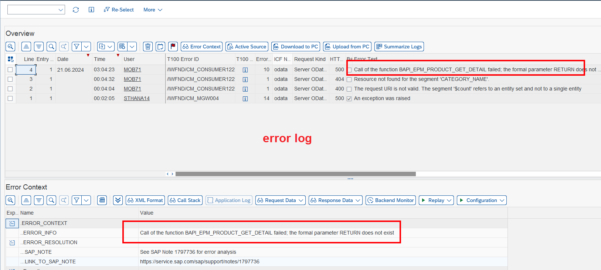
</br></br>

*Unfortunately this issues cannot be identified using error log it requires debugging but we are not going to debug the solution for this is some mandatory field is required we are going to pass it using hard coded values in our ABAP code*

```ABAP

    LS_HEADER = CORRESPONDING #( LS_ENTITY ).

    LS_HEADER-MEASURE_UNIT = 'EA'. " NEWLY ADDED CODE

    " Call the BAPI to create data
    CALL FUNCTION 'BAPI_EPM_PRODUCT_CREATE'

```

</br>

</br></br>
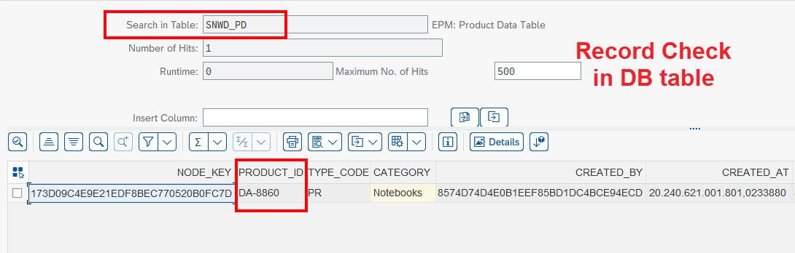
</br></br>

</br></br>

**FULL CODE WITH CORRECTION**

</br>

```ABAP

  METHOD PRODUCTSET_CREATE_ENTITY.

    DATA : LS_ENTITY TYPE ZCL_ZJUNE_19062024_MPC=>TS_PRODUCT,
           LS_HEADER TYPE BAPI_EPM_PRODUCT_HEADER,
           LT_RETURN TYPE TABLE OF BAPIRET2.

    " Received the data coming from client side
    IO_DATA_PROVIDER->READ_ENTRY_DATA(
      IMPORTING
        ES_DATA = LS_ENTITY
    ).

    " Map the data to the BAPI input, TODO : Enhance the implementation by extra validation and pre-checks
    LS_HEADER = CORRESPONDING #( LS_ENTITY ).

    LS_HEADER-MEASURE_UNIT = 'EA'.

    " Call the BAPI to create data
    CALL FUNCTION 'BAPI_EPM_PRODUCT_CREATE'
      EXPORTING
        HEADERDATA = LS_HEADER
*       PERSIST_TO_DB            = ABAP_TRUE
      TABLES
*       CONVERSION_FACTORS       =
        RETURN     = LT_RETURN.

    " Exception handling from BAPI
    IF LT_RETURN IS NOT INITIAL.

      ME->MO_CONTEXT->GET_MESSAGE_CONTAINER( )->ADD_MESSAGES_FROM_BAPI(
        IT_BAPI_MESSAGES          =  LT_RETURN " Return parameter table
      ).

      RAISE EXCEPTION TYPE /IWBEP/CX_MGW_BUSI_EXCEPTION
        EXPORTING
          MESSAGE_CONTAINER = ME->MO_CONTEXT->GET_MESSAGE_CONTAINER( ).
    ENDIF.

    " Return data out
    ER_ENTITY = LS_ENTITY.

  ENDMETHOD.

```

</br></br>
</details>

</br>

**Why Postman ?**

*GW_CLIENT is an internal tool used inside SAP environment but UI5 developers wont be using ERP system they use VS-code, BAS and other tools for designing web pages so if we want to share the POST request link they will test it only in POSTMAN tool for developing the Ui5 and Fiori apps there will be CSRF token authentication as a basic security when POST request is carried out outside the SAP system*

</br>

**Cross-Site Request Forgery (CSRF)**

</br>


<details>
<summary> <b> POSTMAN for POST operations </b> </summary>
</br>
</br>

</br>
</br>
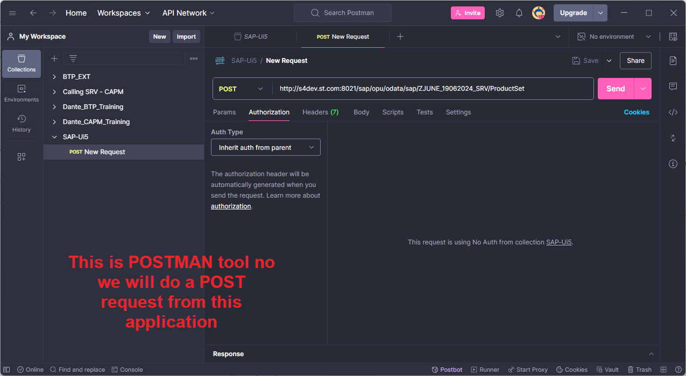
</br></br>

**Follow the steps shown below for executing POST call in POSTMAN**

</br>

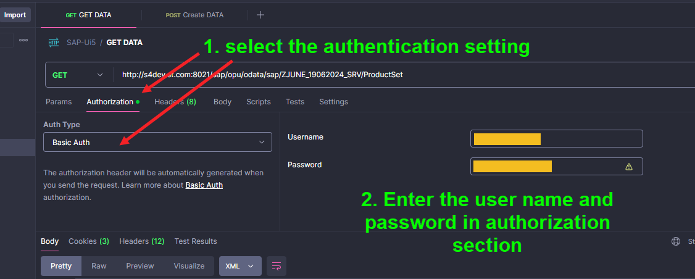
</br></br>
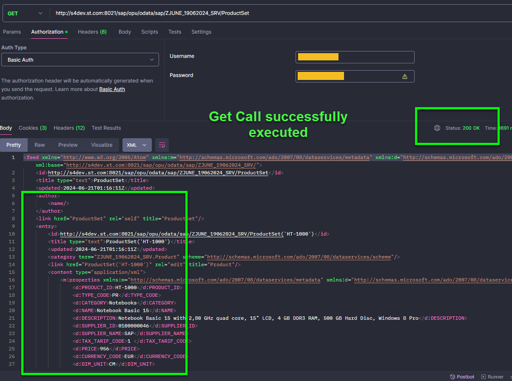
</br></br>
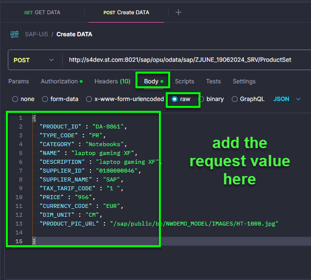
</br></br>
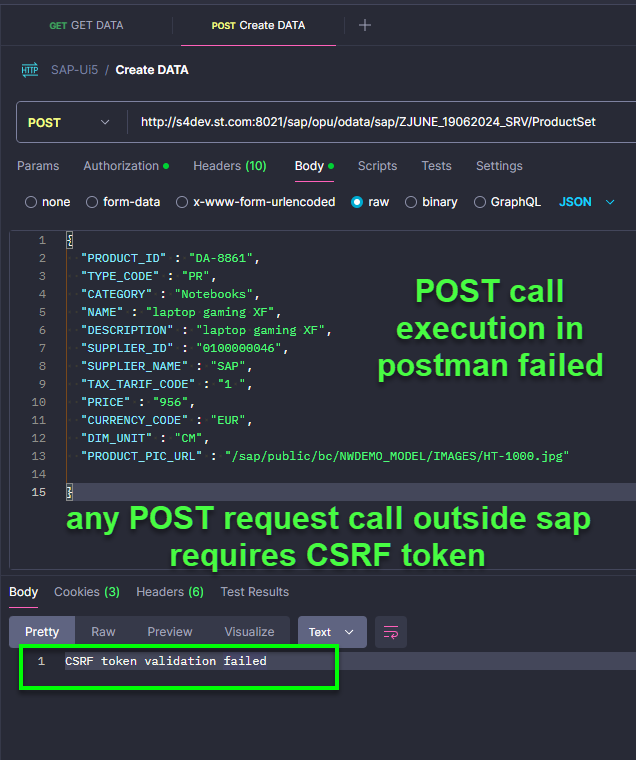
</br></br>
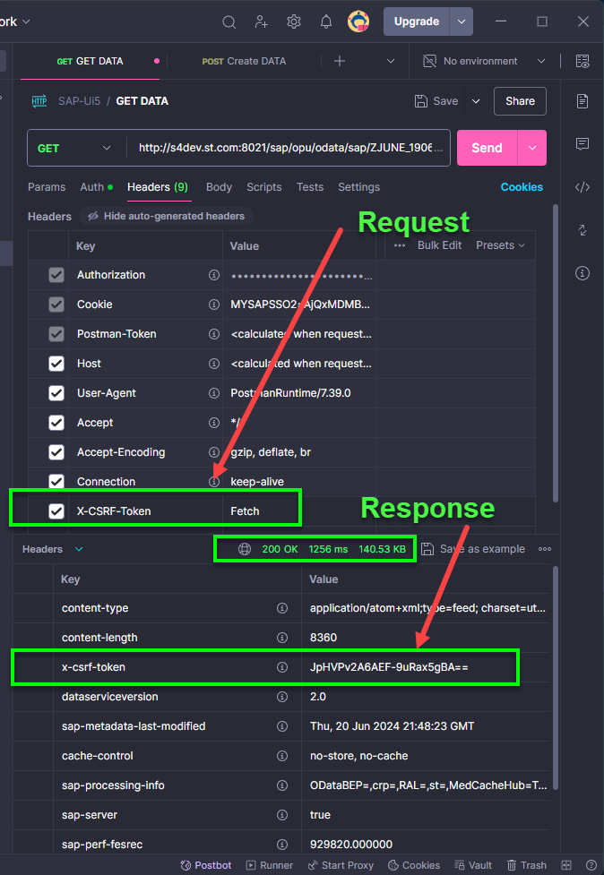
</br></br>

</br></br>
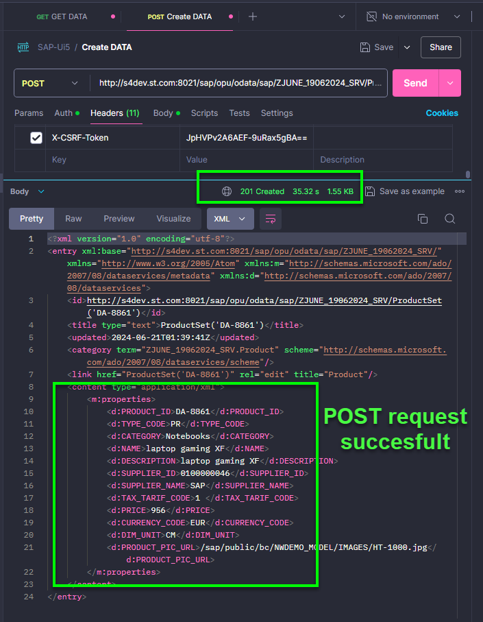
</br></br>
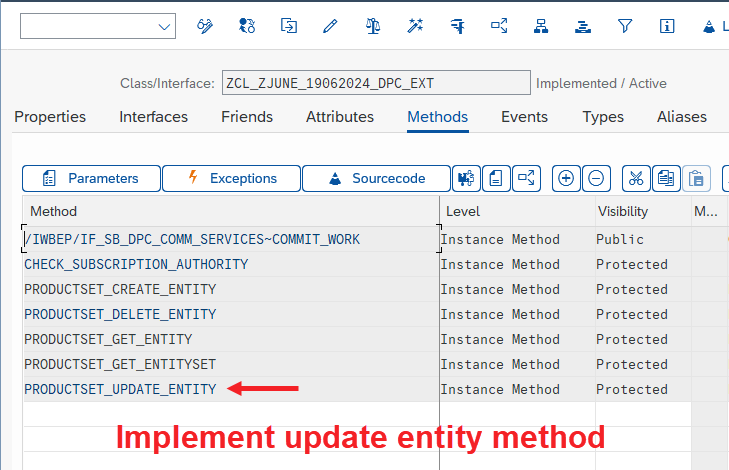
</br></br>
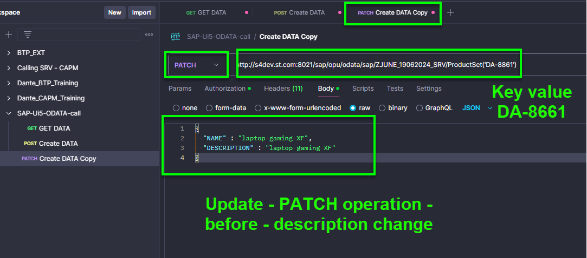
</br></br>
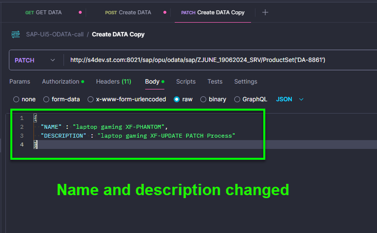
</br></br>

</details>


</br></br>
</br></br>
</br></br>

## End of Exercise 30 ---NEXT---> <a href="https://github.com/Octavius-Dante/Arthelais/tree/main/ex_31"> Exercise 31-Function Import and Images </a>
</br>
<p align="center"> <a href="https://github.com/Octavius-Dante/Arthelais/tree/main"> Main page </a> </p>

</br></br>

**All Previous sessions**
</br></br>
<!-- 
- [x] <a href="https://github.com/Octavius-Dante/Arthelais/tree/main/ex_37"> Exercise 37-Deploy app to launchpad</a>
- [x] <a href="https://github.com/Octavius-Dante/Arthelais/tree/main/ex_36"> Exercise 36-WebIde and Git integration</a>
- [x] <a href="https://github.com/Octavius-Dante/Arthelais/tree/main/ex_35"> Exercise 35-POST, GET and DELETE from Fiori</a>
- [x] <a href="https://github.com/Octavius-Dante/Arthelais/tree/main/ex_34"> Exercise 34-GET and Connect</a>
- [x] <a href="https://github.com/Octavius-Dante/Arthelais/tree/main/ex_33"> Exercise 33-Fiori Project Connect Odata</a>
- [x] <a href="https://github.com/Octavius-Dante/Arthelais/tree/main/ex_32"> Exercise 32-Connectivity</a>
- [x] <a href="https://github.com/Octavius-Dante/Arthelais/tree/main/ex_31"> Exercise 31-Function Import and Images</a>
- [x] <a href="https://github.com/Octavius-Dante/Arthelais/tree/main/ex_30"> Exercise 30-implementing CRUD</a> -->
- [x] <a href="https://github.com/Octavius-Dante/Arthelais/tree/main/ex_29"> Exercise 29-Implementing GET</a>
- [x] <a href="https://github.com/Octavius-Dante/Arthelais/tree/main/ex_28"> Exercise 28-Create A Gateway Project</a>
- [x] <a href="https://github.com/Octavius-Dante/Arthelais/tree/main/ex_27"> Exercise 27-Odata GET</a>
- [x] <a href="https://github.com/Octavius-Dante/Arthelais/tree/main/ex_26"> Exercise 26-Fiori Deployments</a>
- [x] <a href="https://github.com/Octavius-Dante/Arthelais/tree/main/ex_25"> Exercise 25-Fragments Deep dive</a>
- [x] <a href="https://github.com/Octavius-Dante/Arthelais/tree/main/ex_24"> Exercise 24-Fragments</a>
- [x] <a href="https://github.com/Octavius-Dante/Arthelais/tree/main/ex_23"> Exercise 23-Icon Tab bar</a>
- [x] <a href="https://github.com/Octavius-Dante/Arthelais/tree/main/ex_22"> Exercise 22-Route matched Handlers</a>
- [x] <a href="https://github.com/Octavius-Dante/Arthelais/tree/main/ex_21"> Exercise 21-Router Basics</a>
- [x] <a href="https://github.com/Octavius-Dante/Arthelais/tree/main/ex_20"> Exercise 20-Filters on List mode</a>
- [x] <a href="https://github.com/Octavius-Dante/Arthelais/tree/main/ex_19"> Exercise 19-Manifest JSON</a>
- [x] <a href="https://github.com/Octavius-Dante/Arthelais/tree/main/ex_18"> Exercise 18-List Control</a>
- [x] <a href="https://github.com/Octavius-Dante/Arthelais/tree/main/ex_17"> Exercise 17-Fiori Lite app</a>
- [x] <a href="https://github.com/Octavius-Dante/Arthelais/tree/main/ex_16"> Exercise 16-Formatters </a>
- [x] <a href="https://github.com/Octavius-Dante/Arthelais/tree/main/ex_15"> Exercise 15-Element Binding</a>
- [x] <a href="https://github.com/Octavius-Dante/Arthelais/tree/main/ex_14"> Exercise 14-Table control</a>
- [x] <a href="https://github.com/Octavius-Dante/Arthelais/tree/main/ex_13"> Exercise 13-Expression Binding XML Model</a>
- [x] <a href="https://github.com/Octavius-Dante/Arthelais/tree/main/ex_12"> Exercise 12-Json Model Property Binding</a>
- [x] <a href="https://github.com/Octavius-Dante/Arthelais/tree/main/ex_11"> Exercise 11-Model Basics </a>
- [x] <a href="https://github.com/Octavius-Dante/Arthelais/tree/main/ex_10"> Exercise 10-XML Views </a>
- [x] <a href="https://github.com/Octavius-Dante/Arthelais/tree/main/ex_9"> Exercise 9-Control Hierarchy 2</a>
- [x] <a href="https://github.com/Octavius-Dante/Arthelais/tree/main/ex_8"> Exercise 8-Ui5 Control Hierarchy </a>
- [x] <a href="https://github.com/Octavius-Dante/Arthelais/tree/main/ex_7"> Exercise 7-SAP Ui5 Framework </a>
- [x] <a href="https://github.com/Octavius-Dante/Arthelais/tree/main/ex_6"> Exercise 6-JQuery </a>
- [x] <a href="https://github.com/Octavius-Dante/Arthelais/tree/main/ex_5"> Exercise 5-JS deep dive </a>
- [x] <a href="https://github.com/Octavius-Dante/Arthelais/tree/main/ex_4"> Exercise 4-JS basic </a>
- [x] <a href="https://github.com/Octavius-Dante/Arthelais/tree/main/ex_3"> Exercise 3-CSS </a>
- [x] <a href="https://github.com/Octavius-Dante/Arthelais/tree/main/ex_2"> Exercise 2-HTML5</a>
- [x] <a href="https://github.com/Octavius-Dante/Arthelais/tree/main/ex_1"> Exercise 1 -Basic </a>


<!--

<details>
<summary> <b> ALL CODE CHANGES - TODAY SESSION </b> </summary>
</br>
</br>

</br>
</br>

</br>
</br>
</details>

-->