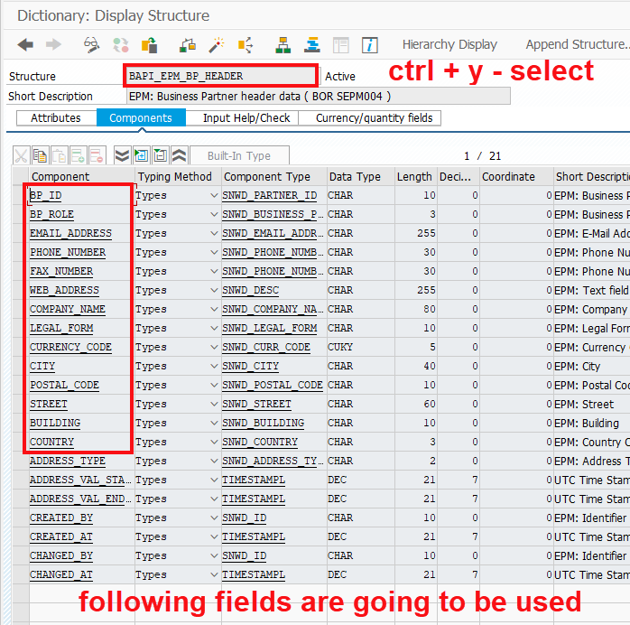
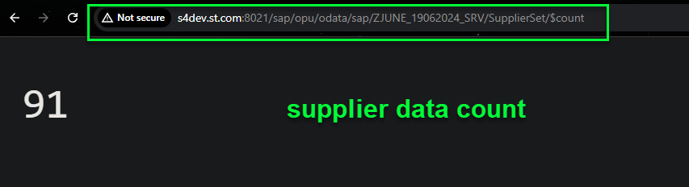
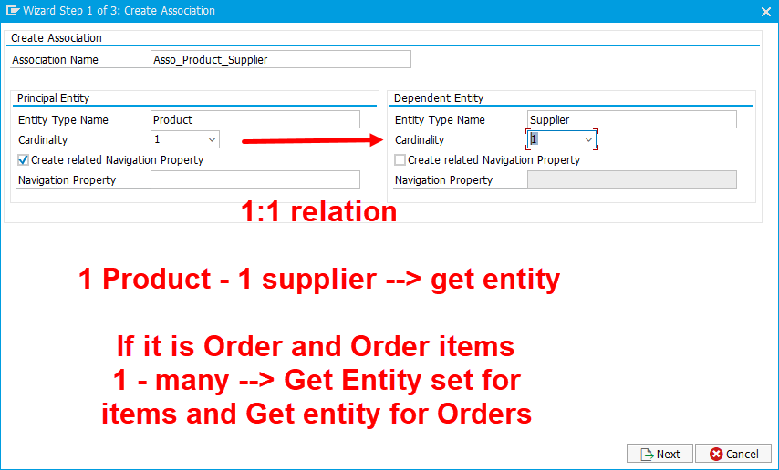
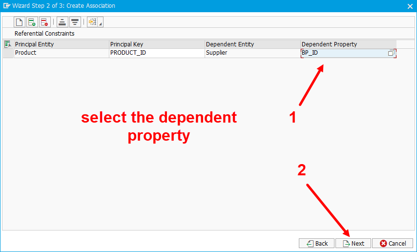

## Exercise 31 - Function Import and Images

</br>

**What is Association ?** ~ *Association is a relationship between 2 entities*

</br></br>

**Association Creation step by step process**

</br>

<details>
<summary> <b> 1. Create New entity type and Re-generate the project </b> </summary>
</br></br>

</br></br>

</br></br>

</br></br>

</br></br>

</br></br>

</br></br>

</br></br>

</br></br>

</br></br>

</br></br>

</br></br>
</details>

<details>
<summary> <b> 2. Go to DPC class and locate the SUPPLIER entity related (CURD) methods and implement it </b> </summary>
</br></br>

</br></br>

</br></br>

*GET_ENTITYSET ~~ FOR SUPPLIERS*

```ABAP

  METHOD SUPPLIERSET_GET_ENTITYSET.

    DATA : LT_BAPI_DATA TYPE TABLE OF BAPI_EPM_BP_HEADER,
           LS_MAX_ROWS  TYPE BAPI_EPM_MAX_ROWS,
           LV_TOP       TYPE I,
           LV_SKIP      TYPE I,
           LV_TOTAL     TYPE I,
           LS_ENTITY    TYPE ZCL_ZJUNE_19062024_MPC=>TS_SUPPLIER.

    " Read the values which was passed by browser for top and skip
    LV_TOP = IS_PAGING-TOP.
    LV_SKIP = IS_PAGING-SKIP.
    LV_TOTAL = LV_TOP + LV_SKIP.
    LS_MAX_ROWS-BAPIMAXROW = LV_TOTAL.

    " Step 1: Read data from BAPI (Function module)
    CALL FUNCTION 'BAPI_EPM_BP_GET_LIST'
      EXPORTING
        MAX_ROWS     = LS_MAX_ROWS
      TABLES
        BPHEADERDATA = LT_BAPI_DATA.


* Start the looping of records from the skip variable value till total
    IF LV_TOTAL IS NOT INITIAL.
      LOOP AT LT_BAPI_DATA INTO DATA(LS_BAPI_DATA) FROM LV_SKIP + 1 TO LV_TOTAL.

        MOVE-CORRESPONDING LS_BAPI_DATA TO LS_ENTITY.
        APPEND LS_ENTITY TO ET_ENTITYSET.

        CLEAR : LS_BAPI_DATA, LS_ENTITY.
      ENDLOOP.
    ELSE.
      ET_ENTITYSET = CORRESPONDING #( LT_BAPI_DATA ).
    ENDIF.

  ENDMETHOD.

```

</br></br>

</br></br>

*GET_ENTITY ~~ FOR SUPPLIERS*

```ABAP

  METHOD SUPPLIERSET_GET_ENTITY.

    DATA : LV_BP_ID TYPE BAPI_EPM_BP_ID,
           LS_HEADER  TYPE BAPI_EPM_BP_HEADER,
           LT_RETURN  TYPE TABLE OF BAPIRET2. " for handling exceptions

    " Step 1 : read the key value passed by user from screen
    READ TABLE IT_KEY_TAB INTO DATA(LS_KEY_TAB) WITH KEY NAME = 'BP_ID'.
    LV_BP_ID = LS_KEY_TAB-VALUE.


* Blank BP id exception handling
* -- Drawback is the followign message cant be translated
* -- if the execution happened other than englihs logon language
    IF LV_BP_ID IS INITIAL.
      RAISE EXCEPTION TYPE /IWBEP/CX_MGW_BUSI_EXCEPTION
        EXPORTING
          MESSAGE_UNLIMITED = 'No Blank BP ID allowed'.
    ENDIF.


    " Step 2 : call BAPAI to laod that BP data by KEY
    CALL FUNCTION 'BAPI_EPM_BP_GET_DETAIL'
      EXPORTING
        BP_ID       = LV_BP_ID         " EPM: Business Partner ID to be used in BAPIs
      IMPORTING
        HEADERDATA  = LS_HEADER        " EPM: Business Partner header data ( BOR SEPM004 )
      TABLES
        RETURN      = LT_RETURN.       " Return Parameter


    IF LT_RETURN IS NOT INITIAL.

      ME->MO_CONTEXT->GET_MESSAGE_CONTAINER( )->ADD_MESSAGES_FROM_BAPI(
         IT_BAPI_MESSAGES          =  LT_RETURN       " Return parameter table
      ).

      RAISE EXCEPTION TYPE /IWBEP/CX_MGW_BUSI_EXCEPTION
        EXPORTING
          MESSAGE_CONTAINER = ME->MO_CONTEXT->GET_MESSAGE_CONTAINER( ).

    ENDIF.

    " Step3 : Map data to output
    ER_ENTITY = CORRESPONDING #( LS_HEADER ).

  ENDMETHOD.

```
</br></br>


**Testing of Entity and Entity Set operation in GET**

</br></br>

</br></br>

```http

// Supplier Get entity set 
http://s4dev.st.com:8021/sap/opu/odata/sap/ZJUNE_19062024_SRV/SupplierSet?$format=json

// Supplier data count
http://s4dev.st.com:8021/sap/opu/odata/sap/ZJUNE_19062024_SRV/SupplierSet/$count

// Single supplier load
http://s4dev.st.com:8021/sap/opu/odata/sap/ZJUNE_19062024_SRV/SupplierSet('0100000005')?$format=json

```

</br></br>

</br></br>

</br></br>

</br></br>
</details>

<details>
<summary> <b> 3. Why Association ? It's use case is explained </b> </summary>
</br></br>

Now we have **ProductSet** and **SupplierSet** in our project Product set displays **Supplier-id** so Supplier details is a dependent data of product 

let's say we have a use case on viewing ProductSet there is supplier id is displayed user wants to see the  Supplier country details now supplier id needs to be copied and checked in supplier single entity GET so this activity which involves manual entry of supplier id (copy -paste) is error prone.

To solve this **Association is introduced** we create a relationship and based on that relationship we create a navigation

</br></br>

</br></br>

</br></br>
</details>

<details>
<summary> <b> 4. Creating Association </b> </summary>
</br></br>

</br></br>

</br></br>

</br></br>

</br></br>

</br></br>

</br></br>

</br></br>
</details>


</br></br>
</br></br>
</br></br>

## End of Exercise 31 ---NEXT---> <a href="https://github.com/Octavius-Dante/Arthelais/tree/main/ex_32"> Exercise 32-Connectivity </a>
</br>
<p align="center"> <a href="https://github.com/Octavius-Dante/Arthelais/tree/main"> Main page </a> </p>


</br></br>

**All Previous sessions**
</br></br>
<!-- 
- [x] <a href="https://github.com/Octavius-Dante/Arthelais/tree/main/ex_37"> Exercise 37-Deploy app to launchpad</a>
- [x] <a href="https://github.com/Octavius-Dante/Arthelais/tree/main/ex_36"> Exercise 36-WebIde and Git integration</a>
- [x] <a href="https://github.com/Octavius-Dante/Arthelais/tree/main/ex_35"> Exercise 35-POST, GET and DELETE from Fiori</a>
- [x] <a href="https://github.com/Octavius-Dante/Arthelais/tree/main/ex_34"> Exercise 34-GET and Connect</a>
- [x] <a href="https://github.com/Octavius-Dante/Arthelais/tree/main/ex_33"> Exercise 33-Fiori Project Connect Odata</a>
- [x] <a href="https://github.com/Octavius-Dante/Arthelais/tree/main/ex_32"> Exercise 32-Connectivity</a>
- [x] <a href="https://github.com/Octavius-Dante/Arthelais/tree/main/ex_31"> Exercise 31-Function Import and Images</a> -->
- [x] <a href="https://github.com/Octavius-Dante/Arthelais/tree/main/ex_30"> Exercise 30-implementing CRUD</a>
- [x] <a href="https://github.com/Octavius-Dante/Arthelais/tree/main/ex_29"> Exercise 29-Implementing GET</a>
- [x] <a href="https://github.com/Octavius-Dante/Arthelais/tree/main/ex_28"> Exercise 28-Create A Gateway Project</a>
- [x] <a href="https://github.com/Octavius-Dante/Arthelais/tree/main/ex_27"> Exercise 27-Odata GET</a>
- [x] <a href="https://github.com/Octavius-Dante/Arthelais/tree/main/ex_26"> Exercise 26-Fiori Deployments</a>
- [x] <a href="https://github.com/Octavius-Dante/Arthelais/tree/main/ex_25"> Exercise 25-Fragments Deep dive</a>
- [x] <a href="https://github.com/Octavius-Dante/Arthelais/tree/main/ex_24"> Exercise 24-Fragments</a>
- [x] <a href="https://github.com/Octavius-Dante/Arthelais/tree/main/ex_23"> Exercise 23-Icon Tab bar</a>
- [x] <a href="https://github.com/Octavius-Dante/Arthelais/tree/main/ex_22"> Exercise 22-Route matched Handlers</a>
- [x] <a href="https://github.com/Octavius-Dante/Arthelais/tree/main/ex_21"> Exercise 21-Router Basics</a>
- [x] <a href="https://github.com/Octavius-Dante/Arthelais/tree/main/ex_20"> Exercise 20-Filters on List mode</a>
- [x] <a href="https://github.com/Octavius-Dante/Arthelais/tree/main/ex_19"> Exercise 19-Manifest JSON</a>
- [x] <a href="https://github.com/Octavius-Dante/Arthelais/tree/main/ex_18"> Exercise 18-List Control</a>
- [x] <a href="https://github.com/Octavius-Dante/Arthelais/tree/main/ex_17"> Exercise 17-Fiori Lite app</a>
- [x] <a href="https://github.com/Octavius-Dante/Arthelais/tree/main/ex_16"> Exercise 16-Formatters </a>
- [x] <a href="https://github.com/Octavius-Dante/Arthelais/tree/main/ex_15"> Exercise 15-Element Binding</a>
- [x] <a href="https://github.com/Octavius-Dante/Arthelais/tree/main/ex_14"> Exercise 14-Table control</a>
- [x] <a href="https://github.com/Octavius-Dante/Arthelais/tree/main/ex_13"> Exercise 13-Expression Binding XML Model</a>
- [x] <a href="https://github.com/Octavius-Dante/Arthelais/tree/main/ex_12"> Exercise 12-Json Model Property Binding</a>
- [x] <a href="https://github.com/Octavius-Dante/Arthelais/tree/main/ex_11"> Exercise 11-Model Basics </a>
- [x] <a href="https://github.com/Octavius-Dante/Arthelais/tree/main/ex_10"> Exercise 10-XML Views </a>
- [x] <a href="https://github.com/Octavius-Dante/Arthelais/tree/main/ex_9"> Exercise 9-Control Hierarchy 2</a>
- [x] <a href="https://github.com/Octavius-Dante/Arthelais/tree/main/ex_8"> Exercise 8-Ui5 Control Hierarchy </a>
- [x] <a href="https://github.com/Octavius-Dante/Arthelais/tree/main/ex_7"> Exercise 7-SAP Ui5 Framework </a>
- [x] <a href="https://github.com/Octavius-Dante/Arthelais/tree/main/ex_6"> Exercise 6-JQuery </a>
- [x] <a href="https://github.com/Octavius-Dante/Arthelais/tree/main/ex_5"> Exercise 5-JS deep dive </a>
- [x] <a href="https://github.com/Octavius-Dante/Arthelais/tree/main/ex_4"> Exercise 4-JS basic </a>
- [x] <a href="https://github.com/Octavius-Dante/Arthelais/tree/main/ex_3"> Exercise 3-CSS </a>
- [x] <a href="https://github.com/Octavius-Dante/Arthelais/tree/main/ex_2"> Exercise 2-HTML5</a>
- [x] <a href="https://github.com/Octavius-Dante/Arthelais/tree/main/ex_1"> Exercise 1 -Basic </a>


<!--

<details>
<summary> <b> ALL CODE CHANGES - TODAY SESSION </b> </summary>
</br>
</br>

</br>
</br>

</br>
</br>
</details>

-->