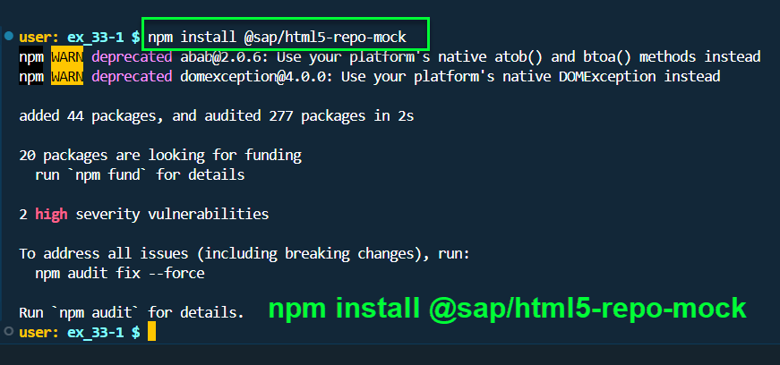

## Exercise 33 - Fiori Project Connect Odata

</br>

**How the project communicated to SAP**

</br>

</br></br>

</br>

**Following activities need to be performed in the same sequential order it is shown : -**

1. *package.json* file creation *(npm init)*
2. *ui5.yaml* file creation *(ui5 init)*
3. *npm install @sap/approuter*
4. *npm install @sap/html5-repo-mock*
5. *xs-app.json* file creation ()
6. *manifest.json* file creation ()
7. service
8. model

</br>

*All the files except manifest.json all need to be created inside webapp folder*

</br></br>

<details>
<summary> <b> 1. package.json file creation in Terminal - npm init </b> </summary>
</br>

</br></br>

</br></br>

</br></br>
</details>

<details>
<summary> <b> 2. ui5.yaml file creation in terminal - ui5 init </b> </summary>
</br>

Check whether the SAP ui5 command line interface is installed in the system  *command ( npm list -g )*

</br>

</br></br>

Install SAP ui5 (Command line interface) CLI if it is not installed you may get error if it is installed can proceed to next step

</br></br>

</br></br>

do ui5 init for the project to create ui5.yaml file (config for ui5)

</br></br>

</br></br>

</br></br>
</details>

<details>
<summary> <b> 3. Install Approuter </b> </summary>
</br>

use npm install command for installing app router as shown below

</br>

</br></br>
</details>

<details>
<summary> <b> 4. Install Mock server Html repository </b> </summary>
</br>

use npm install command for installing html5 mock server 

</br>

</br></br>
</details>

<details>
<summary> <b> 5. xs-app.json file creation </b> </summary>
</br>

command : *touch xs-app.json* to create file xs-app.json

```bat
touch xs-app.json
```

</br>

</br></br>

The file will be blank by default we need to define the configuration as shown below


"source" : "^/sap/opu/odata/" - this redirects any url call to odata service in the destination maintained in BTP

</br>

</br></br>

add the OData service name to the source section in the xs-app.json file as shown below

</br>

```json

{

    "welcomeFile": "webapp/index.html",
    "authenticationMethod": "none",
    "routes":[
        {

            "authenticationType": "none",
            "source" : "^/sap/opu/odata/ZJUNE_19062024_SRV",
            "destination": "S4D"
        }
    ]
}

```

in json file on source section this symbol is used '^' it is a regular expression in JS : https://www.w3schools.com/jsref/jsref_obj_regexp.asp

</br></br>
</details>


<details>
<summary> <b> 6. Changes to manifest.json file </b> </summary>
</br>

added followign 2 section to manifest.json file

```json

// section 1 - App 
    "sap.app": {
        "id": "ntt.hr.payroll",
        "description": "{{APP_TITLE}}",
        "applicationVersion": "1.0.0",
        "type": "application",
        "title": "{{APP_DESCRIPTION}}",
        "i18n": "i18n/i18n.properties",
//////////////////////////////        
        "dataSources": {

            "danteService":{
                "uri": "/sap/opu/odata/ZJUNE_19062024_SRV/"
            }
        }
//////////////////////////////

// section 2 - models 

        "models": {
            "i18n": {
                "type": "sap.ui.model.resource.ResourceModel",
                "uri": "i18n/i18n.properties"
            },
            "local": {
                "type": "sap.ui.model.json.JSONModel",
                "uri": "model/mockdata/fruits.json"
            },
//////////////////////////////                    
            "":{
                "type": "sap.ui.model.odata.v2.OdataModel",
                "settings":{

                },

                "dataSource": "danteService",
                "preload": true
            }
//////////////////////////////                    
        }

```

**manifest.json before change**

```JSON
{
    "_version": "1.123",
    "sap.app": {
        "id": "ntt.hr.payroll",
        "description": "{{APP_TITLE}}",
        "applicationVersion": "1.0.0",
        "type": "application",
        "title": "{{APP_DESCRIPTION}}",
        "i18n": "i18n/i18n.properties"
    },
    "sap.ui": {
        "technology": "UI5",
        "icons": {
            "icon": "sap-icon://home"
        },
        "deviceTypes": {
            "desktop": true,
            "tablet": true,
            "phone": true
        }
    },
    "sap.ui5": {
        "dependencies": {
            "minUI5Version": "1.123",
            "libs": {
                "sap.m": {},
                "sap.ui.table": {}
            }
        },
        "rootView":{
            "id": "idAppView",
            "type": "XML",
            "viewName": "ntt.hr.payroll.view.App"
        },
        "routing": {
            "config":{
                "routerClass": "sap.m.routing.Router",
                "viewPath": "ntt.hr.payroll.view",
                "viewType": "XML",
                "controlId": "appCon",
                "clearControlAggregation": true
            },
            "routes":[{
                "name": "Master",
                "target": ["Facepage","Secondpage"],
                "pattern": ""
            },{
                "name": "Detail",
                "target": ["Facepage","Datapage"],
                "pattern": "Detail/{fruitId}"
            }],
            "targets": {
                "Facepage":{
                    "viewName": "View1",
                    "controlAggregation": "masterPages"
                },
                "Secondpage":{
                    "viewName": "empty",
                    "controlAggregation": "detailPages"
                },
                "Datapage":{
                    "viewName": "View2",
                    "controlAggregation": "detailPages"
                }
            }
        },

        "contentDensities": {
            "compact": true,
            "cozy": true
        },
        "library": {
            "css": "css/mystyle.css"
        },
        "models": {
            "i18n": {
                "type": "sap.ui.model.resource.ResourceModel",
                "uri": "i18n/i18n.properties"
            },
            "": {
                "type": "sap.ui.model.json.JSONModel",
                "uri": "model/mockdata/fruits.json"
            }
        }
    }
}

```

</br></br>

**manifest.json after change**

```JSON

{
    "_version": "1.123",
    "sap.app": {
        "id": "ntt.hr.payroll",
        "description": "{{APP_TITLE}}",
        "applicationVersion": "1.0.0",
        "type": "application",
        "title": "{{APP_DESCRIPTION}}",
        "i18n": "i18n/i18n.properties",
        "dataSources": {

            "danteService":{
                "uri": "/sap/opu/odata/ZJUNE_19062024_SRV/"
            }
        }
    },
    "sap.ui": {
        "technology": "UI5",
        "icons": {
            "icon": "sap-icon://home"
        },
        "deviceTypes": {
            "desktop": true,
            "tablet": true,
            "phone": true
        }
    },
    "sap.ui5": {
        "dependencies": {
            "minUI5Version": "1.123",
            "libs": {
                "sap.m": {},
                "sap.ui.table": {}
            }
        },
        "rootView":{
            "id": "idAppView",
            "type": "XML",
            "viewName": "ntt.hr.payroll.view.App"
        },
        "routing": {
            "config":{
                "routerClass": "sap.m.routing.Router",
                "viewPath": "ntt.hr.payroll.view",
                "viewType": "XML",
                "controlId": "appCon",
                "clearControlAggregation": true
            },
            "routes":[{
                "name": "Master",
                "target": ["Facepage","Secondpage"],
                "pattern": ""
            },{
                "name": "Detail",
                "target": ["Facepage","Datapage"],
                "pattern": "Detail/{fruitId}"
            }],
            "targets": {
                "Facepage":{
                    "viewName": "View1",
                    "controlAggregation": "masterPages"
                },
                "Secondpage":{
                    "viewName": "empty",
                    "controlAggregation": "detailPages"
                },
                "Datapage":{
                    "viewName": "View2",
                    "controlAggregation": "detailPages"
                }
            }
        },

        "contentDensities": {
            "compact": true,
            "cozy": true
        },
        "library": {
            "css": "css/mystyle.css"
        },
        "models": {
            "i18n": {
                "type": "sap.ui.model.resource.ResourceModel",
                "uri": "i18n/i18n.properties"
            },
            "local": {
                "type": "sap.ui.model.json.JSONModel",
                "uri": "model/mockdata/fruits.json"
            },
            "":{
                "type": "sap.ui.model.odata.v2.OdataModel",
                "settings":{

                },

                "dataSource": "danteService",
                "preload": true
            }
        }
    }
}


```


</br></br>
</details>


</br></br>
</br></br>
</br></br>

## End of Exercise 33 ---NEXT---> <a href="https://github.com/Octavius-Dante/Arthelais/tree/main/ex_34"> Exercise 34-GET and Connect </a>
</br>
<p align="center"> <a href="https://github.com/Octavius-Dante/Arthelais/tree/main"> Main page </a> </p>


</br></br>

**All Previous sessions**
</br></br>

<!-- - [x] <a href="https://github.com/Octavius-Dante/Arthelais/tree/main/ex_37"> Exercise 37-Deploy app to launchpad</a>
- [x] <a href="https://github.com/Octavius-Dante/Arthelais/tree/main/ex_36"> Exercise 36-WebIde and Git integration</a>
- [x] <a href="https://github.com/Octavius-Dante/Arthelais/tree/main/ex_35"> Exercise 35-POST, GET and DELETE from Fiori</a>
- [x] <a href="https://github.com/Octavius-Dante/Arthelais/tree/main/ex_34"> Exercise 34-GET and Connect</a>
- [x] <a href="https://github.com/Octavius-Dante/Arthelais/tree/main/ex_33"> Exercise 33-Fiori Project Connect Odata</a> -->
- [x] <a href="https://github.com/Octavius-Dante/Arthelais/tree/main/ex_32"> Exercise 32-Connectivity</a>
- [x] <a href="https://github.com/Octavius-Dante/Arthelais/tree/main/ex_31"> Exercise 31-Function Import and Images</a>
- [x] <a href="https://github.com/Octavius-Dante/Arthelais/tree/main/ex_30"> Exercise 30-implementing CRUD</a>
- [x] <a href="https://github.com/Octavius-Dante/Arthelais/tree/main/ex_29"> Exercise 29-Implementing GET</a>
- [x] <a href="https://github.com/Octavius-Dante/Arthelais/tree/main/ex_28"> Exercise 28-Create A Gateway Project</a>
- [x] <a href="https://github.com/Octavius-Dante/Arthelais/tree/main/ex_27"> Exercise 27-Odata GET</a>
- [x] <a href="https://github.com/Octavius-Dante/Arthelais/tree/main/ex_26"> Exercise 26-Fiori Deployments</a>
- [x] <a href="https://github.com/Octavius-Dante/Arthelais/tree/main/ex_25"> Exercise 25-Fragments Deep dive</a>
- [x] <a href="https://github.com/Octavius-Dante/Arthelais/tree/main/ex_24"> Exercise 24-Fragments</a>
- [x] <a href="https://github.com/Octavius-Dante/Arthelais/tree/main/ex_23"> Exercise 23-Icon Tab bar</a>
- [x] <a href="https://github.com/Octavius-Dante/Arthelais/tree/main/ex_22"> Exercise 22-Route matched Handlers</a>
- [x] <a href="https://github.com/Octavius-Dante/Arthelais/tree/main/ex_21"> Exercise 21-Router Basics</a>
- [x] <a href="https://github.com/Octavius-Dante/Arthelais/tree/main/ex_20"> Exercise 20-Filters on List mode</a>
- [x] <a href="https://github.com/Octavius-Dante/Arthelais/tree/main/ex_19"> Exercise 19-Manifest JSON</a>
- [x] <a href="https://github.com/Octavius-Dante/Arthelais/tree/main/ex_18"> Exercise 18-List Control</a>
- [x] <a href="https://github.com/Octavius-Dante/Arthelais/tree/main/ex_17"> Exercise 17-Fiori Lite app</a>
- [x] <a href="https://github.com/Octavius-Dante/Arthelais/tree/main/ex_16"> Exercise 16-Formatters </a>
- [x] <a href="https://github.com/Octavius-Dante/Arthelais/tree/main/ex_15"> Exercise 15-Element Binding</a>
- [x] <a href="https://github.com/Octavius-Dante/Arthelais/tree/main/ex_14"> Exercise 14-Table control</a>
- [x] <a href="https://github.com/Octavius-Dante/Arthelais/tree/main/ex_13"> Exercise 13-Expression Binding XML Model</a>
- [x] <a href="https://github.com/Octavius-Dante/Arthelais/tree/main/ex_12"> Exercise 12-Json Model Property Binding</a>
- [x] <a href="https://github.com/Octavius-Dante/Arthelais/tree/main/ex_11"> Exercise 11-Model Basics </a>
- [x] <a href="https://github.com/Octavius-Dante/Arthelais/tree/main/ex_10"> Exercise 10-XML Views </a>
- [x] <a href="https://github.com/Octavius-Dante/Arthelais/tree/main/ex_9"> Exercise 9-Control Hierarchy 2</a>
- [x] <a href="https://github.com/Octavius-Dante/Arthelais/tree/main/ex_8"> Exercise 8-Ui5 Control Hierarchy </a>
- [x] <a href="https://github.com/Octavius-Dante/Arthelais/tree/main/ex_7"> Exercise 7-SAP Ui5 Framework </a>
- [x] <a href="https://github.com/Octavius-Dante/Arthelais/tree/main/ex_6"> Exercise 6-JQuery </a>
- [x] <a href="https://github.com/Octavius-Dante/Arthelais/tree/main/ex_5"> Exercise 5-JS deep dive </a>
- [x] <a href="https://github.com/Octavius-Dante/Arthelais/tree/main/ex_4"> Exercise 4-JS basic </a>
- [x] <a href="https://github.com/Octavius-Dante/Arthelais/tree/main/ex_3"> Exercise 3-CSS </a>
- [x] <a href="https://github.com/Octavius-Dante/Arthelais/tree/main/ex_2"> Exercise 2-HTML5</a>
- [x] <a href="https://github.com/Octavius-Dante/Arthelais/tree/main/ex_1"> Exercise 1 -Basic </a>


<!--

<details>
<summary> <b> ALL CODE CHANGES - TODAY SESSION </b> </summary>
</br>
</br>

</br>
</br>

</br>
</br>
</details>

-->