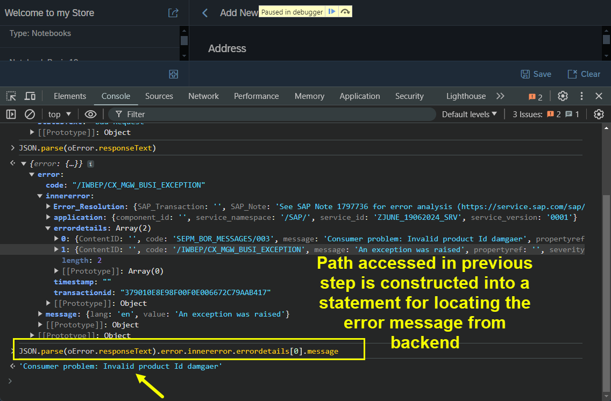
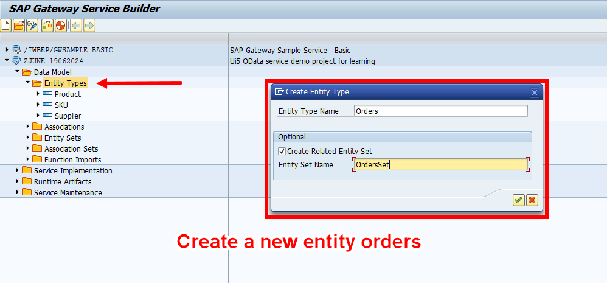
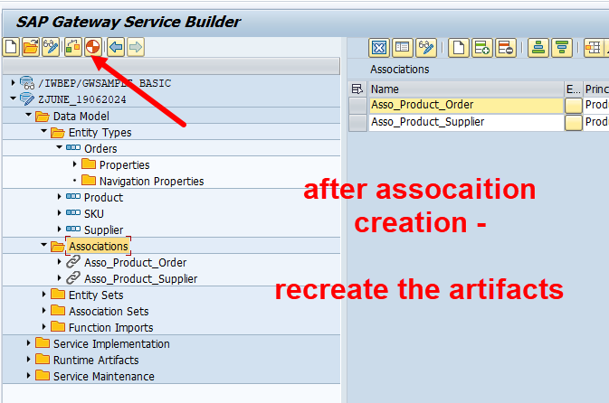

## Exercise 35 - POST, PATCH, GET and DELETE from Fiori

</br>

**Continuing from Previous session we are going to build complete POST, PATCH, DELETE activities from Fiori app**

</br>

<details>
<summary> <b> Implementing Product save logic - POST operation</b> </summary>
</br>

</br></br>

</br></br>

</br></br>

</br></br>
</details>

<details>
<summary> <b> Implementing screen fields CLEAR on click of button</b> </summary>
</br>

</br></br>

</br></br>

</br></br>

</br></br>
</details>

<details>
<summary> <b> Implementing GET Data on press of enter from screen (Input product ID)</b> </summary>
</br>

</br></br>

</br></br>

</br></br>

</br></br>

</br></br>
</details>

<details>
<summary> <b> Implementing error handling on invalid product ID request on press of enter</b> </summary>
</br>

</br></br>

</br></br>

</br></br>

</br></br>

</br></br>

</br></br>

</br></br>

</br></br>

</br></br>

</br></br>
</details>

<details>
<summary> <b> Implementing - Get Expensive product in the screen on Button click -- (OData Function Import)</b> </summary>
</br></br>
</br>
</br></br>
</br></br>
</br></br>
</br></br>
</br></br>
</br></br>
</details>

<details>
<summary> <b> Implementing PATCH Update Data on press of button</b> </summary>
</br>

</br></br>
</br></br>
</br></br>
</br></br>
</br></br>
</br></br>
</br></br>
</br></br>
</details>

<details>
<summary> <b> Implementing DELETE data on click of button</b> </summary>
</br>
</br></br>
</br></br>
</br></br>
</br></br>
</br></br>
</br></br>
</details>


</br></br></br></br>


## Implementing the Orders M-table in view 2

</br>
</br>

**We have product in view-1 in view-2-(tab-1) we are seeing the product related details and supplier details , in view-2-(tab-2) we will be showing all the orders associated with this product in a M-table**

</br>

1. *Adding a new entity set- OrderSet*
2. *Having a 1..n relation between product and orders*
3. *Implementing GET for OrdersSet_GET_EntitySet to fetch orders related to this product*
4. *Bind the table with associations*

</br>
</br>

<details>
<summary> <b> Implementing Orders table in View 2</b> </summary>
</br>
</br></br>
</br></br>
</br></br>
</br></br>
</br></br>
</br></br>
</br></br>
</br></br>
</br></br>
</br></br>
</br></br>

Implementation code code class (ORDER_GET_ENTITYSET)

</br>

```ABAP

  METHOD ORDERSSET_GET_ENTITYSET.

    DATA : LV_PROD_ID TYPE BAPI_EPM_PRODUCT_ID,
           LT_PROD    TYPE RANGE OF BAPI_EPM_PRODUCT_ID_RANGE,
           LT_HEADER  TYPE TABLE OF BAPI_EPM_SO_HEADER.

    READ TABLE IT_KEY_TAB INTO DATA(LS_KEY_TAB) INDEX 1.

    LT_PROD = VALUE #( ( SIGN = 'I' OPTION = 'EQ'  LOW = LV_PROD_ID ) ).

    LV_PROD_ID = LS_KEY_TAB-VALUE.

    CALL FUNCTION 'BAPI_EPM_SO_GET_LIST'
*  EXPORTING
*    MAX_ROWS          =                  " EPM: Max row specifictation
      TABLES
        SOHEADERDATA      = LT_HEADER         " EPM: Sales Order header data of BOR object 'EpmSalesOrder'
*       SOITEMDATA        =                  " EPM: Sales Order Item data of BOR object 'EpmSalesOrder'
*       SELPARAMSOID      =                  " EPM: Range for Sales Order IDs
*       SELPARAMBUYERNAME =                  " EPM: Range for company name
        SELPARAMPRODUCTID = LT_PROD           " EPM: Range for product id
*       RETURN            =                  " Return Parameter
      .

    ET_ENTITYSET = LT_HEADER.

  ENDMETHOD.

```

</br></br>
</br></br>
</br></br>
</br></br>
</br></br>
</br></br>
</br></br>
</br></br>
</br></br>
</br></br>
</br></br>
</br></br>
</br></br>
</br></br>
</br></br>
</br></br>
</br></br>
</br></br>
</br></br>
</br></br>
</br></br>
</br></br>
</br></br>
</br></br>
</br></br>
</br></br>
</br></br>
</br></br>
</br></br>
</br></br>
</br></br>
</br></br>
</br></br>
</br></br>
</br></br>
</br></br>
</br></br>
</br></br>
</br></br>
</br></br>
</br></br>

</br></br>
</details>


</br>
</br>


</br>
</br></br>

## End of Exercise 35 ---NEXT---> <a href="https://github.com/Octavius-Dante/Arthelais/tree/main/ex_36"> Exercise 36-WebIde and Git integration </a>
</br>
<p align="center"> <a href="https://github.com/Octavius-Dante/Arthelais/tree/main"> Main page </a> </p>


</br></br>

**All Previous sessions**
</br></br>

<!-- - [x] <a href="https://github.com/Octavius-Dante/Arthelais/tree/main/ex_37"> Exercise 37-Deploy app to launchpad</a>
- [x] <a href="https://github.com/Octavius-Dante/Arthelais/tree/main/ex_36"> Exercise 36-WebIde and Git integration</a>
- [x] <a href="https://github.com/Octavius-Dante/Arthelais/tree/main/ex_35"> Exercise 35-POST, GET and DELETE from Fiori</a> -->
- [x] <a href="https://github.com/Octavius-Dante/Arthelais/tree/main/ex_34"> Exercise 34-GET and Connect</a>
- [x] <a href="https://github.com/Octavius-Dante/Arthelais/tree/main/ex_33"> Exercise 33-Fiori Project Connect OData</a>
- [x] <a href="https://github.com/Octavius-Dante/Arthelais/tree/main/ex_32"> Exercise 32-Connectivity</a>
- [x] <a href="https://github.com/Octavius-Dante/Arthelais/tree/main/ex_31"> Exercise 31-Function Import and Images</a>
- [x] <a href="https://github.com/Octavius-Dante/Arthelais/tree/main/ex_30"> Exercise 30-implementing CRUD</a>
- [x] <a href="https://github.com/Octavius-Dante/Arthelais/tree/main/ex_29"> Exercise 29-Implementing GET</a>
- [x] <a href="https://github.com/Octavius-Dante/Arthelais/tree/main/ex_28"> Exercise 28-Create A Gateway Project</a>
- [x] <a href="https://github.com/Octavius-Dante/Arthelais/tree/main/ex_27"> Exercise 27-OData GET</a>
- [x] <a href="https://github.com/Octavius-Dante/Arthelais/tree/main/ex_26"> Exercise 26-Fiori Deployments</a>
- [x] <a href="https://github.com/Octavius-Dante/Arthelais/tree/main/ex_25"> Exercise 25-Fragments Deep dive</a>
- [x] <a href="https://github.com/Octavius-Dante/Arthelais/tree/main/ex_24"> Exercise 24-Fragments</a>
- [x] <a href="https://github.com/Octavius-Dante/Arthelais/tree/main/ex_23"> Exercise 23-Icon Tab bar</a>
- [x] <a href="https://github.com/Octavius-Dante/Arthelais/tree/main/ex_22"> Exercise 22-Route matched Handlers</a>
- [x] <a href="https://github.com/Octavius-Dante/Arthelais/tree/main/ex_21"> Exercise 21-Router Basics</a>
- [x] <a href="https://github.com/Octavius-Dante/Arthelais/tree/main/ex_20"> Exercise 20-Filters on List mode</a>
- [x] <a href="https://github.com/Octavius-Dante/Arthelais/tree/main/ex_19"> Exercise 19-Manifest JSON</a>
- [x] <a href="https://github.com/Octavius-Dante/Arthelais/tree/main/ex_18"> Exercise 18-List Control</a>
- [x] <a href="https://github.com/Octavius-Dante/Arthelais/tree/main/ex_17"> Exercise 17-Fiori Lite app</a>
- [x] <a href="https://github.com/Octavius-Dante/Arthelais/tree/main/ex_16"> Exercise 16-Formatters </a>
- [x] <a href="https://github.com/Octavius-Dante/Arthelais/tree/main/ex_15"> Exercise 15-Element Binding</a>
- [x] <a href="https://github.com/Octavius-Dante/Arthelais/tree/main/ex_14"> Exercise 14-Table control</a>
- [x] <a href="https://github.com/Octavius-Dante/Arthelais/tree/main/ex_13"> Exercise 13-Expression Binding XML Model</a>
- [x] <a href="https://github.com/Octavius-Dante/Arthelais/tree/main/ex_12"> Exercise 12-Json Model Property Binding</a>
- [x] <a href="https://github.com/Octavius-Dante/Arthelais/tree/main/ex_11"> Exercise 11-Model Basics </a>
- [x] <a href="https://github.com/Octavius-Dante/Arthelais/tree/main/ex_10"> Exercise 10-XML Views </a>
- [x] <a href="https://github.com/Octavius-Dante/Arthelais/tree/main/ex_9"> Exercise 9-Control Hierarchy 2</a>
- [x] <a href="https://github.com/Octavius-Dante/Arthelais/tree/main/ex_8"> Exercise 8-Ui5 Control Hierarchy </a>
- [x] <a href="https://github.com/Octavius-Dante/Arthelais/tree/main/ex_7"> Exercise 7-SAP Ui5 Framework </a>
- [x] <a href="https://github.com/Octavius-Dante/Arthelais/tree/main/ex_6"> Exercise 6-JQuery </a>
- [x] <a href="https://github.com/Octavius-Dante/Arthelais/tree/main/ex_5"> Exercise 5-JS deep dive </a>
- [x] <a href="https://github.com/Octavius-Dante/Arthelais/tree/main/ex_4"> Exercise 4-JS basic </a>
- [x] <a href="https://github.com/Octavius-Dante/Arthelais/tree/main/ex_3"> Exercise 3-CSS </a>
- [x] <a href="https://github.com/Octavius-Dante/Arthelais/tree/main/ex_2"> Exercise 2-HTML5</a>
- [x] <a href="https://github.com/Octavius-Dante/Arthelais/tree/main/ex_1"> Exercise 1 -Basic </a>


<!--

<details>
<summary> <b> ALL CODE CHANGES - TODAY SESSION </b> </summary>
</br>
</br>

</br>
</br>

</br>
</br>
</details>

-->