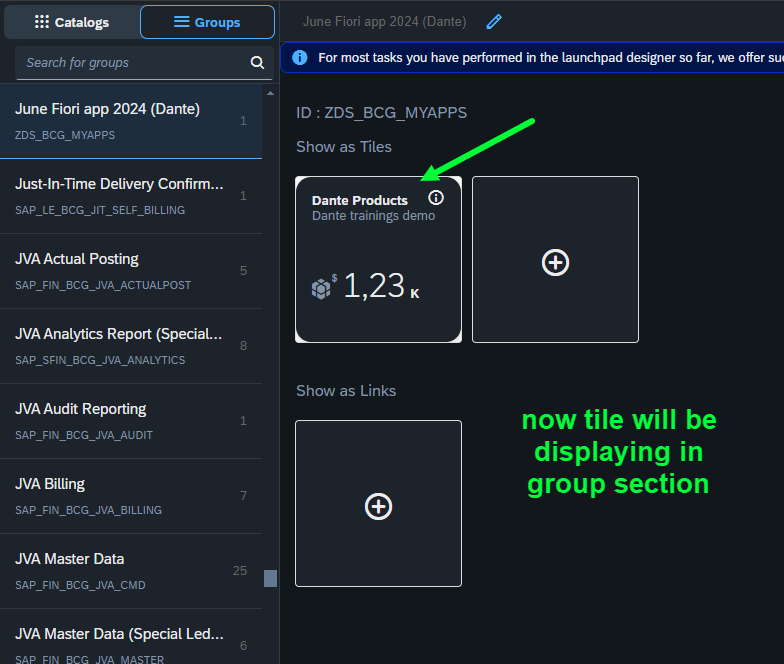
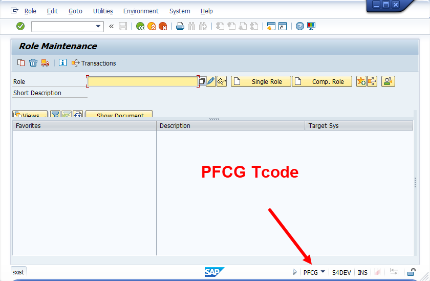

## Exercise 37 - Deploy Fiori app to launchpad

</br>

**Steps for deploying the Fiori App to On-Premise system**

</br>

*Packaging and deployment with Launchpad*

</br>

**TCODE :**

*Fiori Launchpad designer - /n/ui2/flpd_conf*

*Fiori Launchpad - /n/ui2/flp*

</br></br>

</br></br>


</br></br>

**Prerequisite before starting the ui5 packaging and deployment activity**

<details>
<summary> <b> Essential prerequisite</b> </summary>
</br></br></br>


**package.json ~~ this build and deploy commands in this file is required for successful execution of deployment and build process**

```JSON

{
  "name": "ex_35-x",
  "version": "1.0.0",
  "main": "index.js",
  "scripts": {
    "test": "echo \"Error: no test specified\" && exit 1",
    "deploy": "npm run build && fiori deploy --config ui5-deploy.yaml && rimraf archive.zip",
    "undeploy": "fiori undeploy --config ui5-deploy.yaml",
    "deploy-test": "npm run build && fiori deploy --config ui5-deploy.yaml --testMode true",
    "build": "ui5 build -a --clean-dest",
		"build-self-contained": "ui5 build self-contained -a --clean-dest"
  },
  "author": "Dante",
  "license": "ISC",
  "description": "fiori like app ",
  "dependencies": {
    "@sap/abap-deploy": "^0.10.27",
    "@sap/approuter": "^16.6.0",
    "@sap/html5-repo-mock": "^2.1.10",
    "@sap/ux-ui5-tooling": "^1.14.0"
  },
  "devDependencies": {
    "rimraf": "^5.0.5",
    "ui5-task-flatten-library": "3.0.2"
  },
  "ui5": {
    "dependencies": [
      "ui5-task-flatten-library"
    ]
  }
}


```

</br></br>


**BAS activity**

*Command for installing ui5 CLI -command line interface*

```bat
npm install --global @ui5/cli
```

</br></br>


</br>

*Command for installing ABAP repository deployment*

```bat
npm install @sap/abap-deploy
```

</br></br>


</br>

*Command for installing Fiori deployment tools*

```bat
npm install @sap/ux-ui5-tooling
```

</br></br>


</br></br>

**ERP system activity**


*A Demo package is created and assigned to transport*

</br></br>

*A Demo transport is created and assigned with sample package*

</br></br>
</details>

</br></br>

**Step By Step process - Fiori App deployment**

</br>

*1. Fiori App packaging is done via BAS*

*2. Fiori App deployment is done via (source) BAS using packaged build pushed to Html5 repository in Launchpad (destination on premise system)*

*3. Final deployment to Fiori tile layout screen done by launchpad using user role and authorization configuration - also requires user role in PFCG inside ERP*

</br>


<details>
<summary> <b> 1. Fiori App Packaging </b> </summary>
</br>

*First Command for packaging*

Command : 
</br>

```bat
ui5 build
```

</br>

</br></br>
</br></br>

</br>

*Dist - Distribution*

</br>

</br></br>
</br></br>

*Thats all from packaging end now will proceed to deployment activity*
</br></br>
</details>

<details>
<summary> <b> 2. Fiori App Deployment </b> </summary>
</br>
</br>

*First Command for Deploying to ERP -system repository*

Command : 
</br>

```bat
npx fiori add deploy-config
```

</br></br>
</br></br>
</br></br>
</br></br>
</br></br>
</br></br>

*Second Command for Deploying to ERP -system repository*

Command : 
</br>

```bat
npm run build
```

</br></br>

*Third Command for Deploying to ERP -system repository*

Command : 
</br>

```bat
npm run deploy
```

</br></br>


**npm run deploy -- batch process log -- for reference**

```bat

user: ex_35-x $ npm run deploy

> ex_35-x@1.0.0 deploy
> npm run build && fiori deploy --config ui5-deploy.yaml && rimraf archive.zip


> ex_35-x@1.0.0 build
> ui5 build -a --clean-dest

info ProjectBuilder Preparing build for project ex_35-x
info ProjectBuilder   Target directory: ./dist
info ProjectBuilder Cleaning target directory...
info Project 1 of 1: ❯ Building application project ex_35-x...
info ex_35-x › Running task escapeNonAsciiCharacters...
info ex_35-x › Running task replaceCopyright...
info ex_35-x › Running task replaceVersion...
info ex_35-x › Running task minify...
info ex_35-x › Running task generateFlexChangesBundle...
info ex_35-x › Running task generateComponentPreload...
info ProjectBuilder Build succeeded in 321 ms
info ProjectBuilder Executing cleanup tasks...

Confirmation is required to deploy the app:

    Application Name: ZZ_29062024
    Package: ZDEMO_DANTE
    Transport Request: S4DK901063
    Destination: S4D
    SCP: false
    
    
✔ Start deployment (Y/n)?

 … yes
info abap-deploy-task ZZ_29062024 Creating archive with UI5 build result.
info abap-deploy-task ZZ_29062024 Archive created.
info abap-deploy-task ZZ_29062024 Starting to deploy.
info abap-deploy-task ZZ_29062024 ZZ_29062024 found on target system: false
info abap-deploy-task ZZ_29062024 SAPUI5 Application ZZ_29062024 has been uploaded and registered successfully
info abap-deploy-task ZZ_29062024 ***** Upload of SAPUI5 App or Library from ZIP-Archive into SAPUI5 ABAP Repository *****
info abap-deploy-task ZZ_29062024 Running in regular mode, brief log
info abap-deploy-task ZZ_29062024 39 Files found in Archive.
info abap-deploy-task ZZ_29062024 * Parameters *
info abap-deploy-task ZZ_29062024 A BAdI implementation for /UI5/BADI_REPOSITORY_LOAD is active: Operation parameters may have been adjusted.
info abap-deploy-task ZZ_29062024 The name of the SAPUI5 repository "ZZ_29062024" has been determined from the corresponding import parameter.
info abap-deploy-task ZZ_29062024 The binary files are identified using the standard settings.
info abap-deploy-task ZZ_29062024 The text files are identified using the standard settings.
info abap-deploy-task ZZ_29062024 The files and folders to be ignored are determined from the built-in standard settings.
info abap-deploy-task ZZ_29062024 The description of the SAPUI5 repository has been determined from the corresponding import parameter.
info abap-deploy-task ZZ_29062024 The package of the SAPUI5 Application "ZDEMO_DANTE" has been determined from the corresponding import parameter.
info abap-deploy-task ZZ_29062024 Transport Request "S4DK901063" has been determined from the corresponding import parameter.
info abap-deploy-task ZZ_29062024 The external Code Page Name "UTF8" has been determined from the corresponding import parameter.
info abap-deploy-task ZZ_29062024 The acceptance of Unix style end of line markers in text files has been determined from the corresponding import parameter.
info abap-deploy-task ZZ_29062024 Unix style end of line markers in text files get accepted.
info abap-deploy-task ZZ_29062024 The delta mode has been turned on.
info abap-deploy-task ZZ_29062024 Running in safe mode
info abap-deploy-task ZZ_29062024 * Creating new SAPUI5 ABAP repository ZZ_29062024 *
info abap-deploy-task ZZ_29062024 * Creating new SAPUI5 ABAP repository ZZ_29062024 *
info abap-deploy-task ZZ_29062024 Upload File    : Component-dbg.js (Text)
info abap-deploy-task ZZ_29062024 Upload File    : Component-preload.js (Text)
info abap-deploy-task ZZ_29062024 Upload File    : Component-preload.js.map (Text)
info abap-deploy-task ZZ_29062024 Upload File    : Component.js (Text)
info abap-deploy-task ZZ_29062024 Upload File    : Component.js.map (Text)
info abap-deploy-task ZZ_29062024 Upload File    : controller/Add-dbg.controller.js (Text)
info abap-deploy-task ZZ_29062024 Upload File    : controller/Add.controller.js (Text)
info abap-deploy-task ZZ_29062024 Upload File    : controller/Add.controller.js.map (Text)
info abap-deploy-task ZZ_29062024 Upload File    : controller/App-dbg.controller.js (Text)
info abap-deploy-task ZZ_29062024 Upload File    : controller/App.controller.js (Text)
info abap-deploy-task ZZ_29062024 Upload File    : controller/App.controller.js.map (Text)
info abap-deploy-task ZZ_29062024 Upload File    : controller/BaseController-dbg.js (Text)
info abap-deploy-task ZZ_29062024 Upload File    : controller/BaseController.js (Text)
info abap-deploy-task ZZ_29062024 Upload File    : controller/BaseController.js.map (Text)
info abap-deploy-task ZZ_29062024 Upload File    : controller/Empty-dbg.controller.js (Text)
info abap-deploy-task ZZ_29062024 Upload File    : controller/Empty.controller.js (Text)
info abap-deploy-task ZZ_29062024 Upload File    : controller/Empty.controller.js.map (Text)
info abap-deploy-task ZZ_29062024 Upload File    : controller/View1-dbg.controller.js (Text)
info abap-deploy-task ZZ_29062024 Upload File    : controller/View1.controller.js (Text)
info abap-deploy-task ZZ_29062024 Upload File    : controller/View1.controller.js.map (Text)
info abap-deploy-task ZZ_29062024 Upload File    : controller/View2-dbg.controller.js (Text)
info abap-deploy-task ZZ_29062024 Upload File    : controller/View2.controller.js (Text)
info abap-deploy-task ZZ_29062024 Upload File    : controller/View2.controller.js.map (Text)
info abap-deploy-task ZZ_29062024 Upload File    : css/mystyle.css (Text)
info abap-deploy-task ZZ_29062024 Upload File    : fragments/moreInfo.fragment.xml (Text)
info abap-deploy-task ZZ_29062024 Upload File    : fragments/popup.fragment.xml (Text)
info abap-deploy-task ZZ_29062024 Upload File    : fragments/supplierInfo.fragment.xml (Text)
info abap-deploy-task ZZ_29062024 Upload File    : i18n/i18n.properties (Text)
info abap-deploy-task ZZ_29062024 Upload File    : index.html (Text)
info abap-deploy-task ZZ_29062024 Upload File    : manifest.json (Text)
info abap-deploy-task ZZ_29062024 Upload File    : model/mockdata/fruits.json (Text)
info abap-deploy-task ZZ_29062024 Upload File    : util/formatter-dbg.js (Text)
info abap-deploy-task ZZ_29062024 Upload File    : util/formatter.js (Text)
info abap-deploy-task ZZ_29062024 Upload File    : util/formatter.js.map (Text)
info abap-deploy-task ZZ_29062024 Upload File    : view/Add.view.xml (Text)
info abap-deploy-task ZZ_29062024 Upload File    : view/App.view.xml (Text)
info abap-deploy-task ZZ_29062024 Upload File    : view/Empty.view.xml (Text)
info abap-deploy-task ZZ_29062024 Upload File    : view/View1.view.xml (Text)
info abap-deploy-task ZZ_29062024 Upload File    : view/View2.view.xml (Text)
info abap-deploy-task ZZ_29062024 * Updating the Application Index *
info abap-deploy-task ZZ_29062024 Messages from its application log:
info abap-deploy-task ZZ_29062024 Writing descriptor apps/emc.hr.payroll/app/sap/zz_29062024/
info abap-deploy-task ZZ_29062024 For details see the application log (SLG1) in client 000 for object /UI5/APPIDX .
info abap-deploy-task ZZ_29062024 A BAdI implementation for /UI5/BADI_REPOSITORY_LOAD is active: Final activities may have been performed.
info abap-deploy-task ZZ_29062024 SAPUI5 Application  has been uploaded and registered successfully
info abap-deploy-task ZZ_29062024 * Done *
info abap-deploy-task ZZ_29062024 App available at http://122.162.240.164:8021/sap/bc/ui5_ui5/sap/zz_29062024
info abap-deploy-task ZZ_29062024 Deployment Successful.
user: ex_35-x $ 

```

</br></br>
</br></br>
</br></br>
</br></br>
</br></br>

*The Deployment of ui5 application to ERP - ABAP repository is successful*

</br>

</br></br>

</br>

**Note down the detail for configuring the app for users with role and authorizations**

</br>

*Go to T-code SICF and search for the ui5 service name we used during our app deployment - ZZ_29062024*

</br>

</br></br>
</br></br>
</br></br>
</br></br>

*when the test service option is selected from SICF T-code- app launches in browser note down the following path details it is called node name*

```BAT 

SICF Node name : /sap/bc/ui5_ui5/sap/zz_29062024

```

</br>

*Go to manifest.josn and get the application id - Unique identifier*

```BAT

Application id : emc.hr.payroll

```

</br></br>

*Thats all from deployment end now will proceed to Fiori security section for Configuration of app*
</br></br>
</details>

<details>
<summary> <b> 3. Fiori App Configuring </b> </summary>
</br></br></br>

*Go to T-code /n/ui2/flpd_conf* 

*This T-code will launch in browser will take some time and some cases it requires browser enhanced security permission*

</br>
</br></br>
</br></br>
</br></br>
</br></br>
</br></br>
</br></br>
</br></br>
</br></br>
</br></br>
</br></br>

```http

// OData service link for product count
http://s4dev.st.com:8021/sap/opu/odata/sap/ZJUNE_19062024_SRV/ProductSet/$count


// The following section of the link used for dynamic tile value in Launchpad setting

sap/opu/odata/sap/ZJUNE_19062024_SRV/ProductSet/$count

```

</br></br>
</br></br>
</br></br>
</br></br>


*NOTE DOWN THE FOLLOWING DETAILS*

```BAT

SICF Node name : /sap/bc/ui5_ui5/sap/zz_29062024
Application id : emc.hr.payroll

--- CATALOG
Catalog Name : ZDS_BC_MYAPPS
Semantic Object : CLDProduct
Action : lookup

```


</br></br>
</br></br>
</br></br>
</br></br>
</br></br>
</br></br>
</br></br>
</br></br>
</br></br>
</br></br>
</br></br>
</br></br>
</br></br>
</br></br>
</br></br>
</br></br>
</br></br>
</br></br>
</br></br>
</br></br>
</br></br>
</br></br>
</br></br>
</br></br>
</br></br>
</br></br>
</br></br>
</br></br>
</br></br>
</br></br>
</br></br>
</br></br>
</br></br>
</br></br>
</br></br>
</br></br>
</br></br>
</br></br>
</br></br>
</br></br>
</br></br>
</br></br>
</br></br>
</br></br>
</br></br>
</br></br>
</br></br>
</br></br>
</br></br>
</br></br>
</br></br>
</br></br>
</br></br>
</br></br>
</br></br>
</br></br>
</br></br>
</br></br>
</br></br>
</br></br>
</br></br>
</br></br>
</br></br>
</br></br>
</br></br>
</br></br>
</br></br>
</br></br>
</br></br>
</br></br>
</br></br>
</br></br>
</br></br>
</br></br>
</br></br>
</br></br>
</br></br>
</br></br>
</br></br>
</br></br>
</br></br>
</br></br>
</br></br>
</br></br>
</br></br>
</br></br>
</br></br>
</br></br>
</br></br>
</br></br>
</br></br>
</br></br>
</br></br>
</br></br>
</br></br>
</br></br>
</br></br>
</br></br>
</br></br>
</br></br>
</br></br>
</br></br>
</br></br>
</br></br>
</br></br>
</br></br>
</br></br>
</br></br>
</br></br>
</br></br>
</br></br>
</br></br>
</br></br>
</br>
</details>


</br>
</br></br>

## End of Exercise 37 ---NEXT---> <a href="https://github.com/Octavius-Dante/Arthelais/tree/main/ex_38"> Exercise 38-Fiori Elements Basics </a>
</br>
<p align="center"> <a href="https://github.com/Octavius-Dante/Arthelais/tree/main"> Main page </a> </p>


</br></br>

**All Previous sessions**
</br></br>

<!-- - [x] <a href="https://github.com/Octavius-Dante/Arthelais/tree/main/ex_37"> Exercise 37-Deploy app to launchpad</a> -->
- [x] <a href="https://github.com/Octavius-Dante/Arthelais/tree/main/ex_36"> Exercise 36-WebIde and Git integration</a>
- [x] <a href="https://github.com/Octavius-Dante/Arthelais/tree/main/ex_35"> Exercise 35-POST, GET and DELETE from Fiori</a>
- [x] <a href="https://github.com/Octavius-Dante/Arthelais/tree/main/ex_34"> Exercise 34-GET and Connect</a>
- [x] <a href="https://github.com/Octavius-Dante/Arthelais/tree/main/ex_33"> Exercise 33-Fiori Project Connect Odata</a>
- [x] <a href="https://github.com/Octavius-Dante/Arthelais/tree/main/ex_32"> Exercise 32-Connectivity</a>
- [x] <a href="https://github.com/Octavius-Dante/Arthelais/tree/main/ex_31"> Exercise 31-Function Import and Images</a>
- [x] <a href="https://github.com/Octavius-Dante/Arthelais/tree/main/ex_30"> Exercise 30-implementing CRUD</a>
- [x] <a href="https://github.com/Octavius-Dante/Arthelais/tree/main/ex_29"> Exercise 29-Implementing GET</a>
- [x] <a href="https://github.com/Octavius-Dante/Arthelais/tree/main/ex_28"> Exercise 28-Create A Gateway Project</a>
- [x] <a href="https://github.com/Octavius-Dante/Arthelais/tree/main/ex_27"> Exercise 27-Odata GET</a>
- [x] <a href="https://github.com/Octavius-Dante/Arthelais/tree/main/ex_26"> Exercise 26-Fiori Deployments</a>
- [x] <a href="https://github.com/Octavius-Dante/Arthelais/tree/main/ex_25"> Exercise 25-Fragments Deep dive</a>
- [x] <a href="https://github.com/Octavius-Dante/Arthelais/tree/main/ex_24"> Exercise 24-Fragments</a>
- [x] <a href="https://github.com/Octavius-Dante/Arthelais/tree/main/ex_23"> Exercise 23-Icon Tab bar</a>
- [x] <a href="https://github.com/Octavius-Dante/Arthelais/tree/main/ex_22"> Exercise 22-Route matched Handlers</a>
- [x] <a href="https://github.com/Octavius-Dante/Arthelais/tree/main/ex_21"> Exercise 21-Router Basics</a>
- [x] <a href="https://github.com/Octavius-Dante/Arthelais/tree/main/ex_20"> Exercise 20-Filters on List mode</a>
- [x] <a href="https://github.com/Octavius-Dante/Arthelais/tree/main/ex_19"> Exercise 19-Manifest JSON</a>
- [x] <a href="https://github.com/Octavius-Dante/Arthelais/tree/main/ex_18"> Exercise 18-List Control</a>
- [x] <a href="https://github.com/Octavius-Dante/Arthelais/tree/main/ex_17"> Exercise 17-Fiori Lite app</a>
- [x] <a href="https://github.com/Octavius-Dante/Arthelais/tree/main/ex_16"> Exercise 16-Formatters </a>
- [x] <a href="https://github.com/Octavius-Dante/Arthelais/tree/main/ex_15"> Exercise 15-Element Binding</a>
- [x] <a href="https://github.com/Octavius-Dante/Arthelais/tree/main/ex_14"> Exercise 14-Table control</a>
- [x] <a href="https://github.com/Octavius-Dante/Arthelais/tree/main/ex_13"> Exercise 13-Expression Binding XML Model</a>
- [x] <a href="https://github.com/Octavius-Dante/Arthelais/tree/main/ex_12"> Exercise 12-Json Model Property Binding</a>
- [x] <a href="https://github.com/Octavius-Dante/Arthelais/tree/main/ex_11"> Exercise 11-Model Basics </a>
- [x] <a href="https://github.com/Octavius-Dante/Arthelais/tree/main/ex_10"> Exercise 10-XML Views </a>
- [x] <a href="https://github.com/Octavius-Dante/Arthelais/tree/main/ex_9"> Exercise 9-Control Hierarchy 2</a>
- [x] <a href="https://github.com/Octavius-Dante/Arthelais/tree/main/ex_8"> Exercise 8-Ui5 Control Hierarchy </a>
- [x] <a href="https://github.com/Octavius-Dante/Arthelais/tree/main/ex_7"> Exercise 7-SAP Ui5 Framework </a>
- [x] <a href="https://github.com/Octavius-Dante/Arthelais/tree/main/ex_6"> Exercise 6-JQuery </a>
- [x] <a href="https://github.com/Octavius-Dante/Arthelais/tree/main/ex_5"> Exercise 5-JS deep dive </a>
- [x] <a href="https://github.com/Octavius-Dante/Arthelais/tree/main/ex_4"> Exercise 4-JS basic </a>
- [x] <a href="https://github.com/Octavius-Dante/Arthelais/tree/main/ex_3"> Exercise 3-CSS </a>
- [x] <a href="https://github.com/Octavius-Dante/Arthelais/tree/main/ex_2"> Exercise 2-HTML5</a>
- [x] <a href="https://github.com/Octavius-Dante/Arthelais/tree/main/ex_1"> Exercise 1 -Basic </a>


<!--

<details>
<summary> <b> ALL CODE CHANGES - TODAY SESSION </b> </summary>
</br>
</br>

</br>
</br>

</br>
</br>
</details>

-->