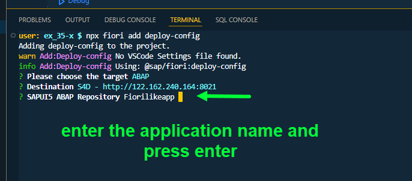
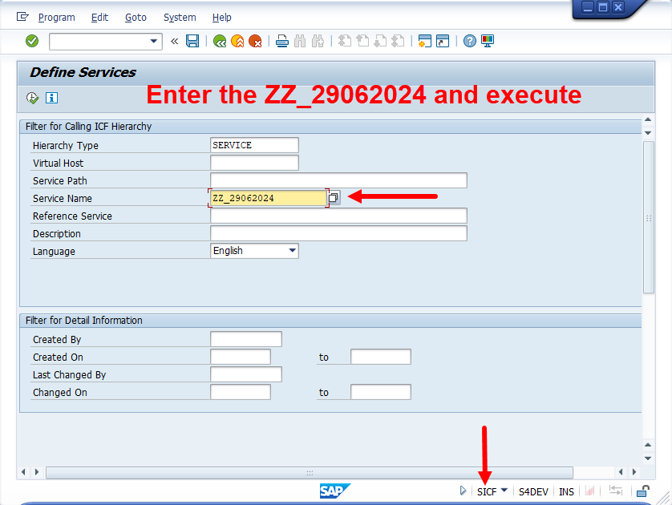
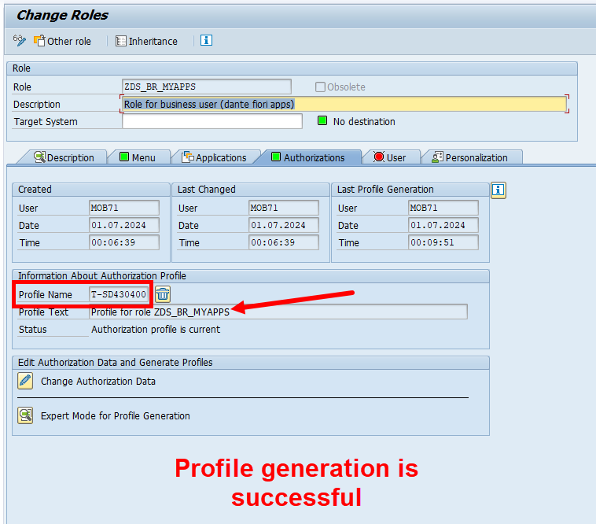

## Exercise 37 - Deploy app to launchpad

</br>

**Steps for deploying the Fiori App to On-Premise system**

</br>

*Packaging and deployment with Launchpad*

</br>

**TCODE :**

*Fiori Launchpad designer - /n/ui2/flpd_conf*

*Fiori Launchpad - /n/ui2/flp*

</br></br>

</br></br>


**Step By Step process - Fiori App deployment**

</br>

*1. Fiori App packaging is done via BAS*

*2. Fiori App deployment is done via (source) BAS using packaged build pushed to Html5 repository in Launchpad (destination on premise system)*

*3. Final deployment to Fiori tile layout screen done by launchpad using user role and authorization configuration - also requires user role in PFCG inside ERP*

</br>

**Prerequisite before starting the ui5 packaging and deployment activity**

<details>
<summary> <b> Essential prerequisite</b> </summary>
</br>

*Command for installing ui5 CLI -command line interface*

```bat
npm install --global @ui5/cli
```

</br></br>

</details>


</br></br></br>

<details>
<summary> <b> 1. Fiori App Packaging </b> </summary>
</br>

*First Command for packaging*

Command : 
</br>

```bat

```

</br>


</br></br>
</br></br>
</br></br>
</br></br>
</br></br>
</br></br>
</br></br>
</br></br>
</br></br>
</br></br>
</br></br>
</br></br>
</br></br>
</br></br>
</br></br>
</br></br>
</br></br>
</br></br>
</br></br>
</br></br>
</br></br>
</br></br>
</br></br>
</br></br>
</br></br>
</br></br>
</br></br>
</br></br>
</br></br>
</br></br>
</br></br>
</br></br>
</br></br>
</br></br>
</br></br>
</br></br>
</br></br>
</br></br>
</br></br>
</br></br>
</br></br>
</br></br>
</br></br>
</br></br>
</br></br>
</br></br>
</br></br>
</br></br>
</br></br>
</br></br>
</br></br>
</br></br>
</br></br>
</br></br>
</br></br>
</br></br>
</br></br>
</br></br>
</br></br>
</br></br>
</br></br>
</br></br>
</br></br>
</br></br>
</br></br>
</br></br>
</br></br>
</br></br>
</br></br>
</br></br>
</br></br>
</br></br>
</br></br>
</br></br>
</br></br>
</br></br>
</br></br>
</br></br>
</br></br>
</br></br>
</br></br>
</br></br>
</br></br>
</br></br>
</br></br>
</br></br>
</br></br>
</br></br>
</br></br>
</br></br>
</br></br>
</br></br>
</br></br>
</br></br>
</br></br>
</br></br>
</br></br>
</br></br>
</br></br>
</br></br>
</br></br>
</br></br>
</br></br>
</br></br>
</br></br>
</br></br>
</br></br>
</br></br>
</br></br>
</br></br>
</br></br>
</br></br>
</br></br>
</br></br>
</br></br>
</br></br>
</br></br>
</br></br>
</br></br>
</br></br>
</br></br>
</br></br>
</br></br>
</br></br>
</br></br>
</br></br>
</br></br>
</br></br>
</br></br>
</br></br>
</br></br>
</br></br>
</br></br>
</br></br>
</br></br>
</br></br>
</br></br>
</br></br>
</br></br>
</br></br>
</br></br>
</br></br>
</br></br>
</br></br>
</br></br>
</br></br>
</br></br>
</br></br>
</br></br>

</details>

<details>
<summary> <b> 2. Fiori App Deployment </b> </summary>
</br>
</br>
</br>
</details>

<details>
<summary> <b> 3. Fiori App Configuring </b> </summary>
</br>
</br>
</br>
</details>


</br>
</br></br>

## End of Exercise 37 ---NEXT---> <a href="https://github.com/Octavius-Dante/Arthelais/tree/main/ex_38"> Exercise 38-Fiori Elements Basics </a>
</br>
<p align="center"> <a href="https://github.com/Octavius-Dante/Arthelais/tree/main"> Main page </a> </p>


</br></br>

**All Previous sessions**
</br></br>

<!-- - [x] <a href="https://github.com/Octavius-Dante/Arthelais/tree/main/ex_37"> Exercise 37-Deploy app to launchpad</a> -->
- [x] <a href="https://github.com/Octavius-Dante/Arthelais/tree/main/ex_36"> Exercise 36-WebIde and Git integration</a>
- [x] <a href="https://github.com/Octavius-Dante/Arthelais/tree/main/ex_35"> Exercise 35-POST, GET and DELETE from Fiori</a>
- [x] <a href="https://github.com/Octavius-Dante/Arthelais/tree/main/ex_34"> Exercise 34-GET and Connect</a>
- [x] <a href="https://github.com/Octavius-Dante/Arthelais/tree/main/ex_33"> Exercise 33-Fiori Project Connect Odata</a>
- [x] <a href="https://github.com/Octavius-Dante/Arthelais/tree/main/ex_32"> Exercise 32-Connectivity</a>
- [x] <a href="https://github.com/Octavius-Dante/Arthelais/tree/main/ex_31"> Exercise 31-Function Import and Images</a>
- [x] <a href="https://github.com/Octavius-Dante/Arthelais/tree/main/ex_30"> Exercise 30-implementing CRUD</a>
- [x] <a href="https://github.com/Octavius-Dante/Arthelais/tree/main/ex_29"> Exercise 29-Implementing GET</a>
- [x] <a href="https://github.com/Octavius-Dante/Arthelais/tree/main/ex_28"> Exercise 28-Create A Gateway Project</a>
- [x] <a href="https://github.com/Octavius-Dante/Arthelais/tree/main/ex_27"> Exercise 27-Odata GET</a>
- [x] <a href="https://github.com/Octavius-Dante/Arthelais/tree/main/ex_26"> Exercise 26-Fiori Deployments</a>
- [x] <a href="https://github.com/Octavius-Dante/Arthelais/tree/main/ex_25"> Exercise 25-Fragments Deep dive</a>
- [x] <a href="https://github.com/Octavius-Dante/Arthelais/tree/main/ex_24"> Exercise 24-Fragments</a>
- [x] <a href="https://github.com/Octavius-Dante/Arthelais/tree/main/ex_23"> Exercise 23-Icon Tab bar</a>
- [x] <a href="https://github.com/Octavius-Dante/Arthelais/tree/main/ex_22"> Exercise 22-Route matched Handlers</a>
- [x] <a href="https://github.com/Octavius-Dante/Arthelais/tree/main/ex_21"> Exercise 21-Router Basics</a>
- [x] <a href="https://github.com/Octavius-Dante/Arthelais/tree/main/ex_20"> Exercise 20-Filters on List mode</a>
- [x] <a href="https://github.com/Octavius-Dante/Arthelais/tree/main/ex_19"> Exercise 19-Manifest JSON</a>
- [x] <a href="https://github.com/Octavius-Dante/Arthelais/tree/main/ex_18"> Exercise 18-List Control</a>
- [x] <a href="https://github.com/Octavius-Dante/Arthelais/tree/main/ex_17"> Exercise 17-Fiori Lite app</a>
- [x] <a href="https://github.com/Octavius-Dante/Arthelais/tree/main/ex_16"> Exercise 16-Formatters </a>
- [x] <a href="https://github.com/Octavius-Dante/Arthelais/tree/main/ex_15"> Exercise 15-Element Binding</a>
- [x] <a href="https://github.com/Octavius-Dante/Arthelais/tree/main/ex_14"> Exercise 14-Table control</a>
- [x] <a href="https://github.com/Octavius-Dante/Arthelais/tree/main/ex_13"> Exercise 13-Expression Binding XML Model</a>
- [x] <a href="https://github.com/Octavius-Dante/Arthelais/tree/main/ex_12"> Exercise 12-Json Model Property Binding</a>
- [x] <a href="https://github.com/Octavius-Dante/Arthelais/tree/main/ex_11"> Exercise 11-Model Basics </a>
- [x] <a href="https://github.com/Octavius-Dante/Arthelais/tree/main/ex_10"> Exercise 10-XML Views </a>
- [x] <a href="https://github.com/Octavius-Dante/Arthelais/tree/main/ex_9"> Exercise 9-Control Hierarchy 2</a>
- [x] <a href="https://github.com/Octavius-Dante/Arthelais/tree/main/ex_8"> Exercise 8-Ui5 Control Hierarchy </a>
- [x] <a href="https://github.com/Octavius-Dante/Arthelais/tree/main/ex_7"> Exercise 7-SAP Ui5 Framework </a>
- [x] <a href="https://github.com/Octavius-Dante/Arthelais/tree/main/ex_6"> Exercise 6-JQuery </a>
- [x] <a href="https://github.com/Octavius-Dante/Arthelais/tree/main/ex_5"> Exercise 5-JS deep dive </a>
- [x] <a href="https://github.com/Octavius-Dante/Arthelais/tree/main/ex_4"> Exercise 4-JS basic </a>
- [x] <a href="https://github.com/Octavius-Dante/Arthelais/tree/main/ex_3"> Exercise 3-CSS </a>
- [x] <a href="https://github.com/Octavius-Dante/Arthelais/tree/main/ex_2"> Exercise 2-HTML5</a>
- [x] <a href="https://github.com/Octavius-Dante/Arthelais/tree/main/ex_1"> Exercise 1 -Basic </a>


<!--

<details>
<summary> <b> ALL CODE CHANGES - TODAY SESSION </b> </summary>
</br>
</br>

</br>
</br>

</br>
</br>
</details>

-->