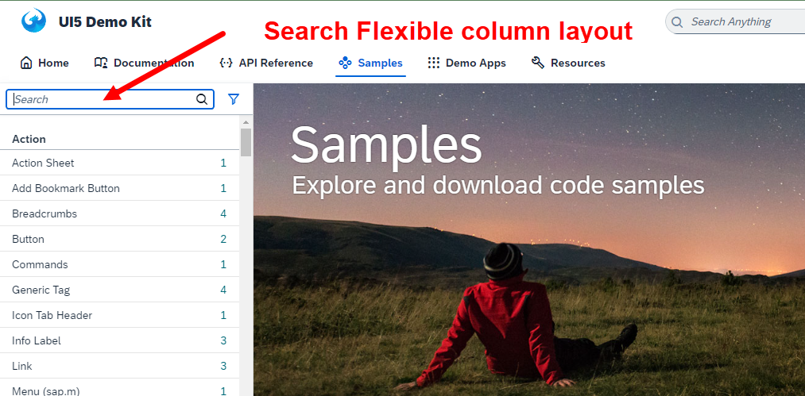
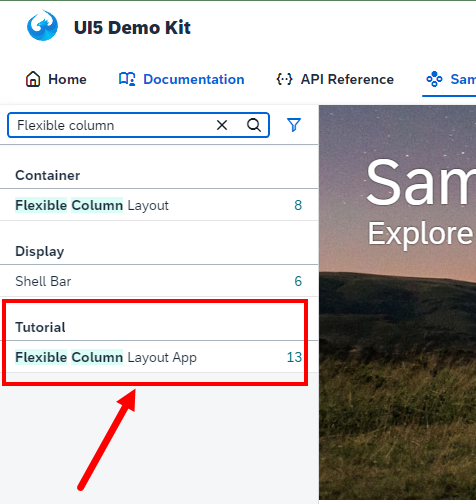
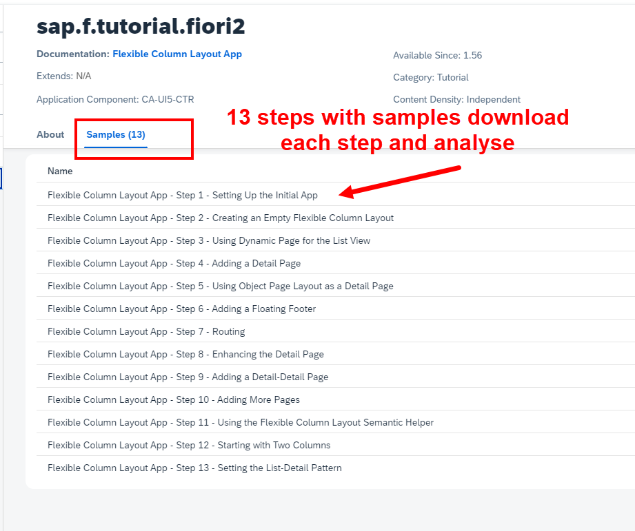

## Exercise 40 - Using Flexible Column Layout

   

**SAP Ui5 SDK has a tutorial to implement the Flexible column layout app** 

  
  
  

**There are 13 samples step by step provided by ui5 SDK**

All 13 samples are integrated accordingly to make it as a working app and that is divided into 3 parts (2,3,4) proper full app for reference

 

- Part 1 (sample 1 ~ 5) ---- *(Check file : ex_flex_part1)* (Partial App only for understanding and analysis not a full app)

- Part 2 (sample 6 ~ 11) --- *(Check file : flex-11 and ex_flex_part2)* - App Variant 1 

- Part 3 (sample 12) ------- *(Check file : flex-12)* - App Variant 2

- Part 4 (sample 13) ------- *(Check file : flex-13)* - App Variant 3

  

Have to compare each samples and see how FCL was implemented in the app for better detailed understanding.

  

1. flex-11 - App opens with single column layout and 4th page will be in new screen 

2. flex-12 - App opens with Two column layout and 4th page will open in new screen 

3. flex-13 - App opens with Two column layout and 3rd page will open in new screen, 4th page will open in new screen  

4. ex_flex_part2 - Same as  first but previous example sample codes commented version

  

## (WORK IN PROGRESS) - Version 2 - Working OData service mapping for the following apps

1. flex-11-v2 

2. flex-12-v2 

3. flex-13-v2 

4. ex_flex_part2-v2 

  

 
  

## End of Exercise 40 ---- End Of Using Flexible Control Layout
 

 <a href="https://github.com/Octavius-Dante/Arthelais/tree/main"> Main page </a> 

<!-- - [x] <a href="https://github.com/Octavius-Dante/Arthelais/tree/main/ex_38"> Exercise 38-Fiori Elements Basics</a> -->
  

**All Previous sessions**
  

<!-- - [x] <a href="https://github.com/Octavius-Dante/Arthelais/tree/main/ex_40"> Exercise 40-Using Flexible Control Layout </a> -->
- [x] <a href="https://github.com/Octavius-Dante/Arthelais/tree/main/ex_39"> Exercise 39-Deep Entity handling </a>
- [x] <a href="https://github.com/Octavius-Dante/Arthelais/tree/main/ex_38"> Exercise 38-Fiori Elements Basics</a>
- [x] <a href="https://github.com/Octavius-Dante/Arthelais/tree/main/ex_37"> Exercise 37-Deploy app to launchpad</a>
- [x] <a href="https://github.com/Octavius-Dante/Arthelais/tree/main/ex_36"> Exercise 36-WebIde and Git integration</a>
- [x] <a href="https://github.com/Octavius-Dante/Arthelais/tree/main/ex_35"> Exercise 35-POST, GET and DELETE from Fiori</a>
- [x] <a href="https://github.com/Octavius-Dante/Arthelais/tree/main/ex_34"> Exercise 34-GET and Connect</a>
- [x] <a href="https://github.com/Octavius-Dante/Arthelais/tree/main/ex_33"> Exercise 33-Fiori Project Connect Odata</a>
- [x] <a href="https://github.com/Octavius-Dante/Arthelais/tree/main/ex_32"> Exercise 32-Connectivity</a>
- [x] <a href="https://github.com/Octavius-Dante/Arthelais/tree/main/ex_31"> Exercise 31-Function Import and Images</a>
- [x] <a href="https://github.com/Octavius-Dante/Arthelais/tree/main/ex_30"> Exercise 30-implementing CRUD</a>
- [x] <a href="https://github.com/Octavius-Dante/Arthelais/tree/main/ex_29"> Exercise 29-Implementing GET</a>
- [x] <a href="https://github.com/Octavius-Dante/Arthelais/tree/main/ex_28"> Exercise 28-Create A Gateway Project</a>
- [x] <a href="https://github.com/Octavius-Dante/Arthelais/tree/main/ex_27"> Exercise 27-Odata GET</a>
- [x] <a href="https://github.com/Octavius-Dante/Arthelais/tree/main/ex_26"> Exercise 26-Fiori Deployments</a>
- [x] <a href="https://github.com/Octavius-Dante/Arthelais/tree/main/ex_25"> Exercise 25-Fragments Deep dive</a>
- [x] <a href="https://github.com/Octavius-Dante/Arthelais/tree/main/ex_24"> Exercise 24-Fragments</a>
- [x] <a href="https://github.com/Octavius-Dante/Arthelais/tree/main/ex_23"> Exercise 23-Icon Tab bar</a>
- [x] <a href="https://github.com/Octavius-Dante/Arthelais/tree/main/ex_22"> Exercise 22-Route matched Handlers</a>
- [x] <a href="https://github.com/Octavius-Dante/Arthelais/tree/main/ex_21"> Exercise 21-Router Basics</a>
- [x] <a href="https://github.com/Octavius-Dante/Arthelais/tree/main/ex_20"> Exercise 20-Filters on List mode</a>
- [x] <a href="https://github.com/Octavius-Dante/Arthelais/tree/main/ex_19"> Exercise 19-Manifest JSON</a>
- [x] <a href="https://github.com/Octavius-Dante/Arthelais/tree/main/ex_18"> Exercise 18-List Control</a>
- [x] <a href="https://github.com/Octavius-Dante/Arthelais/tree/main/ex_17"> Exercise 17-Fiori Lite app</a>
- [x] <a href="https://github.com/Octavius-Dante/Arthelais/tree/main/ex_16"> Exercise 16-Formatters </a>
- [x] <a href="https://github.com/Octavius-Dante/Arthelais/tree/main/ex_15"> Exercise 15-Element Binding</a>
- [x] <a href="https://github.com/Octavius-Dante/Arthelais/tree/main/ex_14"> Exercise 14-Table control</a>
- [x] <a href="https://github.com/Octavius-Dante/Arthelais/tree/main/ex_13"> Exercise 13-Expression Binding XML Model</a>
- [x] <a href="https://github.com/Octavius-Dante/Arthelais/tree/main/ex_12"> Exercise 12-Json Model Property Binding</a>
- [x] <a href="https://github.com/Octavius-Dante/Arthelais/tree/main/ex_11"> Exercise 11-Model Basics </a>
- [x] <a href="https://github.com/Octavius-Dante/Arthelais/tree/main/ex_10"> Exercise 10-XML Views </a>
- [x] <a href="https://github.com/Octavius-Dante/Arthelais/tree/main/ex_9"> Exercise 9-Control Hierarchy 2</a>
- [x] <a href="https://github.com/Octavius-Dante/Arthelais/tree/main/ex_8"> Exercise 8-Ui5 Control Hierarchy </a>
- [x] <a href="https://github.com/Octavius-Dante/Arthelais/tree/main/ex_7"> Exercise 7-SAP Ui5 Framework </a>
- [x] <a href="https://github.com/Octavius-Dante/Arthelais/tree/main/ex_6"> Exercise 6-JQuery </a>
- [x] <a href="https://github.com/Octavius-Dante/Arthelais/tree/main/ex_5"> Exercise 5-JS deep dive </a>
- [x] <a href="https://github.com/Octavius-Dante/Arthelais/tree/main/ex_4"> Exercise 4-JS basic </a>
- [x] <a href="https://github.com/Octavius-Dante/Arthelais/tree/main/ex_3"> Exercise 3-CSS </a>
- [x] <a href="https://github.com/Octavius-Dante/Arthelais/tree/main/ex_2"> Exercise 2-HTML5</a>
- [x] <a href="https://github.com/Octavius-Dante/Arthelais/tree/main/ex_1"> Exercise 1 -Basic </a>

<!--

 <b> ALL CODE CHANGES - TODAY SESSION </b> 

 
 

 
 

 
 

-->

