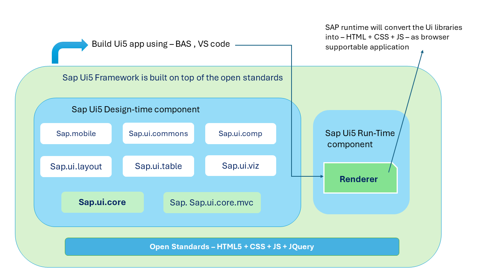

## Exercise 7 - SAP Ui5 Framework

</br></br>

SAP Ui5 is a framework developed by SAP based on Open Standards to build responsive web apps.
</br> </br> 

1. Framework is a Collection of **Libraries**
2. Library is a Collection of **Classes**
3. Class is a Collection of **Functions**
3. Function is a Collection of **Attributes, Events, Aggregations, Methods**

</br> </br> 



</br> </br> 

Sap provides a SDK (software development kit) for developer to understand, Learn, experience, Code (snippet) of SAP ui5
</br> as well as documentation of all the Ui elements in Sap Ui5 in the following link 

</br> https://sapui5.hana.ondemand.com/


Access this page and check all the pages (api reference - detailed document on the code library, documentation, Samples and Fiori elements page)

Fiori elements : 

</br> https://sapui5.hana.ondemand.com/test-resources/sap/fe/core/fpmExplorer/index.html#/overview/introduction

</br> </br> 

## Building a Fiori Ui5 application
</br>

1. Go to BAs / VSCode
2. Open terminal and create a Folder for the project (ui5_basic)
3. Initiate a bootstrap by creating a file (launch file) index.html
4. Then add the basic HTML tags (HTML, HEAD, BODY, SCRIPT)
5. Then link the script source both links works 
</br> (https://sapui5.hana.ondemand.com/resources/sap-ui-core.js) 
</br> or (https://ui5.sap.com/resources/sap-ui-core.js) 
</br>

```html

<script src="https://sapui5.hana.ondemand.com/resources/sap-ui-core.js"></script>

<script src="https://ui5.sap.com/resources/sap-ui-core.js"></script>

```
</br>

6. Define a name space for the project directory to make it unique across the world also serves as ALIAS NAME for the project directory 
7. Create a folder (webapp) and move the index.html file inside the directory 
</br>  Earlier : (projects\ui5_basic\index.html) 
</br>  Now it should be : (projects\ui5_basic\webapp\index.html) this is how a working project structure is followed 

8. This way we can reference all the project artifacts (views, controllers, JS files, resources, component....) with the help of namespace

9. data-sap-ui-resourceroots to pass a json for namespace.
</br> </br> 

**syntax will be as shown below:**

```script 

var oControlName = new libraryName.ClassName(sId, sProperties);
sId - Id of the Control
sProperties - Json which we can pass with the properties, events

```


</br> </br> 

**Fiori Bootstrap code with theme details HTML**

```html

<html>

<head>
    <!-- <script src="https://sapui5.hana.ondemand.com/resources/sap-ui-core.js"></script> -->

    <script
    id="sap-ui-bootstrap"
    type="text/javascript"
    src="https://sapui5.hana.ondemand.com/resources/sap-ui-core.js"
    data-sap-ui-libs="sap.m"
    data-sap-ui-theme="sap_horizon_dark"

    data-sap-ui-resourceroots='{ "spiderman" : "./" }'

    ></script>

<!-- 

// Current working directory definition - notifying SAP
    
    data-sap-ui-resourceroots='{
        "CompanyName.ProjectName.TeamName" : "./"
    }'

    namespace = CompanyName.ProjectName.TeamName
-->


<!--  Lit of SAP Thenmes for Fiori page  - link : 

    Theme Name	        Technical Name
    ------------------------------------    
    Morning Horizon         sap_horizon    
    Evening Horizon         sap_horizon_dark
    High Contrast Black     sap_horizon_hcb
    High Contrast White     sap_horizon_hcw    
    Quartz Light            sap_fiori_3    
    Quartz Dark             sap_fiori_3_dark    
    High Contrast Black     sap_fiori_3_hcb    
    High Contrast White     sap_fiori_3_hcw    
    Belize                  sap_belize    
    Belize Deep             sap_belize_plus    
    High Contrast Black     sap_belize_hcb    
    High Contrast White     sap_belize_hcw    
    Blue Crystal            sap_bluecrystal    
    High Contrast Black     sap_hcb
-->

  <style></style>
</head>

<body class="sapUiBody">
    Welcome!
</body>   

</html>

```

</br> </br> 

**Sample Button click action in Ui5**

```html
<html>    
 <head>
    <script>
        var oBtn = new sap.m.Button("idBtn",{
            text: "Spiderman",
            press: function(){
                alert("Ui5 alert test");
            }
        });
        oBtn.placeAt("content");
    </script>
 </head>

  <body class="sapUiBody">
    <div id="content"> </div>
  </body>  

<html>    

```

</br> </br> 

**Sample input field in Ui5**

```html
<html>    
 <head>
    <script>
        // var oInp = new sap.m.Input("idInp");
        // oInp.placeAt("content2");

        new sap.m.Input("idInp").placeAt("content2");
    </script>
 </head>

  <body class="sapUiBody">
    <div id="content2"> </div>
  </body>  

<html> 
    
```

</br></br>

> [!IMPORTANT]
> To know about an Ui element refer the sap.ui5.sdk page documentation , api reference, sample 

> [!IMPORTANT]
> Any Ui element is referred to will be inherited from a class library 

> [!IMPORTANT]
> Ui element can be accessed and operted using its own library method or its base class library method

> [!IMPORTANT]
> Example button class will have click action -- but button's base class will have further properties even that can be used (placeAt in above code sample)

> [!IMPORTANT]
> Icon explorer in sap.ui.sdk page can be referred to use the icon library to the ui page

> [!IMPORTANT]
> REFERRING THE SAMPLES from (sap.ui.sdk page) AND USING THE CLASS METHODS as instructed in the documentation is the key to better UI5 development 


</br></br>

[All SAP Fiori apps reference library provided by SAP](https://fioriappslibrary.hana.ondemand.com/sap/fix/externalViewer/#/home)

[SAP Sample Fiori SDK screen elements documentation](https://sapui5.hana.ondemand.com/)


</br>
</br></br>

## End of Exercise 7 ---NEXT---> <a href="https://github.com/Octavius-Dante/Arthelais/tree/main/ex_8"> Exercise 8-Ui5 Control Hierarchy </a>
</br>
<p align="center"> <a href="https://github.com/Octavius-Dante/Arthelais/tree/main"> Main page </a> </p>


</br></br>

**All Previous sessions**
</br></br>

<!-- - [x] <a href="https://github.com/Octavius-Dante/Arthelais/tree/main/ex_37"> Exercise 37-Deploy app to launchpad</a>
- [x] <a href="https://github.com/Octavius-Dante/Arthelais/tree/main/ex_36"> Exercise 36-WebIde and Git integration</a>
- [x] <a href="https://github.com/Octavius-Dante/Arthelais/tree/main/ex_35"> Exercise 35-POST, GET and DELETE from Fiori</a>
- [x] <a href="https://github.com/Octavius-Dante/Arthelais/tree/main/ex_34"> Exercise 34-GET and Connect</a>
- [x] <a href="https://github.com/Octavius-Dante/Arthelais/tree/main/ex_33"> Exercise 33-Fiori Project Connect Odata</a>
- [x] <a href="https://github.com/Octavius-Dante/Arthelais/tree/main/ex_32"> Exercise 32-Connectivity</a>
- [x] <a href="https://github.com/Octavius-Dante/Arthelais/tree/main/ex_31"> Exercise 31-Function Import and Images</a>
- [x] <a href="https://github.com/Octavius-Dante/Arthelais/tree/main/ex_30"> Exercise 30-implementing CRUD</a>
- [x] <a href="https://github.com/Octavius-Dante/Arthelais/tree/main/ex_29"> Exercise 29-Implementing GET</a>
- [x] <a href="https://github.com/Octavius-Dante/Arthelais/tree/main/ex_28"> Exercise 28-Create A Gateway Project</a>
- [x] <a href="https://github.com/Octavius-Dante/Arthelais/tree/main/ex_27"> Exercise 27-Odata GET</a>
- [x] <a href="https://github.com/Octavius-Dante/Arthelais/tree/main/ex_26"> Exercise 26-Fiori Deployments</a>
- [x] <a href="https://github.com/Octavius-Dante/Arthelais/tree/main/ex_25"> Exercise 25-Fragments Deep dive</a>
- [x] <a href="https://github.com/Octavius-Dante/Arthelais/tree/main/ex_24"> Exercise 24-Fragments</a>
- [x] <a href="https://github.com/Octavius-Dante/Arthelais/tree/main/ex_23"> Exercise 23-Icon Tab bar</a>
- [x] <a href="https://github.com/Octavius-Dante/Arthelais/tree/main/ex_22"> Exercise 22-Route matched Handlers</a>
- [x] <a href="https://github.com/Octavius-Dante/Arthelais/tree/main/ex_21"> Exercise 21-Router Basics</a>
- [x] <a href="https://github.com/Octavius-Dante/Arthelais/tree/main/ex_20"> Exercise 20-Filters on List mode</a>
- [x] <a href="https://github.com/Octavius-Dante/Arthelais/tree/main/ex_19"> Exercise 19-Manifest JSON</a>
- [x] <a href="https://github.com/Octavius-Dante/Arthelais/tree/main/ex_18"> Exercise 18-List Control</a>
- [x] <a href="https://github.com/Octavius-Dante/Arthelais/tree/main/ex_17"> Exercise 17-Fiori Lite app</a>
- [x] <a href="https://github.com/Octavius-Dante/Arthelais/tree/main/ex_16"> Exercise 16-Formatters </a>
- [x] <a href="https://github.com/Octavius-Dante/Arthelais/tree/main/ex_15"> Exercise 15-Element Binding</a>
- [x] <a href="https://github.com/Octavius-Dante/Arthelais/tree/main/ex_14"> Exercise 14-Table control</a>
- [x] <a href="https://github.com/Octavius-Dante/Arthelais/tree/main/ex_13"> Exercise 13-Expression Binding XML Model</a>
- [x] <a href="https://github.com/Octavius-Dante/Arthelais/tree/main/ex_12"> Exercise 12-Json Model Property Binding</a>
- [x] <a href="https://github.com/Octavius-Dante/Arthelais/tree/main/ex_11"> Exercise 11-Model Basics </a>
- [x] <a href="https://github.com/Octavius-Dante/Arthelais/tree/main/ex_10"> Exercise 10-XML Views </a>
- [x] <a href="https://github.com/Octavius-Dante/Arthelais/tree/main/ex_9"> Exercise 9-Internal Silence of Ui5</a>
- [x] <a href="https://github.com/Octavius-Dante/Arthelais/tree/main/ex_8"> Exercise 8-Ui5 Control Hierarchy </a>
- [x] <a href="https://github.com/Octavius-Dante/Arthelais/tree/main/ex_7"> Exercise 7-SAP Ui5 Framework </a> -->
- [x] <a href="https://github.com/Octavius-Dante/Arthelais/tree/main/ex_6"> Exercise 6-JQuery </a>
- [x] <a href="https://github.com/Octavius-Dante/Arthelais/tree/main/ex_5"> Exercise 5-JS deep dive </a>
- [x] <a href="https://github.com/Octavius-Dante/Arthelais/tree/main/ex_4"> Exercise 4-JS basic </a>
- [x] <a href="https://github.com/Octavius-Dante/Arthelais/tree/main/ex_3"> Exercise 3-CSS </a>
- [x] <a href="https://github.com/Octavius-Dante/Arthelais/tree/main/ex_2"> Exercise 2-HTML5</a>
- [x] <a href="https://github.com/Octavius-Dante/Arthelais/tree/main/ex_1"> Exercise 1 -Basic </a>


<!--

<details>
<summary> <b> ALL CODE CHANGES - TODAY SESSION </b> </summary>
</br>
</br>

</br>
</br>

</br>
</br>
</details>

-->