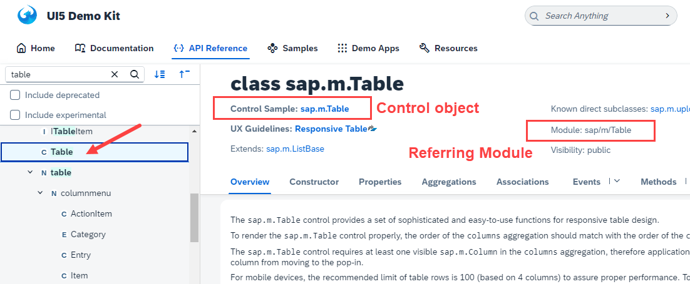
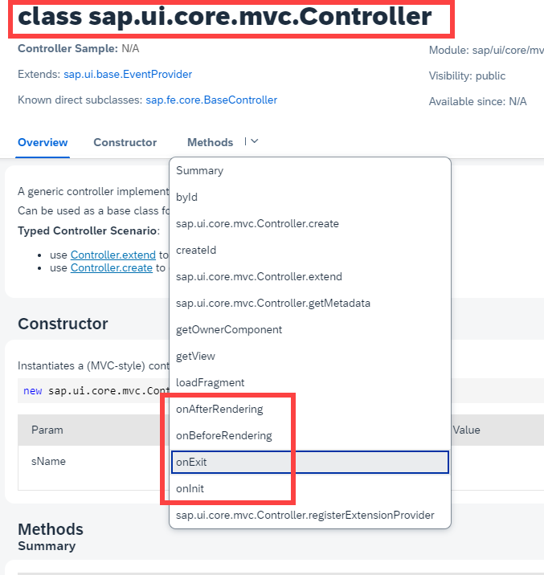

## Exercise 9 - Control Hierarchy 2

</br></br>

**Controller Definition**

The controllers in UI5 are always created using JS. They are considered as classes/modules. We need to first define a module definition.
We have to follow a syntax

</br>

**Syntax for normal JS file** : -- inside SAP UI5 Project except views (class/module)

- Another name for this syntax is called **AMD - Asynchronous Module Definition** loading - modules are parallelly loaded 
- Also called as **Scaffolding template**


</br>

```js

sap.ui.define(["module1", "module2",....], functrion(oM1, oM2,.....) {

});

// Module name for Standard SAP Classes - just replace . with /

```

</br>

Check SAP Ui5 SDK page - open any of the class (screen element) in API reference - open it and see 

it appears like shown in the image , that's how a controller is referred 



</br>

SAP provided guideline that if you willing to create a controller type of JS file / model, 
</br> then you need to inherit your controller module from an sap standard module - **sap/ui/core/mvc/Controller**
</br>

**Syntax for controller type JS file**

</br>

```js

sap.ui.define(["sap/ui/core/mvc/Controller"], functrion(oSpiderman) {
    return oSpiderman.extend("namespace.folder.file",{

    });
});

```

- It is best practice to have 1 controller per view and have same name for vie and controller


</br></br>


**Benefits of inheritance from SAP Controller**

1. we can get the view object associated to the controller using **this.getView**

2. inside the controller/JS/Module we can use **this** pointer to point to current class object

3. Controller will be able to implement the lifecycle methods. These methods helps us injecting, 
</br> writing code which gets executed at specific point automatically

  - **onInit** - is like constructor of a class, it is called when the object of class gets created for first time. 
  </br> The use case of this method is to initialize class variable

  - **onExit** - is like destructor of a class, which gets called when the object of the class is destroyed. 
  </br> When user close the application, we can write clean-up code inside the method

  - **onBeforeRendering** - is the method which gets called Multiple time in the Lifecycle of a controller, 
  </br> every time the corresponding view is displayed on the screen to the user, just **BEFORE** that,
  </br> the onBeforeRendering gets called we can write conditional Ui change logic inside the method.(PBO of ABAP dialog programming)

   - **onBeforeRendering** - is the method which gets called Multiple time in the Lifecycle of a controller, 
  </br> every time the corresponding view is displayed on the screen to the user, just **AFTER** that,
  </br> the onAfterRendering can be used for post processing logic doing JQuery effect.
  

</br></br>

</br></br>

> [!IMPORTANT]
> Constructor is a method, A method which gets called when the class object gets created for the first time.


</br></br>
</br></br>
</br></br>

## End of Exercise 9 ---NEXT---> <a href="https://github.com/Octavius-Dante/Arthelais/tree/main/ex_10"> Exercise 10-XML Views </a>
</br>
<p align="center"> <a href="https://github.com/Octavius-Dante/Arthelais/tree/main"> Main page </a> </p>


</br></br>

**All Previous sessions**
</br></br>
<!-- 
- [x] <a href="https://github.com/Octavius-Dante/Arthelais/tree/main/ex_37"> Exercise 37-Deploy app to launchpad</a>
- [x] <a href="https://github.com/Octavius-Dante/Arthelais/tree/main/ex_36"> Exercise 36-WebIde and Git integration</a>
- [x] <a href="https://github.com/Octavius-Dante/Arthelais/tree/main/ex_35"> Exercise 35-POST, GET and DELETE from Fiori</a>
- [x] <a href="https://github.com/Octavius-Dante/Arthelais/tree/main/ex_34"> Exercise 34-GET and Connect</a>
- [x] <a href="https://github.com/Octavius-Dante/Arthelais/tree/main/ex_33"> Exercise 33-Fiori Project Connect Odata</a>
- [x] <a href="https://github.com/Octavius-Dante/Arthelais/tree/main/ex_32"> Exercise 32-Connectivity</a>
- [x] <a href="https://github.com/Octavius-Dante/Arthelais/tree/main/ex_31"> Exercise 31-Function Import and Images</a>
- [x] <a href="https://github.com/Octavius-Dante/Arthelais/tree/main/ex_30"> Exercise 30-implementing CRUD</a>
- [x] <a href="https://github.com/Octavius-Dante/Arthelais/tree/main/ex_29"> Exercise 29-Implementing GET</a>
- [x] <a href="https://github.com/Octavius-Dante/Arthelais/tree/main/ex_28"> Exercise 28-Create A Gateway Project</a>
- [x] <a href="https://github.com/Octavius-Dante/Arthelais/tree/main/ex_27"> Exercise 27-Odata GET</a>
- [x] <a href="https://github.com/Octavius-Dante/Arthelais/tree/main/ex_26"> Exercise 26-Fiori Deployments</a>
- [x] <a href="https://github.com/Octavius-Dante/Arthelais/tree/main/ex_25"> Exercise 25-Fragments Deep dive</a>
- [x] <a href="https://github.com/Octavius-Dante/Arthelais/tree/main/ex_24"> Exercise 24-Fragments</a>
- [x] <a href="https://github.com/Octavius-Dante/Arthelais/tree/main/ex_23"> Exercise 23-Icon Tab bar</a>
- [x] <a href="https://github.com/Octavius-Dante/Arthelais/tree/main/ex_22"> Exercise 22-Route matched Handlers</a>
- [x] <a href="https://github.com/Octavius-Dante/Arthelais/tree/main/ex_21"> Exercise 21-Router Basics</a>
- [x] <a href="https://github.com/Octavius-Dante/Arthelais/tree/main/ex_20"> Exercise 20-Filters on List mode</a>
- [x] <a href="https://github.com/Octavius-Dante/Arthelais/tree/main/ex_19"> Exercise 19-Manifest JSON</a>
- [x] <a href="https://github.com/Octavius-Dante/Arthelais/tree/main/ex_18"> Exercise 18-List Control</a>
- [x] <a href="https://github.com/Octavius-Dante/Arthelais/tree/main/ex_17"> Exercise 17-Fiori Lite app</a>
- [x] <a href="https://github.com/Octavius-Dante/Arthelais/tree/main/ex_16"> Exercise 16-Formatters </a>
- [x] <a href="https://github.com/Octavius-Dante/Arthelais/tree/main/ex_15"> Exercise 15-Element Binding</a>
- [x] <a href="https://github.com/Octavius-Dante/Arthelais/tree/main/ex_14"> Exercise 14-Table control</a>
- [x] <a href="https://github.com/Octavius-Dante/Arthelais/tree/main/ex_13"> Exercise 13-Expression Binding XML Model</a>
- [x] <a href="https://github.com/Octavius-Dante/Arthelais/tree/main/ex_12"> Exercise 12-Json Model Property Binding</a>
- [x] <a href="https://github.com/Octavius-Dante/Arthelais/tree/main/ex_11"> Exercise 11-Model Basics </a>
- [x] <a href="https://github.com/Octavius-Dante/Arthelais/tree/main/ex_10"> Exercise 10-XML Views </a>
- [x] <a href="https://github.com/Octavius-Dante/Arthelais/tree/main/ex_9"> Exercise 9-Control Hierarchy 2</a> -->
- [x] <a href="https://github.com/Octavius-Dante/Arthelais/tree/main/ex_8"> Exercise 8-Ui5 Control Hierarchy </a>
- [x] <a href="https://github.com/Octavius-Dante/Arthelais/tree/main/ex_7"> Exercise 7-SAP Ui5 Framework </a>
- [x] <a href="https://github.com/Octavius-Dante/Arthelais/tree/main/ex_6"> Exercise 6-JQuery </a>
- [x] <a href="https://github.com/Octavius-Dante/Arthelais/tree/main/ex_5"> Exercise 5-JS deep dive </a>
- [x] <a href="https://github.com/Octavius-Dante/Arthelais/tree/main/ex_4"> Exercise 4-JS basic </a>
- [x] <a href="https://github.com/Octavius-Dante/Arthelais/tree/main/ex_3"> Exercise 3-CSS </a>
- [x] <a href="https://github.com/Octavius-Dante/Arthelais/tree/main/ex_2"> Exercise 2-HTML5</a>
- [x] <a href="https://github.com/Octavius-Dante/Arthelais/tree/main/ex_1"> Exercise 1 -Basic </a>


<!--

<details>
<summary> <b> ALL CODE CHANGES - TODAY SESSION </b> </summary>
</br>
</br>

</br>
</br>

</br>
</br>
</details>

-->